# Pokito Mobile — MVP Product & UX Analysis

**Status:** Product/UX analysis and proposal. No implementation.
**Date:** 2026-08-15
**Sources analysed:** `life-os` (Flutter mobile + Spring Modulith `life-os-core`), `pockito-ui` (Angular web), `pockito-core` (Spring Boot), `pockito-infra`.
**Note on spelling:** the repos use `pockito`; this document uses **Pokito** as the product name, per the brief.

---

## 1. Executive Summary

### What I found

The two products are far less symmetrical than the brief assumes.

**Existing Pokito is a thin but clean personal ledger.** The backend (`pockito-core`) is a well-formed, small domain: `User → Wallet → Transaction`, plus `Category` and `Subscription`. It works. The frontend (`pockito-ui`) is **substantially less complete than the backend**: the dashboard is a literal stub (`<p>dashboard works!</p>`), and the routes for budgets, categories, agreements, settings and account are **commented out** in [app.routes.ts](../pockito-ui/src/app/app.routes.ts). Only four screens are real: Wallets, Wallet Detail, Transactions, Subscriptions. Category CRUD exists as a complete REST API with **no UI at all**. There is no sharing, no budgets, no tags, no reports.

**LifeOS's shared-finance module is the opposite: fully built, and over-built.** `life-os-core` contains a complete, production-shaped finance module — 19 controllers, 40 application services, split calculation, balance scopes, settlement recommendations, OCR via Dify, ECB exchange-rate snapshots, CSV import/export, retention/purge jobs. The Flutter client has ~34,000 lines across finance + spaces screens, including a **3,669-line** add-shared-expense screen and a **3,275-line** space detail screen. It is powerful and it is heavy.

So this is not "merge two half-products." It is:

> **Take Pokito's clean, small personal mental model, and graft onto it the one genuinely hard thing LifeOS already solved — shared expense splitting with balances and settlements — while deliberately discarding most of LifeOS's surface area.**

### The single most important finding

LifeOS **already solved the ¥5,000 crossover problem**, and its solution is correct. In `SharedExpenseService.materializeLinkedTransactions()`:

> When a shared expense is created with a payer whose contribution is backed by an account, the system automatically creates **one** personal `FinanceTransaction` (EXPENSE / POSTED / OUTFLOW) owned by the payer, stamped with `sharedExpenseId`, and stores its id back on the payer row as `linkedTransactionId`. Cash-only payers create no transaction.

One user entry → one ledger row → two views. This should be lifted into new Pokito essentially as-is. It is the architectural spine of the whole product.

### The one thing LifeOS gets wrong that Pokito must fix

LifeOS never cleanly separates **cash flow** (what left your account) from **spending** (your share of what was consumed). It papers over the gap with per-record flags (`affectsBudget`, `BudgetSettledPolicy`). New Pokito should make this a **first-class, explicit product concept** — two lenses over one ledger — because it is the difference between a shared-finance app that adds up and one that quietly double-counts.

### Proposed V1 in one sentence

**Pokito V1 is a mobile-first personal money tracker where any expense can be pointed at a shared space and split, without ever entering it twice.**

Four tabs, one FAB, one add-flow, one ledger.

### Headline scope decisions

| Decision | Rationale |
|---|---|
| Merge Wallet + Account + Payment Method → **one concept: Account** | Three names for one thing across the two apps |
| Merge Subscription + RecurringTransactionTemplate → **Subscription** | Same concept; Pokito's manual pay/skip is the safer UX |
| Keep LifeOS's linked-transaction materialization | Solves the crossover problem correctly, already proven |
| **Single payer** in V1 (not multiple) | Collapses the biggest source of form complexity |
| **3 split methods** (Equal, Exact, Percentage) | Drops Shares + Itemized; covers >90% of real use |
| **2 roles** (Owner, Member) | Down from 4 roles / 19 permissions |
| **Full multi-currency**, with debts denominated in the space's currency and payment from any account | Three currency roles kept separate (§10.8). Balances never span currencies, so who-owes-whom is never ambiguous |
| Adopt **minor units (long)** | Pokito's `BigDecimal(17,2)` is wrong for JPY/KRW — and the brief's own example is ¥5,000 |
| Budgets: **category + monthly + personal-or-space** only | LifeOS ships 10 scope types, rollover, settled-policy — none belong in V1 |
| Exclude: tags, OCR, import/export, reports page, multi-payer, itemized splits, viewer/admin roles | Each is real work with no V1 payoff |

---

## 2. Analysis of Existing Pokito

### 2.1 Domain model as built

From `pockito-core/src/main/java/io/ghassen/pockito/domain/`:

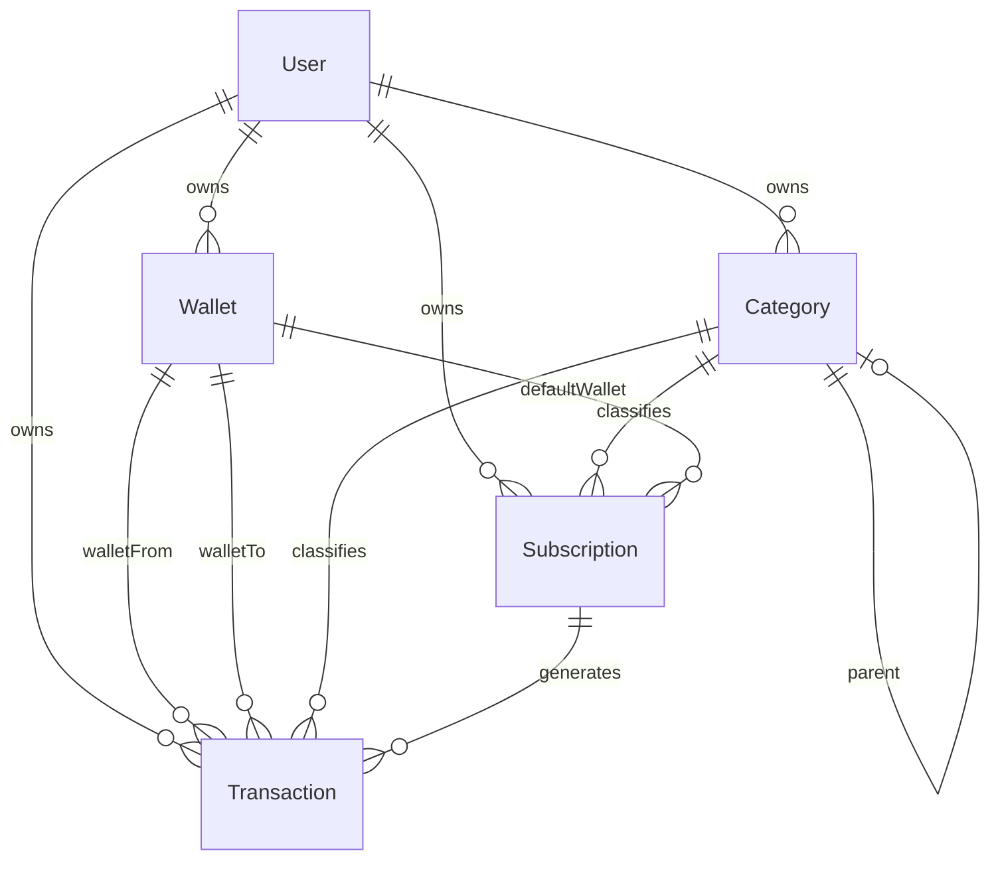

**`User`** — primary key is the Keycloak `preferred_username` (a string, not a UUID). Holds `country` and `defaultCurrency`. Created lazily on first authenticated call.

**`Wallet`** — `name` (unique per user), `initialBalance`, `currency`, `type` (`BANK_ACCOUNT`, `CASH`, `CREDIT_CARD`, `SAVINGS`, `CUSTOM`), `iconUrl`, `color`, `goalAmount`, `isDefault`, `orderPosition`, `description`.

> **Important:** the current balance is **not stored**. `WalletService.calculateCurrentBalance()` derives it from `transactionRepository.calculateCurrentBalance(walletId)` and exposes it as `WalletDto.balance`, falling back to `initialBalance` on error. This is a good decision worth preserving.

**`Transaction`** — the ledger row.
- `transactionType`: `TRANSFER` | `EXPENSE` | `INCOME`
- `walletFrom` / `walletTo` — both nullable; the type determines which is required. External transfers allow one side to be null.
- `amount` (`BigDecimal(17,2)`), `exchangeRate` (default 1.0), and a **transient** `walletToAmount` computed on read as `amount × exchangeRate`
- `effectiveDate`, `note`, `category` (optional), `subscription` (optional back-link)

**`Subscription`** — genuinely the most thought-through entity in the codebase.
- `frequency` (`DAILY`/`WEEKLY`/`MONTHLY`/`YEARLY`) × `interval` — "every 2 weeks" is `WEEKLY` + `2`
- Precision anchors: `dayOfMonth`, `dayOfWeek`, `monthOfYear`
- `startDate`, `nextDueDate`, `lastPaymentDate`, `endDate`, `enabled`
- **`categoryId` and `defaultWalletId` are both required**
- Pay flow: `POST /api/subscriptions/{id}/pay` with `{ walletId, exchangeRate, skip }` → creates a linked `Transaction` and advances `nextDueDate` from `lastPaymentDate`. **`skip: true` advances the dates without creating a transaction.**

**`Category`** — `name` (unique per user), `color` (required hex), `categoryType` (`EXPENSE`|`INCOME`), `iconUrl`, self-referencing `parentCategory`.

### 2.2 What is actually shipped in the UI

| Route | State |
|---|---|
| `/app/dashboard` | **Stub.** `<p>dashboard works!</p>` |
| `/app/wallets` | Real — list with per-wallet balance, positive/negative styling, create dialog |
| `/app/wallets/:id` | Real — header with balance, embedded paged transaction list, edit dialog |
| `/app/transactions` | Real — paged list + form dialog |
| `/app/subscriptions` | Real — list + **monthly total per currency**, expandable when multi-currency |
| `/app/budgets` | **Commented out** |
| `/app/categories`, `/categories/*` | **Commented out** (API is complete) |
| `/app/agreements` | **Commented out** |
| `/app/settings`, `/app/account` | **Commented out** |

Shell ([app-layout.component.html](../pockito-ui/src/app/core/app-layout/app-layout.component.html)): a desktop PrimeNG `p-dock`, a mobile bottom nav, a mobile side drawer, a "More options" dialog, a language switcher dialog, and a **global floating action button that opens the transaction form** — the best interaction in the current app and the one thing that most deserves to survive into mobile.

### 2.3 API surface

```
/api/wallets          POST GET GET/{id} PUT DELETE GET/type/{type} GET/default POST/{id}/set-default POST/reorder
/api/transactions     POST PUT/{id} GET/{id} GET GET/all GET/wallet/{id} GET/date-range GET/type/{type}
/api/subscriptions    POST PUT/{id} GET/{id} GET DELETE POST/{id}/pay
/api/categories       POST GET GET/type/{t} GET/hierarchical GET/{id} GET/{id}/children GET/root GET/color/{c} PUT DELETE
/api/users            GET/me GET/{u} PUT/{u}/country PUT/{u}/currency GET/{u}/exists
```

### 2.4 Assessment

**Strengths to carry forward:** derived balances; the three-type transaction model with transfers; the subscription scheduling model with pay/skip; wallet ordering and defaults; per-currency subscription totals; the global FAB.

**Weaknesses to fix:** `BigDecimal(17,2)` breaks zero-decimal currencies (JPY, KRW) — and the brief's own worked example is ¥5,000; `User` keyed on a mutable username rather than a UUID; the transient `walletToAmount` is recomputed on every read rather than stored, so historical FX is lost if a rate is edited; no soft delete; no budgets; no sharing; the dashboard — the screen that should answer "how am I doing?" — does not exist.

---

## 3. Analysis of Relevant LifeOS Spaces Functionality

### 3.1 Spaces (the collaboration boundary)

From `life-os-core/.../sharedspace/`:

- **`Space`** — `name`, `description`, `type` (`COUPLE`, `FAMILY`, `HOUSEHOLD`, `FRIENDS`, `ROOMMATE`, `TRAVEL`, `PROJECT`, `CUSTOM`), `baseCurrency`, `timezone`, `icon`, `accentToken`, `status` (`ACTIVE`/`ARCHIVED`/`DELETED`)
- **`SpaceMember`** — `role` (`OWNER`/`ADMIN`/`MEMBER`/`VIEWER`), `status` (`INVITED`/`ACTIVE`/`DECLINED`/`LEFT`/`REMOVED`), display-name and email snapshots. At least one active OWNER must always remain; historical records survive member removal.
- **`SpaceInvite`** — email-scoped, hashed opaque token, expiry, `PENDING`/`ACCEPTED`/`DECLINED`/`REVOKED`/`EXPIRED`
- **`SpaceActivity`** — append-only audit feed (actor, event type, entity, summary, metadata JSON)
- **`SpacePermission`** — ~19 permissions (`FINANCE_VIEW`, `FINANCE_CREATE`, `FINANCE_UPDATE_OWN`, `FINANCE_UPDATE_ANY`, `FINANCE_SETTLE`, `FINANCE_BUDGET_MANAGE`, …) resolved through `SharedSpaceAuthorizationFacade`. Finance never queries membership tables directly.
- **`SpaceNotificationPreference`** — per space, per user: `activityUpdates`, `expenseAlerts`, `settlementReminders`

### 3.2 Shared finance

**`SharedExpense`** — the split overlay:
`spaceId`, `title`, `description`, `categoryId`, `splitMethod` (`EQUAL`/`FIXED_AMOUNT`/`PERCENTAGE`/`SHARES`), `splitOrigin` (`GROUP_DEFAULT`/`CUSTOM`), `totalAmountMinor`, `currency`, `occurredOn`, **`affectsBudget`**, `status` (`DRAFT`/`CONFIRMED`/`SETTLED`/`VOIDED`), `settledInSettlementId`, plus eager collections of payers and participants.

**`SharedExpensePayer`** — `userId`, `amountPaidMinor`, `accountId?`, **`linkedTransactionId`**
**`SharedExpenseParticipant`** — `userId`, `owedAmountMinor`, `shareCount?`, `percentage?`, `itemLabel?`

**`FinanceSettlement`** — `spaceId`, `fromUserId`, `toUserId`, `amountMinor`, `status` (`PROPOSED`/`CONFIRMED`/`CANCELLED`), **`linkedOutflowTransactionId`**, **`linkedInflowTransactionId`**

**`SpaceFinanceSettings`** — per-space `defaultSplitMethod` (`NONE`/`EQUAL`/`PERCENTAGE`/`SHARES`/`FIXED_AMOUNT`), `autoConfirmExpenses`, and a list of `SpaceFinanceDefaultShare` rows (per member percentage or share count). This is what `splitOrigin = GROUP_DEFAULT` refers to — **a genuinely excellent idea**: a couple sets 60/40 once and never touches the split editor again.

### 3.3 The crossover mechanism (verbatim behaviour)

`SharedExpenseService.materializeLinkedTransactions(actor, sharedExpense)`:

1. For each payer with a non-null `accountId`:
2. Load the account, assert it is writable
3. Create a `FinanceTransaction`: `ownerUserId = payer`, `spaceId = space`, `accountId`, `type = EXPENSE`, `status = POSTED`, `direction = OUTFLOW`, `amountMinor = amountPaid`, `occurredOn = expense date`, `categoryId = expense category`, `merchant = expense title`, **`sharedExpenseId = expense id`**
4. Store the new transaction id on the payer as `linkedTransactionId`
5. Recalculate the affected account balances

Payers without an account (cash) create **no** transaction. On edit, orphaned linked transactions are voided and re-materialized.

### 3.4 Balance scopes — the cycle model

`BalanceService.memberBalances(spaceId, baseCurrency, kind, from, to)` supports three scopes:

- **`CYCLE`** (the default) — only shared expenses and settlements *after the last confirmed settlement*; the boundary settlement itself is excluded so its zero-out stays in the closed cycle
- **`LIFETIME`** — no time filter
- **`WINDOW`** — explicit date range

Net member balance = `(Σ paid − Σ owed) − settlementNet`.

Critically: **if an exchange-rate snapshot is missing for any non-base currency in scope, the method returns `Optional.empty()`** rather than converting on a guess. Refusing to show a wrong number is the right call and should be preserved in spirit.

`SettlementRecommendationService` computes the minimum set of payments to zero out the space.

### 3.5 The rest of the LifeOS finance module

Budgets (10 scope types: `CATEGORY`, `TAG`, `PROJECT`, `TRIP`, `GROUP`, `CALENDAR`, `EVENT`, `GOAL`, `ACCOUNT`, `CUSTOM`; `linkedEntities` JSONB; `alertThresholds` JSONB defaulting to `[80, 100]`; `rolloverBehavior`; `settledPolicy`; `resetAnchorDay`), tags, payment methods, receipt attachments with Dify OCR, recurring templates with an idempotent scheduler, ECB exchange-rate snapshots, CSV import/export with review-before-commit, a retention/purge job, an iOS home-screen widget, AI "smart insight" cards, and a cross-module Connections panel.

### 3.6 Mobile screens as built

| Area | Screens (lines) |
|---|---|
| Finance hub | `money_screen` (857) |
| Entry | `add_expense` (2,828), `add_shared_expense` (**3,669**), `scan_receipt` (940) |
| Settle | `settle_balance` (1,718), `settlements_history` (1,265) |
| Spaces | `space_detail` (**3,275**), `spaces` (958), `create_space` (2,085), `edit_space` (1,100), `space_settings` (896), `space_members` (238), `invite_member` (1,365), `invite_review` (682), `shared_expense_detail` (1,594) |
| Config | `finance_settings` (1,425), `categories` (1,322), `tags` (1,255), `payment_methods` (1,262), `budget_detail` (2,429) |

`money_screen` structure: hero (net MTD, income, spent) → quick actions (add expense / add shared expense / scan receipt) → budget card → category breakdown → recent transactions → settings shortcuts.

`space_detail_screen` structure: three tabs — **Overview** (unsettled balance card with a progress ring, members, budget, category breakdown, recent expenses, activity snippet, AI insight) / **Expenses** (status filter chips, summary card, list) / **Activity**.

`finance_scope_picker` — a horizontal chip rail: `Personal | Space A | Space B`. Simple, effective, and the right primitive.

### 3.7 Assessment

**Take:** the linked-transaction materialization; the cycle-based balance model; settlement recommendations; per-space default splits; the scope-picker chip rail; the space activity feed; the notification taxonomy; refusing to convert without a rate snapshot.

**Leave:** four roles and nineteen permissions; ten budget scope types; rollover and settled-policy; itemized splits; tags as a second classification axis; OCR; import/export; the Connections panel; AI insight cards; a 3,669-line entry form.

**The tell:** `finance_scope_remap.dart` exists solely because LifeOS scopes categories and tags *per space*, so changing the target space mid-form can invalidate the user's category selection and it has to be re-resolved by name. That file is a symptom. New Pokito should not scope categories per space in V1, and the whole class of problem disappears.

---

## 4. Comparison and Overlap Analysis

### 4.1 Concept-by-concept

| Concept | Existing Pokito | LifeOS | Overlap verdict |
|---|---|---|---|
| Money container | `Wallet` (5 types, derived balance, order, goal, colour) | `FinanceAccount` (9 types, cached `currentBalanceMinor`) + `PaymentMethod` (5 types, optionally pointing at an account) | **Same concept, three names.** Merge to **Account**. Keep Pokito's derived balance and ordering; keep LifeOS's minor units. Drop `PaymentMethod` — it is an account by another name. |
| Ledger row | `Transaction` (3 types, from/to wallets, per-row FX rate) | `FinanceTransaction` (4 types + status + direction + `sharedExpenseId`) | **Same concept.** Take LifeOS's shape; Pokito's `walletFrom`/`walletTo` pair is more natural for transfers than `accountId` + `transferAccountId` — keep the pair. Drop `ADJUSTMENT`; drop `DRAFT` status. |
| Recurring money | `Subscription` (rich scheduling, manual pay/skip, required category + wallet) | `RecurringTransactionTemplate` + `RecurringRun` + background scheduler | **Same concept.** Keep the name **Subscription** and Pokito's manual confirm model. Auto-posting money without the user looking is a support burden, not a feature. |
| Classification | `Category` (hierarchical, typed, coloured, per user) | `FinanceCategory` (per user **or per space**, system flag) + `FinanceTag` | **Overlapping.** One catalog per user, seeded with system defaults. **Space-scoped categories and tags are both excluded from V1.** |
| Budget | Route commented out — does not exist | `FinanceBudget` — very large | **LifeOS only.** Take the smallest useful slice. |
| Sharing | None | `Space`, `SpaceMember`, `SpaceInvite`, `SpaceActivity`, permissions | **LifeOS only.** Take, simplified to 2 roles. |
| Split / balance / settle | None | `SharedExpense`, payers, participants, `BalanceService`, `SettlementService` | **LifeOS only.** Take — this is the reason the merge is worth doing. |
| Overview screen | Stub | `money_screen` + `space_detail` overview | **Redesign.** Neither is right for the merged product. |

### 4.2 The four dangerous overlaps

**1. Account vs. Wallet vs. Payment Method.**
LifeOS ships all three, and `PaymentMethod.accountId` is nullable — so "Visa" can be a payment method that points at the "Visa" account, or one that points at nothing. Users cannot be expected to model that. **One concept: Account.** A card is an account. Cash is an account.

**2. Transaction vs. Expense vs. Shared Expense.**
These are not three things. There is **one ledger row** (Transaction) and **one optional overlay** (Split) that says "this belongs to space X, divided like so." A shared expense is a transaction with a split. Nothing else changes.

**3. Category scoping.**
LifeOS lets categories be personal *or* space-scoped, which forces a remap step whenever the user changes the target space mid-form. **V1: one catalog per user.** A space renders each member's expense under that member's category — and since categories are seeded from the same system defaults, they line up in practice.

**4. Cash flow vs. spending — the one neither app names.**
If A pays ¥5,000 and splits it 50/50:
- A's **account** drops by ¥5,000 — that is cash flow, and it is unambiguously ¥5,000.
- A's **spending** for the month is ¥2,500 — the other ¥2,500 is a loan to B, not consumption.
- B's **spending** is ¥2,500 even though no money has left B's account yet.

LifeOS handles this with per-record flags (`affectsBudget`, `BudgetSettledPolicy.INCLUDE`) rather than as a stated concept, which is why it needs the flags at all. **New Pokito states it outright and derives everything from it.** See §11.

---

## 5. Proposed Pokito Product Model

### 5.1 What Pokito V1 is

A **mobile-first personal money tracker with shared spaces built in** — one app where you see your own accounts, transactions, budgets and subscriptions, and where any expense can be pointed at a space you share with someone and split, without entering it twice.

### 5.2 Who it is for

The person who already tracks their own money in one app and settles up with a partner or flatmate in another, and is tired of the two never agreeing. Concretely: couples with partly-shared finances, flatmates with a rent-and-bills space, friends on a trip, families with a household space.

**Not** for: businesses, accountants, investors, or anyone who wants double-entry bookkeeping.

### 5.3 Value proposition

> **Your money and our money, in one place, entered once.**

The competitive gap is real: personal-finance apps (Pokito today) have no shared layer; splitting apps have no account balances or budgets. The crossover is the product.

### 5.4 The core mental model

Four sentences the user must internalise, and no more:

1. **Accounts** hold your money.
2. **Transactions** move money in, out, or between accounts.
3. A **Space** is a group of people who share some expenses.
4. Any expense can be **shared into a space** — you still record it once; Pokito works out who owes whom.

Everything else (budgets, subscriptions, categories, settlements) is a view or an accelerator over those four.

### 5.5 How personal and shared fit together

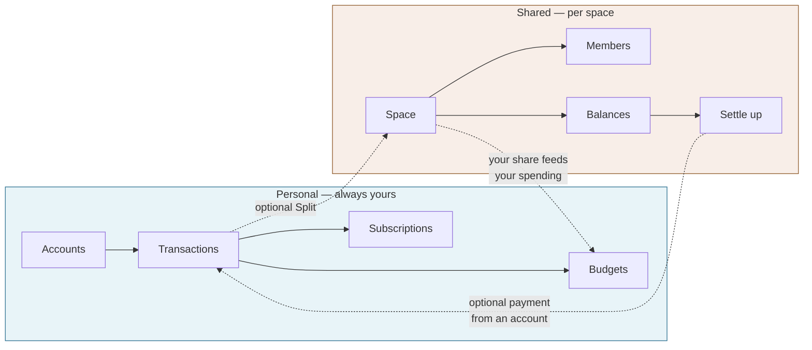

The critical property: **the arrow between the two worlds is optional and one-entry.** A user who never creates a space has a complete personal-finance app. A user who lives in spaces still gets correct account balances for free. Nobody enters anything twice.

### 5.6 Design principles for V1

1. **One entry, one row.** No screen ever asks the user to re-record money the system already knows about.
2. **Two lenses, never mixed.** Cash flow answers "what's in my account." Spending answers "what did I consume." They are labelled differently everywhere.
3. **The FAB is the product.** Adding money events is the highest-frequency action; it is always one tap away, and personal vs. shared is a toggle inside it, not a different button.
4. **Progressive disclosure.** The add sheet opens with amount, account, category, date. Splitting is behind one toggle. Split *method* is behind one more.
5. **Defaults do the work.** Space default splits, default account, last-used category, today's date — the common expense should be three taps.
6. **Refuse rather than guess.** If a number cannot be computed correctly (missing FX rate), show why. Never show a wrong balance.

---

## 6. Feature Matrix

Legend — **Decision:** Keep (bring across largely as-is) · Adapt (bring across, changed) · Merge (two concepts become one) · Remove (not in V1).

### 6.1 Personal finance

| Feature | Existing Pokito | LifeOS | Pokito MVP | Decision | Reasoning |
|---|---|---|---|---|---|
| Accounts / wallets | ✅ `Wallet`, 5 types | ✅ `FinanceAccount`, 9 types | ✅ **Account**, 6 types | **Merge** | One concept. Types: Cash, Bank, Card, Savings, Digital wallet, Other. Drop Crypto/Investment/Loan/Shared. |
| Derived balance | ✅ computed from txns | ⚠️ cached column | ✅ derived, cached read model | **Adapt** | Pokito's approach is correct; add caching for list performance. |
| Account ordering / default | ✅ `orderPosition`, `isDefault` | ✅ `isDefault` | ✅ both | **Keep** | Cheap, and drives add-sheet defaults. |
| Account colour / icon | ✅ | ✅ | ✅ | **Keep** | Recognition at a glance on mobile. |
| Savings goal | ✅ `goalAmount` | ❌ | ⚠️ V1.x | **Remove from V1** | Unused in UI today; not core to the merge. |
| Account archive | ❌ | ✅ `isArchived` | ✅ | **Keep** | Needed — deleting an account with history is destructive. |
| Transactions: expense/income/transfer | ✅ | ✅ (+`ADJUSTMENT`) | ✅ three types | **Merge** | Drop `ADJUSTMENT`; a balance correction is an expense/income. |
| Transaction status | ❌ | ✅ `DRAFT`/`POSTED`/`VOIDED` | ⚠️ `POSTED`/`VOIDED` only | **Adapt** | Drafts add a state users must reason about. Void is needed for correcting shared history. |
| Per-transaction FX rate | ✅ `exchangeRate` | ⚠️ snapshot table | ✅ on cross-currency transfers only | **Adapt** | Keep for personal transfers; store the converted amount rather than recomputing. |
| Notes | ✅ `note` | ✅ `description` + `merchant` | ✅ `note` + `merchant` | **Merge** | Merchant drives recognisable list rows. |
| Categories | ✅ API only, no UI | ✅ + space scope + system flag | ✅ one catalog/user, system-seeded | **Merge** | Ship the UI Pokito never built; drop space scoping. |
| Category hierarchy | ✅ `parentCategory` | ✅ `parentId` | ⚠️ flat in V1 | **Adapt** | Nested pickers are poor on mobile. Model keeps the column; UI stays flat. |
| Tags | ❌ | ✅ `FinanceTag` | ❌ | **Remove** | A second classification axis on top of categories. Post-MVP. |
| Payment methods | ❌ | ✅ `PaymentMethod` | ❌ | **Remove** | Duplicate of Account. |
| Subscriptions | ✅ rich scheduling + pay/skip | ✅ recurring templates + scheduler | ✅ Pokito's model | **Merge** | Same concept. Manual confirm > silent auto-post. |
| Subscription monthly total | ✅ per currency | ❌ | ✅ | **Keep** | Best insight in the current app. |
| Budgets | ❌ (route disabled) | ✅ 10 scope types, rollover, thresholds | ✅ category + monthly + alerts | **Adapt** | Take ~15% of LifeOS's budget model. |
| Receipts | ❌ | ✅ + Dify OCR | ⚠️ photo attach in V1.x | **Remove from V1** | OCR is an external dependency and a whole review UI. |
| Reports page | ❌ | ✅ dedicated screen | ❌ | **Remove** | Home + category breakdown covers V1. |
| CSV import/export | ❌ | ✅ batch + review + commit | ❌ | **Remove** | Large surface, no first-run value. |
| Home-screen widget | ❌ | ✅ iOS | ❌ | **Remove** | Post-launch polish. |
| Multi-currency accounts | ✅ per wallet | ✅ per account | ✅ | **Keep** | Core, not peripheral — Pokito is an international product. |
| Multi-currency spaces | ❌ | ✅ `baseCurrency` | ✅ | **Keep** | A space denominates its debts in one currency; members may pay from any. |
| Reporting currency | ✅ `defaultCurrency` | ✅ profile | ✅ | **Keep** | Set in onboarding, changeable in settings; drives every aggregate. |
| FX rate snapshots | ❌ | ✅ ECB job | ✅ **daily snapshots** | **Keep** | Port LifeOS's `ExchangeRateSnapshot` + refresh job. Required once cross-currency is in V1. |
| Cross-currency shared expenses | ❌ | ⚠️ partial | ✅ | **Adapt** | Resolved by separating unit of account from unit of payment — see below. |
| Manual rate override | ✅ per transaction | ❌ | ✅ on transfers only | **Adapt** | Keep Pokito's per-transaction rate where the user knows what their bank actually gave them. |

### 6.2 Shared finance

| Feature | Existing Pokito | LifeOS | Pokito MVP | Decision | Reasoning |
|---|---|---|---|---|---|
| Spaces | ❌ | ✅ 8 types | ✅ 5 types | **Adapt** | Couple, Household, Trip, Family, Other. Drop Project/Friends/Roommate as separate types. |
| Space base currency | ❌ | ✅ | ✅ **enforced** | **Adapt** | In V1 all shared expenses in a space use this currency. |
| Members | ❌ | ✅ 4 roles, 19 permissions | ✅ **2 roles** | **Adapt** | Owner + Member. Viewer/Admin are enterprise shapes. |
| Invites | ❌ | ✅ email + hashed token + expiry | ✅ **shareable link** + expiry | **Adapt** | Link-first is the mobile-native path; email delivery is infrastructure V1 doesn't need. |
| Shared expenses | ❌ | ✅ | ✅ | **Keep** | The reason for the product. |
| Split: Equal | ❌ | ✅ | ✅ | **Keep** | The default. |
| Split: Exact amounts | ❌ | ✅ `FIXED_AMOUNT` | ✅ | **Keep** | Needed whenever equal is wrong. |
| Split: Percentage | ❌ | ✅ | ✅ | **Keep** | The natural expression of "we split 60/40". |
| Split: Shares/weights | ❌ | ✅ | ❌ | **Remove** | Percentage expresses the same intent more legibly. |
| Split: Itemized | ❌ | ⚠️ spec only, not in enum | ❌ | **Remove** | Not even built in LifeOS. |
| Multiple payers | ❌ | ✅ | ❌ **single payer** | **Adapt** | The single largest simplification available. One "who paid" picker. |
| Space default split | ❌ | ✅ `SpaceFinanceSettings` + per-member shares | ✅ | **Keep** | Excellent: set 60/40 once, never open the split editor again. |
| Personal expense inside a space | ❌ | ✅ (`affectsBudget`, no split) | ✅ **"just mine"** | **Adapt** | Recorded in the space for visibility, split 100% to the payer. |
| Balances (who owes whom) | ❌ | ✅ member + per-pair | ✅ | **Keep** | Core output. |
| Balance scope: cycle | ❌ | ✅ default | ✅ default | **Keep** | "Since we last settled" is how people actually think. |
| Balance scope: lifetime | ❌ | ✅ | ✅ toggle | **Keep** | One toggle, no new screen. |
| Balance scope: window | ❌ | ✅ | ❌ | **Remove** | Third mode, marginal value. |
| Settlements | ❌ | ✅ propose/confirm/cancel | ✅ | **Keep** | Closes the loop. |
| Settlement recommendations | ❌ | ✅ minimises payments | ✅ | **Keep** | With ≤4 members it is trivially cheap and feels magic. |
| Settlement → account transaction | ❌ | ✅ linked in/outflow txn ids | ✅ optional | **Keep** | Keeps account balances honest. Must not count as spending. |
| Settlement history | ❌ | ✅ dedicated screen | ✅ | **Keep** | Trust requires an audit trail. |
| Shared budgets | ❌ | ✅ | ✅ same model as personal | **Keep** | "We spend ¥80,000/month on groceries" is a top-3 use case. |
| Space activity feed | ❌ | ✅ full audit | ✅ simplified | **Adapt** | Money shared with others needs visible provenance. |
| Notifications | ❌ | ✅ ~20 event types + per-space prefs | ✅ **5 event types** | **Adapt** | Expense added, settlement proposed, settlement confirmed, invite received, budget threshold. |
| Space archive | ❌ | ✅ | ✅ | **Keep** | Trips end. |
| Space activity/AI insights | ❌ | ✅ smart insight cards | ❌ | **Remove** | Speculative. |
| Connections panel | ❌ | ✅ cross-module | ❌ | **Remove** | Only meaningful inside a multi-module OS. |

### 6.3 Cross-cutting

| Feature | Existing Pokito | LifeOS | Pokito MVP | Decision | Reasoning |
|---|---|---|---|---|---|
| Auth | ✅ Keycloak | ✅ Keycloak | ✅ Keycloak | **Keep** | Both already on it; infra exists in `pockito-infra`. |
| User key | ⚠️ username string | ✅ internal UUID | ✅ **UUID** | **Adapt** | Usernames change; shared-finance history must not break. |
| Money representation | ⚠️ `BigDecimal(17,2)` | ✅ minor units `long` | ✅ **minor units** | **Adapt** | `(17,2)` is wrong for JPY/KRW — and the worked example is ¥5,000. |
| Soft delete | ❌ | ✅ `deletedAt` + purge job | ✅ `deletedAt` | **Adapt** | Deleting a shared expense must not silently rewrite someone else's balance. |
| i18n | ✅ | ✅ | ✅ | **Keep** | Both already localised. |
| Offline | ❌ | ⚠️ read cache | ⚠️ read cache only | **Adapt** | Read cache yes; offline writes are a sync project. |

---

## 7. Proposed Information Architecture

### 7.1 Reasoning

The workflows, ranked by frequency:

1. **Record an expense** — many times daily → must be one tap from anywhere → **FAB**
2. **Check a balance** ("can I afford this?", "what do I owe?") — daily → **Home** and **Accounts**
3. **Check a space** ("did they add rent?") — every few days → **Spaces**
4. **Find/fix a transaction** — weekly → **Activity**
5. **Check budget / upcoming subscriptions** — weekly → **cards on Home**, detail one tap away
6. **Settle up** — monthly → **inside a space**, surfaced on Home when a balance exists
7. **Manage categories / preferences** — rarely → **Profile**, behind the avatar

Subscriptions and Budgets do **not** earn tabs: both are periodic-review surfaces best represented as Home cards that open a detail screen. Profile does not earn a tab either — it belongs behind the Home header avatar.

That leaves exactly four destinations plus the FAB.

### 7.2 Structure

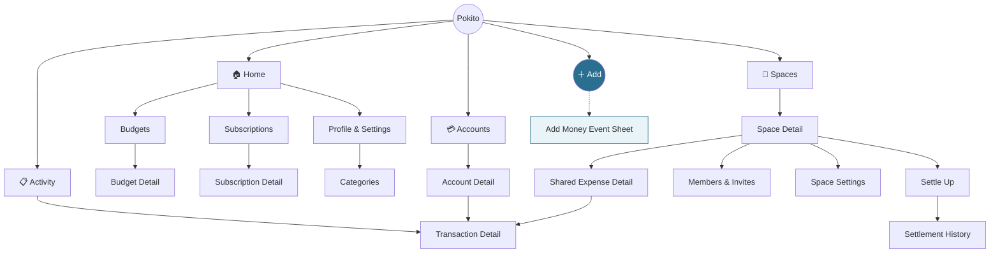

### 7.3 Placement rationale

| Concept | Placement | Why |
|---|---|---|
| **Home** | Primary tab 1 | Answers "how am I doing?" — both personal and shared, in one glance. The screen Pokito never built. |
| **Accounts** | Primary tab 2 | "How much do I have?" is a daily question with a definite answer. |
| **Add** | Centre FAB | Highest-frequency action. Personal vs. shared is a **toggle inside the sheet**, not a separate entry point — this is the crossover made physical. |
| **Spaces** | Primary tab 3 | The differentiating half of the product; must be visible, not buried. |
| **Activity** | Primary tab 4 | Cross-account search/filter is a distinct job from browsing one account. |
| **Budgets** | Home card → detail | Weekly cadence. A tab would be mostly-idle. |
| **Subscriptions** | Home card → detail | Same. The "due soon" card is the actual daily value. |
| **Categories** | Profile → Categories | Configured once, then almost never. |
| **Settle up** | Inside Space Detail + Home nudge | Contextual by nature — you settle *a space*. |
| **Profile / Settings** | Home header avatar | Standard mobile idiom; costs no navigation slot. |
| **Transaction detail** | Pushed screen from three entry points | Deep-linkable, needs full room for split display. |

### 7.4 Navigation

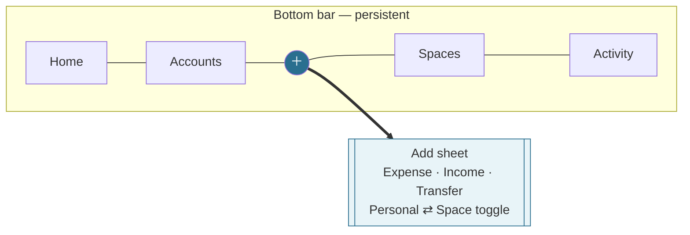

Rules:
- The bottom bar is visible on all four roots and on second-level list screens. It is hidden on modal sheets and full-screen forms.
- Maximum depth is **three** (tab → detail → sub-detail). Anything deeper is a sheet.
- The FAB is present on all four tabs. Its default context follows the tab: on **Spaces** or inside a space, the sheet opens with that space preselected; elsewhere it opens Personal.
- Back always returns to the tab root, never across tabs.

---

## 8. Complete Screen Inventory

Origin key: **P** = existing Pokito · **L** = LifeOS · **P+L** = both · **NEW** = redesigned combination.

### S1 · Home — *NEW*

| | |
|---|---|
| **Purpose** | Answer "how am I doing?" across personal and shared money in one scroll. |
| **Shows** | Header (greeting, avatar → Profile). **Hero:** net worth across accounts (user's default currency) + "Spent this month" (**your share**, not cash out) with change vs. last month. **Accounts strip:** horizontal cards, balance each, "See all". **Shared summary:** "You're owed ¥X · You owe ¥Y" aggregated across spaces, per-space rows when non-zero. **Budgets:** up to 2 budgets closest to their limit, with progress bars. **Upcoming:** next 3 subscriptions due within 14 days. **Recent activity:** last 5 transactions with space badges. |
| **Primary actions** | FAB → Add. Tap any card → its detail. Settle-up nudge when a space balance is non-zero. |
| **Secondary** | Pull to refresh. Avatar → Profile. Month switcher on the hero. |
| **Entry** | App launch (default tab); Home tab. |
| **Next** | Accounts, Account Detail, Spaces, Space Detail, Settle Up, Budget Detail, Subscription Detail, Transaction Detail, Profile. |
| **States** | **Empty (new user):** hero replaced by "Add your first account" CTA; other cards hidden. **Partial:** cards with no data are omitted entirely, not shown empty. **Loading:** skeletons matching final layout. **Error:** inline retry per card — one failing card never blanks the screen. **Stale:** "Updated X ago" when serving cache. |
| **Origin** | **NEW** — replaces Pokito's stub and merges the useful halves of LifeOS's `money_screen` and space-overview cards. |

### S2 · Accounts — *P+L*

| | |
|---|---|
| **Purpose** | See every account and its balance; manage the set. |
| **Shows** | Total across accounts (converted to default currency, with an FX disclosure). List: icon/colour, name, type, balance (positive/negative styling), currency. Archived section, collapsed. |
| **Primary** | Tap → Account Detail. **+ Add account** → S3 sheet. |
| **Secondary** | Long-press → reorder (drag). Swipe → archive. |
| **Entry** | Accounts tab; Home "See all". |
| **Next** | Account Detail, Add/Edit Account sheet. |
| **States** | **Empty:** illustration + "Add your first account" (this is the onboarding entry). **Loading:** skeleton rows. **Error:** full-screen retry. **Single account:** total row suppressed as redundant. **Mixed currency:** total shows a converted figure with an ⓘ disclosing rate and date. |
| **Origin** | **P+L** — Pokito's wallets list with LifeOS's archive. |

### S3 · Add / Edit Account — *P (sheet)* 

| | |
|---|---|
| **Purpose** | Create or edit an account. |
| **Shows** | Name, type (segmented: Cash / Bank / Card / Savings / Digital / Other), currency (defaults to profile currency), starting balance, colour + icon, "Set as default". |
| **Primary** | Save. |
| **Secondary** | Archive (edit only, with a warning that history is kept). Cancel. |
| **Entry** | Accounts "+"; onboarding; Add-sheet "New account" inline option. |
| **Next** | Returns to caller; new account preselected if invoked inline. |
| **States** | **Create** (blank, currency prefilled) · **Edit** (populated; currency locked once transactions exist, with an explanation) · **Saving** · **Validation** (duplicate name) · **Archive confirm.** |
| **Origin** | **P** — Pokito's wallet dialog, redrawn as a bottom sheet. |

### S4 · Account Detail — *P*

| | |
|---|---|
| **Purpose** | One account's balance and its transactions. |
| **Shows** | Header: icon, name, current balance, type, currency. This month in/out. Transaction list grouped by date, infinite scroll, space badge on shared rows. |
| **Primary** | Tap transaction → S15. FAB → Add, this account preselected. |
| **Secondary** | Edit (→ S3). Filter by type/date. |
| **Entry** | Accounts list; Home accounts strip. |
| **Next** | Transaction Detail, Edit Account, Add sheet. |
| **States** | **Empty:** "No transactions yet" + add CTA. **Loading / loading-more** · **Error** · **Archived:** read-only banner, FAB hidden. |
| **Origin** | **P** — directly from `wallet-detail.component`. |

### S5 · Add Money Event *(the sheet)* — *NEW*

**The most important screen in the product.** Every money event, personal or shared, is created here.

| | |
|---|---|
| **Purpose** | Record one money event with the fewest possible taps, and make sharing a toggle rather than a fork. |
| **Shows — always** | Type segmented control: **Expense · Income · Transfer**. Big amount keypad. Account picker (defaults to default account; "To account" appears for Transfer). Category picker (recent categories as chips, then full list). Date (defaults today). Note/merchant (optional). |
| **Shows — Expense only** | **"Share this" toggle.** Off → done. On → reveals inline: space picker (chips; preselected in space context), "Who paid" (defaults to me), split summary line — *"Split equally · you ¥2,500 · Maya ¥2,500"* — tappable to open the split editor. |
| **Primary** | Save. |
| **Secondary** | Split editor sheet (S6). Inline "New category" / "New account". Cancel. |
| **Entry** | FAB on any tab; Account Detail; Space Detail; Home quick action. |
| **Next** | Dismisses to caller with a confirmation toast: *"Added · Maya owes you ¥2,500"* when shared. |
| **States** | **Default** (personal expense) · **Space-context** (space preselected, toggle already on) · **Split preview live-updating** · **Validation** (amount 0, exact split ≠ total, percentages ≠ 100) · **Saving** · **Save error with retained input** · **No accounts:** routes to account creation first · **Currency mismatch:** if the chosen account's currency ≠ space base currency, the share toggle is disabled with the reason shown (V1 constraint). |
| **Origin** | **NEW** — merges Pokito's transaction dialog with LifeOS's `add_expense` + `add_shared_expense`, collapsing 6,497 lines of Flutter into **one progressive sheet**. |

### S6 · Split Editor — *L (sheet)*

| | |
|---|---|
| **Purpose** | Change how a shared expense divides. |
| **Shows** | Method segmented control: **Equal · Exact · Percentage**. Member rows with avatars: each shows the computed share; Exact/Percentage rows become editable. Live remainder indicator (*"¥0 left to assign"* / *"¥500 over"*). Member include/exclude toggles. |
| **Primary** | Done (disabled until it balances). |
| **Secondary** | "Reset to space default". "Just mine" (100% to payer). |
| **Entry** | Split summary line in S5; Edit on S16. |
| **Next** | Returns to caller with the split applied. |
| **States** | **Equal** (read-only rows) · **Exact** (with remainder) · **Percentage** (with % remaining) · **Unbalanced** (Done disabled, reason shown) · **Rounding notice** (e.g. ¥1 assigned to the payer) · **2 members** (compact) vs **3+** (scrollable). |
| **Origin** | **L** — LifeOS's split editor, reduced from 5 methods + multi-payer to 3 methods + single payer. |

### S7 · Spaces — *L*

| | |
|---|---|
| **Purpose** | See every space and your standing in it. |
| **Shows** | Aggregate: "You're owed ¥X · You owe ¥Y". Per space: avatar/accent, name, type, member avatars, **your net balance** colour-coded, last-activity timestamp. Archived section, collapsed. |
| **Primary** | Tap → Space Detail. **+ Create space** → S8. |
| **Secondary** | Pending-invite banner → Invite Review. |
| **Entry** | Spaces tab; Home shared summary. |
| **Next** | Space Detail, Create Space, Invite Review. |
| **States** | **Empty:** explainer + "Create your first space" (this is where the shared half of the product is sold). **Loading / error.** **Pending invite:** banner pinned above the list. **Settled:** balances show "All settled ✓". |
| **Origin** | **L** — simplified from `spaces_screen` (958 lines). |

### S8 · Create Space — *L (2-step sheet)*

| | |
|---|---|
| **Purpose** | Create a space and get a second person into it. |
| **Shows** | **Step 1:** name, type (Couple / Household / Trip / Family / Other), base currency (defaults to profile), accent colour. **Step 2:** "Invite someone" — shareable link with Copy / Share, skippable. |
| **Primary** | Create → Invite → Done. |
| **Secondary** | "Skip for now". |
| **Entry** | Spaces "+"; empty state; onboarding. |
| **Next** | Space Detail of the new space. |
| **States** | **Step 1** · **Step 2 (link generated)** · **Creating** · **Validation** (empty name) · **Link copied** confirmation. |
| **Origin** | **L** — from `create_space_screen` (2,085 lines), reduced to two steps by deferring default-split configuration to Space Settings. |

### S9 · Space Detail — *L*

| | |
|---|---|
| **Purpose** | The shared money hub: who owes whom, what has been spent, what happened. |
| **Shows** | Header: name, type, member avatars, overflow menu. **Balance card** (the anchor): "Maya owes you ¥2,500" or "All settled ✓", scope label "since you last settled", **Settle up** button. Two tabs: **Expenses** (list grouped by date; payer avatar, title, amount, your share, settled indicator; status filter chips) and **Activity** (chronological feed: expenses added, settlements, members joined). Shared budget progress when a budget exists. |
| **Primary** | **Settle up** → S10. FAB → S5 with this space preselected. Tap expense → S16. |
| **Secondary** | Overflow → Members, Space settings, Settlement history, Archive. Balance scope toggle (Since last settle ⇄ All time). |
| **Entry** | Spaces list; Home shared rows; notification deep link. |
| **Next** | Settle Up, Members, Space Settings, Shared Expense Detail, Settlement History, Add sheet. |
| **States** | **Empty:** "No shared expenses yet" + CTA. **Settled:** balance card green, Settle-up de-emphasised. **You owe** vs **you're owed** — different colour treatment. **Loading / error.** **Archived:** read-only banner, FAB hidden. **Solo (invite not yet accepted):** balance card replaced by an "Invite someone" prompt. **FX unavailable:** balance replaced by an explanatory message rather than a wrong number. |
| **Origin** | **L** — from `space_detail_screen` (3,275 lines), cut from 3 tabs to 2 and stripped of AI insight cards, ring charts and category-breakdown sheets. |

### S10 · Settle Up — *L*

| | |
|---|---|
| **Purpose** | Turn a balance into a recorded payment. |
| **Shows** | Recommended settlements ("Maya pays you ¥2,500") — minimal set. Editable from/to/amount. Optional: "Paid from [account]" → records the money movement on the payer's account. Note. |
| **Primary** | **Record payment** (I already paid / received) or **Request** (propose; the other person confirms). |
| **Secondary** | "Mark everything settled" for the whole space. Settlement history. |
| **Entry** | Space Detail balance card; Home settle nudge; notification. |
| **Next** | Success state → back to Space Detail with balances updated. |
| **States** | **Recommendations available** · **Manual entry** · **Nothing to settle** (empty) · **Proposed, awaiting confirmation** (banner) · **Submitting** · **Success** (celebratory, balance now zero) · **Offline** (banner; action queued or blocked). |
| **Origin** | **L** — from `settle_balance_screen` (1,718 lines). |

### S11 · Settlement History — *L*

| | |
|---|---|
| **Purpose** | Audit trail of settlements in a space. |
| **Shows** | Reverse-chronological: date, from → to, amount, status, note, who confirmed. |
| **Primary** | Tap → detail sheet. |
| **Secondary** | Cancel a still-`PROPOSED` settlement. |
| **Entry** | Space Detail overflow; Settle Up link. |
| **Next** | Settlement detail sheet. |
| **States** | Empty · Loading · Error · Pending highlighted. |
| **Origin** | **L**. |

### S12 · Members & Invites — *L*

| | |
|---|---|
| **Purpose** | See who is in the space and add or remove people. |
| **Shows** | Active members: avatar, name, role, joined date, current balance. Pending invites: email/link, sent date, expiry. |
| **Primary** | **Invite** → link sheet. |
| **Secondary** | Remove member (Owner only; warns that history is preserved). Revoke invite. Leave space. |
| **Entry** | Space Detail overflow; member avatars. |
| **Next** | Invite sheet; confirmation dialogs. |
| **States** | Solo · With members · Pending invites · Loading · Error · **Last-owner guard** (Owner cannot leave or be removed while sole Owner) · Non-owner (management actions hidden). |
| **Origin** | **L** — merges `space_members` + `invite_member` (1,603 lines combined). |

### S13 · Space Settings — *L*

| | |
|---|---|
| **Purpose** | Configure how the space behaves — above all, the default split. |
| **Shows** | Name, type, accent, base currency (locked once expenses exist). **Default split**: None / Equal / Percentage, with per-member percentage inputs when Percentage. Notifications: expense alerts, settlement reminders. Danger zone: archive, delete. |
| **Primary** | Save. |
| **Secondary** | Archive. Delete (Owner only, with confirmation). |
| **Entry** | Space Detail overflow. |
| **Next** | Back to Space Detail. |
| **States** | Editable (Owner) · Read-only (Member) · Percentages-must-total-100 validation · Saving · Archive/delete confirm. |
| **Origin** | **L** — merges `space_settings` + `edit_space` + finance settings (~2,000 lines). |

### S14 · Activity *(all transactions)* — *P*

| | |
|---|---|
| **Purpose** | Find, review and correct any money event across all accounts and spaces. |
| **Shows** | Search bar. Filter chips: type, account, category, space, date range. Month summary (in / out / net) reflecting the filter. Grouped-by-date list with running day totals; space badges. |
| **Primary** | Tap → Transaction Detail. |
| **Secondary** | Search. Filter. Swipe → quick edit / delete. |
| **Entry** | Activity tab; Home "see all". |
| **States** | Empty (no transactions) · Empty for filter ("No results — clear filters") · Loading · Loading more · Error · Filters active (visible chip row with "Clear"). |
| **Origin** | **P** — Pokito's transactions screen with LifeOS-style filtering. |

### S15 · Transaction Detail — *NEW*

| | |
|---|---|
| **Purpose** | Full record of one money event, including its shared side when it has one. |
| **Shows** | Amount, type, account(s), category, date, merchant, note. **When shared:** a "Shared with [Space]" section — total, your share, who paid, the per-member split, settled status, and a link to the Shared Expense Detail. **When from a subscription:** a link to the subscription. |
| **Primary** | Edit. |
| **Secondary** | Delete (voids the shared expense too, with a warning naming the affected members). Duplicate. Open space / open subscription. |
| **Entry** | Activity; Account Detail; Home recent; Shared Expense Detail. |
| **Next** | Edit sheet (S5 in edit mode); Space Detail; Shared Expense Detail; Subscription Detail. |
| **States** | Personal · Shared · Shared + already settled (edit restricted, explained) · Subscription-generated · Voided (struck through, banner) · Loading · Error · Not-permitted (someone else's shared expense — read-only). |
| **Origin** | **NEW** — this is where the two-worlds model is made visible to the user. |

### S16 · Shared Expense Detail — *L*

| | |
|---|---|
| **Purpose** | The space's view of one shared expense. |
| **Shows** | Title, total, date, category, who paid, per-member split with amounts, status, who created it and when, balance impact. |
| **Primary** | Edit split (creator/Owner only). |
| **Secondary** | Delete/void. View the payer's linked transaction (own only). |
| **Entry** | Space Detail expenses list; Transaction Detail link; notification. |
| **Next** | Split editor; Transaction Detail. |
| **States** | Active · Settled (read-only, banner) · Voided · Loading · Error · Read-only (not creator/Owner). |
| **Origin** | **L** — from `shared_expense_detail_screen` (1,594 lines). |

### S17 · Budgets — *L (list, reached from Home)*

| | |
|---|---|
| **Purpose** | See every budget and its progress this period. |
| **Shows** | Per budget: name, category, scope badge (**Personal** or space name), spent / limit, progress bar, days remaining, over-limit styling. |
| **Primary** | Tap → Budget Detail. **+ New budget** → sheet. |
| **Secondary** | Filter Personal ⇄ a space. |
| **Entry** | Home budget card "See all". |
| **Next** | Budget Detail; Create Budget sheet. |
| **States** | Empty (explainer + CTA) · On track · Near limit (amber at 80%) · Over (red) · Loading · Error. |
| **Origin** | **L** — heavily reduced from `budget_detail_screen` (2,429 lines). |

### S18 · Budget Detail — *L*

| | |
|---|---|
| **Purpose** | One budget's progress and the transactions inside it. |
| **Shows** | Progress ring/bar, spent vs. limit vs. remaining, daily-pace indicator, contributing transactions list, period selector. |
| **Primary** | Edit budget. |
| **Secondary** | Delete. Tap transaction → S15. |
| **Entry** | Home budget card; Budgets list. |
| **States** | On track · Near · Over · Empty period (no spend yet) · Loading · Error · Shared budget (member attribution shown). |
| **Origin** | **L**. |

### S19 · Subscriptions — *P*

| | |
|---|---|
| **Purpose** | Manage recurring expenses and confirm them as they fall due. |
| **Shows** | **Monthly total, per currency** (Pokito's best existing feature). "Due soon" section. Full list: icon, name, amount, cadence, next due date, account, paused indicator. |
| **Primary** | **Pay** (creates the transaction, advances the schedule) or **Skip** (advances the schedule only). Tap → detail. |
| **Secondary** | **+ Add subscription**. Pause / resume. |
| **Entry** | Home upcoming card. |
| **Next** | Subscription Detail; Add/Edit sheet; Transaction Detail after paying. |
| **States** | Empty · Due today (highlighted) · Overdue (red) · Paused (dimmed) · Ended · Loading · Error · Paying (in-flight). |
| **Origin** | **P** — Pokito's subscriptions, with LifeOS's pause/resume. |

### S20 · Subscription Detail + Add/Edit — *P (sheet)*

| | |
|---|---|
| **Purpose** | Configure a recurring expense; review its payment history. |
| **Shows** | Name, icon, amount, currency, cadence (frequency × interval + day anchor), start/end date, account, category, note, next due, last paid, payment history. |
| **Primary** | Save. Pay now. |
| **Secondary** | Pause. Delete. Tap a past payment → S15. |
| **Entry** | Subscriptions list; Home upcoming. |
| **States** | Create · Edit · Active · Paused · Ended · Validation (interval ≥ 1, end after start) · Saving · Delete confirm. |
| **Origin** | **P** — Pokito's subscription form, which is already the strongest scheduling model across both apps. |

### S21 · Categories — *P (API) + L (UI)*

| | |
|---|---|
| **Purpose** | Manage the expense/income category catalog. |
| **Shows** | Two tabs — Expense / Income. Rows: icon, colour, name, usage count. System categories flagged. |
| **Primary** | Tap → edit sheet. **+ New category**. |
| **Secondary** | Delete (blocked when in use — offers reassignment). Reorder. |
| **Entry** | Profile → Categories; "New category" inline from the Add sheet. |
| **States** | Default (seeded) · Custom added · Empty income tab · Delete blocked (with reason) · Loading · Error. |
| **Origin** | **P+L** — ships the UI Pokito's complete category API never got. |

### S22 · Profile & Settings — *NEW*

| | |
|---|---|
| **Purpose** | Identity, preferences and configuration in one place. |
| **Shows** | Avatar, name, email. Default currency, country. Categories link. Notification preferences. Language. Theme. About / sign out. |
| **Primary** | Edit a preference. |
| **Secondary** | Sign out. |
| **Entry** | Home header avatar. |
| **States** | Loaded · Saving · Error · Sign-out confirm. |
| **Origin** | **NEW** — Pokito's settings routes are commented out; LifeOS's are spread across several screens. |

### S23 · Onboarding — *NEW*

| | |
|---|---|
| **Purpose** | Get a new user to their first useful screen in under a minute. |
| **Shows** | 3 steps: (1) default currency + country; (2) add first account (name, type, balance); (3) optional "Share expenses with someone?" → create space or skip. |
| **Primary** | Continue / Finish. |
| **Secondary** | Skip step 3. |
| **Entry** | First launch after sign-in. |
| **Next** | Home. |
| **States** | Step 1/2/3 · Creating · Error · Skipped-space variant. |
| **Origin** | **NEW** — neither app has onboarding. |

### S24 · Invite Review — *L*

| | |
|---|---|
| **Purpose** | Let an invited person understand and accept a space invitation. |
| **Shows** | Space name, type, who invited you, member count, what joining means. |
| **Primary** | **Join space**. |
| **Secondary** | Decline. |
| **Entry** | Invite deep link; notification; Spaces pending banner. |
| **Next** | Space Detail on accept; Spaces on decline. |
| **States** | Valid · Expired · Revoked · Already a member · Not signed in (auth first, then return) · Joining · Error. |
| **Origin** | **L** — from `invite_review_screen` (682 lines). |

### S25 · Notifications — *L*

| | |
|---|---|
| **Purpose** | Catch up on shared-finance events. |
| **Shows** | Chronological list of the 5 V1 event types, unread indicators, deep links. |
| **Primary** | Tap → deep link to the relevant screen. |
| **Secondary** | Mark all read. |
| **Entry** | Home header bell; push notification. |
| **States** | Empty · Unread · All read · Loading · Error. |
| **Origin** | **L** — reduced from ~20 event types to 5. |

**Total: 25 screens**, of which 8 are sheets or modals rather than pushed routes. For comparison, LifeOS's finance + spaces surface alone is 33 Dart files and ~34,000 lines.

### Deliberately *not* separate screens

| Not a screen | Instead | Why |
|---|---|---|
| Add expense / add shared expense | One sheet (S5) with a toggle | The whole thesis of the product |
| Split method chooser | Segmented control inside S6 | A screen for three options is a screen too many |
| Payer picker | Inline row in S5 | Single payer in V1 — it is one field |
| Space switcher | Chip rail inside S5 | LifeOS's `switch_space_sheet` (306 lines) is not needed once spaces are a tab |
| Reports | Home + Budget Detail | A reports screen with no reporting depth is a dead end |
| Payment methods | — | Merged into Account |
| Tags | — | Excluded from V1 |

---

## 9. Core User Journeys

### 9.1 First-time setup

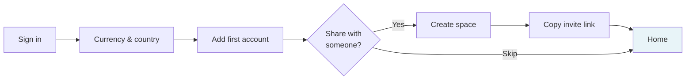

**Target: under 60 seconds to a usable Home.** Categories are seeded automatically — the user is never asked to build a taxonomy before recording anything. Step 3 is where the shared half of the product is introduced, and it is skippable so the personal-only user is never blocked.

### 9.2 Add an account

Accounts tab → **+** → sheet (name, type, currency, starting balance, colour) → Save → appears in the list with its starting balance. The first account is auto-set as default.

### 9.3 Viewing overall financial status

Open app → Home. Net worth and "spent this month (your share)" are above the fold. Accounts strip, shared summary, budgets, upcoming subscriptions, recent activity follow. **No taps required for the primary question.**

### 9.4 Recording a personal expense

FAB → sheet opens with Expense selected, default account, today's date → type amount on the keypad → tap a recent-category chip → Save. **Three interactions.**

### 9.5 Managing subscriptions

Home "Upcoming" → Subscriptions → a due item shows **Pay** / **Skip**.
- **Pay** → confirm account → creates a transaction, advances `nextDueDate`, updates `lastPaymentDate`
- **Skip** → advances the dates only, creates nothing

Adding: **+** → name, amount, cadence, account, category, start date. Next due is computed.

### 9.6 Understanding spending

Home hero → month-over-month change. Home budgets → per-category pace. Activity tab → filter by category, space or date. Budget Detail → the transactions inside a budget. **No separate reports screen in V1.**

### 9.7 Creating a space and inviting someone

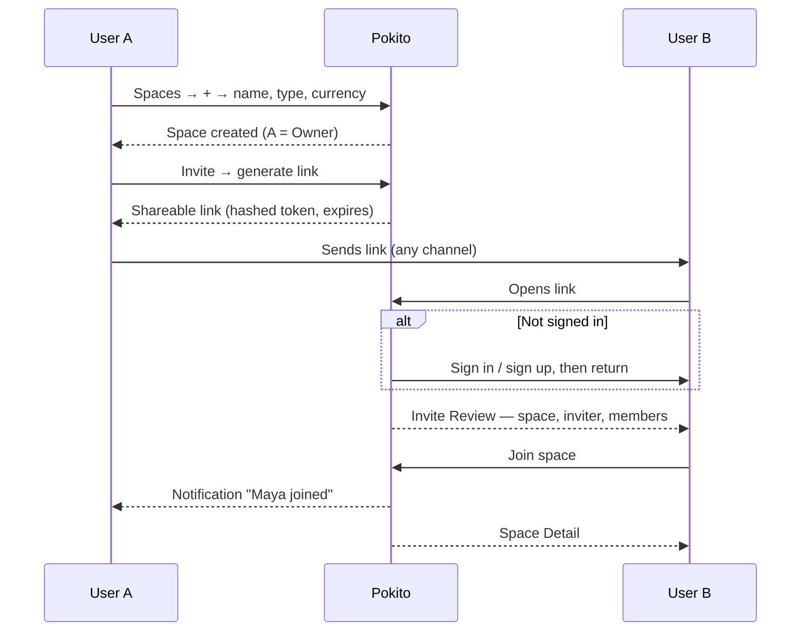

Link-first rather than email-first: no mail infrastructure needed for V1, and it works over whatever channel the pair already use.

### 9.8 Setting up a shared budget

Space Detail → overflow → *or* Home → Budgets → **+** → scope = the space → category → monthly limit → alerts at 80% and 100%. Progress then appears on both Home and Space Detail, counting **all members' shares** of expenses in that space and category.

### 9.9 Adding and splitting a shared expense — **the core journey**

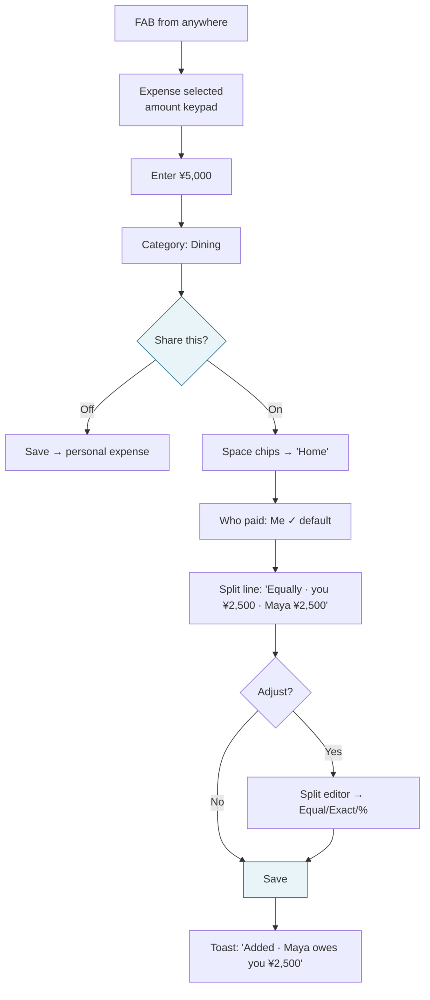

If the space has a **default split** configured (say 60/40), step I already reads *"Split 60/40 · you ¥3,000 · Maya ¥2,000"* and the editor is never opened. That is the intended steady state for a couple.

### 9.10 Understanding balances

Spaces tab → aggregate "You're owed / You owe" → tap a space → the balance card is the first thing on screen: *"Maya owes you ¥2,500 — since you last settled."* A scope toggle switches to All time. Tap the balance → the per-pair breakdown when there are 3+ members.

### 9.11 Reviewing shared spending

Space Detail → **Expenses** tab. Grouped by date, showing payer, total and your share. Filter chips: All / Unsettled / Settled. Shared budget progress sits above the list.

### 9.12 Settling up

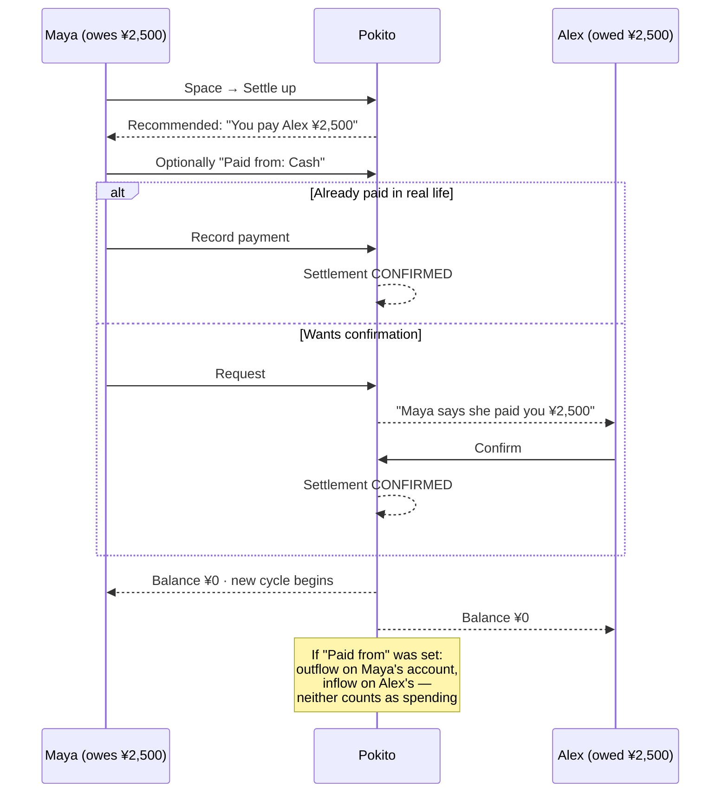

The confirmed settlement becomes the **cycle boundary**: subsequent balances default to "since you last settled."

---

## 10. Personal ↔ Shared Finance Integration Model

This section answers the brief's ¥5,000 question and generalises it.

### 10.1 The rule

> **One money event = one Transaction. A Split is an overlay on that Transaction, never a second record.**

When you record a ¥5,000 restaurant expense from your Bank account and share it into the "Home" space, split 50/50:

| Record | Value |
|---|---|
| `Transaction` | ¥5,000 · EXPENSE · Bank account · Dining · owner = you · **`splitId` set** |
| `Split` | space = Home · total ¥5,000 · method EQUAL · payer = you |
| `SplitShare` (you) | ¥2,500 |
| `SplitShare` (Maya) | ¥2,500 |

**No second transaction is created for Maya.** Maya's ¥2,500 is a *claim*, not a money movement — nothing has left her account.

### 10.2 What the user sees, per surface

| Surface | Shows | Value |
|---|---|---|
| Your Bank account balance | Cash flow | **−¥5,000** |
| Your Activity list | The transaction, with a "Home" badge and a "your share ¥2,500" subtitle | ¥5,000 row |
| Your Home "Spent this month" | Spending | **¥2,500** |
| Your Dining budget | Spending | **¥2,500** |
| Space → Expenses | The shared expense | **¥5,000**, paid by you |
| Space → Balance | Claim | **Maya owes you ¥2,500** |
| Maya's Activity | *(nothing — no money moved)* | — |
| Maya's Home "Spent this month" | Spending | **¥2,500** |
| Maya's Dining budget | Spending | **¥2,500** |
| Maya's account balances | Cash flow | **unchanged** |

### 10.3 The two lenses — stated explicitly

This is the concept LifeOS never named, and the reason it needs `affectsBudget` and `settledPolicy` flags.

**Cash flow** = money that actually entered or left your accounts.
→ Drives: account balances, net worth, the Activity list, account detail.
→ For a shared expense you paid: the **full amount**.
→ For a shared expense someone else paid: **zero**.

**Spending** = your share of what was consumed.
→ Drives: "Spent this month" on Home, budgets, category breakdowns.
→ For any shared expense: **your share**, whoever paid.
→ Settlements: **never counted** — a settlement is repayment of an already-counted share.

Every number in the UI is labelled to make clear which lens it belongs to. Home's hero shows both side by side: net worth (cash flow) and spent this month (spending).

### 10.4 The four crossover cases

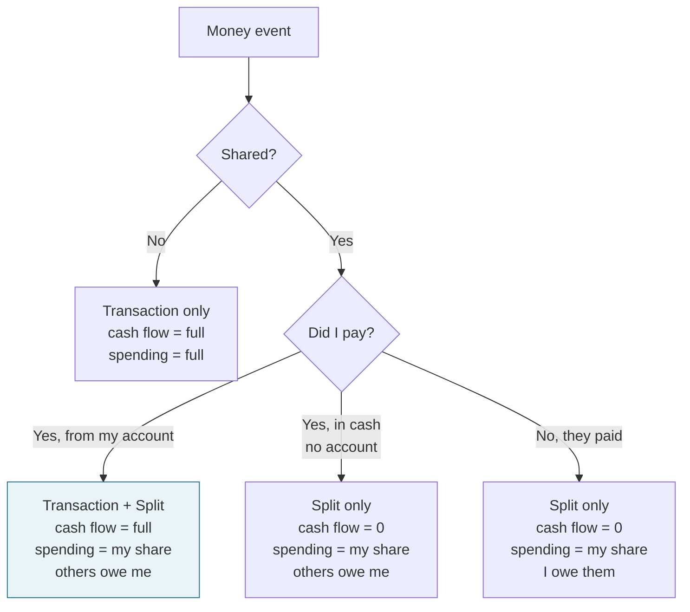

**Case 3 matters.** LifeOS already handles it: a payer with no `accountId` creates no transaction. This lets a user split a cash expense without pretending they track a cash account. The Add sheet exposes it as an account-picker option: *"Cash — don't track"*.

### 10.5 Settlement crossover

When Maya settles ¥2,500 with Alex and marks it "paid from" an account:

| Record | Effect |
|---|---|
| `Settlement` | from Maya → to Alex, ¥2,500, CONFIRMED, cycle boundary |
| Maya's `Transaction` | −¥2,500 outflow, **type = SETTLEMENT**, `settlementId` set |
| Alex's `Transaction` | +¥2,500 inflow, **type = SETTLEMENT**, `settlementId` set |

Both transactions affect **cash flow only**. They carry no category and are **excluded from spending, budgets and category breakdowns**, because Maya's ¥2,500 share was already counted as spending when the dinner was recorded. Counting it again is the classic double-count bug in shared-finance apps, and the type flag is what prevents it.

If "paid from" is left blank (cash, or a bank transfer they don't track), only the `Settlement` is created and no account is touched. Balances still zero out.

### 10.6 Editing and deleting across the boundary

| Action | Consequence |
|---|---|
| Edit the amount of a shared expense you paid | Transaction and all shares recompute; other members are notified |
| Delete a shared expense you paid | Both the transaction and the split are voided (soft delete); a warning names the members whose balance changes |
| Edit the split only | Transaction is untouched — only shares and balances move |
| Delete a shared expense after settlement | **Blocked.** Offer "add a correcting expense" instead — settled history must stay stable |
| Remove a member from a space | Historical expenses and balances are preserved; they cannot create new ones |

### 10.7 Why this beats both source apps

- **Existing Pokito** has no notion of a share, so a split expense either overstates spending (record ¥5,000) or breaks the account balance (record ¥2,500). Both are wrong.
- **LifeOS** gets the mechanics right but never names the two lenses, so it compensates with per-record flags (`affectsBudget`) and per-budget policies (`settledPolicy`) that push the modelling problem onto the user.
- **New Pokito** derives both lenses from one record with one rule, and the flags become unnecessary.

---

### 10.8 Multi-currency: the third role

The two-lens model (§10.3) answers *whose* money. Multi-currency answers *which* money. They compose, and the composition is where international shared finance usually goes wrong.

**The mistake to avoid:** treating "currency" as one property. It is three, and they belong to three different objects.

| Role | Object | Question it answers |
|---|---|---|
| **Unit of payment** | Account | What currency actually left the account? |
| **Unit of account** | Space | What currency is the debt denominated in? |
| **Unit of reporting** | User | What currency do I want totals in? |

**The rule that falls out of it:**

> A shared debt is always denominated in the **space's** currency. Payment may come from an account in **any** currency.

Worked through: three friends on a trip, space denominated in JPY, one of them paying with a EUR card.

| Record | Currency | Value |
|---|---|---|
| Split | Space — JPY | `¥42,000` |
| SplitShare ×3 | Space — JPY | `¥14,000` each |
| Payer's Transaction | Account — EUR | `−€248.00` |
| Rate captured on it | — | `JPY → EUR 0.00590 · 15 Aug` |

**Why this is the right cut:**

1. **Balances never span currencies.** Every figure in a space's who-owes-whom is in that one currency. There is no "at what rate do I owe you?" question, because the debt was never in more than one currency.
2. **Cash flow stays honest.** €248.00 really did leave the EUR card; that is what the account shows.
3. **Rate drift has nowhere to hide.** The debt is ¥14,000 today and ¥14,000 next month. Whoever converts absorbs the movement — which is exactly what happens in real life and is explainable in one sentence.
4. **The two lenses survive conversion.** Cash flow is in the account's currency; spending is the member's share in the space's currency; reporting converts both. No figure is ever silently re-denominated.

**What it costs:** a member cannot see a space's debts in their own currency. That is deliberate — per-member denomination would reintroduce exactly the drift ambiguity this design removes. The space's currency is shared ground, and it is the one thing the group has to agree on.

**Historical amounts are never re-converted.** A captured rate lives on its record. Aggregates recompute against today's snapshot; individual records never move.

**When a rate is missing, Pokito refuses.** Combined totals are replaced by per-currency subtotals and a named reason. This is principle P6 and it is the difference between a product that is trusted with international money and one that is not.

---

## 11. UX Simplification Recommendations

### 11.1 Duplicate concepts to collapse

| Duplication | Resolution |
|---|---|
| Wallet (P) / FinanceAccount (L) / PaymentMethod (L) | **One: Account.** A card is an account; cash is an account. |
| Subscription (P) / RecurringTransactionTemplate (L) | **One: Subscription.** Pokito's name, Pokito's manual pay/skip. |
| Category (P) / FinanceCategory (L) / FinanceTag (L) | **One: Category**, one catalog per user. Tags excluded from V1. |
| Transaction (P) / FinanceTransaction (L) / SharedExpense (L) | **One ledger + one overlay.** A shared expense is a transaction with a split. |
| `space_settings` + `edit_space` + finance settings (L, ~3,400 lines) | **One Space Settings screen.** |
| `space_members` + `invite_member` (L, 1,603 lines) | **One Members & Invites screen.** |
| `add_expense` + `add_shared_expense` (L, 6,497 lines) | **One Add sheet with a toggle.** |

### 11.2 Duplicate data entry to eliminate

| Risk | Prevention |
|---|---|
| Recording the shared expense in the space *and* the payment in your account | Automatic linked transaction (§10.1). The user is never asked twice. |
| Recording a settlement in the space *and* the transfer in your account | "Paid from [account]" checkbox inside Settle Up creates both. |
| Re-picking a category after switching the target space | One catalog per user — the category simply carries over. This deletes the entire `finance_scope_remap` problem class. |
| Re-entering the split every time | Space default split; `splitOrigin = GROUP_DEFAULT`. |
| Re-entering the account and date | Default account, today's date, last-used category as the first chip. |

### 11.3 Navigation levels to flatten

| LifeOS path | Pokito path |
|---|---|
| Money → settings shortcut → Categories → category → edit | Profile → Categories → edit sheet |
| Spaces → space → overview tab → balance card → settle → review sheet → success | Spaces → space → **Settle up** → review → success |
| Home → Money → quick action → add shared expense → space picker → payer → split method → editor | **FAB → toggle → save** |

Rule: **maximum three levels.** Anything deeper becomes a sheet.

### 11.4 Screens to remove outright

| Removed | Replaced by | Why |
|---|---|---|
| `switch_space_sheet` (L, 306 lines) | Spaces tab + chip rail in the Add sheet | Global space context is an OS pattern, not a finance-app pattern |
| `payment_methods_screen` (L, 1,262 lines) | Account | Duplicate concept |
| `tags_screen` (L, 1,255 lines) | — | Tags excluded from V1 |
| `scan_receipt_screen` (L, 940 lines) | — | OCR post-MVP |
| Reports page (L) | Home + Budget Detail | No reporting depth to justify a destination in V1 |
| Space Activity as a third tab (L) | Merged into Space Detail's second tab | Two tabs, not three |
| AI insight cards (L) | — | Speculative |
| Connections panel (L) | — | Only meaningful in a multi-module OS |
| Pokito's desktop `p-dock` and "More options" dialog | Bottom bar | Desktop-oriented |

### 11.5 Actions to consolidate

| Instead of | Do |
|---|---|
| "Add expense" and "Add shared expense" as separate quick actions | One FAB with a Share toggle |
| Propose settlement / Mark as paid / Mark all settled as three flows | One Settle Up screen with Record vs. Request, plus a "settle everything" affordance |
| Pay subscription / Skip subscription on separate screens | Two buttons on the subscription row |
| Edit space / Space settings / Space finance settings | One Space Settings screen |

### 11.6 Terminology to standardise

| Use | Not | Why |
|---|---|---|
| **Account** | Wallet, payment method, finance account | Wallet reads as "cash in pocket"; users have bank accounts |
| **Transaction** | Money movement, ledger entry, finance transaction | Universal |
| **Shared expense** | Split expense, group expense | Matches the "share this" toggle |
| **Split** *(noun and verb)* | Distribution, allocation, participants | "Split it with Maya" is how people speak |
| **Your share** | Owed amount, participant amount, liability | Plain language |
| **Settle up** | Settlement, reconciliation, clear balance | Category-standard |
| **Space** | Group, workspace, household, circle | Already LifeOS's term and it generalises |
| **Subscription** | Recurring transaction, recurring template, standing order | User-facing and concrete |
| **Spent** *(your share)* vs **Out** *(cash flow)* | Using "spent" for both | The two lenses must never share a label |

### 11.7 Information to disclose progressively

| Level | Add sheet | Space Detail | Budget |
|---|---|---|---|
| **1 — always** | Amount, account, category, date | Balance card, recent expenses | Progress bar on Home |
| **2 — one tap** | Share toggle → space, payer, split summary | Expenses tab, Activity tab | Budget Detail |
| **3 — two taps** | Split editor → method, per-member amounts | Members, Settings, Settlement history | Edit, contributing transactions |

A user who only records personal expenses **never sees a space, a split or a member.** The shared machinery is entirely invisible until they opt in.

### 11.8 Desktop-oriented Pokito interactions to redesign

| Web pattern | Mobile pattern |
|---|---|
| PrimeNG `p-dock` sidebar | Bottom tab bar |
| Centre-screen modal dialogs (wallet/transaction/subscription forms) | Bottom sheets with drag-to-dismiss |
| "More options" dialog listing overflow nav | Removed — four tabs need no overflow |
| Paged transaction list with a "load more" button | Infinite scroll with a sticky date header |
| Hover states on wallet cards | Tap targets ≥ 44pt, press states, swipe actions |
| Multi-column dashboard | Single-column vertical scroll with card sections |
| Number input fields | Full-width numeric keypad for amounts |
| Separate desktop and mobile navigation trees in one component | One navigation model |

### 11.9 LifeOS flows to simplify now that finance *is* the product

| LifeOS constraint | Pokito freedom |
|---|---|
| Finance is one module among calendar, AI, search, notifications | Finance owns the whole nav — no module registry, no cross-module Connections |
| Spaces must serve any module, so they carry generic activity/permissions/type machinery | Spaces exist **only** for shared money — 2 roles, money-shaped activity feed |
| Categories are space-scoped so each module can have its own catalog | One catalog per user |
| A generic "scope picker" is needed because every module has personal/shared variants | Scope appears in exactly one place: the Add sheet's Share toggle |
| Budgets must cover projects, trips, events, goals, calendars | Budgets are category + period |
| Global space context switching across modules | Spaces are a tab; context is local |

---

## 12. High-Level Domain / Data Model

### 12.1 Entity relationships

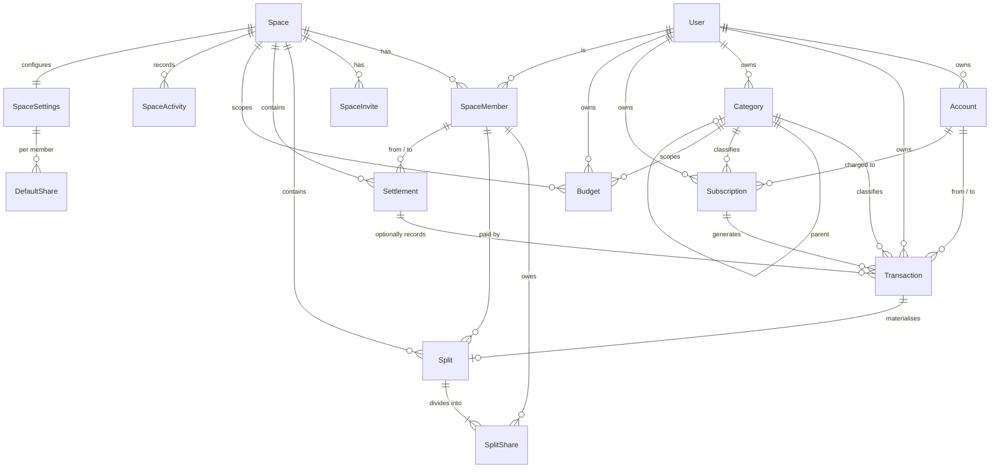

### 12.2 The two halves and their single join

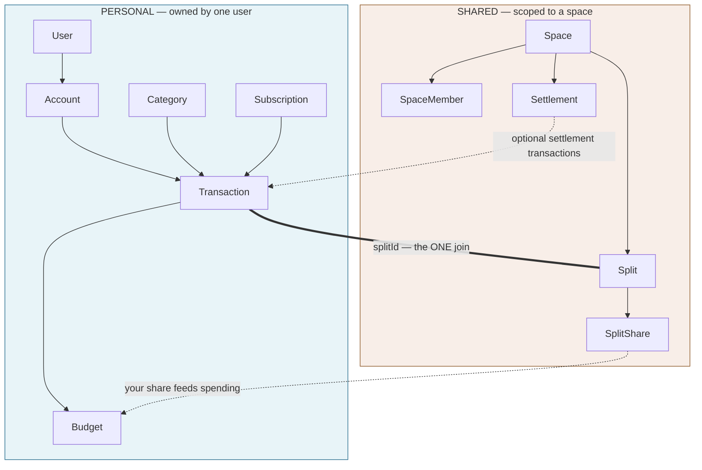

**There is exactly one structural join between the two halves: `Transaction.splitId`.** Everything else is derived. This is what keeps the model comprehensible.

### 12.3 Entity definitions

**`User`** — `id: UUID` (**not** the username — Pokito's current username-as-PK breaks shared history when a username changes), `keycloakSubject`, `displayName`, `email`, `defaultCurrency`, `country`, timestamps.

**`Account`** *(merges Pokito `Wallet` + LifeOS `FinanceAccount` + `PaymentMethod`)* — `id`, `userId`, `name`, `type` (`CASH`|`BANK`|`CARD`|`SAVINGS`|`DIGITAL`|`OTHER`), `currency`, `openingBalanceMinor`, `isDefault`, `sortOrder`, `colour`, `icon`, `archivedAt?`, timestamps.
Balance is **derived** (`openingBalance + Σ transaction effects`) and cached in a read model, as in Pokito today.

**`Transaction`** — `id`, `userId`, `type` (`EXPENSE`|`INCOME`|`TRANSFER`|`SETTLEMENT`), `accountFromId?`, `accountToId?`, `amountMinor`, `currency` (**always the account's currency** — the unit of payment, §10.8), `occurredOn`, `merchant?`, `note?`, `categoryId?`, `subscriptionId?`, **`splitId?`**, **`settlementId?`**, `sourceAmountMinor?` + `sourceCurrency?` + `exchangeRate?` + `rateSnapshotId?` (set when this transaction pays a debt denominated in another currency — a cross-currency shared expense or settlement), `status` (`POSTED`|`VOIDED`), `deletedAt?`, timestamps.

Rules:
- `EXPENSE` → `accountFromId` required, `categoryId` expected
- `INCOME` → `accountToId` required
- `TRANSFER` → both required; cross-currency stores `exchangeRate` **and** the resulting `convertedAmountMinor` (Pokito currently recomputes it transiently and so loses history)
- `SETTLEMENT` → one side set, `settlementId` required, `categoryId` forbidden, **excluded from spending**
- `splitId` set ⟹ this transaction is the payer's materialisation of a shared expense

**`Category`** — `id`, `userId`, `name`, `type` (`EXPENSE`|`INCOME`), `colour`, `icon`, `parentId?` (modelled, flat in the V1 UI), `isSystem`, `sortOrder`, `deletedAt?`.

**`Subscription`** *(Pokito's model, retained)* — `id`, `userId`, `name`, `icon`, `amountMinor`, `currency`, `frequency` (`DAILY`|`WEEKLY`|`MONTHLY`|`YEARLY`), `interval`, `dayOfMonth?`, `dayOfWeek?`, `monthOfYear?`, `startDate`, `nextDueDate`, `lastPaymentDate?`, `endDate?`, `status` (`ACTIVE`|`PAUSED`|`ENDED`), `accountId`, `categoryId`, `note?`.

**`Budget`** — `id`, `ownerUserId?`, `spaceId?` (**exactly one** is set), `name`, `categoryId`, `amountMinor`, `currency`, `period` (`MONTHLY` in V1), `startsOn`, `alertThresholds` (default `[80, 100]`), `deletedAt?`.

**`Space`** — `id`, `name`, `type` (`COUPLE`|`HOUSEHOLD`|`TRIP`|`FAMILY`|`OTHER`), `baseCurrency`, `accentColour`, `icon`, `status` (`ACTIVE`|`ARCHIVED`), timestamps.

**`SpaceMember`** — `id`, `spaceId`, `userId`, `role` (`OWNER`|`MEMBER`), `status` (`INVITED`|`ACTIVE`|`LEFT`|`REMOVED`), `displayNameSnapshot`, `joinedAt?`, `leftAt?`. At least one active `OWNER` per active space.

**`SpaceInvite`** — `id`, `spaceId`, `tokenHash`, `invitedByUserId`, `invitedEmail?`, `role`, `status` (`PENDING`|`ACCEPTED`|`DECLINED`|`REVOKED`|`EXPIRED`), `expiresAt`, `acceptedByUserId?`.

**`SpaceSettings`** — `spaceId` (PK), `defaultSplitMethod` (`NONE`|`EQUAL`|`PERCENTAGE`), plus `DefaultShare` rows (`userId`, `percentage`).

**`Split`** *(LifeOS `SharedExpense`, renamed and reduced)* — `id`, `spaceId`, `title`, `totalAmountMinor`, `currency` (**always the space's currency** — the unit of account, §10.8), `occurredOn`, `categoryId?`, `method` (`EQUAL`|`EXACT`|`PERCENTAGE`), `origin` (`SPACE_DEFAULT`|`CUSTOM`), **`payerUserId`** (single payer in V1), `status` (`ACTIVE`|`SETTLED`|`VOIDED`), `settledInSettlementId?`, `createdByUserId`, `deletedAt?`, timestamps.

**`ExchangeRateSnapshot`** *(ported from LifeOS)* — `id`, `baseCurrency`, `quoteCurrency`, `rate`, `source`, `capturedAt`. Written by a daily refresh job. Every converted record stores the `id` of the snapshot it used, so a historical amount can always be explained and is never recomputed.

**`SplitShare`** *(LifeOS `SharedExpenseParticipant`)* — `id`, `splitId`, `userId`, `owedAmountMinor`, `percentage?`.
Invariant: `Σ owedAmountMinor = totalAmountMinor`, with rounding remainder assigned deterministically to the payer.

**`Settlement`** — `id`, `spaceId`, `fromUserId`, `toUserId`, `amountMinor`, `currency`, `status` (`PROPOSED`|`CONFIRMED`|`CANCELLED`), `note?`, `outflowTransactionId?`, `inflowTransactionId?`, `createdByUserId`, `confirmedByUserId?`, `settledAt?`.

**`SpaceActivity`** — `id`, `spaceId`, `actorUserId`, `eventType`, `entityType`, `entityId`, `summary`, `createdAt`.

### 12.4 Resolving the brief's ambiguous concepts

**Transaction vs. Expense vs. Shared Expense**

| Term | Model | User sees |
|---|---|---|
| Transaction | `Transaction` | "a row in my activity" |
| Expense | `Transaction` with `type = EXPENSE` | "money I spent" |
| Shared expense | `Split` + optionally a `Transaction` with `splitId` | "something we're splitting" |

There are **not** three tables. There is one ledger and one overlay. "Shared expense" is a *presentation* of a Split — with its linked transaction when the viewer is the payer, without it when they are not.

**Account/Wallet vs. Payment Method**

One entity: `Account`. LifeOS's `PaymentMethod` was an account with a nullable pointer at an account — a distinction with no user-facing meaning. Removed.

**Budget scope**

One `Budget` entity with **exactly one** of `ownerUserId` / `spaceId` set. A personal budget counts your personal spending plus your shares. A space budget counts all members' shares within that space. Same entity, same UI, different filter.

### 12.5 Derived values — never stored as user input

| Value | Derivation |
|---|---|
| Account balance | `openingBalance + Σ (inflows − outflows)` on posted, non-deleted transactions |
| Net worth | `Σ` account balances, converted to the default currency, with FX disclosure |
| Spent this month | `Σ` your share of expenses = personal expenses + your `SplitShare`s, **excluding** settlements |
| Space member balance | `(Σ paid − Σ owed) − settlementNet`, restricted to the active cycle |
| Who owes whom | Minimised pairwise reduction of member balances |
| Budget progress | `Σ` in-scope shares in the period ÷ limit |
| Subscription monthly total | Each subscription normalised to a monthly figure, grouped by currency |
| Next due date | Computed from `lastPaymentDate` (or `startDate`) + frequency × interval, honouring the day anchor |

### 12.6 Invariants

1. `Σ SplitShare.owedAmountMinor = Split.totalAmountMinor` — always, after rounding
2. A `Transaction` with `splitId` set has `userId = Split.payerUserId`
3. A `Split` produces **at most one** transaction (single payer in V1); zero if the payer chose "cash — don't track"
4. `SETTLEMENT` transactions never carry a category and never count as spending
5. A confirmed `Settlement` is immutable and forms a cycle boundary
6. Soft delete only for transactions, splits and settlements — never a hard delete of shared history
7. Removing a member preserves all their historical shares and balances
8. `Split.currency = Space.currency` **always** — a debt is denominated in the space's unit of account and never in a member's
9. `Transaction.currency = Account.currency` **always** — a transaction is recorded in the unit of payment
10. When 8 and 9 differ on the same event, the transaction carries `sourceAmountMinor`, `sourceCurrency`, `exchangeRate` and `rateSnapshotId`; neither figure is ever recomputed afterwards
11. `Settlement.currency = Space.currency` — settling a debt clears it in the currency it was owed in

---

## 13. MVP Scope and Prioritisation

### 13.1 Must Have — V1

**Foundation**
- Keycloak auth; `User` with UUID primary key; onboarding (currency, first account, optional first space)
- Money in **minor units**; soft delete on financial records
- **Multi-currency throughout**: per-account currency, per-space currency, a user reporting currency set in onboarding, daily FX snapshots, and cross-currency shared expenses (§11.6)

**Personal finance**
- Accounts: create, edit, archive, reorder, set default; derived balances
- Transactions: expense, income, transfer; create, edit, void; note, merchant, date, category
- Categories: seeded system set + user CRUD (finally ships Pokito's built-but-unused API)
- Subscriptions: full scheduling model; pay / skip; pause / resume; monthly total per currency
- Budgets: category + monthly + personal-or-space, with 80% / 100% alerts
- Home: net worth, spent this month (your share), accounts strip, shared summary, budgets, upcoming, recent
- Activity: search, filter (type, account, category, space, date), grouped list

**Shared finance**
- Spaces: create, edit, archive; 5 types; base currency; accent
- Members: 2 roles (Owner, Member); last-owner protection; remove member preserving history
- Invites: shareable hashed link with expiry; review-and-accept flow
- Shared expenses: single payer; Equal / Exact / Percentage splits; space default split
- **Automatic linked transaction** (the crossover — §10)
- Balances: member net + who-owes-whom; cycle scope default, all-time toggle
- Settlements: recommendations, record or request, confirm, cancel; optional account linkage; history
- Space activity feed
- Push notifications for 5 events: expense added, settlement proposed, settlement confirmed, invite received, budget threshold reached
- Per-space notification preferences

**Cross-cutting**
- Read-through cache for offline reads; empty / loading / error states on every screen; i18n; light and dark themes

### 13.2 Nice to Have — V1.x

| Item | Why it can wait |
|---|---|
| Receipt photo attachment (no OCR) | Valuable, but the capture-and-store pipeline is independent of the core loop |
| Multiple payers on one shared expense | Real but uncommon; adds a repeating sub-form and multi-transaction materialisation |
| Shares/weights split method | Percentage already covers the intent |
| Category hierarchy in the UI | Column exists; nested mobile pickers need their own design pass |
| Savings goals on accounts | Exists in Pokito's model, unused in its UI |
| Balance window scope (date range) | Cycle + lifetime cover the real questions |
| Recurring **shared** expenses (shared rent) | Genuinely wanted; needs recurrence × split × membership-change semantics |
| Weekly / yearly budget periods | Monthly is the overwhelming default |
| Budget rollover | LifeOS has it; adds period-chaining complexity |
| Transaction attachments and richer search | Incremental |
| Home-screen widget | Post-launch polish |
| Email delivery of invites | Link sharing works; email is infrastructure |

### 13.3 Future / Post-MVP — with reasons for exclusion

| Excluded | Why not V1 |
|---|---|
| **Receipt OCR** (LifeOS: Dify) | External dependency, per-scan cost, and an entire review-and-correct UI. LifeOS's own spec insists OCR must never auto-apply — meaning it needs a full review flow before it is safe. |
| **CSV import/export** | Import requires validation, preview, partial-failure handling and a commit step. High risk of corrupting a new user's data; near-zero first-run value. |
| **Tags** | A second classification axis on top of categories, doubling the taxonomy the user maintains and every filter UI. Categories first; add tags only if users ask. |
| **Payment methods as a separate concept** | Structurally duplicates Account. Excluded permanently, not deferred. |
| **Itemized splits** | Not implemented even in LifeOS (spec-only, absent from the `SplitMethod` enum). Needs a line-item editor that is painful on mobile. |
| **Viewer and Admin roles** | 4 roles × 19 permissions is enterprise shape. Two roles cover couples, flatmates and trips. |
| **10 budget scope types** (trip, project, goal, event, calendar…) | Only meaningful inside a life-management OS where those entities exist. In a finance app, category and space are the scopes that mean anything. |
| **Dedicated reports screen with charts** | Without depth it is a dead end; with depth it is its own project. Home plus Budget Detail answer the V1 questions. |
| **Per-member currency preferences** | A member seeing a space's debts in *their own* currency rather than the space's re-introduces the rate-drift ambiguity the model was designed to avoid. The space's currency is shared ground. |
| **Live mid-market rate sourcing / rate shopping** | Daily reference snapshots are sufficient for reporting. Chasing live rates implies a precision the product does not have and does not need. |
| **Currency hedging, multi-currency accounts (one account, several balances)** | A real Revolut-style feature and a genuinely different account model. One account, one currency in V1. |
| **Background auto-posting of recurring transactions** | LifeOS's scheduler posts money without the user looking. Pokito's confirm-based pay/skip is safer and already better. |
| **AI insight cards** | Speculative; exists in LifeOS but earns no V1 trust. |
| **Connections panel** | Only coherent inside a multi-module OS. |
| **Bank sync / open banking** | Provider integrations, compliance and per-market work. A different product phase. |
| **Offline writes with sync** | Offline *reads* are in V1. Offline *writes* mean conflict resolution on shared, multi-user financial records — a project in itself. |
| **Web client** | Mobile-first is the premise. Note that LifeOS explicitly deferred its own finance web tier for the same reason. |
| **Investment, crypto and loan account types** | Each needs its own valuation and reporting semantics. |
| **Data retention / purge jobs** | LifeOS has them; needed at compliance scale, not at V1. |

### 13.4 Sequencing within V1

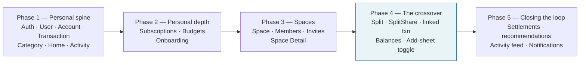

Phase 1 alone is already a better product than existing Pokito ships today (it has no dashboard). **Phase 4 is the phase that justifies the project** — build the split model and the linked transaction together, never separately, or the two-lenses invariant will not hold.

---

## 14. Risks, Ambiguities and Open Decisions

### 14.1 Product risks

| Risk | Severity | Mitigation |
|---|---|---|
| **Users misread "spent this month"** — expecting cash out, seeing their share | High | Label both lenses explicitly on Home; show a one-time explainer on the first shared expense; use different words ("Spent" vs "Out") everywhere |
| **Rounding disputes** — ¥5,000 ÷ 3 | Medium | Deterministic remainder to the payer; show the adjustment in the split editor ("+¥1 to you"); treat split calculation as a separately unit-tested domain service, as LifeOS does |
| **Deleting a shared expense silently changes someone's balance** | High | Soft delete + explicit warning naming affected members + notification; **block deletion after settlement**, offer a correcting expense instead |
| **Trust in the balance number** | High | Cycle scope labelled in plain words ("since you last settled"); settlement history always reachable; never convert currency without a known rate |
| **Personal-only users feel the shared machinery is in the way** | Medium | Progressive disclosure — no space, no split, no member appears until the toggle is used; Spaces tab shows a sell, not an error |
| **Space with one member is a dead end** | Medium | Space Detail replaces the balance card with an invite prompt when solo |

### 14.2 Technical risks

| Risk | Mitigation |
|---|---|
| **Migrating existing Pokito data** — `BigDecimal(17,2)` → minor units, username PK → UUID | Needs an explicit migration plan; see open decision D1 |
| **Derived balance performance** at scale | Cache in a read model, invalidate on write (LifeOS caches `currentBalanceMinor`; Pokito derives every read — take the middle path) |
| **Concurrent edits to a shared expense** | Optimistic locking with a `version` column, as LifeOS already does |
| **Notification delivery** | Firebase is already wired in LifeOS mobile; reuse rather than rebuild |
| **Two clients diverging** if a web client returns later | Keep all business logic server-side; the client renders |

### 14.3 Open decisions — needed before UX design

**D1 · Is this a migration or a new product?**
Do existing Pokito users' wallets and transactions come across, or is Pokito Mobile a fresh start? This changes the data-model work substantially (minor-unit conversion, username→UUID remap, `Wallet`→`Account` rename) and it changes onboarding. **My recommendation: fresh start with an optional one-time import**, given the current web app has four working screens and a stub dashboard — the installed base is unlikely to justify a migration project.

**D2 · Backend strategy — extend `pockito-core`, extract from `life-os-core`, or new service?**
`pockito-core` is small and clean but lacks everything shared. `life-os-core`'s finance module is complete but entangled with the LifeOS module registry, Connections, `ApiEnvelope` and the shared-space facade. **My recommendation: new service, porting `life-os-core`'s finance domain logic** — specifically `SplitCalculationService`, `BalanceService`, `SettlementRecommendationService` and the `materializeLinkedTransactions` logic, which are the parts that are genuinely hard and already proven.

**D3 · Mobile stack — Flutter or native?**
LifeOS mobile is Flutter with Riverpod and a mature design system; Pokito's client is Angular web. **My recommendation: Flutter**, to reuse LifeOS's design system and patterns.

**D4 · Should personal spending include shares of expenses others paid?**
This document says **yes** — spending is your share regardless of who paid. The alternative (spending = cash out only) makes budgets meaningless for anyone in a space. Worth confirming explicitly, as it is the model's most consequential assumption.

**D5 · Should a shared expense you paid appear in your personal Activity at full amount or at your share?**
This document says **full amount, with a "your share" subtitle** — the Activity list is the cash-flow lens, and ¥5,000 did leave the account. Worth user-testing.

**D6 · What happens to balances when a member leaves with a non-zero balance?**
LifeOS preserves history but does not force settlement. Options: block leaving until settled; allow leaving and keep the debt visible; allow leaving and write it off. **Recommendation: allow, keep visible, prompt to settle first.**

**D7 · Invites — link-only, or email too, in V1?**
Link-only needs no mail infrastructure. Email is more discoverable. **Recommendation: link-only in V1**, email in V1.x.

**D8 · Does a space need its own account?**
LifeOS has a `SHARED` account type. A joint bank account is a real thing. **Recommendation: exclude from V1** — a joint account can be modelled as a personal account owned by one member; a true shared account raises ownership and balance-attribution questions that deserve their own design.

**D9 · Currency of a shared expense — RESOLVED.**
An earlier draft required the paying account to match the space's currency, which blocked the most common international case: paying for a group dinner abroad on a home-currency card. **Resolved by separating the two roles a currency can play** — see §11.6. The debt is denominated in the space's currency; the payment happens in the account's currency at a captured rate. No open question remains.

### 14.4 Assumptions made

1. **Target scale:** spaces of 2–5 members, not 20. This justifies eager split loading, naive settlement recommendation, and per-pair balances.
2. **Keycloak stays.** Both products use it and `pockito-infra` already runs it.
3. **JPY is a primary currency.** The brief's ¥5,000 example and LifeOS's JPY base-currency test scenario both point this way — which is precisely why minor units are non-negotiable.
4. **Mobile-only for V1.** No web client.
5. **The user is willing to enter transactions manually.** No bank sync means the whole model rests on manual entry, which is why the Add sheet must be three taps.

---

## 15. Recommended Next Steps

### Immediate — decisions

1. **Resolve D1–D3** (migration strategy, backend strategy, mobile stack) — these gate everything else.
2. **Confirm D4 and D5** (the two-lenses model) — they are the product's central assumption and the cheapest thing to get wrong.
3. **Validate the mental model** with 3–5 target users: show them §5.4's four sentences and the §10.2 table and check they predict the numbers correctly.

### Next — UX design

4. **Wireframe S5 (Add sheet) first, and iterate on it hardest.** It is the highest-frequency screen and the one where the whole crossover thesis either works or does not. Prototype the Share toggle → split summary → editor progression and time it.
5. **Wireframe S1 (Home) second.** It is the screen existing Pokito never built and the one that has to make two lenses legible at a glance.
6. **Wireframe S9 (Space Detail) third**, with the balance card as the anchor.
7. Then the remaining 22 screens, with every state from §8 explicitly drawn.
8. **Write the terminology glossary from §11.6 into the design system** before any copy is written.

### Then — technical architecture

9. **Port the four proven services** from `life-os-core`: `SplitCalculationService`, `BalanceService` (including cycle scope), `SettlementRecommendationService`, and `SharedExpenseService.materializeLinkedTransactions`. Bring their tests.
10. **Write the split-calculation test suite first**, including the rounding cases. `shared-expense-real-life-e2e-scenario.md` in the life-os repo is a 484-line, three-month worked scenario with exact expected balances at every step — it is a ready-made acceptance suite and should be adapted rather than rewritten.
11. Design the schema from §12, with minor units and soft delete from day one.
12. Define the API contract; consider an OpenAPI contract test, as LifeOS does with `FinanceOpenApiContractTest`.

### Then — implementation planning

13. Break Phases 1–5 (§13.4) into deliverable increments, with **Phase 4 as the single highest-risk item** — schedule it with room.
14. Define the acceptance scenario for V1 and make it the definition of done:

> User A creates a Household space with base currency JPY and invites User B. B accepts. A records a ¥5,000 dinner from their Bank account and shares it 50/50. A's Bank balance drops ¥5,000. A's "spent this month" shows ¥2,500. B's "spent this month" shows ¥2,500 with no change to B's accounts. The space shows "B owes A ¥2,500". B settles ¥2,500 from their Cash account. Both balances reach zero. Neither user's "spent this month" changes as a result of the settlement. The Dining budget shows ¥5,000 of household spend and ¥2,500 of each member's personal spend.

That last sentence is the whole product.
