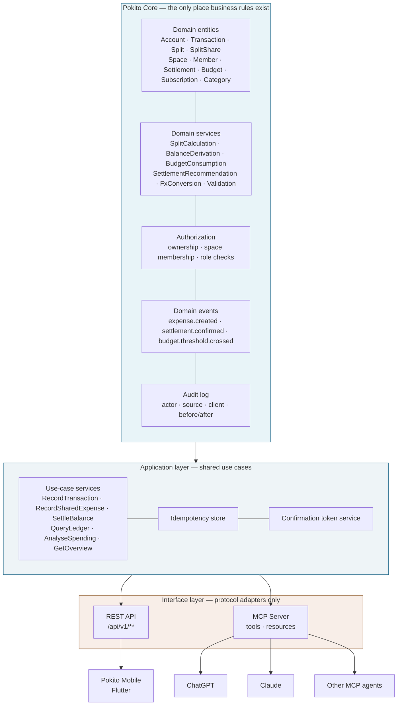
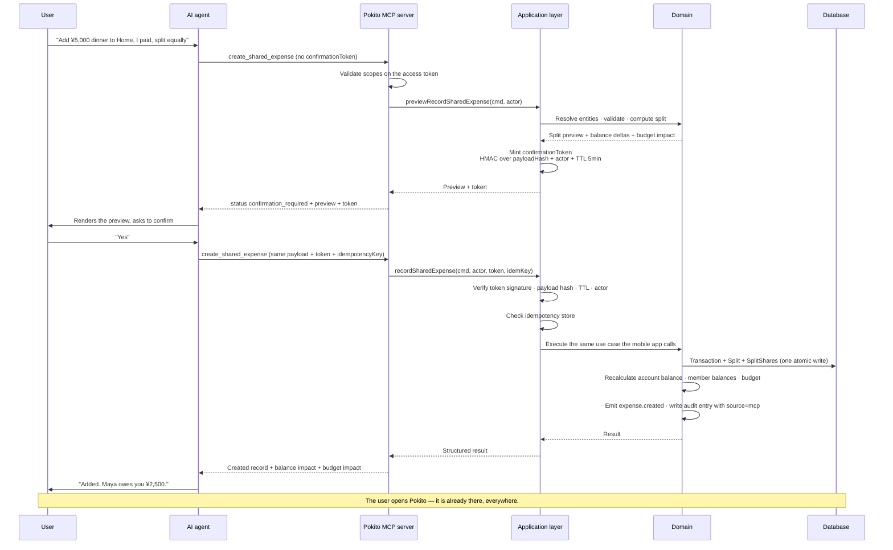
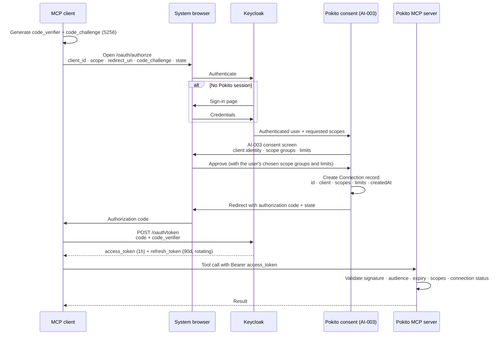
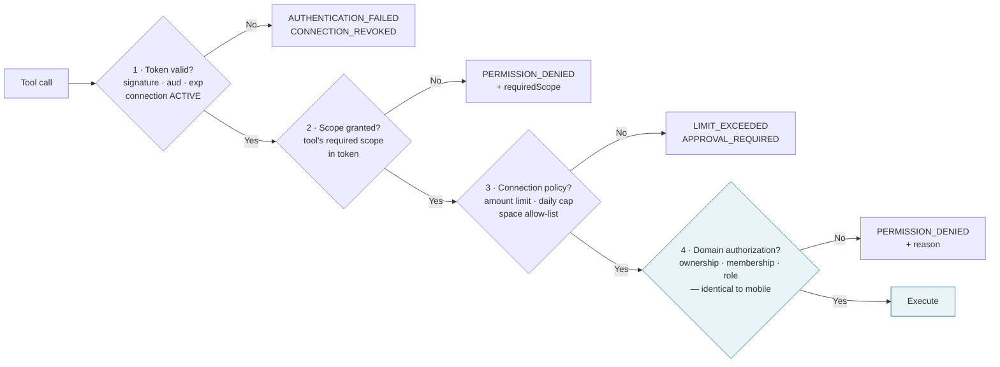
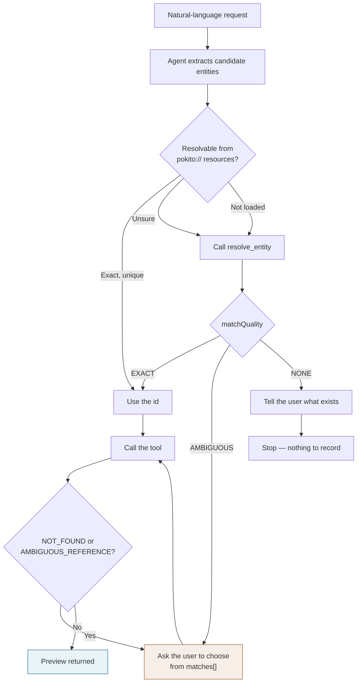
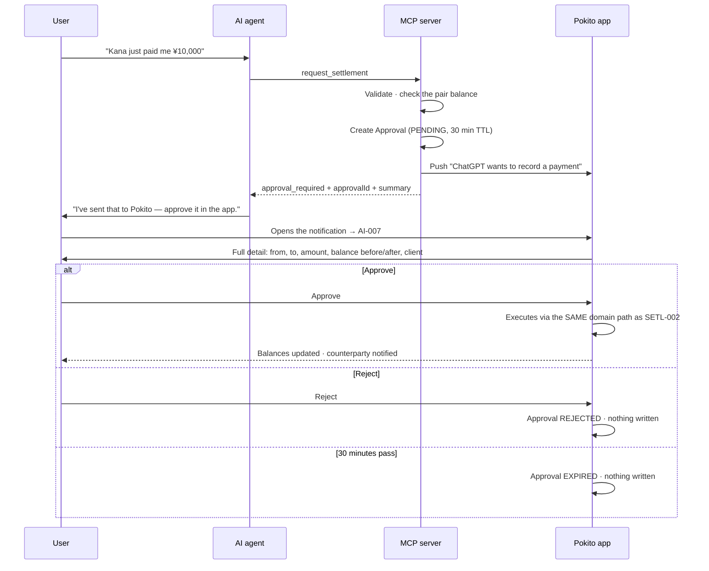
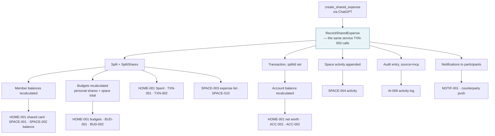
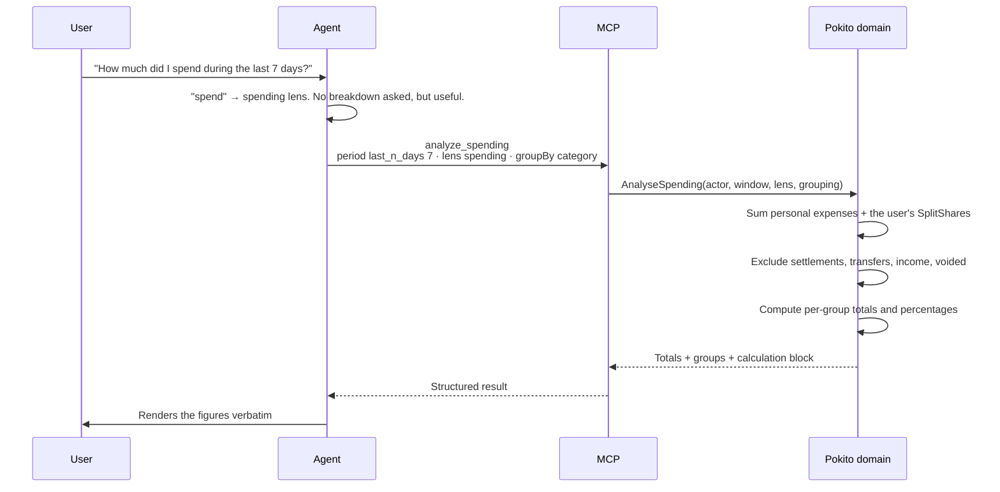
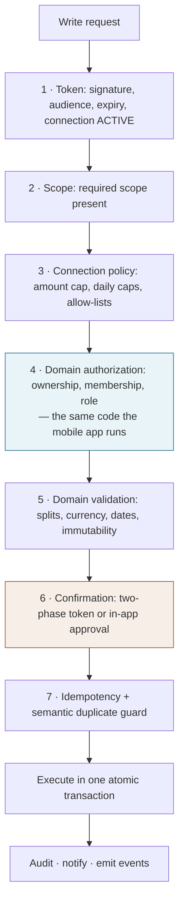

# Pokito MCP Specification

**Document type:** Complete Model Context Protocol server specification for Pokito.
**Audience:** Backend engineers, API designers, security reviewers, AI integration engineers.
**Companion documents:**
- `POCKITO_MOBILE_MVP_PRODUCT_UX_ANALYSIS.md` — product model, domain model, MVP scope
- `pokito-mobile-screen-design-spec.md` — mobile screen blueprint, including the AI & Integrations screens (§20A)

**Date:** 2026-08-15
**Status:** Complete for MVP. Open items are marked `[PRODUCT DECISION REQUIRED]` and listed in §20.4.

---

## Table of Contents

1. [Objectives & Principles](#1-objectives--principles)
2. [Architecture](#2-architecture)
3. [MCP Capability Matrix](#3-mcp-capability-matrix)
4. [Authentication](#4-authentication)
5. [Authorization & Permission Scopes](#5-authorization--permission-scopes)
6. [Connection Policy & Limits](#6-connection-policy--limits)
7. [Resources](#7-resources)
8. [Tool Inventory](#8-tool-inventory)
9. [Tool Specifications](#9-tool-specifications)
10. [Query & Filter Model](#10-query--filter-model)
11. [Analytics Model](#11-analytics-model)
12. [Entity Resolution](#12-entity-resolution)
13. [Confirmation & Approval Model](#13-confirmation--approval-model)
14. [Error Model](#14-error-model)
15. [Idempotency & Duplicate Prevention](#15-idempotency--duplicate-prevention)
16. [Audit Model](#16-audit-model)
17. [MCP ↔ Mobile Consistency](#17-mcp--mobile-consistency)
18. [End-to-End Scenarios](#18-end-to-end-scenarios)
19. [Security Considerations](#19-security-considerations)
20. [MVP vs. Future Capabilities](#20-mvp-vs-future-capabilities)

---

# 1. Objectives & Principles

## 1.1 What the MCP server is for

Pokito has two primary interfaces over one domain:

| Interface | Surface | Optimised for |
|---|---|---|
| **Human** | Pokito mobile app | Deliberate entry, browsing, visual comprehension |
| **AI** | Pokito MCP server | Conversational query, fast capture, aggregation, recall |

The MCP server exists so a user can ask *"how much did we spend on restaurants this month?"* and get an **authoritative** answer, and can say *"add ¥5,000 dinner to Home, I paid, split equally"* and have it land in Pokito exactly as if they had typed it into TXN-003.

## 1.2 The nine governing principles

### M1 · One domain, two interfaces
The MCP server contains **no financial logic**. It is a protocol adapter over the same application services the mobile client calls. Split calculation, balance derivation, budget consumption, settlement recommendation, rounding, and every validation rule live in the domain layer beneath both. If a rule can be stated in the MCP server, it is in the wrong place.

### M2 · The human sets up the structure; the AI operates the money inside it
Accounts, spaces, members, invitations, roles, categories and profile are **created and changed in the app only**. The MCP surface covers recording, querying, correcting and settling money **within** structures the human has already established. This single boundary eliminates the entire class of identity, membership and exfiltration risks — an agent cannot create an invite link, add a member, rename a space, or open an account. See §3.3 for the full reasoning.

### M3 · Calculations are deterministic and server-side
Totals, percentages, balances, budget consumption, split amounts, rounding remainders, currency conversion and settlement recommendations are computed by Pokito and returned as structured values. **The model interprets and communicates; it never does the arithmetic.** Any tool that returns a figure also returns a `calculation` block describing what was included and excluded, so the agent can explain the number honestly rather than guess at it.

### M4 · Two lenses are explicit in the protocol
The `lens` parameter (`spending` | `cashflow`) is **required** on every analytics call and is echoed in every response. The protocol makes the distinction impossible to elide, because an agent that conflates "what left my account" with "what I consumed" will report shared expenses wrongly. See §11.2.

### M5 · Nothing financially material is inferred silently
The server distinguishes fields the agent **may** infer (date defaults to today, payer defaults to the user, split defaults to the space default) from fields it **must** obtain (amount, space, account for a tracked payment). Missing material information returns `MISSING_REQUIRED_INFORMATION` naming exactly what to ask. See §12.4.

### M6 · Every write is previewed before it commits
All write tools use a **two-phase protocol**: the first call returns a server-generated preview plus a signed, payload-bound, short-lived confirmation token; the second call executes. The agent cannot fabricate the preview, and cannot alter the payload between preview and commit. See §13.

### M7 · Every write is idempotent
All write tools require a client-generated `idempotencyKey`. Replays return the original result. A separate semantic duplicate guard catches retries that arrive with a fresh key. See §15.

### M8 · Every write is attributable
Every record carries `source` and, for MCP writes, the connection identity, the tool invoked, the confirmation evidence and a before/after diff. The user can see and audit everything an AI did. See §16.

### M9 · Errors are recovery instructions
Every failure returns a stable machine code, a human sentence, and — where applicable — the candidate values, the missing fields, or the specific place in the app where the operation can be completed. See §14.

## 1.3 Explicit non-goals for MVP

| Non-goal | Why |
|---|---|
| The MCP server as a second write path with its own rules | Violates M1 |
| Agent-driven onboarding or account setup | Violates M2 |
| The model computing totals from raw transaction lists | Violates M3 |
| Streaming/subscription notifications to agents | No MCP transport guarantee worth the complexity in V1 |
| Multi-user agents (an agent acting for two Pokito users) | A connection is always bound to exactly one authenticated user |
| Agent-initiated invitations or membership changes | Violates M2; highest-risk surface with lowest conversational value |

---

# 2. Architecture

## 2.1 Layering



**The load-bearing property:** `MCP` and `REST` sit at the same depth and call the same use-case services. Neither can reach the domain except through the application layer, and neither contains a validation rule, a calculation, or an authorization decision of its own.

## 2.2 Request path for a write



## 2.3 Deployment

| Concern | Decision |
|---|---|
| Transport | Streamable HTTP (remote MCP server). Not stdio — Pokito is a hosted service, not a local tool |
| Endpoint | `https://mcp.pokito.app/v1` |
| Session | Stateless per request; all state lives in Pokito's database. No MCP-local caches of financial data |
| Protocol version | Negotiated per the MCP specification; the server declares `tools` and `resources` capabilities. `prompts` and `sampling` are not offered in V1 |
| Scaling | Horizontally stateless; identical to the REST tier |
| Observability | Every tool invocation emits a structured log line and an audit entry (§16) |

## 2.4 What lives where — the drift test

Use this table in code review. If an item appears in the MCP column, the change is wrong.

| Concern | Domain | Application | REST | MCP |
|---|---|---|---|---|
| Split arithmetic and rounding | ✅ | | | |
| Balance derivation | ✅ | | | |
| Budget consumption rules | ✅ | | | |
| Space permission checks | ✅ | | | |
| Field validation | ✅ | | | |
| Currency conversion | ✅ | | | |
| Use-case orchestration | | ✅ | | |
| Idempotency store | | ✅ | | |
| Confirmation token mint/verify | | ✅ | | |
| Audit writing | ✅ | | | |
| HTTP status mapping | | | ✅ | |
| JSON-schema shaping for tools | | | | ✅ |
| Natural-language error phrasing | | | | ✅ |
| Candidate lists on ambiguity | | ✅ | | ✅ (formatting only) |
| Scope → capability mapping | | ✅ | | ✅ (enforcement) |

---

# 3. MCP Capability Matrix

Derived by walking every domain in the approved MVP scope.

**Legend:** ✅ exposed · 🔒 exposed with in-app approval · ❌ not exposed (app only) · — not applicable

## 3.1 The matrix

| Domain | Read | Search / filter | Analyse | Create | Update | Delete | Actions |
|---|:--:|:--:|:--:|:--:|:--:|:--:|---|
| **Profile** | ✅ | — | — | — | ❌ | — | — |
| **Accounts** | ✅ | ✅ | ❌ | ❌ | ❌ | — | ❌ archive · ❌ reorder · ❌ set default |
| **Transactions (personal)** | ✅ | ✅ | ✅ | ✅ | ✅ | ✅ | ✅ recategorise |
| **Transfers** | ✅ | ✅ | ✅ | ✅ | ✅ | ✅ | — |
| **Categories** | ✅ | ✅ | ✅ | ❌ | ❌ | ❌ | — |
| **Subscriptions** | ✅ | ✅ | ✅ | ✅ | ✅ | ❌ | ✅ record payment · ✅ skip · ✅ pause/resume |
| **Budgets** | ✅ | ✅ | ✅ | ✅ | ✅ | ❌ | — |
| **Spaces** | ✅ | ✅ | ✅ | ❌ | ❌ | ❌ | ❌ archive · ❌ settings · ❌ default split |
| **Space members** | ✅ | ✅ | — | ❌ | ❌ | ❌ | ❌ invite · ❌ remove · ❌ leave |
| **Shared expenses** | ✅ | ✅ | ✅ | ✅ | ✅ | 🔒 | ✅ split · ✅ recategorise |
| **Splits / shares** | ✅ | — | ✅ | *(via expense)* | *(via expense)* | — | ✅ preview |
| **Balances** | ✅ | ✅ | ✅ | — | — | — | ✅ who-owes-whom · ✅ recommendations |
| **Settlements** | ✅ | ✅ | ✅ | 🔒 | ❌ | ❌ | 🔒 confirm · ❌ cancel |
| **Space activity** | ✅ | ✅ | — | — | — | — | — |
| **Notifications** | ❌ | — | — | — | ❌ | ❌ | — |
| **AI connections** | ❌ | — | — | ❌ | ❌ | ❌ | ❌ revoke |
| **App settings** | ✅ *(conventions only)* | — | — | — | ❌ | — | — |

## 3.2 Why each read is exposed

Every read in the MVP is exposed because reads are the primary value of the AI interface and carry no write risk. The one exception is **notifications**, which are a mobile inbox rather than financial data and would only duplicate what the agent can already query.

**AI connections are deliberately invisible to the MCP server.** An agent cannot enumerate, inspect or revoke connections — including its own. This prevents a compromised or prompt-injected agent from escalating its own permissions or hiding itself from the user.

## 3.3 Why each write is or is not exposed

This is the M2 boundary, item by item.

| Operation | Exposure | Reasoning |
|---|---|---|
| Create personal transaction | ✅ Medium | The core capture use case. Affects only the user's own records |
| Update personal transaction | ✅ Medium | *"Change yesterday's supermarket expense to Groceries"* is a top-5 request. Own records only |
| Delete personal transaction | ✅ Medium | The natural correction path after an AI mistake. Own records only; recoverable by re-adding |
| Create shared expense | ✅ **High** | The highest-value write in the product **and** the highest-risk: it creates a claim against another person. Gated by two-phase confirmation, per-transaction limits, and counterparty notification |
| Update shared expense | ✅ **High** | Same risk profile. Restricted to expenses the user created, and blocked once settled |
| Delete shared expense | 🔒 **In-app approval** | Destroys shared history and moves someone else's balance in a direction that can favour the actor. Restricted to own + unsettled, and requires the user to approve in the Pokito app |
| Create settlement | 🔒 **In-app approval** | Records that money moved between people. Wrong entries erode trust between humans, not just data quality |
| Confirm settlement | 🔒 **In-app approval** | The user is asserting they received money someone else claims to have sent. This must be a deliberate human act |
| Cancel settlement | ❌ | Reverses a confirmed financial agreement between two people. No conversational value that justifies the risk |
| Create / update budget | ✅ Medium | Own configuration. Wrong values are visible and trivially corrected |
| Delete budget | ❌ | Low conversational value; the app path is two taps |
| Create / update subscription | ✅ Medium | *"Add my ¥1,310 Netflix subscription"* is natural and low-risk |
| Record / skip subscription payment | ✅ Medium | *"I paid rent"* is natural. Creates an own-account transaction |
| Delete subscription | ❌ | Low value, and pausing covers the real intent |
| Create category | ❌ | An agent creating categories from typos and paraphrases would silently fragment the catalog, poisoning every budget and breakdown. Errors return the available list instead |
| Create / archive / edit account | ❌ | Structural setup. M2 |
| Create / edit / archive / delete space | ❌ | Structural setup. M2 |
| Invite / remove member, change role, leave | ❌ | **The highest-risk surface in the product.** An agent able to generate an invite link is an exfiltration vector for the household's entire financial history. No conversational benefit comes close |
| Change space settings or default split | ❌ | Changes how every future expense divides — a standing rule, not a transaction |
| Edit profile, change default currency | ❌ | Identity and global reporting basis |
| Manage AI connections | ❌ | Privilege escalation vector. §3.2 |

## 3.4 What an agent hitting a blocked operation receives

Blocked operations are not silently absent — the tool simply does not exist, and the server returns a helpful error when an agent attempts a related action that would require one:

```json
{
  "error": {
    "code": "UNSUPPORTED_OPERATION",
    "message": "Pokito doesn't let AI assistants invite people to a space.",
    "recoverable": false,
    "suggestedAction": "Tell the user to open Pokito → Spaces → Home → Members → Invite.",
    "details": { "operation": "invite_member", "availableIn": "mobile_app" }
  }
}
```

---

# 4. Authentication

## 4.1 Approach

**OAuth 2.1 authorization code flow with PKCE**, with Pokito's existing Keycloak realm as the identity provider and Pokito acting as the OAuth resource server and consent surface.

Rationale: both existing products already run on Keycloak (`pockito-infra` provisions it), the MCP specification's authorization framework is built on OAuth 2.1, and every mainstream MCP client already implements this flow. Nothing bespoke is invented.

## 4.2 Client registration

| Property | Value |
|---|---|
| Registration | **Dynamic Client Registration** (RFC 7591) at `POST /oauth/register` |
| Client type | Public (PKCE required, `S256` only; `plain` is rejected) |
| Redirect URIs | Must be registered; `http://localhost` and `https://` only; custom schemes permitted for native clients |
| Client metadata captured | `client_name`, `client_uri`, `logo_uri`, `software_id` — surfaced verbatim to the user on AI-003 and marked as **self-declared, unverified** |
| Pre-registered clients | ChatGPT and Claude may be pre-registered and display a **Verified** badge on AI-003. Every other client displays **Unverified** |

**The unverified badge is load-bearing.** `client_name` is attacker-controlled. AI-003 renders it inside a neutral container, never as page chrome, and always adjacent to the verification state. See §19.3.

## 4.3 Authorization flow



## 4.4 Token properties

| Token | Lifetime | Properties |
|---|---|---|
| **Authorization code** | 60s | Single use; bound to `code_challenge`, `client_id`, `redirect_uri` |
| **Access token** | 1 hour | JWT. Claims: `sub` (Pokito user UUID), `cid` (connection id), `client_id`, `scope`, `aud=pokito-mcp`, `exp`, `jti`. **Never contains financial data** |
| **Refresh token** | 90 days, sliding | Rotating — each use issues a new refresh token and invalidates the previous one. Reuse of a rotated token **revokes the entire connection** and notifies the user |

**Audience binding:** MCP access tokens carry `aud=pokito-mcp` and are rejected by the REST API. Mobile tokens carry `aud=pokito-api` and are rejected by the MCP server. A token stolen from one surface cannot be replayed against the other.

## 4.5 Connection lifecycle

A **Connection** is the first-class object the user manages on AI-001/AI-004.

```
Connection {
  id, userId, clientId, clientName, clientLogoUri, verified,
  scopes[], limits{}, status,
  createdAt, lastUsedAt, lastUsedTool,
  writeCount, readCount, revokedAt, revokedReason
}
```

| Status | Meaning | Token behaviour |
|---|---|---|
| `ACTIVE` | Normal | Tokens valid |
| `SUSPENDED` | Auto-paused by an anomaly rule (§19.5) | All tokens rejected with `CONNECTION_SUSPENDED`; user notified and can resume on AI-004 |
| `REVOKED` | User revoked, or refresh-token reuse detected | All tokens rejected with `CONNECTION_REVOKED`; irreversible |

**Revocation is immediate.** Access tokens are checked against the connection's status on **every** request — the 1-hour token lifetime is not a revocation window. Revoking from AI-004 invalidates access within one request cycle.

## 4.6 Multiple connected clients

- A user may hold **up to 10** active connections.
- Each has independent scopes, independent limits, an independent audit trail and independent revocation.
- Connections are fully isolated: one client cannot see, enumerate or affect another (§3.2).
- Two connections from the same `client_id` are permitted (e.g. ChatGPT on two devices) and are distinguished on AI-001 by their creation date and last-used device hint.
- **Idempotency keys are scoped per connection** — two clients using the same key value cannot collide (§15.2).

## 4.7 Session and device management

The MCP server is stateless; there is no MCP "session" to manage. The user-facing unit of control is the Connection, managed entirely on AI-001, AI-004 and AI-005 in the mobile app. There is deliberately **no web console** for connection management in the MVP: the mobile app is the single place trust is granted and withdrawn.

---

# 5. Authorization & Permission Scopes

## 5.1 The layered check

Every tool invocation passes four independent gates. All four must pass; none can substitute for another.



**Gate 4 is the same code path the mobile app uses.** It is not re-implemented, not relaxed, and not parameterised by interface. If the authenticated user could not perform the operation in the Pokito app, no scope, no limit configuration and no agent can make it possible.

Concretely:
- A **Member** (not Owner) of a space cannot change space settings through MCP, because no tool exposes it *and* because the domain would reject it.
- A user cannot read a space they are not a member of, regardless of `pokito:spaces:read`.
- A user cannot edit a shared expense someone else created, matching SPACE-010's rule.
- A user cannot modify a settled expense, matching DLG-016.

**Scopes narrow; they never widen.** A scope grants an agent a subset of what the user can already do.

## 5.2 Scope catalogue

Fourteen scopes, grouped into six user-facing consent groups.

| Scope | Grants | Consent group |
|---|---|---|
| `pokito:profile:read` | Display name, default currency, locale, timezone | A |
| `pokito:accounts:read` | Account list, types, currencies, balances | A |
| `pokito:transactions:read` | Personal transaction ledger, detail, filters | A |
| `pokito:analytics:read` | Aggregations, breakdowns, comparisons, overviews | A |
| `pokito:spaces:read` | Space list, summaries, members, shared expenses, activity | B |
| `pokito:balances:read` | Member balances, who-owes-whom, settlement recommendations | B |
| `pokito:settlements:read` | Settlement history and detail | B |
| `pokito:budgets:read` | Budget list, limits, consumption | C |
| `pokito:subscriptions:read` | Subscription list, schedules, payment history | C |
| `pokito:transactions:write` | Create, update, delete **personal** transactions | D |
| `pokito:expenses:write` | Create and update **shared** expenses; request deletion | D |
| `pokito:subscriptions:write` | Create/update subscriptions; record and skip payments | D |
| `pokito:budgets:write` | Create and update budgets | E |
| `pokito:settlements:write` | Request settlement creation and confirmation *(always in-app approved)* | F |

## 5.3 Consent groups shown on AI-003

The user never sees fourteen checkboxes. They see six toggles, each expandable to the underlying scopes.

| Group | Label on AI-003 | Scopes | Default |
|---|---|---|---|
| **A** | **Your money** — *"See your accounts, transactions and spending"* | profile, accounts, transactions:read, analytics | On |
| **B** | **Shared spaces** — *"See your spaces, shared expenses and who owes whom"* | spaces:read, balances:read, settlements:read | On |
| **C** | **Budgets & subscriptions** — *"See your budgets and recurring payments"* | budgets:read, subscriptions:read | On |
| **D** | **Record money** — *"Add and change expenses, income and subscriptions"* | transactions:write, expenses:write, subscriptions:write | **Off** |
| **E** | **Manage budgets** — *"Create and change budget limits"* | budgets:write | **Off** |
| **F** | **Settle balances** — *"Record and confirm payments between you and other members"* | settlements:write | **Off** |

**Every write group is off by default.** A user who taps straight through the consent screen grants a read-only connection. Enabling any write group reveals the limits panel (§6.2) with conservative defaults pre-filled.

**Group D cannot be granted without B** when the user belongs to any space — recording a shared expense requires reading the space to resolve members. AI-003 enforces this with a dependency note: *"Recording shared expenses needs Shared spaces access."*

## 5.4 Why this granularity

| Rejected design | Problem |
|---|---|
| A single `pokito:*` scope | The consent screen becomes meaningless; the user cannot grant read-only access, which is what most people actually want |
| Per-tool scopes (~24) | Unusable consent UI; agents fail unpredictably when a single tool's scope was missed; no user can reason about it |
| Read/write only (2 scopes) | Cannot separate "look at my spending" from "move money between me and my flatmate" — a distinction users care about a great deal |

Fourteen scopes in six groups lets the user say **"read everything, record my own expenses, but don't touch settlements"** — which is precisely the shape of trust most people extend to an assistant.

## 5.5 Scope requirements per tool

| Tool | Required scope | Risk |
|---|---|---|
| `get_financial_overview` | `analytics:read` + `accounts:read` | L |
| `analyze_spending` | `analytics:read` | L |
| `list_transactions` | `transactions:read` | L |
| `get_transaction` | `transactions:read` | L |
| `get_space_summary` | `spaces:read` | L |
| `list_space_expenses` | `spaces:read` | L |
| `get_space_balances` | `balances:read` | L |
| `list_settlements` | `settlements:read` | L |
| `get_budget_status` | `budgets:read` | L |
| `list_subscriptions` | `subscriptions:read` | L |
| `resolve_entity` | Any read scope covering the entity type | L |
| `create_transaction` | `transactions:write` | M |
| `update_transaction` | `transactions:write` | M |
| `delete_transaction` | `transactions:write` | M |
| `create_shared_expense` | `expenses:write` + `spaces:read` | **H** |
| `update_shared_expense` | `expenses:write` + `spaces:read` | **H** |
| `request_delete_shared_expense` | `expenses:write` + `spaces:read` | 🔒 |
| `request_settlement` | `settlements:write` + `balances:read` | 🔒 |
| `request_settlement_confirmation` | `settlements:write` | 🔒 |
| `create_budget` | `budgets:write` | M |
| `update_budget` | `budgets:write` | M |
| `create_subscription` | `subscriptions:write` | M |
| `update_subscription` | `subscriptions:write` | M |
| `record_subscription_payment` | `subscriptions:write` + `transactions:write` | M |

---

# 6. Connection Policy & Limits

Scopes answer *"what kind of thing may this agent do?"*. Limits answer *"how much?"*. Both are set on AI-003 at connect time and changed on AI-005 at any time.

## 6.1 Limit types

| Limit | Unit | Default | Range | Applies to |
|---|---|---|---|---|
| **Per-transaction cap** | Minor units, user's default currency | `20,000` (¥20,000) | 0 – unlimited | Every write that records an amount |
| **Daily write total** | Minor units | `100,000` (¥100,000) | 0 – unlimited | Sum of amounts written in a rolling 24h window |
| **Daily write count** | Count | `50` | 1 – 500 | Number of successful writes in a rolling 24h window |
| **Space allow-list** | Set of space ids | All spaces the user belongs to | Any subset, or none | Every shared-expense and settlement operation |
| **Account allow-list** | Set of account ids | All active accounts | Any subset, or none | Every write that names an account |

## 6.2 Behaviour at a limit

| Condition | Result |
|---|---|
| Amount ≤ per-transaction cap | Normal two-phase confirmation (§13.3) |
| Amount > per-transaction cap | `APPROVAL_REQUIRED` — an in-app approval is created (AI-007) and the agent is told to wait |
| Daily total would be exceeded | `LIMIT_EXCEEDED` with `limit`, `used`, `remaining`, `resetsAt`. **Not** escalated to approval — the user must raise the limit in the app |
| Daily count exceeded | `LIMIT_EXCEEDED`, same shape |
| Space not in the allow-list | `PERMISSION_DENIED` with `reason: "space_not_allowed"` and the allowed space names |
| Account not in the allow-list | `PERMISSION_DENIED` with `reason: "account_not_allowed"` and the allowed account names |

**Limits are evaluated at gate 3, before the domain is touched.** A blocked write never reaches the database and never appears in a preview.

## 6.3 Interaction with risk levels

Limits and risk levels are orthogonal and compose:

| | Within limits | Over the per-transaction cap |
|---|---|---|
| **Medium risk** (personal transaction, budget, subscription) | Two-phase confirmation | In-app approval (AI-007) |
| **High risk** (shared expense) | Two-phase confirmation **+** counterparty notification | In-app approval (AI-007) |
| **In-app only** (settlements, shared-expense deletion) | In-app approval (AI-007) | In-app approval (AI-007) |

A ¥500,000 "correction" injected into an agent's context therefore cannot execute silently under any configuration short of the user explicitly raising their cap above ¥500,000.

---

# 7. Resources

## 7.1 The distinction

| | Resources | Tools |
|---|---|---|
| **Are** | Context the agent reads to understand the user's world | Operations the agent invokes to query or change it |
| **Have parameters** | No (or a single path id) | Yes, often complex |
| **Change** | Slowly — accounts, spaces, members, categories | Per call |
| **Cost** | Cheap; safe to load into context | May be expensive; always deliberate |
| **Purpose** | **Name resolution and grounding** | **Answers and effects** |

Pokito uses resources for the **entity catalogues an agent needs in order to turn words into ids** — "my main wallet", "Home", "Kana", "Groceries" — plus the conventions it needs to report figures correctly. Everything parameterised is a tool.

## 7.2 Resource catalogue

| URI | Name | Scope | Changes | Purpose |
|---|---|---|---|---|
| `pokito://profile` | Your profile | `profile:read` | Rarely | Display name, default currency, locale, timezone, week start |
| `pokito://accounts` | Your accounts | `accounts:read` | On balance change | Resolve account names; know currencies |
| `pokito://spaces` | Your spaces | `spaces:read` | Rarely | Resolve space names; know base currencies and the user's role |
| `pokito://spaces/{spaceId}/members` | Space members | `spaces:read` | Rarely | Resolve member names to ids |
| `pokito://categories` | Categories | `transactions:read` | Rarely | Resolve category names; know types |
| `pokito://capabilities` | What this connection can do | *(none)* | On permission change | The granted scopes, limits and blocked operations — self-describing |
| `pokito://conventions` | Pokito conventions | *(none)* | Never | Money format, the two-lens definitions, split methods, date semantics |

**Seven resources.** No transaction, expense, balance or budget resource exists — those are all parameterised queries and belong to tools.

## 7.3 Resource payloads

### `pokito://profile`

```json
{
  "userId": "usr_8fK2mQ",
  "displayName": "Ghassen",
  "defaultCurrency": "JPY",
  "locale": "en-JP",
  "timezone": "Asia/Tokyo",
  "weekStartsOn": "monday",
  "memberOfSpaceCount": 2,
  "accountCount": 4
}
```

### `pokito://accounts`

```json
{
  "accounts": [
    { "id": "acc_R7x", "name": "Rakuten Bank", "type": "BANK",
      "currency": "JPY", "balanceMinor": 348200, "isDefault": true, "isArchived": false },
    { "id": "acc_C4m", "name": "Main Cash Wallet", "type": "CASH",
      "currency": "JPY", "balanceMinor": 12400, "isDefault": false, "isArchived": false },
    { "id": "acc_V9p", "name": "Visa", "type": "CARD",
      "currency": "JPY", "balanceMinor": -42800, "isDefault": false, "isArchived": false }
  ],
  "note": "Balances are cash flow — what is actually in each account. Archived accounts are excluded.",
  "specialValues": {
    "UNTRACKED_CASH": "Pass accountId 'UNTRACKED_CASH' on a shared expense to split it without touching any account balance."
  }
}
```

### `pokito://spaces`

```json
{
  "spaces": [
    { "id": "spc_H1a", "name": "Home", "type": "HOUSEHOLD", "baseCurrency": "JPY",
      "yourRole": "OWNER", "memberCount": 2, "status": "ACTIVE",
      "yourNetBalanceMinor": 2500, "balanceDirection": "OWED_TO_YOU",
      "defaultSplit": { "method": "PERCENTAGE", "shares": [
        { "userId": "usr_8fK2mQ", "percentage": 60 },
        { "userId": "usr_K4n8Ra", "percentage": 40 } ] } },
    { "id": "spc_T5r", "name": "Kyoto Trip", "type": "TRIP", "baseCurrency": "JPY",
      "yourRole": "MEMBER", "memberCount": 4, "status": "ACTIVE",
      "yourNetBalanceMinor": -8400, "balanceDirection": "YOU_OWE",
      "defaultSplit": { "method": "EQUAL" } }
  ],
  "note": "Shared expenses in a space must use that space's baseCurrency."
}
```

### `pokito://spaces/{spaceId}/members`

```json
{
  "spaceId": "spc_H1a",
  "spaceName": "Home",
  "members": [
    { "userId": "usr_8fK2mQ", "displayName": "Ghassen", "role": "OWNER", "isYou": true },
    { "userId": "usr_K4n8Ra", "displayName": "Kana", "role": "MEMBER", "isYou": false }
  ],
  "note": "Only active members can be payers or participants in a new shared expense."
}
```

### `pokito://categories`

```json
{
  "categories": [
    { "id": "cat_gro", "name": "Groceries",     "type": "EXPENSE", "isSystem": true },
    { "id": "cat_res", "name": "Restaurants",   "type": "EXPENSE", "isSystem": true },
    { "id": "cat_tra", "name": "Transport",     "type": "EXPENSE", "isSystem": true },
    { "id": "cat_sal", "name": "Salary",        "type": "INCOME",  "isSystem": true }
  ],
  "note": "Categories cannot be created through MCP. If none fits, leave categoryId null — the expense is still recorded, but will not count toward a budget."
}
```

### `pokito://capabilities`

The connection describing itself. An agent reads this to know what it may attempt, rather than discovering limits through failures.

```json
{
  "connectionId": "con_9Qz",
  "clientName": "ChatGPT",
  "grantedScopes": ["pokito:profile:read","pokito:accounts:read","pokito:transactions:read",
                    "pokito:analytics:read","pokito:spaces:read","pokito:balances:read",
                    "pokito:budgets:read","pokito:subscriptions:read","pokito:transactions:write",
                    "pokito:expenses:write"],
  "limits": {
    "perTransactionCapMinor": 20000,
    "dailyWriteTotalMinor": 100000,
    "dailyWriteCount": 50,
    "usedTodayMinor": 4800,
    "usedTodayCount": 1,
    "resetsAt": "2026-08-16T00:00:00+09:00",
    "allowedSpaceIds": "ALL",
    "allowedAccountIds": "ALL"
  },
  "requiresInAppApproval": [
    "request_settlement", "request_settlement_confirmation", "request_delete_shared_expense",
    "any write above perTransactionCapMinor"
  ],
  "notAvailableThroughMcp": [
    "creating or editing accounts", "creating or editing spaces",
    "inviting or removing members", "changing space settings or default split",
    "creating categories", "cancelling settlements", "editing your profile",
    "managing AI connections"
  ],
  "note": "Operations under notAvailableThroughMcp must be done by the user in the Pokito app."
}
```

### `pokito://conventions`

The semantic grounding resource. This is what stops an agent misreporting a shared expense.

```json
{
  "money": {
    "representation": "minor units, integer",
    "examples": { "JPY 5000": 5000, "EUR 12.50": 1250, "KWD 1.500": 1500 },
    "note": "Decimal places follow ISO-4217: 0 for JPY and KRW, 2 for most, 3 for KWD and BHD. Always pass and read amountMinor."
  },
  "currencyRoles": {
    "unitOfPayment": "An ACCOUNT's currency. What actually left or entered it. A transaction is always recorded here.",
    "unitOfAccount": "A SPACE's currency. What a shared debt is denominated in. Splits, shares, balances and settlements are always recorded here.",
    "unitOfReporting": "The USER's default currency. What aggregates are expressed in. Never stored on a record — applied at read time.",
    "criticalRule": "A shared expense's amount is always in the SPACE's currency, whatever account paid for it. If the paying account uses a different currency, Pokito converts once at entry and stores the rate on the transaction. Balances never span currencies, so 'who owes whom' is never ambiguous.",
    "example": "A EUR card paying for a JPY trip dinner: Split ¥42,000 · each share ¥14,000 · payer's transaction −€248.00 with rate JPY→EUR 0.00590 captured 15 Aug."
  },
  "lenses": {
    "spending": {
      "question": "What did I consume?",
      "includes": "Personal expenses plus YOUR SHARE of shared expenses, whoever paid.",
      "excludes": "The part of a shared expense others owe you; ALL settlements; transfers; income.",
      "userFacingLabel": "Spent"
    },
    "cashflow": {
      "question": "What actually left or entered my accounts?",
      "includes": "Full amounts of expenses you paid, including the whole of a shared expense you fronted; settlements you paid or received; transfers.",
      "excludes": "Shares of expenses someone else paid.",
      "userFacingLabel": "Out / In"
    },
    "criticalRule": "A ¥5,000 dinner you paid and split 50/50 is ¥5,000 of cashflow and ¥2,500 of spending. Never present one as the other. Never add a settlement to spending — the share was already counted when the expense was recorded."
  },
  "splitMethods": {
    "EQUAL": "Divided evenly among included members. Rounding remainder goes to the payer.",
    "EXACT": "Each member's amount is given explicitly. Must sum exactly to the total.",
    "PERCENTAGE": "Each member's percentage is given. Must total exactly 100."
  },
  "balanceScopes": {
    "CYCLE": "Default. Only expenses and settlements after the last confirmed settlement.",
    "LIFETIME": "Everything ever recorded in the space."
  },
  "dates": {
    "format": "YYYY-MM-DD in the user's timezone",
    "futureDatesAllowed": false,
    "note": "Relative expressions must be resolved against the user's timezone from pokito://profile."
  }
}
```

## 7.4 Resources are a convenience, never a dependency

Many MCP clients do not automatically load resources. The tool surface therefore **never assumes** the agent has read them:

- `resolve_entity` provides the same catalogues on demand as a tool.
- Every `NOT_FOUND` and `AMBIGUOUS_REFERENCE` error returns the candidate list inline.
- `pokito://conventions` content is duplicated in the descriptions of `analyze_spending` and `get_financial_overview`, so the lens semantics reach the agent through the tool schema alone.

An agent that reads no resources still converges on the right call within one error round-trip. An agent that reads them gets there in zero.

---

# 8. Tool Inventory

## 8.1 Design rationale

**24 tools.** The surface was derived by asking, for each MVP capability, *"can an agent reliably choose this tool over its neighbours from the name and description alone?"*

| Rejected shape | Why |
|---|---|
| ~60 narrow tools (`get_spending_by_category`, `get_spending_by_month`, `get_restaurant_spending`…) | Agents pick wrongly among near-synonyms; the surface cannot be held in context; every new question needs a new tool |
| ~8 broad tools with a `operation` string parameter | Schemas become unvalidatable; the agent has no signal about required fields; errors arrive late |
| One `query` tool taking a DSL | The model becomes the query planner — maximum failure surface, zero schema help |

The chosen shape: **one tool per user intent**, with rich but validated parameters. `analyze_spending` deliberately absorbs the entire aggregation space through a `groupBy` enum rather than fragmenting into a dozen tools, because grouping is a *parameter* of one intent, not a different intent.

## 8.2 The inventory

### Query tools — 11, all low risk

| # | Tool | Answers |
|---|---|---|
| 1 | `get_financial_overview` | *"How am I doing?"* — balances, spent, in, shared position, for a period |
| 2 | `analyze_spending` | *"How much on X, grouped by Y, compared to Z?"* — the aggregation engine |
| 3 | `list_transactions` | *"Show me the actual transactions matching…"* |
| 4 | `get_transaction` | *"Tell me about that one"* |
| 5 | `get_space_summary` | *"How are we doing in Home?"* — balance, budget, spend, members |
| 6 | `list_space_expenses` | *"What did we spend on in Home?"* |
| 7 | `get_space_balances` | *"Who owes whom?"* + settlement recommendations |
| 8 | `list_settlements` | *"What have we settled?"* |
| 9 | `get_budget_status` | *"How much of our budget is left?"* |
| 10 | `list_subscriptions` | *"What's coming up?"* |
| 11 | `resolve_entity` | Name → id disambiguation, for any entity type |

### Write tools — 13

| # | Tool | Risk | Gate |
|---|---|---|---|
| 12 | `create_transaction` | M | Two-phase confirmation |
| 13 | `update_transaction` | M | Two-phase confirmation |
| 14 | `delete_transaction` | M | Two-phase confirmation |
| 15 | `create_shared_expense` | **H** | Two-phase + counterparty notification |
| 16 | `update_shared_expense` | **H** | Two-phase + counterparty notification |
| 17 | `request_delete_shared_expense` | 🔒 | In-app approval (AI-007) |
| 18 | `request_settlement` | 🔒 | In-app approval (AI-007) |
| 19 | `request_settlement_confirmation` | 🔒 | In-app approval (AI-007) |
| 20 | `create_budget` | M | Two-phase confirmation |
| 21 | `update_budget` | M | Two-phase confirmation |
| 22 | `create_subscription` | M | Two-phase confirmation |
| 23 | `update_subscription` | M | Two-phase confirmation |
| 24 | `record_subscription_payment` | M | Two-phase confirmation |

**Naming convention:** tools that complete an operation use a plain verb (`create_transaction`). Tools that only *request* an operation the user must approve in the app use the `request_` prefix (`request_settlement`). The prefix is a deliberate signal in the tool name itself, so an agent sets the user's expectations correctly before calling.

## 8.3 Universal parameters

| Parameter | Type | Applies to | Notes |
|---|---|---|---|
| `idempotencyKey` | string, UUID v4 | **All writes, required** | §15 |
| `confirmationToken` | string | All writes, optional on the first call | §13 |
| `allowDuplicate` | boolean | All writes, default `false` | Overrides the semantic duplicate guard (§15.3) |

## 8.4 Universal response envelope

Every tool returns this shape. Agents can rely on it without per-tool special-casing.

```json
{
  "status": "ok" | "confirmation_required" | "approval_required" | "error",
  "data": { },
  "calculation": { },
  "confirmation": { },
  "approval": { },
  "error": { },
  "meta": {
    "currency": "JPY",
    "asOf": "2026-08-15T14:32:10+09:00",
    "idempotentReplay": false
  }
}
```

- `data` — present when `status: "ok"`
- `calculation` — present on every tool that returns a figure (§11.4); explains inclusion and exclusion so the agent can report honestly
- `confirmation` — present when `status: "confirmation_required"` (§13.3)
- `approval` — present when `status: "approval_required"` (§13.4)
- `error` — present when `status: "error"` (§14)

---

# 9. Tool Specifications

---

## `get_financial_overview`

### Purpose
The single call that answers *"how am I doing?"* — the MCP equivalent of HOME-001. Returns account balances, both spending lenses for a period, budget headlines and the user's aggregate shared position.

### Risk
**Low.** Read-only.

### Required scopes
`pokito:analytics:read` + `pokito:accounts:read`

### Input

| Parameter | Type | Required | Default | Allowed values | Notes |
|---|---|---|---|---|---|
| `period` | object | No | current month | see §10.1 | The reporting window |
| `includeSpaces` | boolean | No | `true` | — | Requires `spaces:read`; silently omitted if not granted |
| `includeBudgets` | boolean | No | `true` | — | Requires `budgets:read` |
| `includeUpcoming` | boolean | No | `true` | — | Requires `subscriptions:read` |

```json
{ "period": { "type": "month", "month": "2026-08" }, "includeSpaces": true }
```

### Validation
- `period` must resolve to a window not starting before the user's first transaction and not ending in the future beyond today.
- Unsupported `period.type` → `VALIDATION_FAILED` listing the supported types.

### Output

```json
{
  "status": "ok",
  "data": {
    "period": { "from": "2026-08-01", "to": "2026-08-31", "label": "August 2026" },
    "netWorth": {
      "amountMinor": 318000, "currency": "JPY",
      "byAccount": [
        { "accountId": "acc_R7x", "name": "Rakuten Bank", "balanceMinor": 348200, "currency": "JPY" },
        { "accountId": "acc_C4m", "name": "Main Cash Wallet", "balanceMinor": 12400, "currency": "JPY" },
        { "accountId": "acc_V9p", "name": "Visa", "balanceMinor": -42600, "currency": "JPY" }
      ],
      "conversionApplied": false
    },
    "spending": { "lens": "spending", "amountMinor": 84300, "currency": "JPY",
                  "previousPeriodMinor": 91200, "changePercent": -7.6 },
    "income":   { "lens": "cashflow", "amountMinor": 320000, "currency": "JPY" },
    "cashOut":  { "lens": "cashflow", "amountMinor": 96800, "currency": "JPY" },
    "shared": {
      "owedToYouMinor": 2500, "youOweMinor": 8400, "currency": "JPY",
      "bySpace": [
        { "spaceId": "spc_H1a", "name": "Home", "netBalanceMinor": 2500, "direction": "OWED_TO_YOU" },
        { "spaceId": "spc_T5r", "name": "Kyoto Trip", "netBalanceMinor": -8400, "direction": "YOU_OWE" }
      ]
    },
    "budgets": [
      { "budgetId": "bud_G2k", "name": "Groceries", "scope": "PERSONAL",
        "limitMinor": 50000, "usedMinor": 32000, "remainingMinor": 18000,
        "percentUsed": 64.0, "status": "ON_TRACK", "daysRemaining": 16 }
    ],
    "upcoming": [
      { "subscriptionId": "sub_N8f", "name": "Netflix", "amountMinor": 1310,
        "dueOn": "2026-08-18", "daysUntilDue": 3, "accountName": "Rakuten Bank" }
    ]
  },
  "calculation": {
    "spendingLens": "Personal expenses plus your share of shared expenses. Excludes what others owe you, all settlements, transfers and income.",
    "cashflowLens": "Full amounts that left or entered your accounts, including the whole of shared expenses you paid, and settlements.",
    "excluded": ["archived accounts", "voided transactions", "proposed (unconfirmed) settlements"],
    "note": "Spending (¥84,300) is lower than cash out (¥96,800) because ¥12,500 of what you paid is owed back to you by others."
  },
  "meta": { "currency": "JPY", "asOf": "2026-08-15T14:32:10+09:00" }
}
```

That final `calculation.note` is generated by the server whenever the two lenses diverge. It is the sentence that prevents an agent from reporting one figure as the other.

### Errors
`VALIDATION_FAILED` · `PERMISSION_DENIED` · `RATE_UNAVAILABLE` (multi-currency net worth with a missing rate — returns per-currency subtotals and omits `netWorth.amountMinor`)

### Confirmation
None.

### Natural-language triggers
> "How am I doing this month?" · "What's my net worth?" · "Give me a financial summary." · "How much do I have across my accounts?" · "Am I spending more than last month?" · "What's my overall situation right now?"

---

## `analyze_spending`

### Purpose
The aggregation engine. Answers every "how much on X, grouped by Y, compared with Z" question with **server-computed** totals, percentages and deltas. This is the most important query tool and the one that keeps the model out of the arithmetic.

### Risk
**Low.** Read-only.

### Required scopes
`pokito:analytics:read` (+ `spaces:read` when `scope` is `space` or `all`)

### Input

| Parameter | Type | Required | Default | Allowed values |
|---|---|---|---|---|
| `period` | object | **Yes** | — | §10.1 |
| `lens` | enum | **Yes** | — | `spending` · `cashflow` |
| `scope` | enum | No | `personal` | `personal` · `space` · `all` |
| `spaceId` | string | Conditional | — | Required when `scope: "space"` |
| `groupBy` | enum | No | `category` | `category` · `account` · `space` · `member` · `month` · `week` · `day` · `merchant` · `none` |
| `filters` | object | No | — | §10.2 |
| `compare` | object | No | — | `{ "type": "previous_period" \| "same_period_last_year" }` |
| `limit` | integer | No | `20` | 1–100. Groups beyond the limit collapse into `Other` |
| `sort` | enum | No | `amount_desc` | `amount_desc` · `amount_asc` · `count_desc` · `label_asc` · `period_asc` |

```json
{
  "period": { "type": "last_n_days", "n": 7 },
  "lens": "spending",
  "scope": "personal",
  "groupBy": "category"
}
```

### Validation
- `lens` is **required and has no default**, by design (M4). Omitting it → `VALIDATION_FAILED` with the message *"Choose a lens: 'spending' is your share of what was consumed; 'cashflow' is what actually left your accounts."*
- `groupBy: "member"` requires `scope: "space"` → otherwise `VALIDATION_FAILED`.
- `spaceId` must be a space the user is an active member of → `PERMISSION_DENIED`.
- `filters.categoryIds` entries must exist → `NOT_FOUND` with candidates.
- `period` must not extend into the future.
- Mixed currencies within one group require a rate; if unavailable → `RATE_UNAVAILABLE` with per-currency subtotals in `data.byCurrency`.

### Output

```json
{
  "status": "ok",
  "data": {
    "period": { "from": "2026-08-09", "to": "2026-08-15", "label": "Last 7 days" },
    "lens": "spending",
    "scope": "personal",
    "groupBy": "category",
    "totalMinor": 42350,
    "currency": "JPY",
    "transactionCount": 18,
    "groups": [
      { "key": "cat_gro", "label": "Groceries",   "amountMinor": 13400, "percent": 31.6, "count": 5 },
      { "key": "cat_res", "label": "Restaurants", "amountMinor": 10200, "percent": 24.1, "count": 4 },
      { "key": "cat_tra", "label": "Transport",   "amountMinor":  7850, "percent": 18.5, "count": 6 },
      { "key": "cat_sho", "label": "Shopping",    "amountMinor":  6500, "percent": 15.3, "count": 2 },
      { "key": "__other","label": "Other",        "amountMinor":  4400, "percent": 10.4, "count": 1 }
    ],
    "comparison": null
  },
  "calculation": {
    "lens": "spending",
    "includes": "Personal expenses plus your share of shared expenses, whoever paid.",
    "excludes": "The portion others owe you, all settlements, transfers, income, voided and deleted records.",
    "sharedExpensesIncluded": 3,
    "sharedShareMinor": 7100,
    "percentagesSumTo": 100.0,
    "roundingNote": "Percentages are rounded to one decimal place and may not sum to exactly 100."
  },
  "meta": { "currency": "JPY", "asOf": "2026-08-15T14:32:10+09:00" }
}
```

With `compare`:

```json
"comparison": {
  "type": "previous_period",
  "period": { "from": "2026-08-02", "to": "2026-08-08", "label": "Previous 7 days" },
  "totalMinor": 38900,
  "changeMinor": 3450,
  "changePercent": 8.9,
  "direction": "UP",
  "byGroup": [
    { "key": "cat_res", "label": "Restaurants",
      "currentMinor": 10200, "previousMinor": 6400, "changeMinor": 3800, "changePercent": 59.4 }
  ]
}
```

### Errors
`VALIDATION_FAILED` (missing `lens`, bad `groupBy` combination) · `NOT_FOUND` (+ candidates) · `PERMISSION_DENIED` · `RATE_UNAVAILABLE`

### Confirmation
None.

### Natural-language triggers
> "How much did I spend during the last 7 days?" · "Break down my spending this month by category." · "How much have I spent on restaurants in the last three months?" · "Compare our restaurant spending over the last three months." · "What did we spend in Home this month?" · "Which category do I spend the most on?" · "How much did Kana spend in the Kyoto Trip space?" · "Is my transport spending going up?" · "What did I spend at convenience stores?"

---

## `list_transactions`

### Purpose
Return the actual transaction records matching a filter — the MCP equivalent of TXN-001. Used when the user wants to *see* items rather than a total.

### Risk
**Low.** Read-only.

### Required scopes
`pokito:transactions:read`

### Input

| Parameter | Type | Required | Default | Notes |
|---|---|---|---|---|
| `period` | object | No | last 30 days | §10.1 |
| `filters` | object | No | — | §10.2 |
| `sort` | enum | No | `date_desc` | `date_desc` · `date_asc` · `amount_desc` · `amount_asc` |
| `limit` | integer | No | `25` | 1–100 |
| `cursor` | string | No | — | Opaque pagination cursor from a previous response |

### Validation
Filter ids must exist and be accessible → `NOT_FOUND` with candidates. `limit` above 100 → clamped to 100 with a note in `meta`.

### Output

```json
{
  "status": "ok",
  "data": {
    "transactions": [
      {
        "id": "txn_4Kp",
        "type": "EXPENSE",
        "amountMinor": 5000,
        "currency": "JPY",
        "occurredOn": "2026-08-14",
        "merchant": "Sushi Zanmai",
        "note": null,
        "category": { "id": "cat_res", "name": "Restaurants" },
        "account": { "id": "acc_R7x", "name": "Rakuten Bank" },
        "shared": {
          "spaceId": "spc_H1a", "spaceName": "Home",
          "sharedExpenseId": "shx_2Wq",
          "totalMinor": 5000,
          "yourShareMinor": 2500,
          "paidBy": { "userId": "usr_8fK2mQ", "displayName": "Ghassen", "isYou": true },
          "splitMethod": "EQUAL",
          "settled": false
        },
        "subscriptionId": null,
        "source": "mobile",
        "status": "POSTED"
      }
    ],
    "totalMatchingCount": 18,
    "cursor": "eyJvIjoyNX0",
    "hasMore": false,
    "summary": { "cashOutMinor": 96800, "cashInMinor": 320000, "yourShareMinor": 84300 }
  },
  "calculation": {
    "note": "amountMinor is the full transaction amount (cash flow). shared.yourShareMinor is your portion (spending). For a shared expense you paid, these differ.",
    "summaryExplained": "cashOut/cashIn are cash flow across the matched set; yourShare is the spending lens."
  }
}
```

**The inline `summary` matters.** It means an agent asked *"show me last week's transactions and the total"* does not have to add up the list itself.

### Errors
`VALIDATION_FAILED` · `NOT_FOUND` (+ candidates) · `PERMISSION_DENIED`

### Natural-language triggers
> "Show my transactions from last week." · "What did I buy at the supermarket?" · "List my five largest expenses this month." · "Show everything on my Visa in July." · "What transactions have no category?" · "Show me transactions over ¥10,000."

---

## `get_transaction`

### Purpose
Full detail for one transaction, including its split and its linked shared expense.

### Risk
**Low.**

### Required scopes
`pokito:transactions:read`

### Input

| Parameter | Type | Required | Notes |
|---|---|---|---|
| `transactionId` | string | **Yes** | — |

### Output
The full transaction object as in `list_transactions`, plus `splitShares[]` (every member's amount), `balanceImpact`, `budgetImpact`, `createdAt`, `updatedAt`, `source`, `createdVia` (`mobile` / `mcp:ChatGPT`), and `canEdit` / `canDelete` booleans with a `reason` when false.

### Errors
`NOT_FOUND` · `PERMISSION_DENIED`

### Natural-language triggers
> "Tell me more about that dinner expense." · "Who was in that split?" · "Can I still edit that?"

---

## `get_space_summary`

### Purpose
Everything about one space at a glance — the MCP equivalent of SPACE-002. Balance, members, period spend, budgets, recent expenses.

### Risk
**Low.**

### Required scopes
`pokito:spaces:read` (+ `balances:read` for the balance block, `budgets:read` for budgets)

### Input

| Parameter | Type | Required | Default | Allowed values |
|---|---|---|---|---|
| `spaceId` | string | **Yes** | — | — |
| `period` | object | No | current month | §10.1 |
| `balanceScope` | enum | No | `cycle` | `cycle` · `lifetime` |

### Output

```json
{
  "status": "ok",
  "data": {
    "space": { "id": "spc_H1a", "name": "Home", "type": "HOUSEHOLD",
               "baseCurrency": "JPY", "yourRole": "OWNER", "status": "ACTIVE" },
    "members": [
      { "userId": "usr_8fK2mQ", "displayName": "Ghassen", "isYou": true, "role": "OWNER" },
      { "userId": "usr_K4n8Ra", "displayName": "Kana", "isYou": false, "role": "MEMBER" }
    ],
    "balance": {
      "scope": "cycle",
      "cycleStartedAt": "2026-08-01T09:12:00+09:00",
      "yourNetMinor": 2500,
      "direction": "OWED_TO_YOU",
      "summary": "Kana owes you ¥2,500",
      "perMember": [ { "userId": "usr_K4n8Ra", "displayName": "Kana",
                       "netMinor": -2500, "direction": "OWES_YOU" } ]
    },
    "period": { "from": "2026-08-01", "to": "2026-08-31", "label": "August 2026" },
    "spend": { "totalMinor": 84000, "yourShareMinor": 41000,
               "expenseCount": 12, "currency": "JPY" },
    "budgets": [ { "budgetId": "bud_H9c", "name": "Groceries", "limitMinor": 80000,
                   "usedMinor": 62000, "remainingMinor": 18000, "percentUsed": 77.5,
                   "status": "ON_TRACK", "daysRemaining": 16 } ],
    "recentExpenses": [
      { "sharedExpenseId": "shx_2Wq", "title": "Sushi Zanmai", "totalMinor": 5000,
        "yourShareMinor": 2500, "paidByDisplayName": "Ghassen", "occurredOn": "2026-08-14",
        "settled": false }
    ],
    "pendingSettlements": []
  },
  "calculation": {
    "balanceFormula": "(what you paid − what you owed) − settlements, within the current cycle.",
    "cycleNote": "The cycle began at the last confirmed settlement on 1 Aug. Use balanceScope 'lifetime' for everything ever.",
    "spendLenses": "spend.totalMinor is everyone's spending in this space; spend.yourShareMinor is your portion."
  }
}
```

### Errors
`NOT_FOUND` (+ available space names) · `PERMISSION_DENIED` · `RATE_UNAVAILABLE` (balance omitted with a reason)

### Natural-language triggers
> "How are we doing in Home?" · "How much did we spend in our Home space this month?" · "What's the situation with our shared expenses?" · "How much of our Home budget is left?"

---

## `list_space_expenses`

### Purpose
The shared-expense ledger for a space — the MCP equivalent of SPACE-003.

### Risk
**Low.**

### Required scopes
`pokito:spaces:read`

### Input

| Parameter | Type | Required | Default | Allowed values |
|---|---|---|---|---|
| `spaceId` | string | **Yes** | — | — |
| `period` | object | No | current month | §10.1 |
| `filters` | object | No | — | `paidByUserIds[]`, `categoryIds[]`, `settled` (`true`/`false`/`any`), `minAmountMinor`, `maxAmountMinor`, `participantUserIds[]` |
| `sort` | enum | No | `date_desc` | `date_desc` · `date_asc` · `amount_desc` |
| `limit` | integer | No | `25` | 1–100 |
| `cursor` | string | No | — | — |

### Output
`expenses[]` — each with `sharedExpenseId`, `title`, `totalMinor`, `yourShareMinor`, `splitMethod`, `paidBy`, `participants[]` (userId, displayName, owedMinor), `category`, `occurredOn`, `settled`, `settledAt`, `createdBy`, `source`, `canEdit`, `canDelete` — plus `summary { totalMinor, yourShareMinor, count }`.

### Errors
`NOT_FOUND` · `PERMISSION_DENIED`

### Natural-language triggers
> "Show our shared expenses this month." · "What has Kana paid for?" · "Show our five largest expenses in Home." · "What's still unsettled?" · "List everything we spent on groceries in Home."

---

## `get_space_balances`

### Purpose
Who owes whom, plus the minimal set of payments that would clear it — the MCP equivalent of SPACE-012 and SETL-001's recommendation block.

### Risk
**Low.**

### Required scopes
`pokito:balances:read`

### Input

| Parameter | Type | Required | Default | Allowed values |
|---|---|---|---|---|
| `spaceId` | string | No | — | Omit to return balances across **all** the user's spaces |
| `scope` | enum | No | `cycle` | `cycle` · `lifetime` |
| `includeRecommendations` | boolean | No | `true` | — |

### Output

```json
{
  "status": "ok",
  "data": {
    "spaceId": "spc_H1a", "spaceName": "Home", "currency": "JPY",
    "scope": "cycle", "cycleStartedAt": "2026-08-01T09:12:00+09:00",
    "memberBalances": [
      { "userId": "usr_8fK2mQ", "displayName": "Ghassen", "isYou": true,  "netMinor":  2500 },
      { "userId": "usr_K4n8Ra", "displayName": "Kana",    "isYou": false, "netMinor": -2500 }
    ],
    "pairBalances": [
      { "fromUserId": "usr_K4n8Ra", "fromDisplayName": "Kana",
        "toUserId": "usr_8fK2mQ", "toDisplayName": "Ghassen",
        "amountMinor": 2500, "summary": "Kana owes Ghassen ¥2,500" }
    ],
    "yourPosition": { "netMinor": 2500, "direction": "OWED_TO_YOU",
                      "summary": "You are owed ¥2,500 in Home" },
    "recommendations": [
      { "fromUserId": "usr_K4n8Ra", "fromDisplayName": "Kana",
        "toUserId": "usr_8fK2mQ", "toDisplayName": "Ghassen",
        "amountMinor": 2500, "involvesYou": true }
    ],
    "settled": false,
    "pendingSettlements": []
  },
  "calculation": {
    "formula": "Member balance = (what they paid − what they owed) − net settlements, within the scope.",
    "recommendationMethod": "Minimum number of payments that clears every balance.",
    "excludes": "Proposed (unconfirmed) settlements and voided expenses."
  }
}
```

### Errors
`NOT_FOUND` · `PERMISSION_DENIED` · `RATE_UNAVAILABLE` (balances cannot be combined across currencies without a rate; returns the reason and the affected currency)

### Natural-language triggers
> "Who currently owes whom in our Home space?" · "How much does Kana owe me?" · "Am I owed anything?" · "What's the quickest way for us to settle up?" · "Do I owe anyone money?"

---

## `list_settlements`

### Purpose
Settlement history — the MCP equivalent of SETL-004.

### Risk
**Low.**

### Required scopes
`pokito:settlements:read`

### Input

| Parameter | Type | Required | Default | Allowed values |
|---|---|---|---|---|
| `spaceId` | string | No | — | Omit for all spaces |
| `period` | object | No | last 12 months | §10.1 |
| `status` | enum | No | `any` | `proposed` · `confirmed` · `cancelled` · `any` |
| `limit` | integer | No | `25` | 1–100 |

### Output
`settlements[]` — `id`, `spaceId`, `spaceName`, `from`/`to` (userId + displayName + isYou), `amountMinor`, `status`, `note`, `linkedAccountName`, `createdAt`, `confirmedAt`, `createdBy`, `source` — plus `summary { count, totalMinor, pendingCount }`.

### Errors
`NOT_FOUND` · `PERMISSION_DENIED`

### Natural-language triggers
> "When did we last settle up?" · "Has Kana paid me back?" · "Show our settlement history." · "Is anything waiting for my confirmation?"

---

## `get_budget_status`

### Purpose
Budget consumption with server-computed pace — the MCP equivalent of BUD-001/BUD-002.

### Risk
**Low.**

### Required scopes
`pokito:budgets:read`

### Input

| Parameter | Type | Required | Default | Allowed values |
|---|---|---|---|---|
| `budgetId` | string | No | — | Omit to return all budgets |
| `scope` | enum | No | `all` | `personal` · `space` · `all` |
| `spaceId` | string | No | — | Filters to one space |
| `period` | object | No | current period | §10.1 |

### Output

```json
{
  "status": "ok",
  "data": {
    "budgets": [
      { "budgetId": "bud_H9c", "name": "Groceries",
        "scope": "SPACE", "spaceId": "spc_H1a", "spaceName": "Home",
        "category": { "id": "cat_gro", "name": "Groceries" },
        "limitMinor": 80000, "usedMinor": 62000, "remainingMinor": 18000,
        "percentUsed": 77.5, "status": "ON_TRACK",
        "period": { "from": "2026-08-01", "to": "2026-08-31" },
        "daysElapsed": 15, "daysRemaining": 16,
        "dailyAverageMinor": 4133, "dailyAllowanceRemainingMinor": 1125,
        "projectedEndMinor": 128000, "projectedStatus": "OVER",
        "alertThresholds": [80, 100], "currency": "JPY" }
    ]
  },
  "calculation": {
    "personalBudgets": "Count your personal expenses plus YOUR SHARE of shared expenses in the category.",
    "spaceBudgets": "Count EVERY member's share of expenses in that space and category.",
    "excludes": "Settlements, transfers, income, voided records.",
    "projection": "projectedEndMinor extrapolates the current daily average across the remaining days."
  }
}
```

`status` ∈ `ON_TRACK` · `NEAR_LIMIT` (≥80%) · `OVER` · `PERIOD_ENDED`.

### Errors
`NOT_FOUND` · `PERMISSION_DENIED`

### Natural-language triggers
> "How much of our Home budget is left?" · "Am I over budget anywhere?" · "How am I doing on groceries?" · "Will I stay within budget this month?" · "Which budgets need attention?"

---

## `list_subscriptions`

### Purpose
Recurring expenses and what is due — the MCP equivalent of SUB-001.

### Risk
**Low.**

### Required scopes
`pokito:subscriptions:read`

### Input

| Parameter | Type | Required | Default | Allowed values |
|---|---|---|---|---|
| `status` | enum | No | `active` | `active` · `paused` · `ended` · `all` |
| `dueWithinDays` | integer | No | — | 1–365. Filters to items due within N days |
| `sort` | enum | No | `due_asc` | `due_asc` · `amount_desc` · `name_asc` |

### Output
`subscriptions[]` — `id`, `name`, `amountMinor`, `currency`, `cadence` (human string + structured `frequency`/`interval`/`anchor`), `nextDueOn`, `daysUntilDue`, `lastPaidOn`, `status`, `account`, `category` — plus `monthlyTotal` (normalised, **server-computed**, per currency) and `dueSoonCount`.

```json
"monthlyTotal": {
  "byCurrency": [ { "currency": "JPY", "amountMinor": 42000 } ],
  "combinedMinor": 42000, "combinedCurrency": "JPY", "conversionApplied": false
}
```

### Errors
`PERMISSION_DENIED`

### Natural-language triggers
> "What subscriptions are coming up?" · "How much do I pay for subscriptions every month?" · "What's due this week?" · "Am I still paying for that gym?" · "Which subscriptions are paused?"

---

## `resolve_entity`

### Purpose
Turn a user's words into a Pokito id. The reliability backbone of the whole natural-language surface — an agent that is unsure about "my main wallet" or "Kana" calls this instead of guessing.

### Risk
**Low.**

### Required scopes
The read scope for the requested type (`accounts:read` for accounts, `spaces:read` for spaces and members, `transactions:read` for categories).

### Input

| Parameter | Type | Required | Default | Allowed values |
|---|---|---|---|---|
| `type` | enum | **Yes** | — | `account` · `space` · `member` · `category` · `subscription` · `budget` |
| `query` | string | No | — | The user's phrase. Omit to list everything of that type |
| `spaceId` | string | Conditional | — | Required when `type: "member"` |
| `context` | object | No | — | `{ "transactionType": "EXPENSE" }` to narrow categories, `{ "currency": "JPY" }` to narrow accounts |

### Output

```json
{
  "status": "ok",
  "data": {
    "type": "account",
    "query": "main account",
    "matchQuality": "AMBIGUOUS",
    "matches": [
      { "id": "acc_R7x", "name": "Rakuten Bank", "type": "BANK",
        "currency": "JPY", "balanceMinor": 348200, "isDefault": true, "score": 0.62 },
      { "id": "acc_C4m", "name": "Main Cash Wallet", "type": "CASH",
        "currency": "JPY", "balanceMinor": 12400, "isDefault": false, "score": 0.71 }
    ],
    "recommendation": null,
    "guidance": "Two accounts could match \"main account\". Ask the user which one."
  }
}
```

`matchQuality` ∈ `EXACT` (one confident match; `recommendation` is populated) · `AMBIGUOUS` (multiple plausible; `recommendation` is `null`) · `NONE` (no match; `matches` lists everything available).

**The server never silently picks a winner when `matchQuality` is `AMBIGUOUS`.** `recommendation` stays null precisely so the agent has nothing to latch onto.

### Errors
`VALIDATION_FAILED` (missing `spaceId` for a member lookup) · `PERMISSION_DENIED`

### Natural-language triggers
Used internally by the agent whenever a user names something by a nickname, partial name or description — *"my main wallet"*, *"the trip space"*, *"the food category"*, *"Kana"*.

---

## `create_transaction`

### Purpose
Record a personal expense, income or transfer — the MCP equivalent of TXN-003 with the Share toggle off.

### Risk
**Medium.** Affects only the user's own records.

### Required scope
`pokito:transactions:write`

### Input

| Parameter | Type | Required | Default | Allowed values / validation |
|---|---|---|---|---|
| `type` | enum | **Yes** | — | `EXPENSE` · `INCOME` · `TRANSFER` |
| `amountMinor` | integer | **Yes** | — | > 0; ≤ 12 significant digits |
| `currency` | string | No | The account's currency | ISO-4217; must equal the account's currency |
| `accountId` | string | **Yes** for EXPENSE / TRANSFER | — | Active, non-archived, in the connection's allow-list |
| `toAccountId` | string | **Yes** for INCOME / TRANSFER | — | Active; must differ from `accountId` |
| `categoryId` | string | No | — | Must match `type`; `null` is valid and permitted |
| `occurredOn` | date | No | Today | `YYYY-MM-DD`; **not in the future** |
| `merchant` | string | No | — | ≤ 100 chars |
| `note` | string | No | — | ≤ 200 chars |
| `exchangeRate` | decimal | Conditional | Latest known | Required for a cross-currency TRANSFER; > 0 |
| `idempotencyKey` | string | **Yes** | — | UUID v4 |
| `confirmationToken` | string | No | — | §13 |
| `allowDuplicate` | boolean | No | `false` | §15.3 |

### Validation
1. `type` must be one of the three enum values — `ADJUSTMENT` does not exist in Pokito.
2. `amountMinor` > 0. Direction is carried by `type`, never by the sign.
3. EXPENSE requires `accountId`; INCOME requires `toAccountId`; TRANSFER requires both and they must differ.
4. `categoryId`, when given, must be an EXPENSE category for EXPENSE and an INCOME category for INCOME. Categories are **forbidden** on TRANSFER.
5. `occurredOn` must not be in the future (mirrors PICK-003's disabled future days).
6. `currency` must equal the account's currency. Cross-currency is only expressible as a TRANSFER with an `exchangeRate`.
7. The account must be active and within the connection's account allow-list.
8. `amountMinor` must be within the connection's per-transaction cap, or `APPROVAL_REQUIRED` is returned.

### Confirmation
**Required** — two-phase (§13.3). The preview names the account, the resulting balance, the category and whether the budget will be affected.

### Output

```json
{
  "status": "ok",
  "data": {
    "transactionId": "txn_9Lm",
    "type": "EXPENSE", "amountMinor": 2800, "currency": "JPY",
    "occurredOn": "2026-08-14", "merchant": "Life Supermarket",
    "category": { "id": "cat_gro", "name": "Groceries" },
    "account": { "id": "acc_R7x", "name": "Rakuten Bank" },
    "effects": {
      "accountBalanceBeforeMinor": 351000,
      "accountBalanceAfterMinor": 348200,
      "budgetImpact": [ { "budgetId": "bud_G2k", "name": "Groceries",
                          "usedBeforeMinor": 29200, "usedAfterMinor": 32000,
                          "percentUsed": 64.0, "status": "ON_TRACK",
                          "crossedThreshold": null } ],
      "spendingLensMinor": 2800,
      "cashflowLensMinor": 2800
    },
    "source": "mcp", "client": "ChatGPT", "createdAt": "2026-08-15T14:32:10+09:00"
  },
  "meta": { "currency": "JPY", "idempotentReplay": false }
}
```

### Side effects
Creates one Transaction · recalculates the account balance · updates budget consumption · emits `transaction.created` · writes an audit entry with `source=mcp` · surfaces immediately on HOME-001, ACC-002, TXN-001, BUD-002 · **triggers a budget-threshold notification when a threshold is crossed**.

### Errors
`VALIDATION_FAILED` · `NOT_FOUND` (+ candidates) · `AMBIGUOUS_REFERENCE` · `PERMISSION_DENIED` · `LIMIT_EXCEEDED` · `APPROVAL_REQUIRED` · `CONFIRMATION_REQUIRED` · `CONFIRMATION_TOKEN_EXPIRED` · `POSSIBLE_DUPLICATE` · `ACCOUNT_ARCHIVED` · `CURRENCY_MISMATCH`

### Natural-language triggers
> "Add a ¥2,800 supermarket expense from yesterday." · "I spent ¥1,200 on lunch." · "Record ¥320,000 salary into my Rakuten account." · "Transfer ¥50,000 from Rakuten to my savings." · "I bought coffee for ¥480."

---

## `update_transaction`

### Purpose
Correct an existing personal transaction — most commonly its category.

### Risk
**Medium.**

### Required scope
`pokito:transactions:write`

### Input

| Parameter | Type | Required | Notes |
|---|---|---|---|
| `transactionId` | string | **Yes** | Must be owned by the user |
| `amountMinor` | integer | No | > 0 |
| `categoryId` | string \| null | No | `null` clears the category |
| `occurredOn` | date | No | Not in the future |
| `merchant` | string | No | — |
| `note` | string | No | — |
| `accountId` | string | No | Moves the transaction between accounts |
| `idempotencyKey` | string | **Yes** | — |
| `confirmationToken` | string | No | — |

### Validation
1. At least one mutable field must be present → otherwise `VALIDATION_FAILED`.
2. **`type` cannot be changed** — mirrors TXN-004's disabled segmented control. Attempting it → `UNSUPPORTED_OPERATION` with *"Delete this and add a new one to change its type."*
3. **A transaction linked to a settled shared expense cannot be edited** → `IMMUTABLE_RECORD` with the settlement date and the suggestion to add a correcting expense.
4. A transaction linked to a shared expense cannot have its `amountMinor` changed here → `UNSUPPORTED_OPERATION` pointing at `update_shared_expense`, which recomputes every share.
5. Changing `accountId` requires both the old and new accounts to be in the allow-list.

### Confirmation
**Required** — two-phase. The preview shows a before/after diff of every changed field.

### Output
The updated transaction plus `effects` (balance deltas on both accounts when moved, budget impact before/after) and `changes[]` — `{ field, before, after }`.

### Side effects
Updates the Transaction · recalculates affected balances · recomputes budget consumption · emits `transaction.updated` · writes an audit entry with the full diff.

### Errors
`NOT_FOUND` · `PERMISSION_DENIED` · `IMMUTABLE_RECORD` · `UNSUPPORTED_OPERATION` · `VALIDATION_FAILED` · `CONFLICT` (concurrent edit; returns the current version)

### Natural-language triggers
> "Change yesterday's ¥2,800 supermarket expense to Groceries." · "That coffee was actually ¥520." · "Move that expense to my Visa." · "Add a note to that dinner." · "That transaction should be Transport, not Shopping."

---

## `delete_transaction`

### Purpose
Remove a personal transaction — the correction path after a mistaken entry.

### Risk
**Medium.**

### Required scope
`pokito:transactions:write`

### Input

| Parameter | Type | Required | Notes |
|---|---|---|---|
| `transactionId` | string | **Yes** | — |
| `idempotencyKey` | string | **Yes** | — |
| `confirmationToken` | string | No | — |

### Validation
1. Must be owned by the user.
2. **A transaction linked to a shared expense cannot be deleted here** → `UNSUPPORTED_OPERATION` pointing at `request_delete_shared_expense`. Deleting the payer's transaction without removing the split would leave the split orphaned and other members' balances wrong.
3. A subscription-generated transaction *can* be deleted; the subscription's `lastPaymentDate` is **not** rolled back, and the response says so.

### Confirmation
**Required** — two-phase. The preview names the transaction and the resulting account balance.

### Output
`{ deleted: true, transactionId, accountBalanceAfterMinor, budgetImpact[], reversible: true }`

Soft delete — the record is recoverable by support and excluded from every read.

### Errors
`NOT_FOUND` · `PERMISSION_DENIED` · `UNSUPPORTED_OPERATION` · `IMMUTABLE_RECORD`

### Natural-language triggers
> "Delete that duplicate coffee expense." · "Remove the transaction I just added." · "That ¥1,200 lunch was a mistake, get rid of it."

---

## `create_shared_expense`

**The flagship write tool.** It exercises entity resolution, split calculation, the two-lens model, the crossover to a personal transaction, and the full confirmation stack.

### Purpose
Record an expense in a shared space and split it among members — the MCP equivalent of TXN-003 with the Share toggle on.

### Risk
**High.** Creates a financial claim against another person.

### Required scopes
`pokito:expenses:write` + `pokito:spaces:read`

### Input

| Parameter | Type | Required | Default | Allowed values / validation |
|---|---|---|---|---|
| `spaceId` | string | **Yes** | — | User must be an active member; must be in the connection's space allow-list |
| `amountMinor` | integer | **Yes** | — | > 0 |
| `currency` | string | No | The space's currency | **Must equal the space's currency** — the debt's unit of account. The *paying account* may be in any currency |
| `title` | string | **Yes** | — | 1–100 chars. This is what members see in the list |
| `occurredOn` | date | No | Today | Not in the future |
| `categoryId` | string | No | — | EXPENSE category, or `null` |
| `paidByUserId` | string | No | The authenticated user | Must be an active member of the space |
| `accountId` | string | Conditional | The user's default account **only when the payer is the user** | An active account of the payer, in the space's currency, or the literal `"UNTRACKED_CASH"` |
| `split` | object | No | The space's default split, else `EQUAL` across all active members | See below |
| `note` | string | No | — | ≤ 200 chars |
| `idempotencyKey` | string | **Yes** | — | UUID v4 |
| `confirmationToken` | string | No | — | §13 |
| `allowDuplicate` | boolean | No | `false` | §15.3 |

**`split` object:**

```json
{ "method": "EQUAL",      "memberUserIds": ["usr_8fK2mQ", "usr_K4n8Ra"] }
{ "method": "EXACT",      "shares": [ { "userId": "usr_8fK2mQ", "amountMinor": 3000 },
                                      { "userId": "usr_K4n8Ra", "amountMinor": 2000 } ] }
{ "method": "PERCENTAGE", "shares": [ { "userId": "usr_8fK2mQ", "percentage": 60 },
                                      { "userId": "usr_K4n8Ra", "percentage": 40 } ] }
```

`method` ∈ `EQUAL` · `EXACT` · `PERCENTAGE`. **`SHARES` and `ITEMIZED` do not exist in Pokito V1** and are rejected with the list of supported methods.

### Validation

**Structural**
1. `spaceId` exists, is `ACTIVE` (not archived), and the user is an active member.
2. `currency` equals the space's currency → otherwise `CURRENCY_MISMATCH` naming the required currency. The **amount is the debt**, so it is always denominated in the space's unit of account.
3. `amountMinor` > 0.
4. `occurredOn` not in the future.
5. `title` non-empty after trimming.

**Membership**
6. `paidByUserId` is an **active** member of the space. A member who has left → `MEMBER_NOT_FOUND` with the current member list.
7. Every `split` participant is an active member. Same error shape.
8. At least one participant must be included.

**Split arithmetic** — computed by the **domain**, not the MCP layer
9. `EXACT`: `Σ shares.amountMinor` must equal `amountMinor` exactly → otherwise `INVALID_SPLIT` with `expectedMinor`, `providedMinor`, `differenceMinor`.
10. `PERCENTAGE`: `Σ shares.percentage` must equal exactly `100` → otherwise `INVALID_SPLIT` with `providedPercent` and `differencePercent`.
11. `EQUAL`: the remainder in minor units is assigned deterministically to the **payer**, and disclosed in `effects.rounding`.
12. Every resulting share must be ≥ 0.

**Account** — the unit of payment, which **may differ from the space's currency**
13. When `paidByUserId` is the authenticated user and `accountId` is a real account: it must be active, owned by the user, and in the connection's allow-list. **Its currency is not constrained.** When it differs from the space's, the server converts using the current snapshot and returns `conversion` in the preview.
14. When `paidByUserId` is the authenticated user and `accountId` is omitted: the user's **default account** is used regardless of its currency, with the conversion disclosed in the preview.
14b. If a rate is unavailable for the account↔space pair, the call fails with `RATE_UNAVAILABLE` rather than writing an unjustifiable amount. The agent should ask the user to record it in the app, where a manual rate can be entered.
15. When `paidByUserId` is **another member**: `accountId` must be omitted. A user cannot record which of someone else's accounts was used → `VALIDATION_FAILED`.
16. `accountId: "UNTRACKED_CASH"` creates **no** transaction; the split is still recorded.

**Policy**
17. `amountMinor` within the connection's per-transaction cap, else `APPROVAL_REQUIRED`.
18. Daily total and count within limits, else `LIMIT_EXCEEDED`.

### Confirmation
**Required — always, with no exception.** Two-phase (§13.3). The preview is the most detailed in the product because it is the highest-risk routine write.

**First call** (no token) returns:

```json
{
  "status": "confirmation_required",
  "confirmation": {
    "token": "cnf_7hQ2xL9m...",
    "expiresAt": "2026-08-15T14:37:10+09:00",
    "payloadHash": "sha256:9c1f...",
    "riskLevel": "high",
    "summary": "Record a ¥5,000 expense in Home, paid by you from Rakuten Bank, split equally with Kana.",
    "preview": {
      "title": "Dinner",
      "space": "Home",
      "amountMinor": 5000, "currency": "JPY",
      "occurredOn": "2026-08-14",
      "category": "Restaurants",
      "paidBy": "You",
      "account": "Rakuten Bank",
      "splitMethod": "EQUAL",
      "shares": [
        { "displayName": "You",  "amountMinor": 2500 },
        { "displayName": "Kana", "amountMinor": 2500 }
      ],
      "rounding": null
    },
    "effects": {
      "yourAccountBalance":  { "beforeMinor": 353200, "afterMinor": 348200, "accountName": "Rakuten Bank" },
      "balanceChange":       { "beforeSummary": "Settled", "afterSummary": "Kana owes you ¥2,500" },
      "budgetImpact":        [ { "name": "Home · Groceries", "beforeMinor": 62000, "afterMinor": 62000,
                                 "note": "Not affected — different category" } ],
      "yourSpendingMinor": 2500,
      "yourCashOutMinor": 5000,
      "notifies": ["Kana"]
    },
    "renderHint": "Show the user the title, amount, space, payer, split and date, and ask them to confirm before calling again with this token."
  }
}
```

**Second call** — the identical payload plus `confirmationToken` — executes.

### Output

```json
{
  "status": "ok",
  "data": {
    "sharedExpenseId": "shx_2Wq",
    "spaceId": "spc_H1a", "spaceName": "Home",
    "title": "Dinner", "totalMinor": 5000, "currency": "JPY",
    "occurredOn": "2026-08-14",
    "category": { "id": "cat_res", "name": "Restaurants" },
    "paidBy": { "userId": "usr_8fK2mQ", "displayName": "Ghassen", "isYou": true },
    "splitMethod": "EQUAL",
    "shares": [
      { "userId": "usr_8fK2mQ", "displayName": "Ghassen", "isYou": true,  "amountMinor": 2500 },
      { "userId": "usr_K4n8Ra", "displayName": "Kana",    "isYou": false, "amountMinor": 2500 }
    ],
    "linkedTransactionId": "txn_4Kp",
    "effects": {
      "accountBalanceBeforeMinor": 353200,
      "accountBalanceAfterMinor": 348200,
      "spaceBalanceBefore": { "yourNetMinor": 0,    "summary": "Settled" },
      "spaceBalanceAfter":  { "yourNetMinor": 2500, "summary": "Kana owes you ¥2,500" },
      "yourSpendingMinor": 2500,
      "yourCashOutMinor": 5000,
      "budgetImpact": [],
      "rounding": null,
      "notified": ["Kana"]
    },
    "source": "mcp", "client": "ChatGPT", "createdAt": "2026-08-15T14:32:10+09:00"
  },
  "calculation": {
    "note": "One transaction was created on your account for the full ¥5,000. Your spending is ¥2,500 — the other ¥2,500 is what Kana owes you. There is no second record.",
    "splitMethod": "Equal across 2 included members.",
    "rounding": "None required."
  }
}
```

That `calculation.note` is generated on every shared-expense write and is the single most important sentence the agent can relay to the user.

### Side effects
Exactly the same as TXN-003 in the mobile app:
1. Creates a **Split** with its **SplitShares**
2. Creates **at most one Transaction** — the payer's, for the full amount, carrying `splitId` — and **none** when the payer is another member or `UNTRACKED_CASH` was used
3. Recalculates the payer's account balance
4. Recalculates every member's space balance
5. Updates personal budgets (each member's share) and space budgets (all shares)
6. Emits `shared_expense.created`
7. Appends to the space activity feed, attributed to the client
8. **Notifies other participants** — push notification per their SPACE-006 preferences
9. Writes an audit entry with `source=mcp`, the client, the confirmation evidence and the full payload

### Errors
`SPACE_NOT_FOUND` (+ available spaces) · `MEMBER_NOT_FOUND` (+ member list) · `AMBIGUOUS_REFERENCE` · `CURRENCY_MISMATCH` · `INVALID_SPLIT` · `ACCOUNT_NOT_FOUND` · `ACCOUNT_ARCHIVED` · `MISSING_REQUIRED_INFORMATION` · `PERMISSION_DENIED` · `LIMIT_EXCEEDED` · `APPROVAL_REQUIRED` · `CONFIRMATION_REQUIRED` · `CONFIRMATION_TOKEN_EXPIRED` · `CONFIRMATION_PAYLOAD_MISMATCH` · `POSSIBLE_DUPLICATE` · `SPACE_ARCHIVED`

### Natural-language triggers
> "Add a ¥5,000 restaurant expense to our Home space. I paid for it using my main wallet and split it equally between us." · "Add ¥4,800 for dinner yesterday to Home. I paid, split equally." · "Kana paid ¥8,400 for groceries — add it to Home." · "Split the ¥12,000 hotel between the four of us on the Kyoto trip." · "Put ¥3,000 of taxi on Home, 60/40 as usual." · "I paid ¥2,000 cash for our lunch, split it with Kana."

---

## `update_shared_expense`

### Purpose
Correct a shared expense's amount, split, category, title or date.

### Risk
**High.** Changes other people's balances.

### Required scopes
`pokito:expenses:write` + `pokito:spaces:read`

### Input

| Parameter | Type | Required | Notes |
|---|---|---|---|
| `sharedExpenseId` | string | **Yes** | — |
| `amountMinor` | integer | No | > 0; recomputes every share |
| `title` | string | No | — |
| `categoryId` | string \| null | No | — |
| `occurredOn` | date | No | Not in the future |
| `split` | object | No | Same shape as `create_shared_expense` |
| `note` | string | No | — |
| `idempotencyKey` | string | **Yes** | — |
| `confirmationToken` | string | No | — |

### Validation
1. Must exist and the user must be a member of its space.
2. **Only the creator may edit** — mirrors SPACE-010's rule → otherwise `PERMISSION_DENIED` naming the creator.
3. **Settled expenses are immutable** → `IMMUTABLE_RECORD` with the settlement date and the suggestion to add a correcting expense (mirrors DLG-016).
4. Voided expenses cannot be edited.
5. **`spaceId` cannot be changed** → `UNSUPPORTED_OPERATION` (mirrors TXN-004's disabled space chip).
6. **`paidByUserId` cannot be changed** → `UNSUPPORTED_OPERATION`; delete and re-add instead.
7. Changing `amountMinor` without a `split` re-derives shares using the existing method.
8. All split validation from `create_shared_expense` applies.

### Confirmation
**Required.** The preview shows a **before/after balance table for every affected member**, not just the user.

### Output
The updated expense, plus `changes[]` and `effects.balanceChangePerMember[]` giving each member's before and after net.

### Side effects
Updates the Split and SplitShares · updates the linked Transaction when the amount changed · recalculates account and member balances · recomputes budgets · emits `shared_expense.updated` · appends to space activity · **notifies every other participant** · audit entry with the full diff.

### Errors
`NOT_FOUND` · `PERMISSION_DENIED` · `IMMUTABLE_RECORD` · `UNSUPPORTED_OPERATION` · `INVALID_SPLIT` · `MEMBER_NOT_FOUND` · `CONFLICT` · `CONFIRMATION_REQUIRED` · `APPROVAL_REQUIRED`

### Natural-language triggers
> "That dinner was ¥5,500, not ¥5,000." · "Change our grocery expense to a 70/30 split." · "The taxi should be under Transport." · "Fix the date on that expense — it was Saturday."

---

## `request_delete_shared_expense`

### Purpose
Ask the user to approve deleting a shared expense **in the Pokito app**. The MCP server never deletes shared history directly.

### Risk
**In-app approval required.**

### Required scopes
`pokito:expenses:write` + `pokito:spaces:read`

### Input

| Parameter | Type | Required | Notes |
|---|---|---|---|
| `sharedExpenseId` | string | **Yes** | — |
| `reason` | string | No | ≤ 200 chars; shown to the user on AI-007 |
| `idempotencyKey` | string | **Yes** | — |

### Validation
1. Must exist; the user must be its **creator** → otherwise `PERMISSION_DENIED`.
2. Must be **unsettled** → otherwise `IMMUTABLE_RECORD`.
3. Must not already have a pending approval → `APPROVAL_PENDING` with the existing approval id.

### Confirmation
Not two-phase. This tool **creates an approval request** (AI-007) and returns immediately.

### Output

```json
{
  "status": "approval_required",
  "approval": {
    "approvalId": "apr_5Tn",
    "createdAt": "2026-08-15T14:32:10+09:00",
    "expiresAt": "2026-08-15T15:02:10+09:00",
    "state": "PENDING",
    "summary": "Delete \"Dinner\" — ¥5,000 in Home",
    "impact": {
      "affectedMembers": [ { "displayName": "Kana",
                             "balanceBeforeSummary": "Owes you ¥2,500",
                             "balanceAfterSummary": "Settled" } ],
      "yourAccountBalanceAfterMinor": 353200
    },
    "userInstruction": "Pokito has sent a notification. The user must approve this in the Pokito app.",
    "agentInstruction": "Tell the user to check Pokito. Do not retry — you will be told the outcome only if you poll get_transaction or list_space_expenses afterwards."
  }
}
```

### Side effects
Creates a pending approval · sends a push notification (`AI approval needed`) · surfaces a banner on HOME-001 and an entry on AI-007 · **no financial change until the user approves in the app**.

### Errors
`NOT_FOUND` · `PERMISSION_DENIED` · `IMMUTABLE_RECORD` · `APPROVAL_PENDING`

### Natural-language triggers
> "Delete that dinner expense from Home." · "Remove the duplicate grocery expense we have."

---

## `request_settlement`

### Purpose
Ask the user to approve recording a payment between two members — the MCP entry point to SETL-001.

### Risk
**In-app approval required.** Recording money moving between people is a statement about the real world that must be a deliberate human act.

### Required scopes
`pokito:settlements:write` + `pokito:balances:read`

### Input

| Parameter | Type | Required | Default | Notes |
|---|---|---|---|---|
| `spaceId` | string | **Yes** | — | User must be an active member |
| `fromUserId` | string | **Yes** | — | The payer; an active member |
| `toUserId` | string | **Yes** | — | The recipient; an active member; must differ from `fromUserId` |
| `amountMinor` | integer | **Yes** | — | > 0; **≤ the outstanding balance between the pair** |
| `accountId` | string | No | — | Only when the authenticated user is a party; records the money movement on their account |
| `note` | string | No | — | ≤ 200 chars |
| `idempotencyKey` | string | **Yes** | — | — |

### Validation
1. The authenticated user must be **one of the two parties** → otherwise `PERMISSION_DENIED`. A user cannot record a settlement between two other people.
2. Both parties must be active members.
3. `amountMinor` must not exceed the outstanding pair balance → `VALIDATION_FAILED` with `outstandingMinor` and the message *"That's more than Kana owes you. Enter ¥2,500 or less."* (mirrors SETL-001's V1 rule).
4. Currency is fixed to the space's currency — a debt is cleared in the currency it was owed in.
5. `accountId`, when given, must belong to the authenticated user. **Its currency is not constrained**; a differing currency is converted at the current snapshot and disclosed in the approval's impact block.
6. No pending settlement may already exist between the pair → `CONFLICT` with the existing settlement.

### Confirmation
Not two-phase. Creates an approval (AI-007).

### Output
`status: "approval_required"` with an `approval` block whose `impact` gives the before/after balance for both parties and the account balance change when `accountId` was supplied.

### Side effects
Creates a pending approval · push notification to the authenticated user · **nothing financial changes until they approve**. On approval in the app, the domain's normal settlement path runs: settlement `CONFIRMED`, cycle boundary set, optional `SETTLEMENT`-type transactions written on both sides, counterparty notified.

### Errors
`SPACE_NOT_FOUND` · `MEMBER_NOT_FOUND` · `PERMISSION_DENIED` · `VALIDATION_FAILED` · `CONFLICT` · `APPROVAL_PENDING` · `NOTHING_TO_SETTLE`

### Natural-language triggers
> "Record that Kana paid me ¥10,000 toward what she owes me." · "Kana just paid me back." · "I sent Alex ¥8,400 for the trip." · "Mark my Home balance as settled."

---

## `request_settlement_confirmation`

### Purpose
Ask the user to approve confirming a settlement **someone else proposed** — the MCP entry point to SETL-006.

### Risk
**In-app approval required.**

### Required scope
`pokito:settlements:write`

### Input

| Parameter | Type | Required | Notes |
|---|---|---|---|
| `settlementId` | string | **Yes** | Must be `PROPOSED` and addressed to the authenticated user |
| `accountId` | string | No | Records the inflow on one of the user's accounts |
| `idempotencyKey` | string | **Yes** | — |

### Validation
1. Settlement must exist, be `PROPOSED`, and have `toUserId` equal to the authenticated user → otherwise `PERMISSION_DENIED`.
2. Already-confirmed or cancelled → `CONFLICT` with the current status.

### Confirmation
Creates an approval (AI-007).

### Output
`status: "approval_required"` with the proposer's name, the amount, the note and the resulting balance.

### Side effects
On approval: settlement becomes `CONFIRMED`, becomes the cycle boundary, optional inflow transaction created, proposer notified, space activity appended.

### Errors
`NOT_FOUND` · `PERMISSION_DENIED` · `CONFLICT` · `APPROVAL_PENDING`

### Natural-language triggers
> "Yes, I got Kana's payment." · "Confirm the settlement Kana sent." · "Did Kana ask me to confirm something? Approve it."

---

## `create_budget`

### Purpose
Create a monthly category budget, personal or space-scoped.

### Risk
**Medium.**

### Required scope
`pokito:budgets:write`

### Input

| Parameter | Type | Required | Default | Notes |
|---|---|---|---|---|
| `scope` | enum | No | `PERSONAL` | `PERSONAL` · `SPACE` |
| `spaceId` | string | Conditional | — | Required when `scope: "SPACE"` |
| `categoryId` | string | **Yes** | — | EXPENSE category |
| `amountMinor` | integer | **Yes** | — | > 0 |
| `name` | string | No | The category name | 1–40 chars |
| `startsOn` | date | No | 1st of the current month | Must be the 1st of a month |
| `alertThresholds` | integer[] | No | `[80, 100]` | Values 1–200; 0–3 entries |
| `idempotencyKey` | string | **Yes** | — | — |
| `confirmationToken` | string | No | — | — |

### Validation
1. No existing budget for the same category in the same scope → otherwise `CONFLICT` naming it.
2. `categoryId` must be an EXPENSE category.
3. For `SPACE` scope the user must be an active member; the currency is the space's base currency, otherwise the profile default.
4. Period is **monthly only** in V1 — a `period` parameter does not exist.

### Confirmation
**Required.** The preview shows the scope, the limit, the current period's spend to date against it, and what it means (share vs. all members).

### Output
The created budget, plus its current consumption computed immediately so the agent can say *"you've already used ¥32,000 of it this month."*

### Side effects
Creates the Budget · computes consumption · emits `budget.created` · appears on HOME-001, BUD-001 and, for space budgets, SPACE-002.

### Errors
`CONFLICT` · `NOT_FOUND` (+ category candidates) · `VALIDATION_FAILED` · `PERMISSION_DENIED`

### Natural-language triggers
> "Set a ¥50,000 monthly budget for groceries." · "Give our Home space an ¥80,000 restaurant budget." · "Budget ¥20,000 a month for transport, warn me at 90%."

---

## `update_budget`

### Purpose
Change a budget's limit, name or alert thresholds.

### Risk
**Medium.**

### Required scope
`pokito:budgets:write`

### Input
`budgetId` (required), `amountMinor`, `name`, `alertThresholds`, `idempotencyKey` (required), `confirmationToken`.

### Validation
1. Must exist and be owned by the user, or belong to a space the user is a member of.
2. **`scope`, `spaceId`, `categoryId` and `startsOn` cannot be changed** → `UNSUPPORTED_OPERATION` (mirrors BUD-004's locked fields).
3. `amountMinor` > 0.

### Confirmation
**Required.** The preview shows the before/after limit and the resulting status — including when a raise moves the budget from `OVER` back to `ON_TRACK`.

### Output
The updated budget with recomputed consumption, plus `changes[]`.

### Side effects
Updates the Budget · recomputes status · may resolve or trigger threshold notifications · emits `budget.updated`.

### Errors
`NOT_FOUND` · `PERMISSION_DENIED` · `UNSUPPORTED_OPERATION` · `VALIDATION_FAILED`

### Natural-language triggers
> "Raise my grocery budget to ¥60,000." · "Change the Home restaurant budget to ¥40,000." · "Warn me at 50% on my transport budget too."

---

## `create_subscription`

### Purpose
Add a recurring expense — the MCP equivalent of SUB-003.

### Risk
**Medium.**

### Required scope
`pokito:subscriptions:write`

### Input

| Parameter | Type | Required | Default | Notes |
|---|---|---|---|---|
| `name` | string | **Yes** | — | 1–40 chars |
| `amountMinor` | integer | **Yes** | — | > 0 |
| `accountId` | string | **Yes** | — | Active; determines the currency |
| `categoryId` | string | **Yes** | — | **Required**, unlike a transaction — see below |
| `cadence` | object | **Yes** | — | `{ frequency, interval, dayOfMonth?, dayOfWeek?, monthOfYear?, lastDayOfMonth? }` |
| `startsOn` | date | No | Today | — |
| `endsOn` | date | No | — | Must be after `startsOn` |
| `note` | string | No | — | ≤ 200 chars |
| `idempotencyKey` | string | **Yes** | — | — |
| `confirmationToken` | string | No | — | — |

`cadence.frequency` ∈ `DAILY` · `WEEKLY` · `MONTHLY` · `YEARLY`. `interval` ≥ 1.

### Validation
1. **`categoryId` is required** — mirroring SUB-003. A subscription generates many future transactions; an uncategorised one would silently poison every future budget. If the agent has no category, it must ask.
2. Cadence anchors must match the frequency (`dayOfWeek` only for WEEKLY, `dayOfMonth` only for MONTHLY, etc.).
3. `dayOfMonth` 1–31; values above 28 fall to the last day in shorter months, and the response says so.
4. Account must be active and in the allow-list.

### Confirmation
**Required.** The preview includes the plain-language cadence and the **next three occurrences**.

### Output
The created subscription with `nextDueOn` and the recomputed `monthlyTotal` across all subscriptions.

### Errors
`VALIDATION_FAILED` · `NOT_FOUND` (+ candidates) · `MISSING_REQUIRED_INFORMATION` (no category) · `PERMISSION_DENIED`

### Natural-language triggers
> "Add my ¥1,310 Netflix subscription, monthly on the 18th, from Rakuten." · "I pay ¥95,000 rent on the 1st of every month." · "Add a ¥8,000 gym membership every month."

---

## `update_subscription`

### Purpose
Change a subscription, including pausing and resuming it.

### Risk
**Medium.**

### Required scope
`pokito:subscriptions:write`

### Input
`subscriptionId` (required), `name`, `amountMinor`, `accountId`, `categoryId`, `cadence`, `endsOn`, `status` (`ACTIVE` · `PAUSED`), `note`, `idempotencyKey` (required), `confirmationToken`.

### Validation
1. Must exist and be owned by the user.
2. All `create_subscription` validation applies to changed fields.
3. Changing the amount affects **future** payments only; past transactions are untouched, and the response states this.
4. Deletion is **not available** through MCP → an attempt returns `UNSUPPORTED_OPERATION` suggesting `status: "PAUSED"` or the app.

### Confirmation
**Required.** Preview shows the diff and the recalculated `nextDueOn`.

### Output
The updated subscription plus `changes[]` and the new `monthlyTotal`.

### Errors
`NOT_FOUND` · `PERMISSION_DENIED` · `VALIDATION_FAILED` · `UNSUPPORTED_OPERATION`

### Natural-language triggers
> "Netflix went up to ¥1,490." · "Pause my gym subscription." · "Resume Netflix." · "Change my rent to come out of my Visa." · "My rent subscription ends in December."

---

## `record_subscription_payment`

### Purpose
Confirm that a due subscription was paid, or skip it — the MCP equivalent of SUB-005 and DLG-018.

### Risk
**Medium.**

### Required scopes
`pokito:subscriptions:write` + `pokito:transactions:write`

### Input

| Parameter | Type | Required | Default | Notes |
|---|---|---|---|---|
| `subscriptionId` | string | **Yes** | — | Must be `ACTIVE` |
| `action` | enum | **Yes** | — | `PAID` · `SKIPPED` |
| `amountMinor` | integer | No | The subscription's amount | Only for `PAID`; allows recording a differing charge |
| `accountId` | string | No | The subscription's account | Only for `PAID` |
| `occurredOn` | date | No | The **due date**, not today | Only for `PAID`; not in the future |
| `idempotencyKey` | string | **Yes** | — | — |
| `confirmationToken` | string | No | — | — |

### Validation
1. Subscription must be `ACTIVE` → paused or ended returns `VALIDATION_FAILED`.
2. `PAID` requires an active, in-allow-list account.
3. `amountMinor`, when supplied, affects **only this payment**, not the subscription.
4. `occurredOn` defaults to the **due date** rather than today, matching SUB-005 — an overdue payment is dated when it was due.

### Confirmation
**Required.** Preview shows the amount, the account, the resulting balance and the next due date.

### Output

`PAID` → the created transaction, the resulting account balance, the budget impact and the new `nextDueOn`.
`SKIPPED` → `{ transactionCreated: false, nextDueOn }` with a note that no money was recorded.

### Side effects
`PAID`: creates one Transaction linked to the subscription · recalculates the account balance · updates budgets · advances `nextDueDate` · sets `lastPaymentDate`.
`SKIPPED`: advances the dates only. **No transaction is created.**

### Errors
`NOT_FOUND` · `VALIDATION_FAILED` · `ACCOUNT_ARCHIVED` · `PERMISSION_DENIED` · `LIMIT_EXCEEDED`

### Natural-language triggers
> "I paid the rent." · "Mark Netflix as paid." · "Skip this month's gym payment." · "I paid rent from my Visa this month, ¥96,000."

---

# 10. Query & Filter Model

One period object and one filter object, reused across every query tool. An agent learns them once.

## 10.1 The `period` object

| `type` | Additional fields | Resolves to |
|---|---|---|
| `today` | — | Today, in the user's timezone |
| `yesterday` | — | Yesterday |
| `this_week` | — | Current week, honouring `weekStartsOn` from `pokito://profile` |
| `last_week` | — | Previous week |
| `this_month` | — | 1st to the last day of the current month |
| `last_month` | — | Previous calendar month |
| `this_year` | — | 1 Jan to today |
| `month` | `month: "2026-08"` | That calendar month |
| `last_n_days` | `n: 7` | The last N days **including today**; 1–730 |
| `last_n_months` | `n: 3` | The last N **complete** calendar months plus the current one; 1–24 |
| `range` | `from: "2026-08-01"`, `to: "2026-08-15"` | Inclusive on both ends |
| `all_time` | — | Everything |

**Rules:**
- All boundaries are resolved server-side in the user's timezone. The agent never computes dates.
- No period may extend into the future; a range whose `to` is after today is clamped to today, and `meta.clamped: true` is returned.
- `last_n_days` includes today, which is what *"the last 7 days"* means colloquially. The resolved `from`/`to` are always echoed so the agent can state the window precisely.
- Every response echoes `period.label` — a human phrase like `"Last 7 days"` or `"August 2026"` — so the agent narrates the same window the server used.

## 10.2 The `filters` object

| Field | Type | Applies to | Notes |
|---|---|---|---|
| `categoryIds` | string[] | transactions, analytics, space expenses | OR within the list |
| `excludeCategoryIds` | string[] | same | Applied after `categoryIds` |
| `accountIds` | string[] | transactions, analytics | — |
| `spaceIds` | string[] | transactions, analytics | Use `["__personal"]` for transactions with no split |
| `memberUserIds` | string[] | space expenses, analytics with `scope: "space"` | Participants |
| `paidByUserIds` | string[] | space expenses | Payers |
| `types` | enum[] | transactions, analytics | `EXPENSE` · `INCOME` · `TRANSFER` · `SETTLEMENT` |
| `minAmountMinor` | integer | all | Compared against the full amount, not the share |
| `maxAmountMinor` | integer | all | — |
| `merchant` | string | transactions, analytics | Case-insensitive substring |
| `text` | string | transactions | Searches merchant, note, category name |
| `hasCategory` | boolean | transactions, analytics | `false` finds uncategorised records |
| `isShared` | boolean | transactions | `true` = has a split |
| `settled` | boolean | space expenses | — |
| `subscriptionIds` | string[] | transactions | Subscription-generated transactions |
| `source` | enum[] | transactions | `mobile` · `mcp` — *"what did the AI add?"* |

**Filter semantics:** fields combine with AND; values within a field combine with OR. Unknown ids return `NOT_FOUND` with candidates rather than being silently dropped — a filter that silently matches nothing is worse than an error.

## 10.3 Pagination

Cursor-based. `cursor` is opaque and must be passed back verbatim. `hasMore` states whether more exist. Cursors expire after 15 minutes; an expired cursor returns `CURSOR_EXPIRED` and the agent re-queries from the start.

**Aggregations are never paginated** — `analyze_spending` always covers the whole period, with `limit` affecting only how many groups are enumerated before collapsing into `Other`. A total must never be a partial total.

---

# 11. Analytics Model

## 11.1 Where calculation happens

| Calculation | Computed by | Never by |
|---|---|---|
| Period totals | Pokito domain | The model |
| Category / account / member breakdowns | Pokito domain | The model |
| Percentages of total | Pokito domain | The model |
| Period-over-period deltas | Pokito domain | The model |
| Account balances | Pokito domain (derived from transactions) | The model |
| Member balances and who-owes-whom | Pokito domain | The model |
| Settlement recommendations | Pokito domain | The model |
| Budget consumption, remaining, pace, projection | Pokito domain | The model |
| Split amounts and rounding | Pokito domain | The model |
| Subscription monthly normalisation | Pokito domain | The model |
| Currency conversion | Pokito domain, with a rate snapshot | The model |
| **Narrative framing of the above** | The model | — |

**The model's job is language, not arithmetic.** Every figure an agent reports is a value it received; nothing is derived in the response. This is not merely a quality preference — a model that sums a truncated transaction list will produce a wrong total confidently, and in a finance product that is the worst possible failure.

## 11.2 The two lenses in the protocol

`lens` is **required** on `analyze_spending` and echoed everywhere a figure is returned.

| | `spending` | `cashflow` |
|---|---|---|
| Question | *"What did I consume?"* | *"What left my accounts?"* |
| Shared expense you paid ¥5,000, split 50/50 | **¥2,500** | **¥5,000** |
| Shared expense someone else paid, your share ¥2,500 | **¥2,500** | **¥0** |
| Settlement you paid ¥2,500 | **¥0** | **¥2,500** |
| Transfer between your accounts | **¥0** | Neutral — excluded from both totals |
| Income | **¥0** | Counted as inflow |
| User-facing label | **Spent** | **Out** / **In** |
| Drives | Budgets, category breakdowns, "spent this month" | Account balances, net worth, the transaction ledger |

**The rule the protocol enforces:** a settlement is never in the spending lens, because the share was already counted when the expense was recorded. Counting it twice is the classic double-count bug, and `analyze_spending` structurally cannot produce it.

When an agent omits `lens`, the error text itself teaches the distinction:

```json
{ "error": {
  "code": "VALIDATION_FAILED", "field": "lens",
  "message": "Choose a lens. 'spending' is your share of what was consumed — use it for budget and category questions. 'cashflow' is what actually left your accounts — use it for balance and bank-statement questions.",
  "recoverable": true,
  "suggestedAction": "For \"how much did I spend\", use 'spending'."
} }
```

## 11.3 Choosing a lens — guidance embedded in the tool description

| User question | Lens |
|---|---|
| "How much did I spend last week?" | `spending` |
| "Break down my spending by category" | `spending` |
| "How much is left in my budget?" | `spending` |
| "How much left my bank account?" | `cashflow` |
| "Why doesn't this match my bank statement?" | `cashflow` |
| "How much did we spend in Home?" | `spending`, `scope: "space"` — the space total is everyone's shares |
| "How much did I actually pay out?" | `cashflow` |

## 11.4 The `calculation` block

Every response carrying a figure includes it. Its purpose is to let the agent **explain** rather than merely state.

```json
"calculation": {
  "lens": "spending",
  "includes": "…",
  "excludes": "…",
  "sharedExpensesIncluded": 3,
  "sharedShareMinor": 7100,
  "conversionApplied": false,
  "roundingNote": "…",
  "note": "Spending (¥84,300) is lower than cash out (¥96,800) because ¥12,500 of what you paid is owed back to you."
}
```

The `note` field is generated only when something needs explaining — a lens divergence, an applied conversion, an excluded record, a rounding adjustment. When nothing is unusual it is absent, so its presence is itself a signal to the agent that the user deserves a caveat.

## 11.5 Currency handling

- Every figure carries its currency. Nothing is currency-less.
- Cross-currency aggregation uses a dated rate snapshot; `conversionApplied: true` plus `conversionRates[]` and `conversionDate` are returned.
- **When a rate is unavailable, the combined total is omitted entirely** and `byCurrency[]` subtotals are returned with `RATE_UNAVAILABLE` context. The server never approximates. This mirrors mobile principle P6 exactly.

---

# 12. Entity Resolution

Turning *"add ¥5,000 dinner to Home, I paid, split equally"* into a valid call.

## 12.1 Resolution order



## 12.2 What may be inferred

| Field | May be inferred | From | Confidence needed |
|---|---|---|---|
| `occurredOn` | ✅ | "yesterday", "on Saturday", "last Tuesday" → resolved in the user's timezone. Absent → **today** | Low — dates are visible in the preview and trivially corrected |
| `paidByUserId` | ✅ | "I paid" or unstated → **the authenticated user** | Low — the default matches the overwhelming majority |
| `split` | ✅ | The space's **default split**; if none, `EQUAL` across all active members | Low — the preview shows every share |
| `accountId` | ✅ **conditionally** | The user's **default account**, only when its currency matches the space | Medium — see 12.3 |
| `categoryId` | ✅ | Merchant or description text matched against the user's category names | Low — a wrong category is visible and harmless to balances |
| `currency` | ✅ | The **space's** currency for a shared expense; the **account's** for a personal one | Low — deterministic from the currency roles |
| `title` | ✅ | The user's own words: *"dinner"* → `"Dinner"` | Low |
| `spaceId` | ⚠️ **only when unambiguous** | Named explicitly, or the user has exactly **one** space | High |
| `amountMinor` | ❌ **never** | — | — |
| Participants beyond the space's active members | ❌ **never** | — | — |
| `fromUserId` / `toUserId` on a settlement | ❌ **never** | — | — |

## 12.3 The account inference rule in detail

Account inference is the subtlest case, because getting it wrong silently debits the wrong balance.

| Situation | Behaviour |
|---|---|
| User named an account, unambiguous | Use it |
| User named an account, ambiguous ("main account" matching two) | `AMBIGUOUS_REFERENCE` with candidates. **Never** pick |
| User said "cash" or "I paid cash" | Resolve to `UNTRACKED_CASH` if the user has no CASH-type account; otherwise `AMBIGUOUS_REFERENCE` offering both the cash account and `UNTRACKED_CASH` |
| Nothing said, user has a default account in the right currency | Use the default, and **name it in the preview** |
| Nothing said, default account's currency ≠ the space's | `MISSING_REQUIRED_INFORMATION` — which account? |
| Nothing said, the payer is another member | `accountId` is omitted entirely; no transaction is created |
| Nothing said, user has no accounts | `MISSING_REQUIRED_INFORMATION` pointing at the app |

Because the account always appears in the preview, an inferred default is corrected by the user before anything is written.

## 12.4 What must be asked — `MISSING_REQUIRED_INFORMATION`

The brief's example: *"Add ¥5,000 to Home."*

```json
{
  "status": "error",
  "error": {
    "code": "MISSING_REQUIRED_INFORMATION",
    "message": "I need a bit more to record this expense in Home.",
    "recoverable": true,
    "missing": [
      { "field": "title", "question": "What was the expense for?",
        "required": true, "examples": ["Dinner", "Groceries", "Taxi"] }
    ],
    "inferred": [
      { "field": "occurredOn",   "value": "2026-08-15", "display": "Today",
        "basis": "Not specified — defaulted to today" },
      { "field": "paidByUserId", "value": "usr_8fK2mQ", "display": "You",
        "basis": "Not specified — defaulted to you" },
      { "field": "accountId",    "value": "acc_R7x", "display": "Rakuten Bank",
        "basis": "Your default account, matching Home's currency" },
      { "field": "split",        "value": { "method": "PERCENTAGE" }, "display": "60/40 (You/Kana)",
        "basis": "Home's default split" }
    ],
    "suggestedAction": "Ask the user what the expense was for. Everything else has a sensible default that will be shown in the preview.",
    "readyAfter": ["title"]
  }
}
```

**The design point:** the server distinguishes what is **missing** from what was **inferred**, and states the basis for each inference. The agent asks one short question rather than an interrogation, and the preview then exposes every default for correction. `readyAfter` tells the agent exactly which fields unblock the call.

## 12.5 Never-inferable: the amount

If the amount is absent or ambiguous the call fails. There is no fuzzy amount extraction, no "about ¥5,000", no rounding of a spoken figure. Amounts arrive as explicit integers in minor units or the request does not proceed.

## 12.6 The disambiguation contract

Whenever the server cannot resolve a reference with confidence:

1. It returns **every plausible candidate** with enough distinguishing detail for a human to choose (account type and balance; space type and member count; member role).
2. It sets `recommendation: null`. There is deliberately no "best guess" field for an agent to latch onto.
3. It provides `guidance` — a sentence the agent can paraphrase to the user.

---

# 13. Confirmation & Approval Model

## 13.1 Risk classification

| Level | Definition | Gate | Operations |
|---|---|---|---|
| **Low** | Reads. No state change | None | All 11 query tools |
| **Medium** | Writes affecting only the user's own records | Two-phase confirmation | `create/update/delete_transaction`, `create/update_budget`, `create/update_subscription`, `record_subscription_payment` |
| **High** | Writes affecting another person's balance | Two-phase confirmation **+** counterparty notification | `create_shared_expense`, `update_shared_expense` |
| **In-app approval** | Destroys shared history, or asserts that real-world money moved between people | Approval in the Pokito app (AI-007) | `request_delete_shared_expense`, `request_settlement`, `request_settlement_confirmation`, **and any Medium/High write above the connection's per-transaction cap** |
| **Not exposed** | Structural, identity or membership changes | — | §3.3 |

## 13.2 Why this classification

The classification tracks a single question: **whose money, and whose trust, is at stake?**

- Reading is free — the token already proves the user granted access.
- A wrong personal transaction costs the user a correction. Annoying, self-inflicted, reversible.
- A wrong **shared** expense creates a claim against someone else. It can silently favour the actor and it damages a human relationship, not just a dataset. Hence the same two-phase gate *plus* an unconditional notification to everyone affected — the counterparty finds out even if the user never mentions it.
- Deleting shared history and recording settlements are assertions about the physical world (*"this money moved"*) or destructive to a shared record. No amount of in-chat confirmation is adequate, because the chat is the very channel an injection attack would arrive through. These require the user to act in an application the attacker cannot reach.

## 13.3 Two-phase confirmation

### Phase 1 — preview

The agent calls the tool **without** `confirmationToken`. Nothing is written. The server:

1. Validates everything, including authorization and limits
2. Resolves every entity
3. Computes the full effect — split amounts, balance deltas, budget impact, who gets notified
4. Mints a token

```
token = base64( nonce || HMAC-SHA256( serverKey,
          nonce || userId || connectionId || toolName || payloadHash || expiresAt ) )
```

5. Returns `status: "confirmation_required"` with the token, the payload hash, `expiresAt` and a structured `preview` + `effects`

### Phase 2 — commit

The agent shows the preview to the user, gets a yes, and calls again with the **identical payload** plus the token.

The server verifies, in order: signature → not expired → `userId` matches → `connectionId` matches → `toolName` matches → **`payloadHash` matches the payload just received**. Any mismatch fails.

### Properties this buys

| Property | Mechanism |
|---|---|
| The agent cannot fabricate a preview | The preview is server-generated; the token is server-signed |
| The agent cannot alter the payload after the user agrees | `payloadHash` binding — changing ¥5,000 to ¥500,000 between phases fails with `CONFIRMATION_PAYLOAD_MISMATCH` |
| A leaked token is useless elsewhere | Bound to user, connection, tool and payload |
| A stale token cannot be replayed | 5-minute TTL, single use |
| Confirmation cannot be skipped | Phase 2 without a valid token returns `CONFIRMATION_REQUIRED` again — indefinitely |

### What the token does *not* prove

It does not prove a human said yes — only that a server-generated preview existed for exactly this payload. **A prompt-injected agent can complete both phases on its own.** This is why the classification exists: everything genuinely dangerous is in the in-app tier, where the gate is outside the agent's reach, and everything else is bounded by per-transaction and daily limits (§6) and fully visible in the audit trail (§16) with a notification to anyone affected.

This limitation is stated plainly rather than papered over. Two-phase confirmation is a **mistake-prevention** mechanism — it stops well-behaved agents from acting on a misunderstanding — not an anti-adversary mechanism.

### `renderHint`

Every confirmation carries a `renderHint` telling the agent what the user must see. This makes the confirmation dialogue consistent across ChatGPT, Claude and any other client:

> "Show the user the title, amount, space, payer, split and date, and ask them to confirm before calling again with this token."

Producing, for the brief's example:

```
I'm about to record:

  Dinner — ¥4,800
  Space:    Home
  Paid by:  You
  Split:    50/50 — you ¥2,400, Kana ¥2,400
  Date:     14 August 2026
  Category: Restaurants
  Account:  Rakuten Bank

Your Rakuten Bank balance will go from ¥353,000 to ¥348,200.
After this, Kana will owe you ¥2,400. Kana will be notified.

Confirm?
```

## 13.4 In-app approval



**Approval object**

```
Approval { id, userId, connectionId, clientName, toolName, payload,
           summary, impact, state, createdAt, expiresAt,
           resolvedAt, resolvedVia, resultId }
```

`state` ∈ `PENDING` · `APPROVED` · `REJECTED` · `EXPIRED` · `SUPERSEDED`

**Rules**
- TTL 30 minutes. Expiry writes nothing.
- Approval executes through the **same application service** the mobile app calls — the approval mechanism is a deferred invocation, not a parallel write path.
- At most **3** pending approvals per connection; a fourth returns `TOO_MANY_PENDING_APPROVALS`.
- A new approval for the same target supersedes the previous one, which becomes `SUPERSEDED`.
- The agent is **not** pushed the outcome. It is told to inform the user and may discover the result by querying afterwards. No polling loop is encouraged, and `agentInstruction` says so explicitly.

## 13.5 Summary table

| Operation | Gate | Counterparty notified | Undoable |
|---|---|---|---|
| Any read | None | — | — |
| Create/update/delete personal transaction | Two-phase | — | Yes, in-app |
| Create/update budget | Two-phase | — | Yes, in-app |
| Create/update subscription | Two-phase | — | Yes, in-app |
| Record/skip subscription payment | Two-phase | — | Yes, in-app |
| Create shared expense | Two-phase | ✅ Always | Yes, in-app |
| Update shared expense | Two-phase | ✅ Always | Yes, in-app |
| Delete shared expense | **In-app approval** | ✅ Always | No |
| Create settlement | **In-app approval** | ✅ Always | Cancel, in-app only |
| Confirm settlement | **In-app approval** | ✅ Always | Cancel, in-app only |
| Any write above the per-transaction cap | **In-app approval** | Per the operation | Per the operation |

---

# 14. Error Model

## 14.1 Shape

```json
{
  "status": "error",
  "error": {
    "code": "MEMBER_NOT_FOUND",
    "message": "Space \"Home\" exists, but there is no member called \"John\".",
    "recoverable": true,
    "suggestedAction": "Ask the user which member they meant, or whether they meant a different space.",
    "details": { "spaceId": "spc_H1a", "spaceName": "Home", "query": "John" },
    "candidates": [
      { "id": "usr_8fK2mQ", "displayName": "Ghassen", "role": "OWNER",  "isYou": true },
      { "id": "usr_K4n8Ra", "displayName": "Kana",    "role": "MEMBER", "isYou": false }
    ]
  }
}
```

Every error carries: a **stable machine `code`**, a **human `message`** naming the specific object, `recoverable` (can the agent fix this itself or must it ask?), a `suggestedAction` written as an instruction to the agent, and — where useful — `candidates`, `missing` or `details`.

**Never returned:** HTTP status codes, stack traces, SQL, internal service names, or the string *"Something went wrong."*

## 14.2 Catalogue

### Resolution errors — recoverable by asking the user

| Code | When | Payload |
|---|---|---|
| `SPACE_NOT_FOUND` | Named space does not exist or the user is not a member | `candidates`: all the user's spaces |
| `MEMBER_NOT_FOUND` | Named person is not an active member | `candidates`: active members; `details.spaceName` |
| `ACCOUNT_NOT_FOUND` | Named account does not exist | `candidates`: active accounts with type, currency, balance |
| `CATEGORY_NOT_FOUND` | Named category does not exist | `candidates`: categories of the right type; note that categories cannot be created via MCP |
| `TRANSACTION_NOT_FOUND` | Id does not exist or is not the user's | — |
| `EXPENSE_NOT_FOUND` | Id does not exist or is not accessible | — |
| `BUDGET_NOT_FOUND` / `SUBSCRIPTION_NOT_FOUND` / `SETTLEMENT_NOT_FOUND` | — | `candidates` where a short list exists |
| `AMBIGUOUS_REFERENCE` | Multiple entities match | `candidates` with distinguishing detail; `recommendation: null` |

Example:

```json
{ "error": {
  "code": "AMBIGUOUS_REFERENCE",
  "message": "Two accounts match \"main account\".",
  "recoverable": true,
  "suggestedAction": "Ask the user which one. Do not guess.",
  "details": { "entityType": "account", "query": "main account" },
  "candidates": [
    { "id": "acc_R7x", "name": "Rakuten Bank",     "type": "BANK", "currency": "JPY", "balanceMinor": 348200, "isDefault": true },
    { "id": "acc_C4m", "name": "Main Cash Wallet", "type": "CASH", "currency": "JPY", "balanceMinor": 12400,  "isDefault": false }
  ],
  "recommendation": null
} }
```

### Information errors

| Code | When | Payload |
|---|---|---|
| `MISSING_REQUIRED_INFORMATION` | A materially required field is absent | `missing[]` with a `question` per field; `inferred[]` with the basis for each default; `readyAfter[]` |
| `VALIDATION_FAILED` | A value violates a rule | `field`, `rule`, `provided`, `expected` |
| `INVALID_SPLIT` | Shares do not sum correctly | `method`, `expectedMinor`, `providedMinor`, `differenceMinor` or the percentage equivalent |
| `CURRENCY_MISMATCH` | Currency does not match the space or account | `provided`, `required`, `reason` |

### Permission errors — not recoverable by the agent

| Code | When | Payload |
|---|---|---|
| `PERMISSION_DENIED` | Scope missing, domain rule, or connection policy | `requiredScope` or `reason` (`not_a_member`, `not_the_creator`, `space_not_allowed`, `account_not_allowed`, `not_a_party`) |
| `AUTHENTICATION_FAILED` | Token invalid or expired | `action: "reauthenticate"` |
| `CONNECTION_REVOKED` | The user revoked this connection | `action: "reauthorize"`; the agent must stop and tell the user |
| `CONNECTION_SUSPENDED` | Auto-suspended by an anomaly rule | `reason`, `action: "user must resume in the Pokito app"` |
| `LIMIT_EXCEEDED` | Daily total or count exceeded | `limit`, `used`, `remaining`, `resetsAt` |
| `UNSUPPORTED_OPERATION` | Not available through MCP | `operation`, `availableIn: "mobile_app"`, and the exact in-app path |

### State errors

| Code | When | Payload |
|---|---|---|
| `IMMUTABLE_RECORD` | Settled expense, confirmed settlement, voided record | `reason`, `settledAt`, `alternative` |
| `CONFLICT` | Concurrent modification, or a pending settlement already exists | `currentVersion`, `currentState` |
| `SPACE_ARCHIVED` / `ACCOUNT_ARCHIVED` | Target is read-only | `archivedAt` |
| `NOTHING_TO_SETTLE` | Settlement requested on a zero balance | `currentBalanceMinor: 0` |
| `RATE_UNAVAILABLE` | Cross-currency figure with no rate snapshot | `fromCurrency`, `toCurrency`, `byCurrency[]` subtotals |

### Flow-control statuses — not failures

| Code | Meaning |
|---|---|
| `CONFIRMATION_REQUIRED` | Phase 1 succeeded; call again with the token |
| `CONFIRMATION_TOKEN_EXPIRED` | Restart from phase 1 |
| `CONFIRMATION_TOKEN_INVALID` | Signature/binding failure; restart |
| `CONFIRMATION_PAYLOAD_MISMATCH` | The payload changed after preview. **Security-relevant**: logged and surfaced in the audit trail |
| `APPROVAL_REQUIRED` | An in-app approval was created |
| `APPROVAL_PENDING` | One already exists for this target |
| `TOO_MANY_PENDING_APPROVALS` | 3 outstanding; the user must clear them |
| `POSSIBLE_DUPLICATE` | Semantic duplicate guard; pass `allowDuplicate: true` to proceed |
| `DUPLICATE_REQUEST` | Idempotent replay; the original result is returned |
| `CURSOR_EXPIRED` | Re-query from the start |
| `RATE_LIMITED` | `retryAfterSeconds` |

## 14.3 Recovery expectations

| `recoverable` | Agent behaviour |
|---|---|
| `true` with `candidates` | Ask the user to choose from the list. **Never** pick one automatically |
| `true` with `missing` | Ask exactly the questions in `missing[].question` — no more |
| `true` with `retryAfterSeconds` | Wait, then retry once |
| `false` | Stop. Relay `message` and `suggestedAction`. Do not retry, do not try a variant tool |

**Explicit anti-pattern the agent must not adopt:** on `AMBIGUOUS_REFERENCE`, retrying with a guess. `recommendation` is deliberately null so there is nothing to guess with.

---

# 15. Idempotency & Duplicate Prevention

The single most important reliability property for agent-driven financial writes. An agent that times out and retries must not create a second ¥5,000 expense.

## 15.1 Two independent guards

| Guard | Catches | Mechanism |
|---|---|---|
| **Idempotency key** | Retries of the same logical request | Client-supplied key; server replays the stored result |
| **Semantic duplicate detection** | Retries that arrive with a *new* key, or genuine accidental double-entry | Fingerprint match within a time window |

Both are needed. The first fails when the agent regenerates its key on retry — which agents do. The second catches that case.

## 15.2 Idempotency keys

| Property | Value |
|---|---|
| Parameter | `idempotencyKey`, **required on every write** |
| Format | UUID v4 |
| Scope | Per **connection** — two clients cannot collide |
| Retention | 24 hours |
| Stored | Key → `{ requestFingerprint, resultId, fullResponse, createdAt }` |

**Behaviour**

| Situation | Result |
|---|---|
| New key | Execute; store the result |
| Key seen, **same** payload | Return the **original response** verbatim with `meta.idempotentReplay: true`. Nothing is written a second time |
| Key seen, **different** payload | `CONFLICT` with `code: "IDEMPOTENCY_KEY_REUSED"` — a serious client bug, surfaced loudly rather than silently resolved |
| Key missing | `VALIDATION_FAILED` naming the field |
| Key seen but the original is still in flight | `409` with `retryAfterSeconds: 2` |

**Two-phase interaction:** phase 1 (preview) writes nothing and does not consume the key. Only phase 2 records it. An agent may preview repeatedly at no cost.

## 15.3 Semantic duplicate detection

For every write that records an amount, the server computes a fingerprint:

```
fingerprint = hash( userId, toolName, spaceId|accountId, amountMinor,
                    currency, occurredOn, normalise(title), paidByUserId )
```

If a matching non-deleted record was created **within 120 seconds**, the write is halted:

```json
{
  "status": "error",
  "error": {
    "code": "POSSIBLE_DUPLICATE",
    "message": "A ¥5,000 \"Dinner\" was already added to Home 40 seconds ago.",
    "recoverable": true,
    "suggestedAction": "Ask the user whether this is a second, separate expense. If yes, retry with allowDuplicate: true.",
    "details": {
      "existingId": "shx_2Wq",
      "createdAt": "2026-08-15T14:31:30+09:00",
      "secondsAgo": 40,
      "createdVia": "mcp:ChatGPT"
    }
  }
}
```

The agent asks; the user says *"no, that's the same one"* or *"yes, we ate twice"*. Only an explicit `allowDuplicate: true` proceeds.

**Window rationale:** 120 seconds is long enough to cover a timeout-and-retry cycle and short enough not to obstruct legitimate repeated entries (two coffees the same morning are minutes apart, not seconds).

## 15.4 Retry guidance for agents

| Failure | Retry? | With the same key? |
|---|---|---|
| Network timeout, no response | ✅ Yes | ✅ **Same key** — this is exactly what it is for |
| `5xx` | ✅ Once, after 2s | ✅ Same key |
| `RATE_LIMITED` | ✅ After `retryAfterSeconds` | ✅ Same key |
| `VALIDATION_FAILED`, `NOT_FOUND`, `INVALID_SPLIT` | ✅ After fixing the payload | ❌ **New key** — different request |
| `PERMISSION_DENIED`, `UNSUPPORTED_OPERATION` | ❌ Never | — |
| `CONFIRMATION_TOKEN_EXPIRED` | ✅ Restart from phase 1 | ✅ Same key |
| `POSSIBLE_DUPLICATE` | Only after asking the user | ✅ Same key + `allowDuplicate: true` |

This table is reproduced in the MCP server's instructions block so agents receive it as context.

## 15.5 Atomicity

Every write is a single database transaction. A shared expense creating a Split, its SplitShares and the payer's Transaction either fully commits or fully rolls back. There is **no partial state** in which a split exists without its shares, or a transaction exists without its split. Balance and budget recalculation happen inside the same transaction.

---

# 16. Audit Model

## 16.1 Requirement

Every MCP write produces an immutable audit entry. Users can see exactly what an AI did on their behalf, and every write is attributable to a specific connection.

## 16.2 Entry shape

```json
{
  "auditId": "aud_3Kx",
  "timestamp": "2026-08-15T14:32:10.412+09:00",
  "userId": "usr_8fK2mQ",
  "source": "mcp",
  "client": { "connectionId": "con_9Qz", "clientId": "chatgpt",
              "clientName": "ChatGPT", "verified": true },
  "tool": "create_shared_expense",
  "outcome": "SUCCESS",
  "entity": { "type": "shared_expense", "id": "shx_2Wq",
              "spaceId": "spc_H1a", "spaceName": "Home" },
  "summary": "Added \"Dinner\" — ¥5,000 in Home, split equally with Kana",
  "before": null,
  "after": { "totalMinor": 5000, "currency": "JPY", "splitMethod": "EQUAL",
             "paidByUserId": "usr_8fK2mQ",
             "shares": [ { "userId": "usr_8fK2mQ", "amountMinor": 2500 },
                         { "userId": "usr_K4n8Ra", "amountMinor": 2500 } ] },
  "confirmation": { "method": "two_phase_token", "tokenId": "cnf_7hQ2xL9m",
                    "previewedAt": "2026-08-15T14:31:52+09:00",
                    "confirmedAt": "2026-08-15T14:32:10+09:00" },
  "idempotencyKey": "6f1c9a2e-...",
  "sideEffects": ["transaction.created:txn_4Kp", "balance.recalculated:acc_R7x",
                  "space_balance.recalculated:spc_H1a", "notification.sent:usr_K4n8Ra"],
  "requestId": "req_8Hn"
}
```

**For updates**, `before` and `after` carry the full changed-field set so a diff is always reconstructable. **For failures**, `outcome` is `FAILED` with `error.code` — failed attempts are audited too, which is what makes the trail useful for detecting a misbehaving or compromised client.

## 16.3 Source attribution across the product

Every financial record carries `source` and, for MCP, `client`:

| Value | Meaning |
|---|---|
| `mobile` | Created in the Pokito app |
| `mcp` | Created through an MCP connection; `client` names it |
| `system` | Created by Pokito itself (a recurring job) |

This surfaces in the UI at four points:
1. **TXN-002** — a metadata line: `Added by ChatGPT · 15 Aug, 14:32`
2. **SPACE-010** — the same line on shared expenses
3. **SPACE-004** — activity events read *"**Ghassen** added Dinner via ChatGPT"*
4. **AI-006** — the dedicated AI activity log

**`client` is derived from the authenticated connection, never from a request header.** A client cannot claim to be another client.

## 16.4 The user-facing AI activity log

`AI-006` in the mobile spec. Included in the MVP, for three reasons:

1. **Trust.** A user granting an AI write access needs to see what it did. Without this, the reasonable response to the consent screen is to decline.
2. **Correction.** *"ChatGPT added ¥4,800 to Home"* → tap → the transaction → fix it.
3. **Detection.** An unexpected entry is the earliest signal of a compromised or misbehaving client, and it is one tap from revocation.

Grouped by day, newest first, showing client name and logo, the action sentence, the affected object, the time, and whether it was confirmed in chat or approved in the app.

## 16.5 Retention and access

| Property | Value |
|---|---|
| Retention | 24 months, independent of the record's own lifecycle — a deleted transaction's audit entry survives |
| Immutable | Append-only; no update or delete path exists |
| User access | AI-006 in the mobile app |
| **MCP access** | **None.** No tool exposes the audit log — a compromised agent must not be able to read or verify its own footprint (§3.2) |
| Export | Not in V1; user data export is post-MVP |

---

# 17. MCP ↔ Mobile Consistency

## 17.1 The rule

> **Anything changed through MCP must immediately behave as if it had been changed through the Pokito app itself.**

Guaranteed structurally, not by convention: both interfaces call the same application services over the same domain against the same database. There is no MCP-side cache of financial data, no MCP-side write path and no eventual reconciliation.

## 17.2 What propagates, and where

A single `create_shared_expense` call:



## 17.3 Cross-interface invariants

| Invariant | Guarantee |
|---|---|
| One entry, one row | A shared expense written via MCP produces **at most one** Transaction, identical to TXN-003 |
| Two lenses | An MCP-created shared expense contributes its full amount to cash flow and only the user's share to spending |
| Settlements are not spending | A settlement written via MCP carries `type: SETTLEMENT` and no category, exactly as SETL-002 produces |
| Immutability | A settled expense is equally uneditable through both interfaces |
| Permissions | Gate 4 is the same code, so the same operations succeed and fail on both |
| Rounding | The same domain service assigns the same remainder to the same payer |
| Cycle boundaries | An approved settlement sets the boundary identically |
| Notifications | Fire on domain events, so MCP writes notify exactly as mobile writes do |
| Budget thresholds | Cross on domain recalculation, so an MCP-created expense can trigger an alert |
| Soft delete | `request_delete_shared_expense`, once approved, soft-deletes exactly as DLG-003 does |

## 17.4 Freshness

The mobile app reads through a cache with pull-to-refresh (§5.11 of the mobile spec). An MCP write is visible:

| Situation | Latency |
|---|---|
| App in the foreground, screen visible | Next pull-to-refresh, or **immediately** on a push-triggered refresh when the write generated a notification |
| App backgrounded | On next foreground, per the 30-minute stack rule |
| App closed | On next launch |
| Any explicit refresh | Immediately |

There is never a state where the database and the app **disagree** — only one where the app has not yet re-read. `[PRODUCT DECISION REQUIRED — PD-M2, §20.4]` covers whether V1 adds a silent push to refresh open screens after an MCP write.

## 17.5 The reverse direction

Mobile changes are equally visible to MCP: the server holds no cached state, so every tool call reads current data. An expense added in the app is returned by the very next `list_transactions`.

---

# 18. End-to-End Scenarios

Five scenarios covering the full behavioural range. Every tool call and response below matches the schemas in §9.

---

## Scenario A — A financial question

> **User:** "How much did I spend during the last 7 days?"

### Flow



### The call

```json
{ "period": { "type": "last_n_days", "n": 7 }, "lens": "spending", "groupBy": "category" }
```

### The response
As specified under `analyze_spending` in §9 — `totalMinor: 42350`, five groups with server-computed percentages, and a `calculation` block.

### What the agent says

```
You spent ¥42,350 over the last 7 days (9–15 August).

  Groceries      ¥13,400   31.6%
  Restaurants    ¥10,200   24.1%
  Transport       ¥7,850   18.5%
  Shopping        ¥6,500   15.3%
  Other           ¥4,400   10.4%

That's your share of spending — it includes ¥7,100 from three shared
expenses in Home and excludes what others owe you back.
```

### Why it is correct
Every number came from `data`. The agent computed **nothing** — not the total, not a percentage, not the date window. The closing sentence is generated from `calculation.sharedShareMinor` and `calculation.excludes`, so the caveat is authoritative rather than invented.

---

## Scenario B — A shared expense

> **User:** "Add ¥5,000 dinner to Home. I paid and split equally."

### Resolution

| Field | Value | How |
|---|---|---|
| `spaceId` | `spc_H1a` | "Home" — exact match |
| `amountMinor` | `5000` | Explicit |
| `currency` | `JPY` | Space base currency |
| `title` | `"Dinner"` | User's words |
| `occurredOn` | `2026-08-15` | Unstated → **today** (inferred) |
| `categoryId` | `cat_res` | "dinner" → Restaurants (inferred) |
| `paidByUserId` | `usr_8fK2mQ` | "I paid" |
| `accountId` | `acc_R7x` | Default account, JPY matches (inferred) |
| `split` | `EQUAL`, both members | "split equally" — overrides Home's 60/40 default |

### Phase 1

```json
{ "spaceId": "spc_H1a", "amountMinor": 5000, "currency": "JPY",
  "title": "Dinner", "occurredOn": "2026-08-15", "categoryId": "cat_res",
  "paidByUserId": "usr_8fK2mQ", "accountId": "acc_R7x",
  "split": { "method": "EQUAL", "memberUserIds": ["usr_8fK2mQ", "usr_K4n8Ra"] },
  "idempotencyKey": "6f1c9a2e-4b8d-4a1e-9c33-11a2b3c4d5e6" }
```

→ `status: "confirmation_required"` with the preview and token.

### What the agent shows

```
I'm about to record:

  Dinner — ¥5,000
  Space:    Home
  Paid by:  You
  Account:  Rakuten Bank
  Split:    Equally — you ¥2,500, Kana ¥2,500
  Date:     15 August 2026
  Category: Restaurants

Your Rakuten Bank balance goes from ¥353,200 to ¥348,200.
After this, Kana will owe you ¥2,500. Kana will be notified.

Note: Home usually splits 60/40 — you asked for equal, so I've used that.

Confirm?
```

The final note is generated because the response's `preview.splitMethod` differs from `pokito://spaces` `defaultSplit.method` — a divergence the agent should surface rather than silently apply.

### Phase 2
The identical payload plus `confirmationToken` and the **same** `idempotencyKey`.

### Result

```
Added. Kana now owes you ¥2,500 in Home.

One transaction was recorded on Rakuten Bank for the full ¥5,000.
Your spending counts as ¥2,500 — the rest is what Kana owes you.
```

That closing explanation comes verbatim from `calculation.note`.

### State changes
1 Split + 2 SplitShares + 1 Transaction (`txn_4Kp`, `splitId` set) · Rakuten Bank −¥5,000 · Home balance `Settled` → `Kana owes you ¥2,500` · the user's Spent +¥2,500, Kana's Spent +¥2,500 · Kana notified · audit entry `source=mcp, client=ChatGPT` · SPACE-004 records *"Ghassen added Dinner via ChatGPT"*.

**The user opens Pokito: it is already on Home, in Activity, in the Rakuten balance, and on Kana's phone.**

---

## Scenario C — An ambiguous request

> **User:** "Add yesterday's supermarket expense to Home."

### Round 1 — the amount is missing

The agent has no amount. Rather than guessing, it calls phase 1 with what it has:

```json
{ "spaceId": "spc_H1a", "title": "Supermarket", "occurredOn": "2026-08-14",
  "idempotencyKey": "..." }
```

```json
{ "status": "error", "error": {
  "code": "MISSING_REQUIRED_INFORMATION",
  "message": "I need the amount to record this expense in Home.",
  "recoverable": true,
  "missing": [ { "field": "amountMinor", "question": "How much was it?",
                 "required": true, "note": "Amounts are never guessed." } ],
  "inferred": [
    { "field": "occurredOn", "value": "2026-08-14", "display": "Yesterday, 14 August", "basis": "\"yesterday\"" },
    { "field": "categoryId", "value": "cat_gro", "display": "Groceries", "basis": "\"supermarket\"" },
    { "field": "paidByUserId", "value": "usr_8fK2mQ", "display": "You", "basis": "Not specified — defaulted to you" },
    { "field": "accountId", "value": "acc_R7x", "display": "Rakuten Bank", "basis": "Your default account" },
    { "field": "split", "value": { "method": "PERCENTAGE" }, "display": "60/40 (You/Kana)", "basis": "Home's default split" }
  ],
  "readyAfter": ["amountMinor"]
} }
```

> **Agent:** "How much was the supermarket expense? I'll record it for yesterday under Groceries, paid by you from Rakuten Bank, split 60/40 as Home usually does."

One question. Every default disclosed.

### Round 2 — ambiguity appears

> **User:** "¥3,200, and I paid from my main account."

`"main account"` matches two accounts. The agent calls `resolve_entity`:

```json
{ "type": "account", "query": "main account" }
```

→ `matchQuality: "AMBIGUOUS"`, two candidates, `recommendation: null`.

> **Agent:** "Which one — Rakuten Bank (¥348,200) or Main Cash Wallet (¥12,400)?"

### Round 3 — completion

> **User:** "Rakuten."

Phase 1 → preview → user confirms → phase 2 → done.

### What made this safe
- The amount was **never** inferred (§12.5).
- The ambiguous account produced candidates and **no** recommendation, so the agent had nothing to guess with.
- Every inference was disclosed at the first opportunity, then again in the preview.
- Three exchanges — each asking exactly one thing — rather than one wrong write.

---

## Scenario D — A settlement

> **User:** "Kana just paid me ¥10,000."

### Step 1 — establish what the payment represents

The agent must not assume. It reads the balance first:

```json
{ "spaceId": "spc_H1a", "scope": "cycle" }
```

→ `yourPosition: { netMinor: 2500, direction: "OWED_TO_YOU" }` — **Kana owes only ¥2,500.**

### Step 2 — the conflict is surfaced, not resolved

The agent could call `request_settlement` with ¥10,000, but validation rule 3 caps it at the outstanding balance:

```json
{ "status": "error", "error": {
  "code": "VALIDATION_FAILED", "field": "amountMinor",
  "message": "That's more than Kana owes you in Home. She owes ¥2,500.",
  "recoverable": true,
  "details": { "outstandingMinor": 2500, "requestedMinor": 10000, "spaceName": "Home" },
  "suggestedAction": "Ask whether the payment covers something else, or record ¥2,500 and ask about the remainder."
} }
```

> **Agent:** "Kana only owes you ¥2,500 in Home right now. Did she pay ¥10,000 for something else as well — a different space, or something not yet recorded? Or should I record ¥2,500 against Home?"

> **User:** "Ah, ¥2,500 for Home. The rest was for the Kyoto trip."

### Step 3 — the request

```json
{ "spaceId": "spc_H1a", "fromUserId": "usr_K4n8Ra", "toUserId": "usr_8fK2mQ",
  "amountMinor": 2500, "accountId": "acc_C4m",
  "note": "Cash", "idempotencyKey": "..." }
```

→ `status: "approval_required"`.

> **Agent:** "I've sent that to Pokito. Open the app to approve recording ¥2,500 from Kana. I'll also check the Kyoto Trip balance for the rest."

### Step 4 — the user approves in the app

AI-007 shows: *"ChatGPT wants to record: Kana paid you ¥2,500 in Home. Your balance goes from **Kana owes you ¥2,500** to **Settled**. ¥2,500 will be added to Main Cash Wallet."* → **Approve**.

The domain then runs the same path SETL-002 uses: settlement `CONFIRMED`, cycle boundary set, an inflow `SETTLEMENT` transaction on Main Cash Wallet, Kana notified.

### How incorrect balance modification was prevented

| Guard | Effect |
|---|---|
| The agent read the balance before writing | The discrepancy surfaced before any request |
| Server-side cap at the outstanding balance | ¥10,000 could not be recorded even if the agent tried |
| In-app approval | The user saw the exact before/after in an app the chat cannot reach |
| `SETTLEMENT` transaction type | The ¥2,500 lands in cash flow and **not** in spending — Kana's and the user's "Spent this month" are untouched |
| Counterparty notification | Kana sees it regardless |

---

## Scenario E — Comparative analytics

> **User:** "Compare our restaurant spending for the last three months."

### Resolution
"our" → a space. The user has two; "restaurant" is a category. The agent resolves the space:

```json
{ "type": "space", "query": "our" }
```

→ `AMBIGUOUS`: Home and Kyoto Trip.

> **Agent:** "Home or the Kyoto Trip?"
> **User:** "Home."

### The call

```json
{
  "period": { "type": "last_n_months", "n": 3 },
  "lens": "spending",
  "scope": "space",
  "spaceId": "spc_H1a",
  "groupBy": "month",
  "filters": { "categoryIds": ["cat_res"] },
  "compare": { "type": "same_period_last_year" }
}
```

### The response

```json
{ "status": "ok", "data": {
  "period": { "from": "2026-06-01", "to": "2026-08-15", "label": "Last 3 months" },
  "lens": "spending", "scope": "space", "spaceId": "spc_H1a",
  "groupBy": "month", "totalMinor": 186400, "currency": "JPY", "transactionCount": 34,
  "groups": [
    { "key": "2026-06", "label": "June",   "amountMinor": 71200, "percent": 38.2, "count": 14 },
    { "key": "2026-07", "label": "July",   "amountMinor": 68900, "percent": 37.0, "count": 13 },
    { "key": "2026-08", "label": "August", "amountMinor": 46300, "percent": 24.8, "count": 7 }
  ],
  "comparison": { "type": "same_period_last_year", "totalMinor": 142800,
                  "changeMinor": 43600, "changePercent": 30.5, "direction": "UP" } },
  "calculation": {
    "lens": "spending", "scope": "space",
    "includes": "All members' shares of Restaurants expenses in Home.",
    "excludes": "Settlements, personal expenses outside Home, voided records.",
    "note": "August is partial — 15 of 31 days."
  } }
```

### What the agent says

```
Restaurant spending in Home over the last three months: ¥186,400 total.

  June     ¥71,200   14 expenses
  July     ¥68,900   13 expenses
  August   ¥46,300    7 expenses   (15 days so far)

That's up 30.5% on the same period last year (¥142,800).

August is only halfway through, so it isn't comparable to the full
months yet — at the current pace it would land near ¥95,000.
```

### Why it is correct
The monthly figures, the total, the percentages and the year-on-year delta are all server-computed. The partial-month caveat comes from `calculation.note`. The one projection the agent offers is clearly framed as an extrapolation and **not** presented as a Pokito figure — the correct division of labour: Pokito owns the facts, the model owns the framing.

---

# 19. Security Considerations

## 19.1 Threat model

| Threat | Mitigation |
|---|---|
| **Prompt injection** — malicious text in a merchant name, note or expense title steers the agent into a harmful call | The dangerous operations are simply not exposed (§3.3); everything else is bounded by per-transaction and daily limits (§6), fully audited (§16), and notified to affected parties. Injected instructions cannot reach in-app approval |
| **Token theft** | 1h access-token TTL; audience-bound (`aud=pokito-mcp`) so a stolen token cannot hit the REST API; rotating refresh tokens with reuse detection that revokes the whole connection |
| **Over-broad consent** | Write groups **off by default**; six comprehensible groups instead of fourteen scopes; conservative limits pre-filled the moment any write group is enabled |
| **Confused deputy** — one client acting with another's privileges | Every token is bound to a `connectionId`; connections are mutually invisible; idempotency keys are per-connection |
| **Runaway agent** — a loop creating many records | Daily write count and total limits; semantic duplicate detection; rate limiting; anomaly auto-suspension (§19.5) |
| **Retry duplication** | Idempotency keys plus fingerprint detection (§15) |
| **Privilege escalation** | Connection management is not exposed via MCP; scopes cannot be widened without a new authorization flow through the browser and the consent screen |
| **Client impersonation** | `client_name` is self-declared and rendered as **unverified** on AI-003; `client` in audit entries derives from the connection, never from a header |
| **Data exfiltration via invites** | Invitation and membership tools do not exist (§3.3) — the single highest-value mitigation in this document |
| **Silent financial harm** | Counterparty notification is unconditional on every shared write; AI-006 makes every AI action visible |

## 19.2 Defence in depth for a write

Seven independent layers. A single failure does not produce an unauthorized write.



## 19.3 Rendering untrusted client metadata

`client_name`, `client_uri` and `logo_uri` come from Dynamic Client Registration and are attacker-controlled. On AI-003 they are:

- Rendered inside a bounded card, never as page chrome or as the screen title
- Always adjacent to a **Verified** / **Unverified** badge
- Length-clamped (40 chars) and stripped of control characters, newlines and bidirectional-override characters
- Never used to construct the permission sentences — those are generated from the scope catalogue

A client registering as `"Pokito Official — Approve to continue"` therefore appears as a clearly unverified third-party app with that odd name inside a card, beneath Pokito's own real header.

## 19.4 Rate limits

| Scope | Limit |
|---|---|
| Reads per connection | 120 / minute |
| Writes per connection | 20 / minute |
| Phase-1 previews per connection | 60 / minute |
| Approvals created per connection | 10 / hour |
| Authorization attempts per user | 10 / hour |
| Total connections per user | 10 |

Exceeding returns `RATE_LIMITED` with `retryAfterSeconds`.

## 19.5 Anomaly detection and auto-suspension

A connection is automatically moved to `SUSPENDED` — all tokens rejected, user notified — on any of:

| Trigger | Rationale |
|---|---|
| >10 `CONFIRMATION_PAYLOAD_MISMATCH` in an hour | Strong signal of an agent altering payloads after preview |
| >5 `PERMISSION_DENIED` for the same blocked operation in 10 minutes | Probing for an unexposed capability |
| Writes totalling >5× the daily limit attempted in an hour | Runaway loop or hostile control |
| Refresh-token reuse | Token theft — this **revokes** rather than suspends |
| >20 `POSSIBLE_DUPLICATE` in an hour | Broken retry logic |

Suspension is reversible by the user on AI-004; revocation is not.

## 19.6 Data minimisation

- Access tokens carry **no** financial data — only identity and scope claims.
- Resources return only what is needed to resolve names; `pokito://accounts` includes balances because they are needed for the preview, but no transaction history.
- No tool returns another member's account details, other spaces' data, or any user's identity beyond display name and role within a shared space.
- The MCP server persists **nothing**. All state is Pokito's.

## 19.7 What the user is told at consent time

AI-003 states plainly, in the user's language:

- Which client is asking, and whether it is verified
- What it will be able to see, in six plain-language groups
- What it will be able to change, with write groups off until deliberately enabled
- **What it can never do** — a fixed list drawn from `pokito://capabilities.notAvailableThroughMcp`
- That every change will appear in AI activity and can be undone in the app
- That access can be revoked at any time, taking effect immediately

That "can never do" list is as important as the permission list. It is what makes granting write access a reasonable decision rather than an act of faith.

---

# 20. MVP vs. Future Capabilities

## 20.1 In the MVP

| Area | Included |
|---|---|
| Transport | Remote MCP over Streamable HTTP |
| Auth | OAuth 2.1 + PKCE via Keycloak, Dynamic Client Registration |
| Scopes | 14 scopes in 6 consent groups |
| Limits | Per-transaction cap, daily total, daily count, space and account allow-lists |
| Resources | 7 |
| Tools | 24 — 11 query, 13 write |
| Analytics | Full `analyze_spending` with grouping, filtering and period comparison |
| Confirmation | Two-phase tokens; in-app approval for the high tier |
| Errors | ~30 structured codes with candidates and recovery guidance |
| Idempotency | Keys + semantic duplicate detection |
| Audit | Full audit trail, source attribution, AI-006 activity log |
| Mobile screens | AI-001 … AI-007 plus DLG-019 … DLG-022 |

## 20.2 Deliberately excluded from the MVP

| Excluded | Reason |
|---|---|
| **Membership and invitation tools** | Highest-risk surface, lowest conversational value. §3.3 |
| **Space and account creation** | Structural setup belongs to the human. M2 |
| **Category creation** | Agent-created categories from paraphrases would fragment the catalog and corrupt every budget |
| **Settlement cancellation** | Reverses an agreement between two people |
| **MCP prompts capability** | Adds a surface without solving a V1 problem |
| **MCP sampling capability** | Pokito has no need to invoke the client's model |
| **Server-initiated notifications to agents** | No dependable transport guarantee; the mobile app is the notification surface |
| **Bulk operations** (`create_transactions_batch`) | Multiplies the blast radius of one bad call; the duplicate guard and preview model assume single writes |
| **Receipt image upload** | Receipts are not in the mobile MVP either |
| **Audit-log read tool** | A compromised agent must not be able to read its own footprint |
| **Data export tool** | Bulk exfiltration in a single call |
| **Per-member currency preferences** | Would reintroduce the rate-drift ambiguity the unit-of-account model removes |

## 20.3 Post-MVP roadmap

| Version | Capability | Notes |
|---|---|---|
| **V1.1** | `list_ai_activity` scoped to *other* connections | Lets an agent help a user audit **other** clients, never itself |
| **V1.1** | Receipt attachment via a signed upload URL | Follows the mobile receipt feature |
| **V1.2** | Recurring **shared** expenses | Follows the mobile feature |
| **V1.2** | Space and account creation, behind in-app approval | Only once approval UX is proven by settlements |
| **V1.3** | Budget forecasting and anomaly insight tools | Server-computed, e.g. *"unusual spending in Transport"* |
| **V1.3** | Natural-language query tool over a constrained grammar | Only if the structured surface proves insufficient in practice |
| **V2** | Proactive agent notifications | Requires a durable transport |
| **V2** | Multi-user agents for a household assistant | Requires a fundamentally different consent model |

## 20.4 Open product decisions

---

### `PD-M1` — Should settlement recording require in-app approval, or is two-phase confirmation enough?

**Unknown:** §13 places all settlement operations in the in-app tier. This makes *"Kana just paid me"* a two-surface interaction rather than a conversation.

**Options**
- **A.** In-app approval always *(specified)*
- **B.** Two-phase confirmation, with in-app approval only above the per-transaction cap
- **C.** Two-phase confirmation when the user is the **recipient** (giving up a claim, self-harming if wrong); in-app when the user is the **payer**

**Recommendation: A for launch, then C.** Settlements are the operation most likely to cause a *human* disagreement — the record says money moved between two people. A is the conservative launch position and the friction is bounded (a notification tap). C is the more sophisticated long-term answer because it correctly identifies that recording *"they paid me"* only ever costs the user, and should be revisited once AI-006 shows how the capability is actually used.

**Impact if changed:** `request_settlement` becomes `create_settlement` with two-phase confirmation; AI-007 sees far less traffic; §13.5 changes.

---

### `PD-M2` — Should an MCP write silently refresh open mobile screens?

**Unknown:** §17.4 says an MCP write appears on the next refresh. Whether V1 adds a silent push to refresh screens already open is undecided.

**Options**
- **A.** No silent refresh; rely on the existing pull-to-refresh and notification-triggered refresh *(specified)*
- **B.** Silent data-only push after every MCP write, refreshing open screens
- **C.** Silent push only for writes affecting the screen currently in the foreground

**Recommendation: B.** The user experience the product is selling is *"tell the AI, then open Pokito and it's already there."* A stale screen with a manual refresh undercuts that in the exact moment the feature is being evaluated. B is a data-only push with a small implementation cost, and the notification infrastructure already exists. C is over-engineered for the traffic volume.

**Impact if changed:** a data-only push type is added; the mobile client refreshes the active screen on receipt; §5.11 of the mobile spec gains a case.

---

### `PD-M3` — Should the default per-transaction cap be ¥20,000?

**Unknown:** §6.1 proposes ¥20,000 with a ¥100,000 daily total. These are judgement calls without usage data.

**Options**
- **A.** ¥20,000 / ¥100,000 *(specified)*
- **B.** Lower — ¥10,000 / ¥50,000 — safer, more approval friction
- **C.** Currency-relative — a multiple of the user's median transaction

**Recommendation: A for launch, then C.** ¥20,000 covers ordinary dinners, groceries and taxis while forcing rent, flights and deposits through in-app approval, which is the right split. C is clearly better once there is data, because a cap tuned to the individual is both safer and less obstructive.

**Impact if changed:** default values on AI-003 and AI-005 only. No structural change.

---

### `PD-M4` — Should an unverified client be able to request write scopes at all?

**Unknown:** §4.2 lets any dynamically registered client request any scope, with verification shown only as a badge.

**Options**
- **A.** Any client may request any scope; verification is informational *(specified)*
- **B.** Unverified clients are limited to read scopes; writes require an allow-listed client
- **C.** Unverified clients may request writes, but their per-transaction cap is forced to a low fixed value

**Recommendation: C.** A relies entirely on the user reading a badge under time pressure. B is safest but blocks legitimate self-hosted and experimental agents, which is a real cost for a product whose premise is openness. C preserves openness while capping the damage an unverified client can do, and the user can raise the cap deliberately on AI-005 after deciding they trust it.

**Impact if changed:** AI-003 shows a forced cap for unverified clients with an explanation; §6.1 gains a verification-dependent default.

---

## 20.5 Completeness check

| Requirement | Status |
|---|---|
| Every MVP domain evaluated for MCP exposure | ✔ §3.1 — 17 domains, every operation classified |
| Every permitted AI operation maps to existing Pokito business logic | ✔ §2.4 drift table; every write tool names the mobile screen it mirrors |
| MCP duplicates no financial logic | ✔ §2.4; M1; every calculation attributed to the domain |
| Every write has explicit validation and authorization | ✔ Per-tool Validation sections; §5.1 four-gate model |
| Risky operations have an appropriate confirmation model | ✔ §13, four-tier classification with stated reasoning |
| Financial calculations are deterministic and authoritative | ✔ §11.1; `calculation` block on every figure |
| Ambiguous requests cannot silently create incorrect data | ✔ §12; `recommendation: null` on ambiguity; amounts never inferred; §18 Scenarios C and D |
| Retries cannot duplicate financial operations | ✔ §15 — two independent guards |
| MCP actions are auditable | ✔ §16; AI-006 in the mobile spec |
| MCP changes are immediately reflected in mobile | ✔ §17; shared application services, no MCP state |
| MCP-related mobile screens are in the screen specification | ✔ `pokito-mobile-screen-design-spec.md` §20A — AI-001 … AI-007, DLG-019 … DLG-022 |
| The tool surface is reliably operable by different agents | ✔ §8.1 rationale; universal envelope; universal period/filter model; errors carry candidates; `pokito://conventions` teaches semantics |
| A developer could implement this without inventing product behaviour | ✔ Every tool has input, validation, output, side effects, errors and triggers; 4 open decisions, all with recommendations, none blocking |


