# Pokito Mobile — Complete Screen & UX Design Specification

**Document type:** Screen-level design blueprint — single source of truth for the Pokito MVP UI.
**Audience:** UI/UX designers, product designers, mobile engineers.
**Companion documents:**
- `POCKITO_MOBILE_MVP_PRODUCT_UX_ANALYSIS.md` — product model, feature matrix, domain model, scope. This document assumes those decisions and does not re-litigate them.
- `pokito-mcp-spec.md` — the Pokito MCP server: how the same capabilities are exposed to AI agents. **Pokito is designed as an AI-accessible application from the start**, so its user-facing AI surfaces are specified here in §20A, not treated as a backend concern.
**Date:** 2026-08-15
**Status:** Complete for MVP. Open items are marked `[PRODUCT DECISION REQUIRED]` and are listed in §19.

---

## Table of Contents

1. [Design Principles](#1-design-principles)
2. [Complete App & Navigation Map](#2-complete-app--navigation-map)
3. [Master Screen Inventory](#3-master-screen-inventory)
4. [Global Navigation Specification](#4-global-navigation-specification)
5. [Global UI & Interaction Patterns](#5-global-ui--interaction-patterns)
6. [Authentication Screens](#6-authentication-screens-auth)
7. [Onboarding Screens](#7-onboarding-screens-onb)
8. [Home](#8-home-home)
9. [Accounts](#9-accounts-acc)
10. [Activity & Transactions](#10-activity--transactions-txn)
11. [Spaces](#11-spaces-space)
12. [Split Editor](#12-split-editor-split)
13. [Settlements](#13-settlements-setl)
14. [Budgets](#14-budgets-bud)
15. [Subscriptions](#15-subscriptions-sub)
16. [Categories](#16-categories-cat)
17. [Profile & Settings](#17-profile--settings-set)
18. [Notifications](#18-notifications-notif)
19. [Reusable Pickers](#19-reusable-pickers-pick)
20. [Confirmation Dialogs](#20-confirmation-dialogs-dlg)
20A. [AI & Integrations](#20a-ai--integrations-ai)
21. [Global Quick Add](#21-global-quick-add)
22. [State Catalogue](#22-state-catalogue)
23. [Personal ↔ Shared Finance Interaction](#23-personal--shared-finance-interaction)
24. [Complete Transition Matrix](#24-complete-transition-matrix)
25. [Flow Diagrams](#25-flow-diagrams)
26. [Designer Handoff Notes](#26-designer-handoff-notes)
27. [Remaining Product Decisions](#27-remaining-product-decisions)
28. [Completeness Pass](#28-completeness-pass)

---

# 1. Design Principles

These six principles resolve ambiguity. When a design choice is unclear, apply them in order.

### P1 · One entry, one row
No screen ever asks the user to record money the system already knows about. A shared expense you paid is entered **once**; the personal transaction and the split are both produced from that single entry. If a design requires the user to type the same amount twice, the design is wrong.

### P2 · Two lenses, never mixed
Every monetary figure in the UI belongs to exactly one of two lenses, and they are never given the same label:

| Lens | Question it answers | Label used | Where it appears |
|---|---|---|---|
| **Cash flow** | "What left my account?" | **Out** / **In** / balance | Account balances, net worth, Activity rows, Account Detail |
| **Spending** | "What did I consume?" | **Spent** | Home hero, budgets, category breakdowns, Space totals |

For a ¥5,000 dinner split 50/50 that you paid: **Out = ¥5,000**, **Spent = ¥2,500**. Both are correct; they are different questions. Settlements are cash flow only and are **never** counted as spending.

### P3 · The FAB is the product
Recording money is the highest-frequency action. It is one tap from every tab, and personal vs. shared is a **toggle inside the sheet**, never a separate button, never a separate flow.

### P4 · Progressive disclosure
Level 1 is always visible. Level 2 is one tap. Level 3 is two taps. Nothing is three taps deep. A user who never shares an expense never sees a space, a split, a member or a balance.

### P5 · Defaults do the work
Default account, today's date, most-recent categories as chips, space default split, single payer defaulting to "me". The common expense is **three interactions**: amount → category chip → Save.

### P6 · Refuse rather than guess
If a number cannot be computed correctly — a missing exchange rate, an unsynced balance — show the reason, not an approximation. A visibly missing number is recoverable; a silently wrong one destroys trust in a money app permanently.

---

# 2. Complete App & Navigation Map

## 2.1 Structural overview

Pokito has **one persistent bottom bar with four destinations and a centre FAB**. Everything else is a push, a sheet, or a dialog.

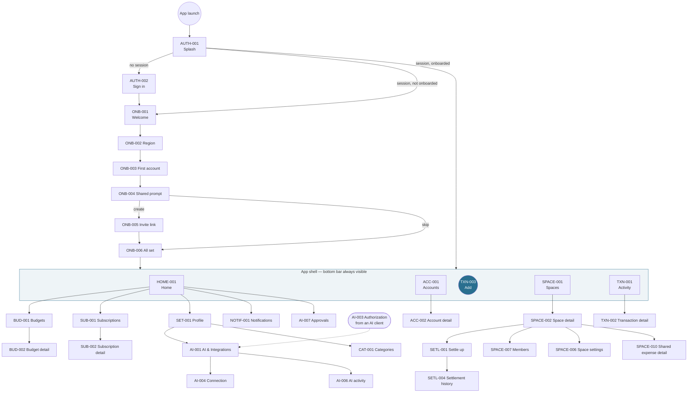
```mermaid
flowchart TD
    LAUNCH((App launch)) --> AUTH001[AUTH-001<br/>Splash]
    AUTH001 -->|no session| AUTH002[AUTH-002<br/>Sign in]
    AUTH001 -->|session, not onboarded| ONB001[ONB-001<br/>Welcome]
    AUTH001 -->|session, onboarded| SHELL

    AUTH002 --> ONB001
    ONB001 --> ONB002[ONB-002 Region] --> ONB003[ONB-003 First account]
    ONB003 --> ONB004[ONB-004 Shared prompt]
    ONB004 -->|create| ONB005[ONB-005 Invite link]
    ONB004 -->|skip| ONB006
    ONB005 --> ONB006[ONB-006 All set] --> SHELL

    subgraph SHELL["App shell — bottom bar always visible"]
        HOME001[HOME-001<br/>Home]
        ACC001[ACC-001<br/>Accounts]
        FAB(("TXN-003<br/>Add"))
        SPACE001[SPACE-001<br/>Spaces]
        TXN001[TXN-001<br/>Activity]
    end

    HOME001 --> BUD001[BUD-001 Budgets]
    HOME001 --> SUB001[SUB-001 Subscriptions]
    HOME001 --> SET001[SET-001 Profile]
    HOME001 --> NOTIF001[NOTIF-001 Notifications]
    HOME001 --> AI007["AI-007 Approvals"]
    SET001 --> AI001["AI-001 AI & Integrations"]
    AI001 --> AI004["AI-004 Connection"]
    AI001 --> AI006["AI-006 AI activity"]
    AI003X(["AI-003 Authorization<br/>from an AI client"]) -.-> AI001
    ACC001 --> ACC002[ACC-002 Account detail]
    SPACE001 --> SPACE002[SPACE-002 Space detail]
    TXN001 --> TXN002[TXN-002 Transaction detail]

    BUD001 --> BUD002[BUD-002 Budget detail]
    SUB001 --> SUB002[SUB-002 Subscription detail]
    SET001 --> CAT001[CAT-001 Categories]
    SPACE002 --> SETL001[SETL-001 Settle up]
    SPACE002 --> SPACE007[SPACE-007 Members]
    SPACE002 --> SPACE006[SPACE-006 Space settings]
    SPACE002 --> SPACE010[SPACE-010 Shared expense detail]
    SETL001 --> SETL004[SETL-004 Settlement history]

    style FAB fill:#2a6f8f,color:#fff
    style SHELL fill:#eef4f7,stroke:#2a6f8f
```

## 2.2 Tab ownership

| Tab | Root screen | Screens reachable from this tab |
|---|---|---|
| **Home** | HOME-001 | BUD-001, BUD-002, SUB-001, SUB-002, SET-001 (+ all SET-*), CAT-001, NOTIF-001, ACC-002, SPACE-002, SETL-001, TXN-002 |
| **Accounts** | ACC-001 | ACC-002, ACC-003, ACC-004, ACC-005, ACC-006, TXN-002 |
| **Spaces** | SPACE-001 | SPACE-002 … SPACE-014, SPLIT-001, SETL-001 … SETL-007, BUD-002 |
| **Activity** | TXN-001 | TXN-002, TXN-005, TXN-006, ACC-002, SPACE-010 |
| **FAB** | TXN-003 (sheet) | SPLIT-001, PICK-001 … PICK-007 |

Screens appear under more than one tab deliberately — a transaction opened from Activity stays in the Activity stack; the same transaction opened from Account Detail stays in the Accounts stack. See §4.3.

## 2.3 Modal & sheet hierarchy

Three layers, never more:

```
Layer 0 — Screen           (push, full screen, part of a tab's stack)
Layer 1 — Sheet            (bottom sheet over a screen; scrim; drag-to-dismiss)
Layer 2 — Nested sheet     (a picker opened from within a sheet)
Layer 3 — Dialog           (alert; always dismissible; may sit over any layer)
```

**Rules:**
- A Layer-1 sheet may open **one** Layer-2 sheet. A Layer-2 sheet may not open another sheet — it may only open a Layer-3 dialog.
- Dialogs never open sheets. A dialog's actions either dismiss it or navigate at Layer 0.
- Only one sheet is presented at each layer at a time.

| Layer | Examples |
|---|---|
| **L1 sheets** | TXN-003 Add, ACC-003 Add account, SPACE-005 Create space, BUD-003 Create budget, SUB-003 Add subscription, SETL-002 Settlement review, TXN-005 Filters, HOME-002 Month picker |
| **L2 sheets** | PICK-001 Account, PICK-002 Category, PICK-003 Date, PICK-005 Member, PICK-006 Currency, PICK-007 Icon & colour, SPLIT-001 Split editor, SUB-007 Cadence |
| **L3 dialogs** | All DLG-* |

## 2.4 Global actions

| Action | Where | Behaviour |
|---|---|---|
| **Add (FAB)** | All four tabs | Opens TXN-003. Context-aware defaults — see §14 |
| **Search** | TXN-001 header only | Inline expand into TXN-006 |
| **Notifications** | HOME-001 header bell | Push to NOTIF-001 |
| **Profile** | HOME-001 header avatar | Push to SET-001 |
| **Pull to refresh** | HOME-001, ACC-001, ACC-002, TXN-001, SPACE-001, SPACE-002, BUD-001, SUB-001 | Re-fetch; see §5.11 |

---

# 3. Master Screen Inventory

**Type key:** `Screen` = pushed full screen · `Tab` = bottom-bar root · `Sheet` = bottom sheet (L1) · `Sub-sheet` = nested sheet (L2) · `Dialog` = alert (L3) · `Mode` = in-place state change of a parent screen · `Component` = persistent global element

## 3.1 Authentication & onboarding

| ID | Screen | Type | Parent | Entry Point | Main Purpose |
|---|---|---|---|---|---|
| AUTH-001 | Splash | Screen | — | App launch | Resolve session, route to sign-in / onboarding / Home |
| AUTH-002 | Sign in | Screen | AUTH-001 | No valid session | Authenticate via Keycloak |
| AUTH-003 | Auth error | Screen | AUTH-002 | Auth failure | Explain failure, offer retry |
| ONB-001 | Welcome | Screen | AUTH-002 | First run after sign-in | Set expectation; start setup |
| ONB-002 | Region & currency | Screen | ONB-001 | Continue from ONB-001 | Capture country + default currency |
| ONB-003 | Add first account | Screen | ONB-002 | Continue from ONB-002 | Create the first account so the app has data |
| ONB-004 | Share with someone? | Screen | ONB-003 | Continue from ONB-003 | Introduce spaces; optional space creation |
| ONB-005 | Invite link | Screen | ONB-004 | Space created in ONB-004 | Hand the user a shareable invite link |
| ONB-006 | All set | Screen | ONB-004 / ONB-005 | End of onboarding | Confirm completion, enter the app |

## 3.2 Home

| ID | Screen | Type | Parent | Entry Point | Main Purpose |
|---|---|---|---|---|---|
| HOME-001 | Home dashboard | Tab | — | App launch (default tab); Home tab | Answer "how am I doing?" across personal + shared |
| HOME-002 | Month picker | Sheet | HOME-001 | Tap month chip on hero | Change the reporting month |
| HOME-003 | Net worth breakdown | Sheet | HOME-001 | Tap net worth figure | Show per-account contribution + FX disclosure |

## 3.3 Accounts

| ID | Screen | Type | Parent | Entry Point | Main Purpose |
|---|---|---|---|---|---|
| ACC-001 | Accounts | Tab | — | Accounts tab; Home "See all" | See all accounts and balances |
| ACC-002 | Account detail | Screen | ACC-001 | Tap account; Home strip; TXN-002 link | One account's balance and transactions |
| ACC-003 | Add account | Sheet | ACC-001 | "+" on ACC-001; ONB-003; inline from PICK-001 | Create an account |
| ACC-004 | Edit account | Sheet | ACC-002 | Overflow → Edit | Modify an account |
| ACC-005 | Reorder accounts | Mode | ACC-001 | Overflow → Reorder; long-press a row | Change display order |
| ACC-006 | Archived accounts | Screen | ACC-001 | Tap "Archived (N)" | Review / restore archived accounts |

## 3.4 Activity & transactions

| ID | Screen | Type | Parent | Entry Point | Main Purpose |
|---|---|---|---|---|---|
| TXN-001 | Activity | Tab | — | Activity tab; Home "See all" | Find, review, correct any money event |
| TXN-002 | Transaction detail | Screen | TXN-001 | Tap row (TXN-001, ACC-002, HOME-001, BUD-002, SUB-002) | Full record of one money event |
| TXN-003 | Add money event | Sheet | any | FAB; Home quick action; ACC-002; SPACE-002 | Record expense / income / transfer, personal or shared |
| TXN-004 | Edit money event | Sheet | TXN-002 | Tap Edit on TXN-002 | Modify an existing transaction |
| TXN-005 | Filters | Sheet | TXN-001 | Tap filter icon | Narrow the transaction list |
| TXN-006 | Search | Mode | TXN-001 | Tap search icon | Free-text search across transactions |

## 3.5 Spaces

| ID | Screen | Type | Parent | Entry Point | Main Purpose |
|---|---|---|---|---|---|
| SPACE-001 | Spaces | Tab | — | Spaces tab; Home shared card | See all spaces and your standing in each |
| SPACE-002 | Space detail | Screen | SPACE-001 | Tap space; Home space row; deep link | The shared money hub for one space |
| SPACE-003 | Expenses tab | Mode | SPACE-002 | Default tab of SPACE-002 | Browse shared expenses |
| SPACE-004 | Activity tab | Mode | SPACE-002 | Second tab of SPACE-002 | Audit feed of space events |
| SPACE-005 | Create space | Sheet | SPACE-001 | "+" on SPACE-001; ONB-004; empty state | Create a space and invite someone |
| SPACE-006 | Space settings | Screen | SPACE-002 | Overflow → Settings | Configure space, default split, notifications |
| SPACE-007 | Members & invites | Screen | SPACE-002 | Tap member avatars; overflow → Members | See, invite, and manage people |
| SPACE-008 | Invite | Sheet | SPACE-007 | "Invite" on SPACE-007 / SPACE-002 | Generate and share an invite link |
| SPACE-009 | Invite review | Screen | — | Invite deep link; notification; SPACE-001 banner | Accept or decline an invitation |
| SPACE-010 | Shared expense detail | Screen | SPACE-003 | Tap expense row; TXN-002 link; notification | The space's view of one shared expense |
| SPACE-011 | Default split | Sub-sheet | SPACE-006 | Tap "Default split" | Set the space's standing split |
| SPACE-012 | Balance breakdown | Sheet | SPACE-002 | Tap balance card | Per-pair balances when 3+ members |
| SPACE-013 | Archived spaces | Screen | SPACE-001 | Tap "Archived (N)" | Review / restore archived spaces |
| SPACE-014 | Expense filters | Sheet | SPACE-003 | Tap filter icon | Narrow the space expense list |

## 3.6 Split & settlement

| ID | Screen | Type | Parent | Entry Point | Main Purpose |
|---|---|---|---|---|---|
| SPLIT-001 | Split editor | Sub-sheet | TXN-003 | Tap split summary row; Edit split on SPACE-010 | Configure how an expense divides |
| SETL-001 | Settle up | Screen | SPACE-002 | Balance card CTA; Home nudge; notification | Turn a balance into a recorded payment |
| SETL-002 | Review settlement | Sheet | SETL-001 | Tap Record / Request | Final confirm before writing |
| SETL-003 | Settlement success | Screen | SETL-002 | After successful write | Confirm the balance is cleared |
| SETL-004 | Settlement history | Screen | SPACE-002 | Overflow → History; SETL-001 link | Audit trail of settlements |
| SETL-005 | Settlement detail | Sheet | SETL-004 | Tap a settlement row | One settlement's full record |
| SETL-006 | Confirm request | Sheet | — | Notification; SPACE-002 banner | Confirm a settlement someone proposed |
| SETL-007 | Settle everything | Dialog | SETL-001 | Tap "Mark everything settled" | Bulk-clear all balances in a space |

## 3.7 Budgets, subscriptions, categories

| ID | Screen | Type | Parent | Entry Point | Main Purpose |
|---|---|---|---|---|---|
| BUD-001 | Budgets | Screen | HOME-001 | Home budget card "See all" | See all budgets and progress |
| BUD-002 | Budget detail | Screen | BUD-001 | Tap budget; Home budget card; SPACE-002 | One budget's progress and contents |
| BUD-003 | Create budget | Sheet | BUD-001 | "+" on BUD-001; empty state; SPACE-002 | Create a budget |
| BUD-004 | Edit budget | Sheet | BUD-002 | Tap Edit | Modify a budget |
| SUB-001 | Subscriptions | Screen | HOME-001 | Home upcoming card "See all" | Manage recurring expenses |
| SUB-002 | Subscription detail | Screen | SUB-001 | Tap subscription; Home upcoming row | One subscription's config and history |
| SUB-003 | Add subscription | Sheet | SUB-001 | "+" on SUB-001; empty state | Create a subscription |
| SUB-004 | Edit subscription | Sheet | SUB-002 | Tap Edit | Modify a subscription |
| SUB-005 | Confirm payment | Sheet | SUB-001 | Tap "Pay" | Confirm account and amount before posting |
| SUB-006 | Cadence picker | Sub-sheet | SUB-003 | Tap "Repeats" | Configure frequency, interval and anchor |
| CAT-001 | Categories | Screen | SET-001 | Settings → Categories | Manage the category catalog |
| CAT-002 | Add / edit category | Sheet | CAT-001 | "+" or tap a row; inline from PICK-002 | Create or modify a category |
| CAT-003 | Reassign category | Sheet | CAT-001 | Delete a category that is in use | Move transactions before deletion |

## 3.8 Settings, profile, notifications

| ID | Screen | Type | Parent | Entry Point | Main Purpose |
|---|---|---|---|---|---|
| SET-001 | Profile & settings | Screen | HOME-001 | Home header avatar | Identity, preferences, configuration |
| SET-002 | Edit profile | Sheet | SET-001 | Tap profile row | Change display name and avatar |
| SET-003 | Default currency | Sub-sheet | SET-001 | Tap "Default currency" | Change reporting currency |
| SET-004 | Notifications | Screen | SET-001 | Tap "Notifications" | Global + per-space notification preferences |
| SET-005 | Appearance | Sheet | SET-001 | Tap "Appearance" | Light / dark / system |
| SET-006 | Language | Sheet | SET-001 | Tap "Language" | Change app language |
| SET-007 | About | Screen | SET-001 | Tap "About" | Version, legal, support |
| NOTIF-001 | Notifications | Screen | HOME-001 | Header bell; push tap | Catch up on shared-finance events |
| NOTIF-002 | Enable notifications | Sheet | — | After first space is created | Pre-prompt before the OS permission dialog |

## 3.8a AI & Integrations

| ID | Screen | Type | Parent | Entry Point | Main Purpose |
|---|---|---|---|---|---|
| AI-001 | AI & Integrations | Screen | SET-001 | Settings → AI & Integrations | Manage every connected AI application |
| AI-002 | Connect an app | Screen | AI-001 | "Connect an app" | Explain that connecting starts in the AI client |
| AI-003 | Authorization request | Screen | — | OAuth redirect from an AI client | Grant scoped access — the consent screen |
| AI-004 | Connection detail | Screen | AI-001 | Tap a connection | One app's access, usage and revocation |
| AI-005 | Connection permissions | Screen | AI-004 | Tap "Change" | Narrow scopes and tune spending limits |
| AI-006 | AI activity | Screen | AI-001 | "AI activity"; AI-004 "See all" | Audit every change an AI made |
| AI-007 | Pending approvals | Screen | — | Push; HOME-001 banner; AI-001 banner | Approve actions too risky to confirm in chat |

## 3.9 Reusable pickers

| ID | Screen | Type | Parent | Entry Point | Main Purpose |
|---|---|---|---|---|---|
| PICK-001 | Account picker | Sub-sheet | any form | Tap an account row | Choose an account |
| PICK-002 | Category picker | Sub-sheet | any form | Tap a category row | Choose a category |
| PICK-003 | Date picker | Sub-sheet | any form | Tap a date row | Choose a date |
| PICK-004 | Space picker | Sub-sheet | TXN-003, BUD-003 | Tap "More spaces" | Choose a space when >4 exist |
| PICK-005 | Member picker | Sub-sheet | TXN-003, SETL-001 | Tap "Paid by" / member field | Choose a space member |
| PICK-006 | Currency picker | Sub-sheet | ACC-003, SET-001, SPACE-005 | Tap a currency row | Choose a currency |
| PICK-007 | Icon & colour | Sub-sheet | ACC-003, CAT-002, SPACE-005 | Tap the icon swatch | Choose a visual identity |

## 3.10 Confirmation dialogs

| ID | Dialog | Parent | Trigger | Purpose |
|---|---|---|---|---|
| DLG-001 | Discard changes? | any form | Dismiss with unsaved edits | Prevent accidental data loss |
| DLG-002 | Delete transaction? | TXN-002 | Overflow → Delete | Confirm a personal delete |
| DLG-003 | Delete shared expense? | TXN-002, SPACE-010 | Overflow → Delete | Confirm and warn about balance impact |
| DLG-004 | Archive account? | ACC-002, ACC-004 | Archive action | Confirm; explain history is kept |
| DLG-005 | Delete account? | ACC-004 | Delete action | Confirm hard removal (only when empty) |
| DLG-006 | Archive space? | SPACE-006 | Archive action | Confirm read-only transition |
| DLG-007 | Delete space? | SPACE-006 | Delete action | Confirm irreversible removal |
| DLG-008 | Leave space? | SPACE-007 | Leave action | Confirm; surface outstanding balance |
| DLG-009 | Remove member? | SPACE-007 | Swipe/overflow → Remove | Confirm; explain history is kept |
| DLG-010 | Revoke invite? | SPACE-007 | Tap Revoke | Confirm link invalidation |
| DLG-011 | Cancel settlement? | SETL-004, SETL-005 | Tap Cancel | Confirm reverting a proposal |
| DLG-012 | Delete budget? | BUD-002, BUD-004 | Delete action | Confirm |
| DLG-013 | Delete subscription? | SUB-002, SUB-004 | Delete action | Confirm; explain past transactions remain |
| DLG-014 | Category in use | CAT-001 | Delete a used category | Block delete; offer reassignment |
| DLG-015 | Sign out? | SET-001 | Tap Sign out | Confirm |
| DLG-016 | Already settled | TXN-002, SPACE-010 | Edit/delete a settled expense | Block; offer a correcting expense |
| DLG-017 | Settle everything? | SETL-001 | Tap "Mark everything settled" | Confirm bulk clear |
| DLG-018 | Skip this payment? | SUB-001, SUB-002 | Tap Skip | Confirm no transaction will be created |
| DLG-019 | Disconnect app? | AI-001, AI-004 | Disconnect action | Confirm immediate revocation |
| DLG-020 | Disconnect all AI apps? | AI-001 | Overflow → Disconnect all | Confirm bulk revocation |
| DLG-021 | Don't connect? | AI-003 | Dismiss mid-review | Prevent accidental abandonment |
| DLG-022 | Reject this action? | AI-007 | Tap Reject | Confirm rejecting an AI request |

## 3.11 Global components

| ID | Component | Appears on | Purpose |
|---|---|---|---|
| GLB-001 | Bottom navigation | All tab roots and their pushed screens | Primary navigation |
| GLB-002 | Floating action button | All four tabs | Global add |
| GLB-003 | Toast / snackbar | Anywhere | Transient confirmation + undo |
| GLB-004 | Offline banner | Anywhere | Connectivity state |
| GLB-005 | Full-screen error | Any screen root | Unrecoverable load failure |
| GLB-006 | Pull-to-refresh | Scrollable roots | Manual refresh |

**Total documented units: 107** — 41 screens, 6 tab/mode states, 31 sheets, 22 dialogs, 6 global components (34 + 7 AI screens; 18 + 4 AI dialogs).

---

# 4. Global Navigation Specification

## 4.1 Bottom navigation (GLB-001)

**Structure:** five slots, fixed order.

| Slot | Label | Icon (outline / filled) | Destination |
|---|---|---|---|
| 1 | Home | house | HOME-001 |
| 2 | Accounts | credit-card | ACC-001 |
| 3 | *(none)* | plus, filled circle | TXN-003 (sheet) |
| 4 | Spaces | users | SPACE-001 |
| 5 | Activity | list | TXN-001 |

**Specification:**
- Height 56pt + safe-area inset. Background: surface colour with a 1px top hairline.
- Labels always visible (never icon-only). Type: 10–11pt, medium weight.
- Active state: filled icon + accent colour + accent label. Inactive: outline icon + secondary text colour.
- Slot 3 renders the FAB (GLB-002) raised 12pt above the bar, 56pt diameter, accent fill, white plus glyph, elevation 3.
- Tap target minimum 48×48pt for all slots.

**Visibility rules:**

| Context | Bottom bar |
|---|---|
| Tab roots (HOME-001, ACC-001, SPACE-001, TXN-001) | **Visible** |
| Second-level pushed screens (ACC-002, SPACE-002, TXN-002, BUD-001, SUB-001, …) | **Visible** |
| Third-level pushed screens (BUD-002, SPACE-010, SETL-004, …) | **Visible** |
| Full-screen flows (SETL-001, SETL-003, SPACE-009, all AUTH-*, all ONB-*) | **Hidden** |
| Any sheet or dialog presented | **Covered by scrim**, not removed |

**Tap behaviour:**

| Situation | Result |
|---|---|
| Tap an inactive tab | Switch to that tab, restoring its saved stack and scroll position |
| Tap the **active** tab, not at root | Pop that tab's stack to root |
| Tap the **active** tab, at root, scrolled down | Smooth-scroll to top |
| Tap the **active** tab, at root, already at top | Trigger pull-to-refresh |
| Tap the FAB | Present TXN-003 over the current tab; the tab does not change |

## 4.2 Back behaviour

| Trigger | Behaviour |
|---|---|
| **Header back chevron** | Pop one screen within the current tab stack |
| **Android system back — on a pushed screen** | Identical to the header back chevron |
| **Android system back — at a tab root, not Home** | Switch to the Home tab |
| **Android system back — at Home root** | Show a "Press back again to exit" toast; a second press within 2s exits |
| **Android system back — sheet presented** | Dismiss the topmost sheet only |
| **Android system back — dialog presented** | Dismiss the dialog with its cancel action |
| **iOS edge swipe** | Same as header back; disabled while a form has unsaved changes (DLG-001 is triggered by the header close button instead) |
| **Swipe down on a sheet** | Dismiss, unless the sheet has unsaved changes → DLG-001 |
| **Tap the scrim behind a sheet** | Same as swipe down |

**Back never crosses tabs**, with the single exception of the Android system-back-at-root rule above.

## 4.3 Stack independence

Each tab owns an independent navigation stack, preserved when switching tabs.

Practical consequence, and it is deliberate:

```
Activity → tap txn → TXN-002 → tap "Bank" → ACC-002  [stays in the Activity stack]
Accounts → tap Bank → ACC-002                          [stays in the Accounts stack]
```

Both are reachable; neither jumps the user into a different tab. Back from TXN-002-in-Activity returns to Activity; back from ACC-002-in-Accounts returns to Accounts.

**Stacks are cleared when:** the user signs out; onboarding completes; the app is cold-started after being killed. Stacks are **preserved** on background/foreground for up to 30 minutes, after which tabs reset to root and data is re-fetched.

## 4.4 Sheet dismissal

| Sheet type | Dismiss affordances | Unsaved-changes guard |
|---|---|---|
| Form sheet (TXN-003, ACC-003, BUD-003, SUB-003, SPACE-005) | Close ✕ (top-left), swipe down, scrim tap | **Yes** → DLG-001 |
| Picker sheet (PICK-001 … PICK-007) | Selection auto-dismisses; Cancel; swipe; scrim | No — selection is the commit |
| Filter sheet (TXN-005, SPACE-014) | Apply; Close ✕; swipe; scrim | No — filters apply live or on Apply, per §5.14 |
| Review sheet (SETL-002) | Back arrow returns to the parent screen; swipe | No |
| Info sheet (HOME-003, SPACE-012, SETL-005) | Close ✕; swipe; scrim | No |

**Sheet height rules:**
- Pickers with ≤6 options: wrap content.
- Pickers with >6 options: 60% of viewport, expandable to 90% by dragging up, internally scrollable.
- Form sheets: 90% of viewport (near-full-screen) with a visible grab handle.
- TXN-003: 100% of viewport minus the status bar — it behaves as a screen but is presented as a sheet so that dismissal is a swipe.

## 4.5 Deep links

| Link | Destination | Unauthenticated behaviour |
|---|---|---|
| `pokito://invite/{token}` | SPACE-009 | Route to AUTH-002, then to SPACE-009 after sign-in |
| `pokito://space/{id}` | SPACE-002 | Sign in, then destination |
| `pokito://space/{id}/expense/{id}` | SPACE-010 | Sign in, then destination |
| `pokito://space/{id}/settle` | SETL-001 | Sign in, then destination |
| `pokito://settlement/{id}/confirm` | SETL-006 | Sign in, then destination |
| `pokito://transaction/{id}` | TXN-002 (Activity stack) | Sign in, then destination |
| `pokito://budget/{id}` | BUD-002 | Sign in, then destination |
| `pokito://add` | TXN-003 over Home | Sign in, then destination |

**Deep-link stack construction:** a deep link builds a synthetic back stack so back is never a dead end. `pokito://space/{id}/expense/{id}` produces `SPACE-001 → SPACE-002 → SPACE-010`, and back walks that path.

**Invalid deep links** (deleted entity, no permission): route to the nearest valid parent with a toast — *"That expense is no longer available."*

## 4.6 State preservation

| State | Preserved across | Reset when |
|---|---|---|
| Tab scroll position | Tab switches, push/pop | Tab root re-tapped at top; cold start |
| TXN-001 active filters | Push/pop within Activity; tab switches | Explicit "Clear"; sign-out. **Not** reset by app restart |
| TXN-001 search query | Push/pop | Leaving the Activity tab; exiting search mode |
| SPACE-002 selected tab | Push/pop within Spaces | Leaving the space |
| SPACE-002 balance scope (cycle/all-time) | Session | App restart → back to Cycle |
| HOME-001 selected month | Session | App restart → back to current month |
| TXN-003 draft content | Interruption (phone call, backgrounding) for 10 minutes | Explicit discard; successful save; 10-minute expiry |

## 4.7 Return-from-create/edit behaviour

| Flow | On success | Toast | List behaviour |
|---|---|---|---|
| TXN-003 → save | Dismiss to the caller | "Added" (+ balance line when shared) | Caller list refreshes; the new row is highlighted for 1.5s |
| TXN-004 → save | Dismiss to TXN-002 | "Saved" | TXN-002 re-renders |
| ACC-003 → save | Dismiss to ACC-001 | "Account added" | New account appears; if opened inline from PICK-001, it is auto-selected in the parent form |
| SPACE-005 → create | Push to SPACE-002 of the new space; SPACE-005 is removed from the stack | "Space created" | Back from SPACE-002 goes to SPACE-001 |
| BUD-003 → save | Dismiss to BUD-001 | "Budget created" | — |
| SUB-003 → save | Dismiss to SUB-001 | "Subscription added" | — |
| SETL-002 → confirm | Replace stack with SETL-003 | — | Back from SETL-003 goes to SPACE-002 |
| CAT-002 → save | Dismiss to caller | "Category saved" | If opened inline from PICK-002, auto-selected |

**Rule:** a creation flow never leaves its own form on the back stack. After creating a space, back must not re-open "Create space."

---

# 5. Global UI & Interaction Patterns

Every pattern below is defined once and referenced by ID throughout the screen specifications.

## 5.1 Headers

Three header variants. No screen invents a fourth.

**H1 — Tab header** (HOME-001, ACC-001, SPACE-001, TXN-001)
- Height 56pt, no back button
- Left: screen title, 22pt semibold (Home uses a greeting instead — see HOME-001)
- Right: up to two icon actions, 24pt, 48pt tap target
- Collapses on scroll: the title shrinks to 17pt and moves to the centre; a hairline appears beneath

**H2 — Detail header** (all pushed screens)
- Height 56pt
- Left: back chevron, 24pt
- Centre: screen title, 17pt semibold, truncating with an ellipsis at one line
- Right: up to two icon actions, the last being an overflow ⋮ when there are more than two actions
- Large-title variant: for ACC-002, SPACE-002, BUD-002 the title area expands to show the primary figure and collapses on scroll

**H3 — Sheet header**
- Height 52pt, grab handle 4×32pt centred 8pt above
- Left: Close ✕ (form sheets) or Cancel text (pickers)
- Centre: sheet title, 17pt semibold
- Right: primary action as text (Save / Apply / Done), disabled until valid

## 5.2 Cards

| Token | Radius | Padding | Elevation | Use |
|---|---|---|---|---|
| **Card/standard** | 16pt | 16pt | 0, 1px border | Section cards on Home, budget cards, space cards |
| **Card/hero** | 20pt | 20pt | 1 | Home net-worth hero, space balance card |
| **Card/compact** | 12pt | 12pt | 0, 1px border | Account strip cards, recommendation cards |

Cards never nest more than one level. A card is tappable **only** if it has a single obvious destination; if it contains several tappable rows, the card itself is inert and the rows carry the tap.

## 5.3 List rows

**Standard row anatomy** (used by transactions, expenses, subscriptions, members, categories):

```
┌────────────────────────────────────────────────────────┐
│ [40pt      ]  Primary text            Trailing primary │
│ [ leading  ]  Secondary text · meta   Trailing second. │
└────────────────────────────────────────────────────────┘
   16pt gutter                            16pt gutter
```

- Row height: 64pt for two-line rows, 56pt for single-line
- Leading: 40pt circle — a category icon on a tinted background, an account icon, or a member avatar
- Primary text: 16pt medium, truncates to one line
- Secondary text: 13pt regular, secondary colour, one line, middle-dot separated
- Trailing primary: 16pt medium, tabular figures, right-aligned
- Trailing secondary: 12pt, secondary colour
- Divider: 1px inset to the text start (56pt from the left), omitted after the last row
- Pressed state: surface tint, no ripple offset

## 5.4 Amount formatting

**Absolute rules:**

| Rule | Detail |
|---|---|
| Minor units | All amounts are stored and computed in minor units; formatting is presentational only |
| Decimals | Follow the currency: JPY/KRW → 0 decimals; USD/EUR/GBP → 2 |
| Grouping | Locale-appropriate thousands separators — `¥5,000`, `€1.234,56` |
| Symbol position | Locale-appropriate — `¥5,000`, `1 234,56 €` |
| Figures | Tabular/monospaced numerals everywhere so columns align |
| Negative sign | Minus sign U+2212 (−), never a hyphen. Never parentheses |
| Zero | `¥0`, never `-` or blank |

**Sign and colour:**

| Context | Format | Colour |
|---|---|---|
| Expense in a list | `−¥5,000` | Default text colour — **not** red |
| Income in a list | `+¥250,000` | Success colour |
| Transfer in a list | `¥50,000` with a ⇄ glyph | Secondary text colour |
| Settlement in a list | `−¥2,500` with a handshake glyph | Secondary text colour |
| Account balance, positive | `¥348,200` | Default text colour |
| Account balance, negative | `−¥12,400` | Danger colour |
| "You are owed" | `¥2,500` | Success colour |
| "You owe" | `¥2,500` | Warning colour — **not** danger; owing a flatmate is not an error |
| Budget within limit | `¥32,000 / ¥50,000` | Default |
| Budget ≥80% | same | Warning |
| Budget over | same | Danger |

**Rationale for not colouring every expense red:** in a transaction list nearly every row is an expense. Colouring them all destroys colour as a signal. Colour is reserved for values that carry a judgement — balances, budget status, debt direction.

**Truncation:** amounts are never truncated or abbreviated in detail views. In constrained widths (account strip cards) values above 8 digits abbreviate to `¥1.2M`, with the full value shown on the detail screen.

## 5.5 Date & time formatting

| Context | Format | Example |
|---|---|---|
| List group headers | Relative for 2 days, then absolute | `Today` · `Yesterday` · `Mon 12 Aug` |
| Previous years | Include the year | `12 Aug 2025` |
| Detail screens | Full | `Monday, 12 August 2026` |
| Relative activity | Compact relative under 7 days | `2h ago` · `3d ago` · then `12 Aug` |
| Subscription due | Relative with emphasis | `Due today` · `Due in 3 days` · `Overdue by 2 days` |
| Budget period | Range | `1–31 Aug` |
| Settlement cycle | Relative | `since 12 Aug` |

Week starts on the locale's first day. All dates render in the device timezone; a space's timezone is **not** used in V1 for display.

## 5.6 Multi-currency model

Pokito is an international app. A user may hold accounts in several currencies, belong to spaces denominated in others, and travel between them. Multi-currency is a **first-class capability in V1**, not a constrained edge case.

### 5.6.1 The three currency roles

Every amount in Pokito sits in exactly one of three roles. Conflating them is the source of every multi-currency bug, so they are named and kept separate throughout.

| Role | Belongs to | What it means | Chosen at |
|---|---|---|---|
| **Unit of payment** | An **Account** | The currency money actually moved in | Account creation (ACC-003); immutable once the account has transactions |
| **Unit of account** | A **Space** | The currency a shared debt is denominated in — what everyone agrees they owe | Space creation (SPACE-005); immutable once the space has expenses |
| **Unit of reporting** | The **User** | The currency every aggregate is expressed in — net worth, spent, budgets | ONB-002; changeable any time in SET-003 |

### 5.6.2 The load-bearing rule

> **A shared debt is always denominated in the space's currency. Payment may come from an account in any currency.**

So a €248.00 charge on a EUR card, recorded in a JPY-based trip space, becomes:

| Record | Currency | Value |
|---|---|---|
| **Split** — the shared expense | Space currency | `¥42,000` |
| **SplitShares** — what each member owes | Space currency | `¥14,000` each |
| **Transaction** — the payer's cash flow | **Account** currency | `−€248.00` |
| **Rate snapshot** on the transaction | — | `JPY → EUR 0.00590 · 15 Aug 2026` |

**Why this works:** balances never span currencies. Every figure in `who owes whom` for a given space is in that one space's currency, so there is no ambiguity about which rate a debt is measured at, and no drift when rates move. The payer's account is debited in its own currency, so their cash flow stays honest. The two lenses (§P2) remain intact across currencies.

**What this replaces:** an earlier draft required a shared expense's account to match the space's currency, blocking the most common international case — paying for a group dinner abroad on a home-currency card. That restriction is removed.

### 5.6.3 Where conversion happens, and where it never happens

| Figure | Converted? | Basis |
|---|---|---|
| An individual amount in a list or on a detail screen | **Never** | Shown in the currency it was recorded in |
| Account balance | **Never** | Always the account's own currency |
| Space balances, who-owes-whom, settlement amounts | **Never** | Always the space's currency |
| A split's shares | **Never** | Always the space's currency |
| Net worth (HOME-001, ACC-001) | Yes | Reporting currency, dated snapshot |
| Spent / In (HOME-001) | Yes | Reporting currency |
| Personal budget consumption | Yes | Reporting currency |
| **Space** budget consumption | **Never** | The space's currency — a space budget is inside one space |
| Subscription monthly total | Yes, with per-currency subtotals available | Reporting currency |
| The payer's transaction for a cross-currency shared expense | Yes, **once, at entry** | Rate captured and stored on the transaction |

**Historical amounts are never re-converted.** A rate captured at entry is stored on the record and never recalculated when rates move. Aggregates recompute against the current snapshot; individual records do not.

### 5.6.4 Rates

| Property | Behaviour |
|---|---|
| Source | Daily reference rates from a central-bank feed, stored as dated snapshots |
| Refresh | Once daily; the app never blocks on a live fetch |
| Staleness | A snapshot older than 7 days is still used, but every figure derived from it carries a **stale-rate** disclosure |
| Manual override | Available on a cross-currency **transfer** only (ACC-to-ACC), where the user knows the rate their bank actually gave them |
| Storage | Every converted record stores the rate and its capture date |

### 5.6.5 Display rules

- **Symbol always; code when it could be ambiguous.** `€1,240.50`. The ISO code is appended in a smaller, letterspaced mono treatment — `€1,240.50 EUR` — whenever a screen shows more than one currency, whenever the amount is not in the user's reporting currency, and always on account rows and space headers.
- **Symbols that collide are disambiguated by code, never by prefix guessing.** `$` never appears alone when both USD and AUD are present; `US$`/`A$` are not used — the code carries it.
- **Decimal places follow the currency**, from ISO-4217: 0 for JPY and KRW, 2 for most, 3 for KWD and BHD.
- **Grouping and symbol position follow the user's locale**, not the currency's home locale.
- **A converted figure never appears without its ⓘ**, which discloses the rate, its date, and the source.
- **Every amount is stored and computed in minor units.** Formatting is presentational only.

### 5.6.6 Refusing to guess (principle P6)

When a rate is unavailable for a currency in scope, Pokito does **not** approximate, omit the account, or fall back to a stale guess without saying so. The combined total is replaced by per-currency subtotals plus a named reason:

```
Net worth
€4,722.50 EUR · ¥18,400 JPY · Fr2,100 CHF

Can't combine — no rate for CHF.
```

A **stale** rate is different from a missing one: the figure is shown, with `Rates from 8 Aug` in place of the usual disclosure, in warning colour.

### 5.6.7 Currency in each flow

| Flow | Behaviour |
|---|---|
| **Onboarding** (ONB-002) | Sets the reporting currency from the device region, changeable before continuing |
| **First account** (ONB-003) | Defaults to the reporting currency; changeable |
| **Add account** (ACC-003) | Defaults to the reporting currency; **locked once the account has transactions** |
| **Create space** (SPACE-005) | Defaults to the reporting currency; **locked once the space has expenses** |
| **Add personal expense** (TXN-003) | Currency follows the selected account; not separately editable |
| **Transfer between currencies** (TXN-003) | Both accounts shown; a rate field appears, pre-filled from the snapshot and editable; the converted amount is shown live and stored |
| **Add shared expense** (TXN-003) | Amount is entered in the **space's** currency. When the paying account differs, a conversion line shows what will leave the account |
| **Settle up** (SETL-001) | Amount is in the space's currency; the paying account may be any currency, with the conversion shown |
| **Budgets** (BUD-003) | Personal → reporting currency. Space → that space's currency. Not user-selectable; derived from scope |
| **Subscriptions** (SUB-003) | Currency follows the account; the monthly total converts with per-currency subtotals available |

## 5.7 Member avatars

- 32pt circle in lists, 24pt in stacks, 48pt on SPACE-007
- Content: uploaded photo, else initials on a colour deterministically derived from the user id
- **Avatar stack:** up to 3 avatars overlapping by 8pt, then a `+N` chip. Tapping the stack opens SPACE-007
- "You" is always rendered first in any member list and labelled **You**, never the user's own name
- Removed/left members render at 50% opacity with a struck-through name in historical contexts

## 5.8 Category chips & icons

- Icon: 20pt glyph on a 40pt circle tinted at 12% of the category colour, glyph at 100%
- Chip (used in TXN-003 recents): 32pt tall, pill, icon + label, selected state = filled with the category colour at 16% + a 1.5px border
- Categories with no icon assigned use a generic tag glyph on a neutral tint
- Category colour is used **only** in the icon tint and the chip fill, never as a text colour (contrast risk)

## 5.9 Status pills

| Status | Label | Style |
|---|---|---|
| Unsettled expense | *(no pill)* | Absence is the default |
| Settled expense | `Settled` | Success tint, success text |
| Voided | `Voided` | Neutral tint, secondary text, and the row's amount is struck through |
| Settlement proposed | `Awaiting confirmation` | Warning tint |
| Settlement confirmed | `Confirmed` | Success tint |
| Settlement cancelled | `Cancelled` | Neutral tint |
| Subscription paused | `Paused` | Neutral tint |
| Subscription overdue | `Overdue` | Danger tint |
| Space archived | `Archived` | Neutral tint |
| Account archived | `Archived` | Neutral tint |

Pills: 20pt tall, 8pt horizontal padding, 10pt medium uppercase-free text, 10pt radius.

## 5.10 Progress bars

Used by budgets (BUD-001, BUD-002, HOME-001, SPACE-002).

- Height 8pt, full radius, track at 8% of the fill colour
- Fill colour by state: **on track** accent · **≥80%** warning · **>100%** danger
- Over-budget rendering: the bar fills 100% in danger, and a hatched overflow segment extends the last 12pt to signal overrun without misrepresenting the ratio
- Always paired with a text value beneath: `¥32,000 of ¥50,000 · ¥18,000 left` or, when over, `¥54,000 of ¥50,000 · ¥4,000 over`
- Never animated on scroll; animated once on first paint over 400ms

## 5.11 Pull to refresh (GLB-006)

- Available on: HOME-001, ACC-001, ACC-002, TXN-001, SPACE-001, SPACE-002, BUD-001, BUD-002, SUB-001, NOTIF-001, SETL-004
- Standard platform indicator, accent-tinted
- On success: content updates in place, no toast
- On failure: content is retained and GLB-004 shows *"Couldn't refresh"* for 3s with a Retry action
- Refresh is disabled while a write is in flight

## 5.12 Toasts & snackbars (GLB-003)

- Position: 16pt above the bottom bar, or 16pt above the safe area when the bar is hidden
- Duration: 4s standard, 6s when an action is present
- Max two lines; single action, right-aligned, accent text
- Only one toast at a time; a new toast replaces the current one
- **Undo is offered for:** deleting a transaction, deleting a shared expense, archiving an account, skipping a subscription payment. The write is optimistic and reversed if Undo is tapped within the window.
- **Undo is not offered for:** confirming a settlement, accepting an invite, removing a member, deleting a space. These are consequential and use a dialog beforehand instead.

## 5.13 Search (TXN-006 pattern)

- Trigger: search icon in H1 → the header transforms in place into a search field, back chevron on the left, ✕ to clear
- Placeholder: *"Search transactions"*
- Debounce 250ms; minimum 2 characters
- Searches: merchant, note, category name, amount (exact numeric match), space name
- Results reuse the standard list, grouped by date, with the matched substring emphasised in the primary text
- Empty result: *"No transactions match "sushi""* + a **Clear search** button
- Recent searches: the last 5 queries appear as chips beneath the field while the query is empty; long-press a chip to remove it
- Exiting search restores the previous list and scroll position

## 5.14 Filters (TXN-005 / SPACE-014 pattern)

- Trigger: filter icon in the header, badged with the active filter count
- Presented as an L1 sheet with grouped filter sections
- **Apply model: explicit.** Changes stage inside the sheet and commit on **Apply**. Rationale: a live-applying filter sheet obscures the very list it is filtering.
- Sheet footer: `Clear all` (text, left) and `Apply` (filled, right, showing the result count — *"Apply · 24 results"*, updated live as filters change)
- Once applied, active filters render as removable chips in a horizontal rail below the header on the parent screen; each chip has an ✕, and a trailing `Clear all` chip appears when two or more are active
- Filter state persists per §4.6

## 5.15 Empty states

Standard anatomy, centred in the content area:

```
        [ 64pt illustration or icon ]
                 24pt gap
          Title — 17pt semibold
                  8pt gap
   Supporting text — 14pt secondary, max 2 lines, centred
                 24pt gap
        [ Primary CTA button ]
```

- Illustration: a light line illustration where the empty state is a first-run moment (Accounts, Spaces, Budgets); a plain 40pt icon where it is an ordinary "nothing here" state (a filtered list, an empty month)
- Every empty state has **exactly one** CTA, and that CTA must lead somewhere useful
- Empty states never show a spinner or a skeleton — they are a resolved state

## 5.16 Loading

| Situation | Treatment |
|---|---|
| First load of a screen with unknown content | **Skeleton** matching the final layout — card shapes and row shapes, shimmering, no text |
| Refreshing content already on screen | Retain content; show the pull-to-refresh indicator only |
| Loading more (pagination) | 40pt row with a centred 20pt spinner at the list end |
| Submitting a form | Primary button becomes a spinner, retains its width, all inputs disable, sheet cannot be dismissed |
| Inline value still resolving (e.g. a converted total) | 3-dot shimmer placeholder at the value's width |
| Action that completes in <300ms | No loading state at all — do not flash |

Skeletons must match the real layout closely enough that no reflow occurs on content arrival.

## 5.17 Errors

Four presentations, chosen by scope:

**E1 — Full-screen error (GLB-005)** — the screen's primary data failed and there is no cache.
Icon, title *"Couldn't load"*, body naming the failure in plain language, **Try again** button. No bottom bar change.

**E2 — Inline card error** — one section of a composite screen failed (Home is the main case).
The card renders at its normal size with a compact message and a **Retry** text button. **Other cards render normally.** One failing section never blanks Home.

**E3 — Toast error** — a non-blocking action failed (refresh, mark-read).
GLB-003 with a Retry action.

**E4 — Form error** — a submission failed.
The sheet stays open with **all user input retained**, a banner appears above the primary button: *"Couldn't save — check your connection."* with **Try again**. Field-level validation errors instead attach to their field (§5.18).

**Error copy rules:** never show HTTP codes or exception text. Always name the object — *"Couldn't load this space"*, not *"An error occurred"*. Always offer the next step.

## 5.18 Form validation

- **Timing:** validate on blur, then re-validate on every keystroke once a field has errored. Never validate on first focus.
- **Presentation:** the field's border turns danger-coloured; a 12pt danger-coloured message appears directly beneath; the field's leading icon does not change.
- **Submit button:** disabled while any required field is empty or any field is invalid. It is **never** enabled-then-rejecting for client-detectable problems.
- **Disabled-submit affordance:** tapping a disabled submit scrolls to the first invalid field and focuses it. A disabled button that does nothing on tap is a dead end.
- **Server-side rejection:** presented as E4, with the specific field re-marked when the server identifies one.
- **Amount fields:** never accept a negative or zero value; direction is carried by the transaction type, not the sign.

## 5.19 Destructive actions

| Severity | Pattern | Examples |
|---|---|---|
| **Low** — reversible, private | Immediate action + toast with Undo | Delete a personal transaction, archive an account, skip a payment |
| **Medium** — affects only the user, not trivially undone | Dialog with a plain-language consequence, destructive-coloured confirm | Delete a budget, delete a subscription, delete an account |
| **High** — affects other people's money | Dialog naming **who** is affected and **how the numbers change**, destructive confirm, no Undo | Delete a shared expense, remove a member, delete a space, leave a space |
| **Blocked** | Dialog explaining why, offering the legitimate alternative | Edit or delete a settled expense (DLG-016), delete a category in use (DLG-014) |

High-severity dialogs must quantify: *"Maya's balance will change from ¥2,500 to ¥0."* — not *"This will affect balances."*

Destructive confirm buttons use the danger colour and a specific verb (**Delete expense**, **Remove Maya**), never "OK" or "Yes".

## 5.20 Buttons & CTAs

| Variant | Use | Style |
|---|---|---|
| **Primary** | One per screen or sheet, the main forward action | Filled accent, white label, 48pt tall, full-width in sheets / auto-width in headers |
| **Secondary** | Alternative action alongside a primary | Tinted accent at 12%, accent label, 48pt |
| **Tertiary / text** | Low-emphasis, dismissive, or navigational | Accent text, 44pt tap target, no fill |
| **Destructive** | Confirm a destructive action | Filled danger, white label |
| **Icon** | Header and row affordances | 24pt glyph, 48pt tap target, no fill |

Rules: exactly one primary action visible per screen; primary buttons never sit side-by-side; button labels are verbs naming the outcome (**Add expense**, **Settle up**, **Send invite**) — never "Submit", "OK", or "Continue" where a specific verb exists.

## 5.21 Confirmation dialogs (DLG pattern)

- Centre-presented alert, 280pt wide, 20pt radius, scrim at 40%
- Title: a question, ≤6 words — *"Delete this expense?"*
- Body: 1–3 lines of consequence, including quantified impact for high-severity actions
- Actions: stacked vertically when either label exceeds 12 characters, otherwise side-by-side with the confirm on the right
- Cancel is always present and is always the safer choice
- Dismissible by scrim tap and system back, both equivalent to Cancel

## 5.22 Offline behaviour (GLB-004)

- **Banner:** 32pt, warning tint, pinned directly beneath the header, text *"You're offline — showing saved data"*. Persists while offline; animates away on reconnect.
- **Reads:** all list and detail screens serve the last cached payload. A *"Updated 2h ago"* line appears beneath the header on HOME-001, ACC-001, SPACE-002.
- **Writes:** **blocked in V1.** The FAB remains tappable, TXN-003 opens and can be filled, but Save shows E4: *"You're offline — Pokito can't save this yet."* with the input retained and a **Try again** button. Offline write queuing is explicitly out of MVP scope.
- **Actions disabled while offline:** Settle up, Confirm settlement, Invite, Accept invite, Pay subscription. Each renders disabled with a helper line: *"Needs a connection."*

## 5.23 Permissions

| Permission | When requested | Pre-prompt |
|---|---|---|
| **Push notifications** | After the user's **first space is created or joined** — never at launch | NOTIF-002 explains the five event types before the OS dialog is shown |
| **Photo library / camera** | Not required in V1 | — |
| **Contacts** | Not required in V1 — invites are link-based | — |

If push permission is denied, SET-004 shows an inline row: *"Notifications are off in system settings"* with an **Open settings** action. Pokito never re-prompts the OS dialog.

## 5.24 Accessibility

- Minimum tap target 44×44pt; list rows 56pt or taller
- Text scales to 200%; all layouts reflow without truncating monetary values
- Colour is never the only signal: budget status pairs colour with text; debt direction pairs colour with an explicit "You owe" / "You're owed" label; transaction direction pairs colour with a +/− sign
- Contrast: 4.5:1 for body text, 3:1 for large text and UI boundaries, in both themes
- Every icon-only control carries an accessibility label
- Amounts are announced in full by screen readers — "minus five thousand yen", not "minus five comma zero zero zero"
- Charts and progress bars expose their value as text to assistive technology

## 5.25 Motion

| Transition | Duration | Curve |
|---|---|---|
| Push / pop | 300ms | Platform standard |
| Sheet present / dismiss | 250ms | Ease-out / ease-in |
| Dialog | 150ms fade + 4% scale | Ease-out |
| Tab switch | No animation — instant |
| Toast in / out | 200ms slide + fade |
| Progress bar first paint | 400ms | Ease-out |
| Value change (balance updates after a save) | 300ms cross-fade, no rolling counters |

Motion never delays interactivity. All motion respects the OS reduce-motion setting by degrading to a cross-fade.

---

# 6. Authentication Screens (AUTH)

## `AUTH-001` Splash

### Purpose
Resolve the session and route the user to exactly one of three destinations without any visible flicker or intermediate state.

### Entry Points
- Cold app launch
- Return from background after >30 minutes
- After sign-out (returns here, then to AUTH-002)

### Exit / Navigation Paths
```
AUTH-001 → valid session + onboarding complete → HOME-001   (replace)
AUTH-001 → valid session + onboarding incomplete → ONB-001   (replace)
AUTH-001 → no/expired session → AUTH-002                     (replace)
AUTH-001 → network failure → AUTH-003                        (replace)
AUTH-001 → launched from deep link → resolve, then destination
```

### Layout
Full-bleed background in the brand accent. Centred: Pokito wordmark, 120pt wide. 32pt below: a 24pt indeterminate spinner in white at 60% opacity, appearing **only after 600ms** so fast launches show no spinner at all.

### States
| State | Behaviour |
|---|---|
| Default | Logo only; resolves in <600ms in the common case |
| Slow | Spinner appears after 600ms |
| Timeout (>8s) | Replace with AUTH-003 |
| Deep link pending | Identical visual; the target is held and applied after routing |

### Actions
None. This screen is not interactive.

### Notes
No version number, no tagline, no marketing copy. This screen must never be a destination the user can navigate back to — it is always replaced, never pushed.

---

## `AUTH-002` Sign in

### Purpose
Authenticate the user through Keycloak and return them to the app.

### Entry Points
- AUTH-001 with no valid session
- After sign-out (DLG-015 confirmed)
- Deep link opened while unauthenticated

### Exit / Navigation Paths
```
AUTH-002 → Tap "Continue" → system browser / in-app auth session → Keycloak
Keycloak → success, new user → ONB-001                    (replace)
Keycloak → success, returning user → HOME-001             (replace)
Keycloak → success + pending deep link → deep-link target (replace)
Keycloak → cancelled by user → AUTH-002                   (remain)
Keycloak → failure → AUTH-003                             (replace)
```

### Layout — top to bottom

**Brand block** (top 45% of the viewport)
- Pokito wordmark, 140pt wide, centred
- 16pt gap
- Tagline: *"Your money and our money, in one place."* — 15pt, secondary colour, centred, max 2 lines

**Value block** (middle)
Three rows, 24pt apart, each with a 24pt accent-tinted icon and 15pt text, left-aligned within a centred 280pt column:
1. wallet icon — *"Track accounts, spending and subscriptions"*
2. users icon — *"Split expenses with the people you share with"*
3. check icon — *"Enter it once — Pokito does the rest"*

**Action block** (bottom, 24pt above the safe area)
- Primary button, full-width: **Continue**
- 12pt gap
- Legal line, 12pt secondary, centred, with inline links: *"By continuing you agree to our Terms and Privacy Policy."*

### Actions
| Action | Result | Destination / Response |
|---|---|---|
| Tap **Continue** | Launches the platform auth session | Keycloak hosted page |
| Tap **Terms** | Opens in-app browser | External |
| Tap **Privacy Policy** | Opens in-app browser | External |
| Cancel the auth session | Returns to AUTH-002 | Toast: *"Sign-in cancelled"* |

### States
| State | Behaviour |
|---|---|
| Default | As specified |
| Authenticating | Continue becomes a spinner; all controls disabled |
| Cancelled | Returns to Default with a toast |
| Offline | Continue disabled; banner GLB-004; helper: *"Sign in needs a connection."* |

### Notes
No in-app email/password fields, no social buttons — Keycloak owns all credential entry. Pokito never renders a password field. This is a hard requirement.

---

## `AUTH-003` Authentication error

### Purpose
Explain why sign-in could not complete and offer a single recovery path.

### Entry Points
- AUTH-001 timeout or network failure
- Keycloak returns an error
- Token refresh fails irrecoverably while the app is in use

### Exit / Navigation Paths
```
AUTH-003 → Tap "Try again" → AUTH-001  (replace, re-resolves)
AUTH-003 → Tap "Get help" → in-app browser (support page)
```

### Layout
Centred content: 64pt warning icon in the warning colour; 24pt gap; title **"Couldn't sign you in"** at 20pt semibold; 8pt gap; body at 15pt secondary, centred, max 3 lines, varying by cause:

| Cause | Body copy |
|---|---|
| Network | *"Check your connection and try again."* |
| Server | *"Pokito's sign-in service isn't responding. This is on our side."* |
| Token/session | *"Your session expired. Sign in again to continue."* |
| Unknown | *"Something went wrong during sign-in."* |

32pt gap; primary button **Try again**; 8pt gap; tertiary button **Get help**.

### Actions
| Action | Result | Destination / Response |
|---|---|---|
| Tap **Try again** | Re-runs session resolution | AUTH-001 |
| Tap **Get help** | Opens support | In-app browser |

### States
Single state. If **Try again** fails three consecutive times, the body appends: *"Still not working? Get help below."* and **Get help** is promoted to a secondary button.

---

# 7. Onboarding Screens (ONB)

**Flow contract:** six screens, maximum four of which any single user sees. Target time to HOME-001: **under 60 seconds.** A progress indicator (3 dots) appears on ONB-002, ONB-003 and ONB-004 only; ONB-001, ONB-005 and ONB-006 are not counted as steps.

**Global onboarding rules:**
- Bottom bar is hidden throughout
- System back on ONB-002/003/004 moves to the previous step; on ONB-001 it exits the app
- There is no "skip everything" — ONB-002 and ONB-003 are required because the app is unusable without a currency and an account
- All onboarding writes are committed as the user advances, not batched at the end. If the app is killed mid-flow, the user resumes at the first incomplete step.

---

## `ONB-001` Welcome

### Purpose
Frame what Pokito does in one sentence before asking for anything, so the following questions have context.

### Entry Points
- First launch after successful sign-in
- Resume when onboarding is incomplete and no step has been completed

### Exit / Navigation Paths
```
ONB-001 → Tap "Get started" → ONB-002  (push)
ONB-001 → System back → exits the app
```

### Layout
**Illustration block** (top 50%): a single line illustration showing two overlapping wallets, 200pt, centred.

**Copy block:**
- Title: **"Welcome to Pokito"** — 28pt bold, centred
- 12pt gap
- Body: *"Track your own money, and split what you share — without entering anything twice."* — 16pt secondary, centred, max 3 lines

**Action block** (bottom):
- Primary button, full-width: **Get started**
- No skip affordance

### Actions
| Action | Result | Destination / Response |
|---|---|---|
| Tap **Get started** | Advances | ONB-002 |

### States
Single state.

---

## `ONB-002` Region & currency

### Purpose
Capture the user's country and default currency. The default currency determines how every aggregate figure in the app is expressed, so it must be set before any account exists.

### Entry Points
- ONB-001 → Get started
- Resume when onboarding is incomplete and ONB-002 was not completed

### Exit / Navigation Paths
```
ONB-002 → Tap "Continue" → ONB-003     (push)
ONB-002 → Back → ONB-001               (pop)
```

### Layout
**Header:** back chevron; step dots (1 of 3) centred.

**Copy:**
- Title: **"Where are you?"** — 24pt semibold, left-aligned, 24pt margins
- 8pt gap
- Body: *"This sets your default currency. You can add accounts in any currency later."* — 14pt secondary

**Form** (32pt below):

| Field | Type | Label | Default | Required | Behaviour |
|---|---|---|---|---|---|
| Country | Row → picker sheet | "Country" | Device locale region | Yes | Opens a searchable list of countries with flag + name. Selecting a country **auto-sets** Currency to that country's primary currency |
| Currency | Row → PICK-006 | "Default currency" | Derived from Country | Yes | Opens PICK-006. Changing it does **not** change Country. Row shows symbol, code and full name: `¥ · JPY · Japanese Yen` |

**Helper** beneath the currency row, 12pt secondary: *"Net worth, spending and budgets are shown in this currency. Your accounts and spaces can each use their own — Pokito converts for totals only."*

**Multi-currency note** (12pt secondary, 20pt below the form, with a 16pt globe glyph): *"Travelling or paid in more than one currency? You can add accounts in any currency later, and share expenses across them."*

This note exists because the reporting-currency choice looks final and constraining at this moment, and a user with money in two countries needs to know it is not. It is the only place in onboarding that mentions multi-currency, and it costs one line.

**Action block:** primary button **Continue**, enabled once both fields have values (they are pre-filled, so it is enabled on arrival).

### Actions
| Action | Result | Destination / Response |
|---|---|---|
| Tap Country row | Opens country picker | Sub-sheet |
| Select a country | Sets Country; auto-updates Currency | Sheet dismisses |
| Tap Currency row | Opens PICK-006 | Sub-sheet |
| Select a currency | Sets Currency only | Sheet dismisses |
| Tap **Continue** | Persists profile; advances | ONB-003 |
| Back | Returns | ONB-001 |

### States
| State | Behaviour |
|---|---|
| Default | Country and currency pre-filled from device locale |
| Locale undetectable | Both rows show *"Select"* placeholders; Continue disabled until both are set |
| Saving | Continue becomes a spinner |
| Save error | E4 banner above the button; values retained |

---

## `ONB-003` Add your first account

### Purpose
Create the first account so that Home, Accounts and the Add sheet all have something to show. Without this the app has no usable surface.

### Entry Points
- ONB-002 → Continue
- Resume when ONB-002 is complete and no account exists

### Exit / Navigation Paths
```
ONB-003 → Tap "Continue" → ONB-004  (push, account created)
ONB-003 → Back → ONB-002            (pop)
```

### Layout
**Header:** back chevron; step dots (2 of 3).

**Copy:**
- Title: **"Add your first account"** — 24pt semibold
- Body: *"This is where your money lives — a bank account, cash, or a card. You can add more later."* — 14pt secondary

**Form:**

| Field | Type | Label | Placeholder | Default | Required | Validation |
|---|---|---|---|---|---|---|
| Type | Segmented, 2 rows of 3 | *(none)* | — | **Bank** | Yes | — |
| Name | Text | "Account name" | Auto-filled from type — "Bank account" | Type name | Yes | 1–40 chars; trimmed |
| Balance | Amount keypad row | "Current balance" | `0` | 0 | Yes | ≥ 0 allowed; negative permitted for Card type |
| Currency | Row → PICK-006 | "Currency" | — | Profile default | Yes | — |

Type options with icons: **Cash** (banknote) · **Bank** (building) · **Card** (credit-card) · **Savings** (piggy bank) · **Digital** (phone) · **Other** (circle)

**Helper** beneath Balance: *"How much is in it right now. Pokito tracks changes from here."*

**Action block:** primary **Continue**.

### Actions
| Action | Result | Destination / Response |
|---|---|---|
| Tap a Type chip | Selects type; updates Name placeholder if Name is untouched | In place |
| Focus Name | System keyboard | In place |
| Tap Balance | Numeric keypad | In place |
| Tap Currency row | Opens PICK-006 | Sub-sheet |
| Tap **Continue** | Creates the account | ONB-004 |
| Back | Returns; entered values retained | ONB-002 |

### States
| State | Behaviour |
|---|---|
| Default | Bank preselected, name pre-filled, balance 0, currency from profile |
| Invalid | Name empty → Continue disabled + field error on blur |
| Saving | Continue spinner; inputs disabled |
| Save error | E4; values retained |

### Notes
The account created here is automatically set as the **default account**, which pre-fills TXN-003 for the user's entire subsequent use of the app. Colour and icon are auto-assigned by type and can be changed later in ACC-004 — asking for them here would slow the flow for no first-run benefit.

---

## `ONB-004` Share with someone?

### Purpose
Introduce shared spaces at the moment the user has just finished thinking about their own money, and let them opt in or defer without penalty.

### Entry Points
- ONB-003 → Continue

### Exit / Navigation Paths
```
ONB-004 → Tap "Create a space" → inline space form → ONB-005  (push)
ONB-004 → Tap "Not now" → ONB-006                             (push)
ONB-004 → Back → ONB-003                                      (pop)
```

### Layout
**Header:** back chevron; step dots (3 of 3).

**Copy:**
- Title: **"Share expenses with someone?"** — 24pt semibold
- Body: *"A space is for money you share — with a partner, flatmate, or on a trip. Pokito works out who owes whom."* — 14pt secondary

**Illustration:** 140pt line illustration of two avatars with a split receipt between them.

**Inline form**, revealed only after **Create a space** is tapped (progressive disclosure — the screen opens as a choice, not a form):

| Field | Type | Label | Default | Required | Validation |
|---|---|---|---|---|---|
| Type | Segmented, 5 chips | *(none)* | **Couple** | Yes | — |
| Name | Text | "Space name" | Auto-filled from type — "Home", "Trip", "Family" | Yes | 1–40 chars |
| Currency | Row → PICK-006 | "Space currency" | Profile default | Yes | Locked to this value once expenses exist |

Type chips: **Couple · Household · Trip · Family · Other**
Name auto-fill by type: Couple → *"Us"* · Household → *"Home"* · Trip → *"Trip"* · Family → *"Family"* · Other → *(empty)*

**Helper** beneath Currency: *"All shared expenses in this space use this currency."*

**Action block:**
- Before the form is revealed: primary **Create a space**, then tertiary **Not now**
- After the form is revealed: primary **Create space**, then tertiary **Not now**

### Actions
| Action | Result | Destination / Response |
|---|---|---|
| Tap **Create a space** | Reveals the inline form (250ms expand) | In place |
| Tap a Type chip | Selects type; updates Name if untouched | In place |
| Tap Currency row | Opens PICK-006 | Sub-sheet |
| Tap **Create space** | Creates the space; user becomes Owner | ONB-005 |
| Tap **Not now** | No space created | ONB-006 |
| Back | Returns | ONB-003 |

### States
| State | Behaviour |
|---|---|
| Choice (default) | Illustration + two buttons; no form fields visible |
| Form revealed | Illustration shrinks to 80pt; form visible |
| Saving | Create space becomes a spinner |
| Save error | E4; form retained |

### Notes
**Default split is deliberately not asked here.** It is a refinement, configured later in SPACE-011, and asking for it during onboarding would triple the perceived cost of creating a space.

---

## `ONB-005` Invite link

### Purpose
Hand the user a link they can send through whatever channel they already use, and make clear the space works even before anyone joins.

### Entry Points
- ONB-004 → Create space

### Exit / Navigation Paths
```
ONB-005 → Tap "Share link" → OS share sheet → returns to ONB-005
ONB-005 → Tap "Copy link" → clipboard → remains, toast
ONB-005 → Tap "Done" → ONB-006  (push)
ONB-005 → Back → disabled (the space is already created)
```

### Layout
**Header:** no back chevron (the space is committed); title empty.

**Copy:**
- 64pt success check icon, accent-tinted
- Title: **""Home" is ready"** — 24pt semibold, using the actual space name
- Body: *"Invite the person you share with. They'll see shared expenses and balances."* — 14pt secondary

**Link block** — a Card/standard containing:
- The invite URL, 13pt monospace, truncated in the middle (`pokito.app/i/8fK…9Qz`)
- Trailing copy icon
- Beneath, 12pt secondary: *"Expires in 7 days"*

**Action block:**
- Primary, full-width: **Share link**
- 8pt gap
- Secondary, full-width: **Copy link**
- 16pt gap
- Tertiary, centred: **Done**

### Actions
| Action | Result | Destination / Response |
|---|---|---|
| Tap **Share link** | Opens the OS share sheet with the URL and a pre-written message | Returns to ONB-005 |
| Tap **Copy link** / copy icon | Copies to clipboard | Toast: *"Link copied"* |
| Tap the URL text | Same as Copy | Toast |
| Tap **Done** | Advances | ONB-006 |

**Pre-written share message:** *"Join me on Pokito to split our shared expenses: {url}"*

### States
| State | Behaviour |
|---|---|
| Default | Link generated and visible |
| Generating | Link block shows a shimmer; both buttons disabled |
| Generation failed | Link block shows *"Couldn't create a link"* + **Retry**; **Done** remains enabled so the user is never trapped |

---

## `ONB-006` All set

### Purpose
Close the loop and set expectations for the first action the user should take.

### Entry Points
- ONB-004 → Not now
- ONB-005 → Done

### Exit / Navigation Paths
```
ONB-006 → Tap "Start using Pokito" → HOME-001  (replace entire stack)
ONB-006 → auto-advance after 4s → HOME-001     (replace entire stack)
```

### Layout
- 96pt success animation (a check drawing in over 600ms)
- Title: **"You're all set"** — 28pt bold, centred
- Body varies:
  - Space created: *"Tap ＋ any time to add an expense. Turn on "Share this" to split it with Home."*
  - No space: *"Tap ＋ any time to add an expense, income, or a transfer."*
- Primary button: **Start using Pokito**

### Actions
| Action | Result | Destination / Response |
|---|---|---|
| Tap **Start using Pokito** | Marks onboarding complete | HOME-001, stack replaced |
| Wait 4s | Auto-advance | HOME-001 |

### Notes
On first arrival at HOME-001 from onboarding, a **one-time coach mark** points at the FAB: *"Add your first expense"* with a **Got it** dismissal. It appears once and never again. This is the only coach mark in the MVP.

---

# 8. Home (HOME)

## `HOME-001` Home dashboard

### Purpose
Answer "how am I doing?" for both personal and shared money in a single scroll, with the two lenses (P2) visibly distinguished. This is the app's default screen and the one existing Pokito never built.

### Entry Points
- App launch (default tab)
- Home tab tap from any other tab
- Back from any Home-stack screen
- ONB-006 → Start using Pokito
- Any "Home" deep link

### Exit / Navigation Paths
```
HOME-001 → Tap avatar → SET-001                          (push)
HOME-001 → Tap bell → NOTIF-001                          (push)
HOME-001 → Tap month chip → HOME-002                     (sheet)
HOME-001 → Tap net-worth figure → HOME-003               (sheet)
HOME-001 → Tap an account card → ACC-002                 (push)
HOME-001 → Tap "See all" on accounts → ACC-001           (switch tab)
HOME-001 → Tap a space row → SPACE-002                   (switch tab + push)
HOME-001 → Tap "Settle up" nudge → SETL-001              (push)
HOME-001 → Tap a budget card → BUD-002                   (push)
HOME-001 → Tap "See all" on budgets → BUD-001            (push)
HOME-001 → Tap a subscription row → SUB-002              (push)
HOME-001 → Tap "Pay" on a subscription → SUB-005         (sheet)
HOME-001 → Tap "See all" on upcoming → SUB-001           (push)
HOME-001 → Tap a transaction row → TXN-002               (push)
HOME-001 → Tap "See all" on recent → TXN-001             (switch tab)
HOME-001 → Tap FAB → TXN-003                             (sheet)
```

### Layout — top to bottom

---

**1 · Header** (H1 variant, no title)

| Element | Position | Detail |
|---|---|---|
| Greeting | Left | Two lines: *"Good morning"* (13pt secondary, time-based: <12h morning, <18h afternoon, else evening) over the user's first name (22pt semibold) |
| Notification bell | Right, first | 24pt outline bell. Unread badge: 8pt accent dot, or a count pill when ≥1 |
| Avatar | Right, second | 32pt circle, §5.7 |

On scroll, the greeting collapses to a single 17pt centred *"Home"* with a hairline.

---

**2 · Hero card** (Card/hero, 16pt margins)

| Element | Detail |
|---|---|
| Label row | *"Net worth"* (13pt secondary) · right-aligned month chip showing `August` with a chevron |
| Value | Net worth, 34pt bold, tabular. Tappable → HOME-003 |
| Sub-line | *"Across 4 accounts"* — 13pt secondary. When currencies are mixed, append an ⓘ glyph |
| Divider | 1px, 16pt vertical margin |
| Metric pair | Two equal columns |

**Left metric — Spent** (spending lens)
- Label: **Spent** with a small ⓘ affordance
- Value: 20pt semibold — the user's **share** of expenses this month
- Delta: 12pt — `↓ 8% vs July` in success colour when down, `↑ 12% vs July` in warning when up, `— same as July` in secondary when within ±2%

**Right metric — In** (cash-flow lens)
- Label: **In**
- Value: 20pt semibold — income received this month
- Delta: same treatment

**The ⓘ on "Spent"** opens a small popover: *"Your share of what you spent — including your part of shared expenses, and not counting money you fronted for others."* This popover is the single most important explanatory surface in the app.

---

**3 · Accounts strip** (no card; horizontally scrolling rail)

- Section header: **Accounts** (17pt semibold) · trailing **See all** (accent text)
- Rail of Card/compact cards, 140×88pt, 12pt gap, 16pt leading inset:
  - Account icon, 24pt, in the account colour
  - Account name, 13pt medium, one line, truncating
  - Balance, 17pt semibold, tabular, §5.4 colour rules
  - Currency code, 11pt secondary, only when it differs from the default currency
- Maximum 6 cards; a trailing **"+N more"** card appears when there are more
- Last card in the rail is always a dashed **＋ Add account** card

---

**4 · Shared card** (Card/standard) — *rendered only when the user belongs to ≥1 space*

- Section header: **Shared** · trailing **See all**
- Summary row, two columns:
  - *"You're owed"* label + amount in success colour
  - *"You owe"* label + amount in warning colour
  - Either column showing `¥0` is de-emphasised to secondary colour
- Divider
- Per-space rows, maximum 3, sorted by absolute balance descending:
  - Leading: 32pt space avatar in the space accent
  - Primary: space name
  - Secondary: `3 members · 12 expenses this month`
  - Trailing: the user's net balance in that space, with a direction label above it in 11pt — *"You're owed"* / *"You owe"* / *"Settled"*
- **Settle-up nudge:** when any space has a non-zero balance, a full-width secondary button at the card's foot: **Settle up in Home** (naming the space with the largest balance). When more than one space is unsettled, the label is **Settle up** and it routes to SPACE-001.

---

**5 · Budgets card** (Card/standard) — *rendered only when ≥1 budget exists*

- Section header: **Budgets** · trailing **See all**
- Up to **2** budget rows, chosen by highest percentage-used descending — the ones needing attention, not the alphabetically first
- Each row:
  - Line 1: category icon + budget name (left) · `¥32,000 / ¥50,000` (right, tabular)
  - Line 2: progress bar (§5.10)
  - Line 3: `¥18,000 left · 12 days` (12pt secondary) or `¥4,000 over` in danger
  - Scope pill on the right of line 1 when the budget belongs to a space: the space name in a neutral pill
- Rows are tappable → BUD-002

---

**6 · Upcoming card** (Card/standard) — *rendered only when ≥1 subscription is due within 14 days*

- Section header: **Upcoming** · trailing **See all**
- Up to **3** subscription rows sorted by due date ascending:
  - Leading: subscription icon, 40pt
  - Primary: subscription name
  - Secondary: `Due in 3 days · Bank` — due-date phrasing per §5.5; overdue rows use danger colour
  - Trailing: amount, and beneath it a compact **Pay** button (32pt tall, secondary style)
- Tapping the row opens SUB-002; tapping **Pay** opens SUB-005 without leaving Home

---

**7 · Recent activity card** (Card/standard)

- Section header: **Recent** · trailing **See all**
- **5** most recent transactions, standard rows (§5.3):
  - Leading: category icon
  - Primary: merchant, or category name when no merchant was entered
  - Secondary: `Dining · Bank` — category · account, plus a space chip when the transaction is shared
  - Trailing primary: signed amount (§5.4)
  - Trailing secondary: date (`Today`, `Yesterday`, `12 Aug`)
- A **shared transaction** row additionally shows, beneath the amount, `Your share ¥2,500` in 11pt secondary. This is where the two-lens model becomes concretely visible in everyday use.

---

**8 · Bottom spacer** — 96pt so the FAB never covers the last row.

---

### Section ordering rationale

Fixed order, never personalised in V1: **Hero → Accounts → Shared → Budgets → Upcoming → Recent**. Cash position first because it is the most-asked question; shared second because it is the differentiator and time-sensitive; budgets and upcoming are forward-looking; recent is reference material. A predictable order lets returning users build muscle memory, which matters far more than optimal density.

### Component behaviour

| Component | Tappable | Long press | Swipe | Overflow | No data |
|---|---|---|---|---|---|
| Net worth value | Yes → HOME-003 | No | No | No | Shows `—` with *"Add an account"* link |
| Month chip | Yes → HOME-002 | No | No | No | n/a |
| Spent / In metrics | ⓘ only | No | No | No | `¥0` with *"No activity in August"* |
| Account card | Yes → ACC-002 | No | Rail scrolls | No | Card omitted |
| Add-account card | Yes → ACC-003 | No | No | No | Always present |
| Space row | Yes → SPACE-002 | No | No | No | Card omitted entirely |
| Budget row | Yes → BUD-002 | No | No | No | Card omitted entirely |
| Subscription row | Yes → SUB-002 | No | No | No | Card omitted entirely |
| Pay button | Yes → SUB-005 | No | No | No | Hidden when paused |
| Transaction row | Yes → TXN-002 | No | No | No | Card shows an inline empty state |

**Cards with no data are removed from the layout entirely, not rendered empty.** The only exception is Recent activity, which shows an inline empty state because its absence would leave a first-run Home nearly blank.

### Actions

| Action | Result | Destination / Response |
|---|---|---|
| Tap avatar | Opens profile | SET-001 (push) |
| Tap bell | Opens notifications; clears the badge | NOTIF-001 (push) |
| Tap month chip | Change reporting month | HOME-002 (sheet) |
| Tap net worth | Per-account breakdown | HOME-003 (sheet) |
| Tap ⓘ on Spent | Explain the spending lens | Popover, dismiss on tap-away |
| Tap account card | Open that account | ACC-002 (push) |
| Tap **＋ Add account** | Create an account | ACC-003 (sheet) |
| Tap Accounts **See all** | Switch tab | ACC-001 |
| Tap space row | Open that space | Spaces tab + SPACE-002 (push) |
| Tap **Settle up** | Start settlement | SETL-001 (push) |
| Tap Shared **See all** | Switch tab | SPACE-001 |
| Tap budget row | Open budget | BUD-002 (push) |
| Tap Budgets **See all** | All budgets | BUD-001 (push) |
| Tap subscription row | Open subscription | SUB-002 (push) |
| Tap **Pay** | Confirm payment | SUB-005 (sheet) |
| Tap Upcoming **See all** | All subscriptions | SUB-001 (push) |
| Tap transaction row | Open transaction | TXN-002 (push) |
| Tap Recent **See all** | Switch tab | TXN-001 |
| Tap FAB | Add money event | TXN-003 (sheet), Personal mode |
| Pull to refresh | Re-fetch all sections | In place |
| Tap Home tab while here | Scroll to top, then refresh | In place |

### States

**Default / populated** — as specified above.

**Empty — brand-new user (has one account from onboarding, no transactions)**
- Hero: net worth shows the account's opening balance; Spent and In both `¥0`; sub-line *"Across 1 account"*
- Accounts strip: the one account + Add card
- Shared, Budgets, Upcoming: omitted
- Recent: inline empty state — 40pt receipt icon, *"No transactions yet"*, *"Tap ＋ to add your first one."*, no button (the FAB is the CTA and the coach mark points at it)

**Empty — no accounts at all** (only reachable if the user deletes every account)
- Hero replaced by a full-width empty card: *"Add an account to get started"* + primary **Add account** → ACC-003
- All other sections omitted

**Partial data** — each card renders independently. A user with accounts and transactions but no budgets, no subscriptions and no spaces sees Hero → Accounts → Recent, and nothing feels missing.

**Loading (first load)** — skeleton: a hero-shaped block, three compact card shapes in the rail, and three standard-card shapes. No text, no spinner.

**Loading (refresh)** — content retained; pull-to-refresh indicator only.

**Error — whole-screen** (session valid but the aggregate endpoint failed with no cache): E1 with *"Couldn't load your dashboard"*.

**Error — per-card** (E2): the failing card renders at normal size with *"Couldn't load"* + **Retry**. Every other card is unaffected. This is the intended and common error mode.

**Offline** — GLB-004 banner; all cards render from cache; a line beneath the header reads *"Updated 2h ago"*; the FAB remains tappable but TXN-003's Save will fail per §5.22; **Pay** and **Settle up** are disabled with *"Needs a connection."*

**Special contextual states**

| Condition | Home behaviour |
|---|---|
| Any budget ≥80% | That budget is promoted to the top of the Budgets card; its bar is warning-coloured |
| Any budget over limit | Promoted to the top; danger bar; the card header gains a danger dot |
| Subscription due today | Row shows `Due today` in warning; the Upcoming card sorts it first |
| Subscription overdue | Row shows `Overdue by 2 days` in danger; the card header gains a danger dot |
| Any account negative | That account's card balance renders in danger; net worth is unaffected in styling |
| Net worth negative | Value renders in danger colour |
| User owes in ≥1 space | Shared card's "You owe" column is emphasised; settle-up nudge appears |
| User is owed in ≥1 space | "You're owed" emphasised; nudge appears |
| All spaces settled | Per-space rows show `Settled` in success; the nudge is **not** shown |
| A space has one member | That row's secondary text reads `Just you · Invite someone`, and tapping routes to SPACE-002 whose balance card is replaced by an invite prompt |
| Settlement awaiting **your** confirmation | A full-width warning-tinted banner is inserted directly beneath the hero: *"Maya says she paid you ¥2,500"* + **Review** → SETL-006. This is the only element that can jump the fixed section order |
| No transactions this month | Spent and In show `¥0`; the delta line reads *"No activity in August"*; Recent still shows older transactions |
| Mixed currencies with a missing rate | Net worth is replaced by the per-currency list (`¥348,200 · €1,240`) and a 12pt line: *"Can't combine — no rate for EUR."* |

---

## `HOME-002` Month picker

### Purpose
Change the month that the hero metrics, budgets and Spent/In figures report on.

### Entry Points
- HOME-001 → tap the month chip

### Exit / Navigation Paths
```
HOME-002 → Select a month → HOME-001 (dismiss, data re-fetches)
HOME-002 → Cancel / swipe / scrim → HOME-001 (dismiss, unchanged)
```

### Layout
- H3 sheet header: Cancel (left) · **"Select month"** (centre) · no right action
- Year stepper row: `‹  2026  ›` — 17pt semibold centred, chevrons at 44pt tap targets. The forward chevron is disabled at the current year.
- 3×4 grid of month cells, 12pt gap, each 64pt tall:
  - Month abbreviation, 15pt medium
  - Selected: filled accent, white text
  - Current month: 1.5px accent border when not selected
  - Future months: 30% opacity, not tappable
  - Months before the user's first transaction: 30% opacity, not tappable
- Footer: tertiary **Jump to this month**, hidden when the current month is already selected

### Actions
| Action | Result | Destination / Response |
|---|---|---|
| Tap ‹ / › | Change year | In place |
| Tap a month | Select and commit | Dismisses; HOME-001 re-fetches |
| Tap **Jump to this month** | Selects the current month | Dismisses |
| Cancel / swipe / scrim | No change | Dismisses |

### States
Single state. Sheet height wraps content (~380pt).

### Notes
Selection is immediate — there is no Apply. A month picker is a single-value choice and an extra confirm step is friction with no benefit.

---

## `HOME-003` Net worth breakdown

### Purpose
Show how the net worth figure is composed, and disclose any currency conversion — the transparency required by principle P6.

### Entry Points
- HOME-001 → tap the net worth value

### Exit / Navigation Paths
```
HOME-003 → Tap an account row → ACC-002  (dismiss sheet, push)
HOME-003 → Close / swipe / scrim → HOME-001
```

### Layout
- H3 header: **"Net worth"** (centre) · Close ✕ (left)
- Total row: the net worth figure, 28pt bold, with `in JPY` beneath in 12pt secondary
- Divider
- One row per active account, sorted by balance descending:
  - Leading: account icon
  - Primary: account name
  - Secondary: account type · original currency amount when it differs from the default (`€1,240.00`)
  - Trailing: contribution in the default currency, tabular
- Divider
- **Conversion disclosure block** — shown only when ≥2 currencies are present:
  - 12pt secondary: *"Converted using rates from 15 Aug 2026"*
  - One line per non-default currency: `EUR → JPY · 168.42`
- Footer note, 12pt secondary: *"Archived accounts are not included."*

### Actions
| Action | Result | Destination / Response |
|---|---|---|
| Tap an account row | Opens the account | Dismisses; ACC-002 (push in the Home stack) |
| Tap Close / swipe / scrim | Dismiss | HOME-001 |

### States
| State | Behaviour |
|---|---|
| Single currency | Conversion block omitted entirely |
| Multi-currency, rates available | Conversion block shown |
| Multi-currency, rate missing | Total replaced by per-currency subtotals; a warning-tinted row explains *"No rate available for CHF — that account isn't included in the total."*; the affected account row shows `—` as its contribution |
| Loading | Skeleton rows |
| Error | E1 within the sheet, with **Retry** |

---

# 9. Accounts (ACC)

## `ACC-001` Accounts

### Purpose
Show every account and its balance in one place, and act as the management surface for the set — the cash-flow lens at its most direct.

### Entry Points
- Accounts tab
- HOME-001 → Accounts **See all**
- Back from ACC-002, ACC-006

### Exit / Navigation Paths
```
ACC-001 → Tap an account row → ACC-002              (push)
ACC-001 → Tap "+" in the header → ACC-003           (sheet)
ACC-001 → Tap "Add account" empty CTA → ACC-003     (sheet)
ACC-001 → Overflow → "Reorder" → ACC-005            (mode)
ACC-001 → Tap "Archived (N)" → ACC-006              (push)
ACC-001 → Swipe row left → Archive → DLG-004        (dialog)
ACC-001 → Tap FAB → TXN-003                         (sheet)
```

### Layout — top to bottom

**1 · Header** (H1)
- Title: **Accounts**
- Right actions: **＋** (24pt plus) · **⋮** overflow → `Reorder accounts`

**2 · Total card** (Card/hero, 16pt margins) — *omitted when only one account exists*
- Label: *"Total"* — 13pt secondary
- Value: sum across accounts in the default currency, 28pt bold, tabular
- Sub-line: *"Across 4 accounts"* — 13pt secondary, with an ⓘ affordance when currencies are mixed (opens the same disclosure content as HOME-003)

**3 · Account list** — standard rows, 72pt tall (taller than the standard row to accommodate the type + currency line)

Each row:
- Leading: 44pt circle, account colour at 12% tint, account-type glyph at full colour
- Primary: account name, 16pt medium
- Secondary: `Bank · JPY` — type label · currency code. Currency code shown always, because account currency is load-bearing for TXN-003
- Trailing primary: balance, 17pt semibold, tabular, §5.4 colours
- Trailing secondary: **Default** pill when this is the default account
- Row divider inset to 60pt

Order: user-defined (`sortOrder`), default account first on first run.

**4 · Archived link** — *shown only when ≥1 archived account exists*
- A full-width row beneath the list: `Archived (2)` with a trailing chevron, secondary colour, no leading icon

**5 · Bottom spacer** — 96pt.

### Component behaviour — account row

| Property | Behaviour |
|---|---|
| Tap | → ACC-002 |
| Long press | Enters ACC-005 reorder mode with this row lifted |
| Swipe left | Reveals **Edit** (accent) and **Archive** (warning), 72pt each |
| Swipe right | No action |
| Overflow | None on the row — actions live in ACC-002 |
| Balance unavailable | Trailing shows a 3-dot shimmer; the row remains tappable |

### Actions

| Action | Result | Destination / Response |
|---|---|---|
| Tap **＋** | Create an account | ACC-003 (sheet) |
| Tap **⋮** → Reorder accounts | Enter reorder mode | ACC-005 |
| Tap an account row | Open it | ACC-002 (push) |
| Long-press a row | Enter reorder with that row lifted | ACC-005 |
| Swipe left → **Edit** | Edit that account | ACC-004 (sheet) |
| Swipe left → **Archive** | Confirm first | DLG-004 → toast with **Undo** |
| Tap **Archived (N)** | Review archived | ACC-006 (push) |
| Tap total ⓘ | Currency disclosure | Popover |
| Pull to refresh | Re-fetch balances | In place |
| Tap FAB | Add money event | TXN-003, no account preselected beyond the default |

### States

**Default / populated** — as specified.

**Empty (no accounts)** — full empty state per §5.15:
- 64pt wallet line illustration
- Title: **"No accounts yet"**
- Body: *"Add a bank account, cash, or a card to start tracking your money."*
- Primary CTA: **Add account** → ACC-003
- Total card and overflow menu are hidden

**Single account** — total card omitted (it would duplicate the row).

**Loading** — skeleton: hero-shaped block + four 72pt row shapes.

**Error** — E1, *"Couldn't load your accounts"* + **Try again**.

**Partial** — if balances fail but the account list succeeds, rows render with shimmer trailing values and an E3 toast: *"Couldn't refresh balances"* + **Retry**.

**Offline** — GLB-004; cached balances; *"Updated 2h ago"* beneath the header; **＋** remains available but ACC-003 Save will fail per §5.22.

**Special states**

| Condition | Behaviour |
|---|---|
| An account balance is negative | Balance in danger colour; no other treatment (a negative card balance is normal) |
| Total is negative | Total in danger colour |
| Mixed currency with a missing rate | Total replaced by per-currency subtotals + *"Can't combine — no rate for CHF."* |
| All accounts archived | Treated as Empty, with body copy *"All your accounts are archived."* and a secondary link **View archived** |

---

## `ACC-002` Account detail

### Purpose
Show one account's current balance and everything that has moved through it — the account-scoped cash-flow ledger.

### Entry Points
- ACC-001 → tap a row
- HOME-001 → tap an account card
- HOME-003 → tap an account row
- TXN-002 → tap the account row
- ACC-003 → after creating an account `[see note]`
- ACC-006 → tap an archived account

### Exit / Navigation Paths
```
ACC-002 → Tap a transaction row → TXN-002        (push)
ACC-002 → Overflow → Edit → ACC-004              (sheet)
ACC-002 → Overflow → Archive → DLG-004           (dialog)
ACC-002 → Overflow → Delete → DLG-005            (dialog)
ACC-002 → Tap "View all transactions" → TXN-001  (switch tab, account filter applied)
ACC-002 → Tap FAB → TXN-003                      (sheet, this account preselected)
ACC-002 → Back → previous screen                 (pop)
```

### Layout — top to bottom

**1 · Header** (H2, large-title variant)
- Back chevron
- Title (collapsed state): account name
- Right: **⋮** overflow → `Edit account` · `Archive account` · `Delete account`

**2 · Balance block** (expanded header, collapses on scroll)
- 56pt account icon circle, centred
- 8pt gap
- Account name, 17pt medium, centred
- 4pt gap
- Balance, 34pt bold, tabular, centred, §5.4 colours
- 4pt gap
- `Bank account · JPY` — 13pt secondary, centred
- **Default** pill beneath when applicable

**3 · This month card** (Card/standard)
Two columns separated by a vertical hairline:
- Left: label **Out**, value = total outflow from this account this month, 20pt semibold
- Right: label **In**, value = total inflow this month, 20pt semibold
- Beneath, full width, 12pt secondary: `Net −¥42,300 this month`
- **This card uses the cash-flow lens exclusively** — for a shared expense paid from this account it counts the **full** amount, not the user's share. A footnote is not shown here; the labels Out/In carry the meaning per §5.4.

**4 · Transactions section**
- Section header: **Transactions** (17pt semibold), trailing filter icon (opens TXN-005 pre-scoped to this account)
- Date-grouped list, sticky group headers (`Today`, `Yesterday`, `Mon 12 Aug`)
- Standard transaction rows (§5.3):
  - Leading: category icon
  - Primary: merchant, or category name when merchant is absent
  - Secondary: `Dining` · space chip when shared
  - Trailing primary: signed amount relative to **this** account (a transfer out of this account shows `−¥50,000`; the same transfer viewed from the destination account shows `+¥50,000`)
  - Trailing secondary: time is **not** shown; the date group header carries it
- Page size 25, infinite scroll with a 40pt spinner row
- After 50 rows, an inline **View all transactions** row replaces further scrolling and routes to TXN-001 with the account filter applied `[see note]`

**5 · Bottom spacer** — 96pt.

### Component behaviour — transaction row (shared context)

| Property | Behaviour |
|---|---|
| Tap | → TXN-002 |
| Long press | No action |
| Swipe left | **Edit** (→ TXN-004) and **Delete** (→ DLG-002 or DLG-003) |
| Shared transaction | Space chip in the secondary line; **no** "your share" line here — this screen is the cash-flow lens, and mixing lenses in one row would violate P2 |
| Subscription-generated | A small repeat glyph precedes the merchant name |
| Voided | 50% opacity, amount struck through, `Voided` pill |

### Actions

| Action | Result | Destination / Response |
|---|---|---|
| Tap ⋮ → **Edit account** | Modify | ACC-004 (sheet) |
| Tap ⋮ → **Archive account** | Confirm | DLG-004 → on confirm, pop to ACC-001 + toast with **Undo** |
| Tap ⋮ → **Delete account** | Confirm | DLG-005 → on confirm, pop to ACC-001 + toast |
| Tap a transaction row | Open it | TXN-002 (push) |
| Swipe row → **Edit** | Edit it | TXN-004 (sheet) |
| Swipe row → **Delete** | Confirm | DLG-002 / DLG-003 |
| Tap the filter icon | Filter this account's list | TXN-005 (sheet), account locked |
| Tap **View all transactions** | Full ledger, filtered | TXN-001 (switch tab) |
| Tap FAB | Add | TXN-003 with this account preselected |
| Pull to refresh | Re-fetch | In place |

### States

**Default / populated** — as specified.

**Empty (no transactions)**
- Balance block and This-month card render normally (showing the opening balance and `¥0` / `¥0`)
- Transactions section shows an inline empty state: 40pt receipt icon, *"No transactions yet"*, *"Money in and out of this account will show up here."*, secondary button **Add transaction** → TXN-003 with this account preselected

**Empty this month, with history** — This-month card shows `¥0` / `¥0` and a 12pt line *"No activity in August"*; the transaction list still shows older entries.

**Loading** — skeleton for the balance block, the month card and six rows.

**Error** — E1 for the whole screen if the account fails to load. If only the transaction list fails, the balance block renders and the list area shows E2 with **Retry**.

**Offline** — cached; GLB-004; FAB opens but cannot save.

**Special states**

| Condition | Behaviour |
|---|---|
| Archived account | A warning-tinted banner beneath the header: *"This account is archived. It's read-only."* · FAB **hidden** · swipe actions disabled · overflow offers `Restore account` instead of Archive |
| Negative balance | Balance in danger colour; no banner (normal for cards) |
| Balance stale/unsynced | Balance shows the cached value with a 12pt line *"Updated 2h ago"* |
| Account is the only account | Overflow's `Delete account` is disabled with a helper: *"You need at least one account."* |
| Account has transactions | `Delete account` is **replaced** by `Archive account` in the overflow; deletion is only offered for accounts with zero transactions. This is a hard rule — deleting an account with history would silently rewrite past balances |

### Notes
`[see note]` **Entry after creation:** creating an account from ACC-001 returns to ACC-001, not into ACC-002 — the user's intent was managing the set, not inspecting the new item.
`[see note]` **The 50-row cap:** ACC-002 is a summary surface. Deep history belongs in TXN-001, which has search and filters. Capping avoids building two full-featured ledger screens.

---

## `ACC-003` Add account

### Purpose
Create a new account with the minimum required input.

### Entry Points
- ACC-001 → **＋**
- ACC-001 empty state → **Add account**
- HOME-001 → **＋ Add account** card in the accounts strip
- PICK-001 → **＋ New account** (inline creation while filling another form)
- ONB-003 uses the same field set as a full screen

### Exit / Navigation Paths
```
ACC-003 → Save → ACC-001                     (dismiss, toast)
ACC-003 → Save (opened from PICK-001) → parent form with the new account selected
ACC-003 → Close / swipe / scrim → DLG-001 if dirty, else dismiss
ACC-003 → Tap Currency → PICK-006            (sub-sheet)
ACC-003 → Tap icon swatch → PICK-007         (sub-sheet)
```

### Layout — L1 form sheet, 90% height

**Header** (H3): Close ✕ · **"New account"** · **Save** (disabled until valid)

**Form body**, 16pt margins, 20pt between groups:

| # | Field | Type | Label | Placeholder | Default | Required | Validation | Remembered |
|---|---|---|---|---|---|---|---|---|
| 1 | Type | Segmented chips, 2 rows of 3 | *(no label)* | — | **Bank** | Yes | — | No |
| 2 | Name | Text input | "Account name" | Type name, e.g. "Bank account" | Type name | Yes | 1–40 chars, trimmed; must be unique among the user's active accounts | No |
| 3 | Balance | Amount row → inline keypad | "Current balance" | `0` | `0` | Yes | Numeric; ≥0 for all types except **Card**, which permits negative | No |
| 4 | Currency | Row → PICK-006 | "Currency" | — | Profile default currency | Yes | Must be a supported ISO-4217 code | Yes — last used becomes the next default |
| 5 | Appearance | Swatch row → PICK-007 | "Icon & colour" | — | Auto-assigned by type | No | — | No |
| 6 | Default account | Toggle | "Set as default" | — | **On** if this is the first account, else **Off** | No | — | No |

**Field details:**

- **Type chips:** Cash (banknote) · Bank (building-columns) · Card (credit-card) · Savings (piggy-bank) · Digital (device-phone) · Other (circle). Selecting a type updates the Name placeholder **and** the Name value, but only while the user has not manually edited Name.
- **Name uniqueness error:** *"You already have an account called "Bank account"."*
- **Balance:** tapping opens an inline numeric keypad beneath the field (not a sub-sheet). The keypad shows the account's currency symbol. Helper text beneath: *"How much is in it right now."*
- **Card type helper:** when Type = Card, the Balance helper changes to *"Enter what you currently owe as a negative amount, or 0."*
- **Currency row** displays `¥ · JPY · Japanese Yen`.
- **Appearance swatch:** a 44pt circle preview showing the current icon and colour, with a chevron.
- **Default toggle** helper: *"New transactions will use this account by default."*

**Footer:** none — Save lives in the header. The body scrolls; the keyboard insets the content.

### Actions

| Action | Result | Destination / Response |
|---|---|---|
| Tap a Type chip | Selects; updates Name if untouched; updates the auto icon/colour | In place |
| Edit Name | Marks Name as manually set | In place |
| Tap Balance | Opens the inline keypad | In place |
| Tap Currency | Choose currency | PICK-006 (sub-sheet) |
| Tap Appearance | Choose icon and colour | PICK-007 (sub-sheet) |
| Toggle Default | Sets/unsets | In place; if another account was default, a helper appears: *"This will replace Bank as your default."* |
| Tap **Save** | Creates the account | Dismiss + toast *"Account added"* |
| Tap **Close** with no edits | Dismiss | Immediately |
| Tap **Close** with edits | Guard | DLG-001 |

### States

| State | Behaviour |
|---|---|
| Default | Bank selected, Name pre-filled, Balance `0`, Currency from profile, Save **enabled** (all required fields have valid defaults) |
| Invalid | Save disabled; the offending field shows an inline error on blur |
| Saving | Save becomes a spinner; all fields disabled; the sheet cannot be dismissed |
| Save error | E4 banner above the header's Save; all input retained; **Try again** |
| Offline | Save disabled with the helper *"Needs a connection."*; input retained |
| Opened inline from PICK-001 | Header title becomes **"New account"**; on save, the sheet dismisses and the parent form's account field is set to the new account |

---

## `ACC-004` Edit account

### Purpose
Modify an existing account, and provide the archive/delete entry points.

### Entry Points
- ACC-002 → ⋮ → Edit account
- ACC-001 → swipe row → Edit

### Exit / Navigation Paths
```
ACC-004 → Save → ACC-002         (dismiss, toast, header re-renders)
ACC-004 → Archive → DLG-004      (dialog)
ACC-004 → Delete → DLG-005       (dialog, only when the account has no transactions)
ACC-004 → Close → DLG-001 if dirty, else dismiss
```

### Layout
Identical to ACC-003 with these differences:

- Header title: **"Edit account"**
- All fields pre-populated
- **Balance field is replaced.** It becomes a read-only row showing the current balance with a chevron-less info treatment and a helper: *"Balance is calculated from your transactions. To correct it, add an income or expense."*
  - `[PRODUCT DECISION REQUIRED — PD-3, see §26]` This chooses derived-balance purity over a convenience "adjust balance" action.
- **Currency field is locked** once the account has any transaction: the row renders disabled with a helper *"Currency can't change once an account has transactions."*
- **Danger zone** appended at the foot of the form, above the safe area, separated by a 32pt gap and a full-width divider:
  - Tertiary destructive row: **Archive account** with a warning glyph and helper *"Hides it from lists. History is kept."*
  - Tertiary destructive row: **Delete account** — rendered **only when the account has zero transactions** — helper *"Permanently removes this account."*

### Actions

| Action | Result | Destination / Response |
|---|---|---|
| Edit any field | Marks dirty; enables Save | In place |
| Tap **Save** | Persists | Dismiss + toast *"Account updated"* |
| Tap **Archive account** | Confirm | DLG-004 → dismiss sheet, pop to ACC-001, toast with **Undo** |
| Tap **Delete account** | Confirm | DLG-005 → dismiss, pop to ACC-001, toast (no Undo) |
| Tap the locked Currency row | Explain | Toast: *"Currency can't change once an account has transactions."* |
| Close with edits | Guard | DLG-001 |

### States
As ACC-003, plus:

| State | Behaviour |
|---|---|
| Account is archived | Header title **"Edit account"**; a banner at the top: *"This account is archived."*; the Archive row becomes **Restore account** |
| Account is the only account | The Default toggle is on and disabled, with helper *"Your only account is always the default."* |
| Account has transactions | Delete row absent; Currency locked |

---

## `ACC-005` Reorder accounts

### Purpose
Let the user control the order accounts appear in throughout the app — the list, the Home strip, and every account picker.

### Entry Points
- ACC-001 → ⋮ → Reorder accounts
- ACC-001 → long-press an account row

### Exit / Navigation Paths
```
ACC-005 → Tap "Done" → ACC-001  (mode exit, order saved)
ACC-005 → System back → ACC-001 (mode exit, order saved)
```

### Layout
An in-place mode change of ACC-001, not a new screen:
- Header right action changes from **＋ ⋮** to a single **Done** text button
- Total card is hidden
- Each row loses its balance and swipe actions and gains a trailing 24pt drag handle (three horizontal lines)
- Row content reduces to icon + name + type
- The archived link is hidden
- FAB is hidden

### Actions

| Action | Result | Destination / Response |
|---|---|---|
| Drag a handle | Reorders live with a 4pt lift and shadow | In place |
| Release | Commits that position | Persisted immediately, no toast |
| Tap **Done** | Exit mode | ACC-001 restored |
| System back | Exit mode | ACC-001 restored |

### States

| State | Behaviour |
|---|---|
| Default | Drag handles visible |
| Dragging | The lifted row has elevation 4; others shift with a 200ms animation |
| Save error | The row snaps back with an E3 toast *"Couldn't save the new order"* + **Retry** |
| Fewer than 2 accounts | Reorder is not offered — the overflow item is hidden |

---

## `ACC-006` Archived accounts

### Purpose
Give archived accounts a home so their history stays reachable and they can be restored.

### Entry Points
- ACC-001 → tap `Archived (N)`

### Exit / Navigation Paths
```
ACC-006 → Tap an account → ACC-002        (push, archived variant)
ACC-006 → Swipe → Restore → ACC-006       (row leaves, toast)
ACC-006 → Back → ACC-001                  (pop)
```

### Layout
- H2 header: back chevron · title **"Archived accounts"** · no right actions
- Explanatory line beneath the header, 13pt secondary, 16pt margins: *"Archived accounts are hidden from lists and totals. Their history is kept."*
- Standard 72pt account rows at 70% opacity, each with an `Archived` pill in place of the Default pill
- Balance still shown (dimmed) — history must remain legible

### Actions

| Action | Result | Destination / Response |
|---|---|---|
| Tap a row | View history | ACC-002 (archived variant) |
| Swipe left → **Restore** | Un-archives | Row animates out; toast *"Bank restored"*; if the list empties, pop back to ACC-001 |

### States

| State | Behaviour |
|---|---|
| Populated | As specified |
| Empty | Not reachable — ACC-001 hides the entry point at zero. If the last account is restored while here, pop automatically to ACC-001 |
| Loading | Skeleton rows |
| Error | E1 |

---

# 10. Activity & Transactions (TXN)

## `TXN-001` Activity

### Purpose
Find, review and correct any money event across all accounts and spaces. The complete ledger with search and filters — the surface for questions Home cannot answer.

### Entry Points
- Activity tab
- HOME-001 → Recent **See all**
- ACC-002 → **View all transactions** (account filter pre-applied)
- BUD-002 → **View all** (category + period filter pre-applied)
- Back from TXN-002

### Exit / Navigation Paths
```
TXN-001 → Tap a transaction row → TXN-002        (push)
TXN-001 → Tap search icon → TXN-006              (mode)
TXN-001 → Tap filter icon → TXN-005              (sheet)
TXN-001 → Tap a filter chip ✕ → TXN-001          (chip removed, list re-queries)
TXN-001 → Swipe row → Edit → TXN-004             (sheet)
TXN-001 → Swipe row → Delete → DLG-002 / DLG-003 (dialog)
TXN-001 → Tap FAB → TXN-003                      (sheet)
```

### Layout — top to bottom

**1 · Header** (H1)
- Title: **Activity**
- Right actions: search glyph · filter glyph (badged with the active filter count in an 16pt accent circle)

**2 · Active filter rail** — *rendered only when ≥1 filter is active*
- Horizontally scrolling, 40pt tall, 8pt gap, 16pt leading inset
- Each chip: label + ✕, accent-tinted — `Bank ✕`, `Dining ✕`, `Aug 2026 ✕`, `Home ✕`
- Trailing chip **Clear all** (neutral) when ≥2 filters are active

**3 · Period summary card** (Card/standard, 16pt margins)
- Reflects the **current filter set**, not just the month
- Three columns separated by hairlines:
  - **Out** — total outflow (cash-flow lens)
  - **In** — total inflow
  - **Net** — In − Out, coloured by sign
- Sub-line, 12pt secondary, describing the scope: *"August 2026 · all accounts"* or *"August 2026 · Bank · Dining"*

**4 · Transaction list**
- Date-grouped with sticky headers. Each group header row: date label (left, 13pt semibold) · that day's net (right, 13pt secondary, tabular)
- Standard rows (§5.3):
  - Leading: 40pt category icon; for transfers, a ⇄ glyph on a neutral tint; for settlements, a handshake glyph
  - Primary: merchant, else category name, else — for transfers — `Bank → Savings`
  - Secondary: `Dining · Bank`, plus a space chip when shared, plus a repeat glyph when subscription-generated
  - Trailing primary: signed amount (§5.4)
  - Trailing secondary: `Your share ¥2,500` — **shown only for shared transactions**, 11pt secondary
- Page size 25, infinite scroll

**5 · Bottom spacer** — 96pt.

### Why the "your share" line appears here but not on ACC-002
TXN-001 is the general ledger and must be able to explain any row on its own terms. ACC-002 is explicitly the cash-flow view of one account, and adding a spending-lens figure there would blur the two lenses (P2). This asymmetry is intentional and must be preserved.

### Component behaviour — transaction row

| Property | Behaviour |
|---|---|
| Tap | → TXN-002 |
| Long press | No action |
| Swipe left | Reveals **Edit** (accent, 72pt) and **Delete** (danger, 72pt) |
| Swipe right | No action |
| Shared row | Space chip in the secondary line; `Your share` in trailing secondary |
| Transfer row | No category icon; primary text is `From → To`; amount in secondary colour, unsigned |
| Settlement row | Handshake glyph; primary text `Settled with Maya`; secondary text `Home`; amount in secondary colour; **not tappable to edit** — tap opens SETL-005 instead of TXN-002 |
| Voided row | 50% opacity, struck-through amount, `Voided` pill; swipe actions disabled |
| Subscription row | Repeat glyph before the merchant name |
| Category deleted | Leading icon falls back to a neutral tag glyph; secondary shows `Uncategorised` |

### Actions

| Action | Result | Destination / Response |
|---|---|---|
| Tap search | Enter search | TXN-006 |
| Tap filter | Open filters | TXN-005 (sheet) |
| Tap a filter chip ✕ | Remove that filter | List re-queries in place |
| Tap **Clear all** | Remove all filters | List re-queries; rail disappears |
| Tap a transaction row | Open detail | TXN-002 (push) |
| Tap a settlement row | Open settlement | SETL-005 (sheet) |
| Swipe → **Edit** | Edit | TXN-004 (sheet) |
| Swipe → **Delete** | Confirm | DLG-002 (personal) or DLG-003 (shared) |
| Scroll to bottom | Load 25 more | Spinner row |
| Pull to refresh | Re-fetch page 1 | In place |
| Tap FAB | Add | TXN-003 |
| Tap Activity tab while here | Scroll to top | In place |

### States

**Default / populated** — as specified, no filter rail.

**Empty — no transactions at all**
- Summary card hidden
- 64pt receipt line illustration
- Title: **"No transactions yet"**
- Body: *"Everything you record — expenses, income, transfers — shows up here."*
- Primary CTA: **Add transaction** → TXN-003

**Empty — filters return nothing**
- Filter rail remains visible (so the user can see why)
- Summary card shows `¥0 / ¥0 / ¥0`
- 40pt filter icon, title **"No matching transactions"**, body *"Try removing a filter."*, secondary CTA **Clear all filters**

**Empty — search returns nothing** — see TXN-006.

**Loading (first)** — skeleton: summary card + one group header + six rows.

**Loading more** — 40pt centred spinner row at the list end.

**Error** — E1 for the initial load. For pagination failure: a 40pt row with *"Couldn't load more"* + **Retry**, keeping loaded rows visible.

**Offline** — GLB-004; cached first page; the "load more" row is replaced by *"Connect to see older transactions."*

**Special states**

| Condition | Behaviour |
|---|---|
| Filters applied from ACC-002 | Filter rail arrives pre-populated with a locked-looking account chip (still removable) |
| Filters applied from BUD-002 | Category + date-range chips pre-populated |
| Month with no data but history exists | Summary shows zeros; a 40pt inline row: *"No transactions in August"*; the list shows adjacent months' data only if no date filter is set |
| All rows in view are shared | No special treatment |
| A transaction was just created | The new row highlights with an accent tint for 1.5s then fades |

---

## `TXN-006` Search

### Purpose
Free-text lookup across the ledger. A mode of TXN-001, not a separate screen — the results reuse the same list.

### Entry Points
- TXN-001 → tap the search glyph

### Exit / Navigation Paths
```
TXN-006 → Tap a result → TXN-002              (push)
TXN-006 → Tap back / Cancel → TXN-001         (mode exit, previous list + scroll restored)
TXN-006 → Tap ✕ in the field → TXN-006        (query cleared, recents shown)
```

### Layout
- The H1 header transforms in place (250ms): back chevron (left) · full-width search field · the title and both icon actions are removed
- Search field: 40pt tall, pill, surface-variant fill, leading 20pt magnifier, trailing ✕ when non-empty, placeholder *"Search transactions"*
- Keyboard opens automatically and focus is placed in the field
- **Empty query:** the list is replaced by
  - Section label **Recent searches** (13pt secondary) when history exists
  - Up to 5 chips of previous queries; long-press a chip → **Remove** dialog-free (immediate, with a toast)
- **Active query:** results in the standard date-grouped list; the matched substring in the primary text is rendered in the accent colour at the same weight
- The active-filter rail from TXN-001 **remains applied** during search, and its chips remain visible above the results so the scope is never hidden

### Search behaviour

| Property | Value |
|---|---|
| Debounce | 250ms |
| Minimum length | 2 characters |
| Fields matched | merchant, note, category name, space name, exact amount (digits only, ignoring separators) |
| Case | Insensitive |
| Ordering | Date descending; no relevance ranking in V1 |
| History | Last 5 distinct queries, stored locally, cleared on sign-out |

### Actions

| Action | Result | Destination / Response |
|---|---|---|
| Type ≥2 chars | Query after 250ms | Results render |
| Tap a recent chip | Fills the field and searches | Results render |
| Long-press a recent chip | Removes it from history | Toast *"Removed"* |
| Tap ✕ | Clears the query | Recents shown |
| Tap a result | Open it | TXN-002 (push) |
| Tap back | Exit search | TXN-001 restored with scroll position |

### States

| State | Behaviour |
|---|---|
| Empty query, has history | Recent-search chips |
| Empty query, no history | Blank content area with a centred 13pt secondary line: *"Search by merchant, note, category, or amount."* |
| Query <2 chars | No query fired; content area unchanged |
| Searching | A 2pt indeterminate progress bar beneath the field; previous results dim to 50% |
| Results | Standard list |
| No results | 40pt magnifier icon, title **"No transactions match "sushi""**, body *"Check the spelling, or search for a category or amount."*, secondary CTA **Clear search** |
| Error | E3 toast *"Search failed"* + **Retry**; the field retains the query |
| Offline | Search runs against the local cache with a 12pt line beneath the field: *"Searching saved transactions only."* |

---

## `TXN-002` Transaction detail

### Purpose
The full record of one money event, and the place where the relationship between the personal transaction and its shared split is made visible and comprehensible.

### Entry Points
- TXN-001 → tap a row
- TXN-006 → tap a result
- ACC-002 → tap a row
- HOME-001 → tap a recent row
- BUD-002 → tap a contributing row
- SUB-002 → tap a payment-history row
- SPACE-010 → tap **View my transaction**
- Deep link `pokito://transaction/{id}`

### Exit / Navigation Paths
```
TXN-002 → Tap Edit → TXN-004                        (sheet)
TXN-002 → Overflow → Duplicate → TXN-003            (sheet, pre-filled)
TXN-002 → Overflow → Delete → DLG-002 / DLG-003     (dialog)
TXN-002 → Tap the account row → ACC-002             (push)
TXN-002 → Tap the "to" account row → ACC-002        (push)
TXN-002 → Tap the category row → TXN-001            (switch tab, category filter)
TXN-002 → Tap the shared section header → SPACE-002 (switch tab + push)
TXN-002 → Tap "View in space" → SPACE-010           (push)
TXN-002 → Tap the subscription row → SUB-002        (push)
TXN-002 → Back → previous screen                    (pop)
```

### Layout — top to bottom

**1 · Header** (H2)
- Back chevron · title **"Transaction"** · right: **Edit** (text button) and **⋮** overflow → `Duplicate` · `Delete`

**2 · Amount block** (centred, 32pt vertical padding)
- 56pt category icon circle
- 12pt gap
- Signed amount, 34pt bold, tabular, §5.4 colours
- 4pt gap
- Merchant, 17pt medium — or category name when no merchant
- 4pt gap
- Full date, 13pt secondary — `Monday, 12 August 2026`
- Status pill beneath when the transaction is voided or the linked shared expense is settled

**3 · Details card** (Card/standard) — label/value rows, 48pt each, label left in 14pt secondary, value right in 15pt medium

| Row | Value | Tappable |
|---|---|---|
| Type | `Expense` / `Income` / `Transfer` / `Settlement` | No |
| Account | Icon + name, with a chevron | **Yes** → ACC-002 |
| To account | *(Transfer only)* icon + name | **Yes** → ACC-002 |
| Exchange rate | *(cross-currency transfer only)* `1 EUR = 168.42 JPY` and the resulting amount | No |
| Category | Icon + name, with a chevron | **Yes** → TXN-001 filtered by that category |
| Note | Free text, wrapping to 3 lines then truncating with **more** | Tap expands |
| Subscription | Repeat icon + name, with a chevron | **Yes** → SUB-002 |

Rows with no value are **omitted**, not shown blank. Note is omitted when empty.

**4 · Shared section** (Card/standard) — *rendered only when the transaction has a split*

Header row inside the card:
- 24pt space avatar + space name, 15pt medium
- Trailing: `View in space` accent text → SPACE-010

Divider

Body:
- **Total** — `¥5,000` — 14pt secondary label, 17pt semibold value
- **Paid by** — avatar + `You` or the member's name
- **Split** — the method label: `Equally` / `Exact amounts` / `60/40`
- Divider
- **Member share rows**, one per participant, 48pt each:
  - Leading: 32pt avatar
  - Primary: `You` or member name
  - Trailing: their share amount, tabular
  - The current user's row has a subtle accent-tinted background so their share is instantly locatable
- Divider
- **Balance impact row**, 14pt: `Maya owes you ¥2,500` in success colour, or `You owe Alex ¥2,500` in warning, or `Settled` in secondary
- Status pill when the split is settled: `Settled 14 Aug`

**5 · Explanatory footnote** — *shown only on shared transactions, 12pt secondary, 16pt margins, below the card*

> *"You paid ¥5,000 from Bank. Your share of the spending is ¥2,500 — the rest is what Maya owes you."*

This sentence is generated from the record and is the primary in-context teaching moment for the two-lens model. It appears on every shared transaction, not just the first.

**6 · Metadata** — 12pt secondary, 16pt margins, 24pt above the safe area
- `Added by you · 12 Aug, 19:42`
- `Last edited 13 Aug, 08:10` — omitted when never edited

### Layout variants

| Variant | Differences |
|---|---|
| **Personal expense** | No shared section, no footnote |
| **Income** | Amount in success colour with `+`; Account row labelled `To account`; no shared section (income cannot be shared in V1) |
| **Transfer** | Two account rows; amount unsigned in secondary colour; no category row; no shared section; exchange-rate row when currencies differ |
| **Settlement** | Amount in secondary colour; Category row absent; the Details card gains a `Settlement` row showing `With Maya · Home`; **Edit is hidden** and the overflow offers only `View settlement` → SETL-005; a footnote reads *"Settlements move money between people. They don't count as spending."* |
| **Shared expense, you paid** | Full shared section + footnote as specified |
| **Shared expense, someone else paid** | **This screen is not reachable** — no transaction exists on your accounts. The user reaches SPACE-010 instead |
| **Voided** | Whole screen at 70% opacity, `Voided` pill under the amount, Edit hidden, overflow offers only `Delete permanently` when the record has no shared dependants |

### Actions

| Action | Result | Destination / Response |
|---|---|---|
| Tap **Edit** | Open the editor | TXN-004 (sheet) |
| Tap ⋮ → **Duplicate** | Pre-fill a new entry with the same amount, category, account; date = today | TXN-003 (sheet) |
| Tap ⋮ → **Delete** (personal) | Confirm | DLG-002 → pop + toast with **Undo** |
| Tap ⋮ → **Delete** (shared) | Confirm with impact | DLG-003 → pop + toast with **Undo** |
| Tap ⋮ → **Delete** (settled shared) | Blocked | DLG-016 |
| Tap the Account row | Open the account | ACC-002 (push) |
| Tap the Category row | See everything in that category | TXN-001 (switch tab, filter applied) |
| Tap the Subscription row | Open the subscription | SUB-002 (push) |
| Tap the space name | Open the space | SPACE-002 (switch tab + push) |
| Tap **View in space** | The space's view of this expense | SPACE-010 (push) |
| Tap **more** on Note | Expand the note | In place |

### States

| State | Behaviour |
|---|---|
| Default | As specified |
| Loading | Skeleton: amount block + two card shapes |
| Error | E1, *"Couldn't load this transaction"* + **Try again** |
| Not found / deleted | E1 with *"This transaction no longer exists."* and a **Go back** button |
| No permission | Only possible for a shared expense created by someone else — routes to SPACE-010 instead |
| Offline | Renders from cache; Edit and Delete disabled with helper *"Needs a connection."* |
| Settled split | Edit shows a lock glyph; tapping it opens DLG-016 |
| Deleted category | Category row shows `Uncategorised` in secondary with a neutral icon; still tappable, filtering to uncategorised |
| Archived account | Account row shows an `Archived` pill; still tappable |

---

## `TXN-003` Add money event

**This is the most important screen in Pokito.** Every money event — personal or shared, expense, income or transfer — is created here. Its design carries principles P1, P3, P4 and P5 simultaneously.

### Purpose
Record one money event with the fewest possible interactions, and make sharing a **toggle** rather than a fork in the flow.

### Entry Points
- FAB on any of the four tabs
- HOME-001 first-run coach mark
- ACC-002 FAB (that account preselected)
- SPACE-002 FAB (that space preselected, Share toggle **on**)
- SPACE-003 empty-state CTA
- TXN-001 / ACC-002 empty-state CTA
- TXN-002 → ⋮ → Duplicate (pre-filled)
- Deep link `pokito://add`

### Context-dependent defaults

| Opened from | Type | Account | Space | Share toggle |
|---|---|---|---|---|
| Home FAB | Expense | User's default account | — | **Off** |
| Accounts tab FAB | Expense | User's default account | — | Off |
| ACC-002 FAB | Expense | **That account** | — | Off |
| Activity FAB | Expense | Default account | — | Off |
| Spaces tab FAB | Expense | Default account | Most-recently-used space | **On** |
| SPACE-002 FAB | Expense | Default account | **That space** | **On** |
| Duplicate | Source type | Source account | Source space | As source |

### Exit / Navigation Paths
```
TXN-003 → Save → caller                                (dismiss + toast)
TXN-003 → Close ✕ / swipe / scrim → DLG-001 if dirty   (else dismiss)
TXN-003 → Tap account row → PICK-001                   (sub-sheet)
TXN-003 → Tap category row → PICK-002                  (sub-sheet)
TXN-003 → Tap date row → PICK-003                      (sub-sheet)
TXN-003 → Tap "More spaces" → PICK-004                 (sub-sheet)
TXN-003 → Tap "Paid by" → PICK-005                     (sub-sheet)
TXN-003 → Tap split summary → SPLIT-001                (sub-sheet)
```

### Layout — L1 sheet, full height minus the status bar

```
┌──────────────────────────────────────────┐
│  ✕            New expense           Save │   ← H3 header
├──────────────────────────────────────────┤
│    ┌────────┬────────┬────────┐          │
│    │Expense │ Income │Transfer│          │   ← 1 · Type segmented
│    └────────┴────────┴────────┘          │
│                                          │
│              ¥5,000                      │   ← 2 · Amount display
│                                          │
├──────────────────────────────────────────┤
│  💳  Bank                        ›       │   ← 3 · Field list
│  🍜  Dining                      ›       │      (scrollable)
│  📅  Today                       ›       │
│  ✎   Add a note                          │
│  ────────────────────────────────────    │
│  ⇄   Share this expense       [ ○  ]    │   ← 4 · Share toggle
├──────────────────────────────────────────┤
│   1      2      3                        │   ← 5 · Keypad
│   4      5      6                        │
│   7      8      9                        │
│   .      0      ⌫                        │
├──────────────────────────────────────────┤
│         [    Save expense    ]           │   ← 6 · Primary action
└──────────────────────────────────────────┘
```

---

**1 · Type segmented control**
- Three equal segments: **Expense · Income · Transfer**
- 36pt tall, pill container, selected segment filled with the accent at 12% and accent-coloured text
- Expense is always the default (it is 85%+ of entries)
- Switching type **preserves** the amount and date, and **resets** category, accounts and the share toggle, because their validity is type-dependent. A 12pt helper appears for 3s on switch: *"Account and category reset."*

**2 · Amount display**
- The amount, 44pt bold, tabular, centred, with the selected account's currency symbol at 28pt
- Empty state: `¥0` at 40% opacity
- A blinking 2pt caret at the trailing edge while the keypad is active
- **Currency indicator:** when the account's currency differs from the profile default, a 12pt secondary line beneath: `JPY` and, when a rate exists, `≈ €29.70`
- Long-press the amount → **Copy**

**3 · Field list** (scrollable region between the amount and the keypad)

Each field is a 56pt row: 24pt leading glyph · label or value · trailing chevron.

| # | Field | Shown for | Type | Label / display | Default | Required | Validation | Remembered |
|---|---|---|---|---|---|---|---|---|
| 3.1 | Account | Expense, Transfer | Row → PICK-001 | Icon + name + balance (`Bank · ¥348,200`) | Context default | Yes | Must be active, not archived | Yes — the last account used per type |
| 3.2 | To account | Transfer | Row → PICK-001 | Icon + name | None; placeholder *"Select account"* | Yes | Must differ from Account | Yes |
| 3.3 | To account | Income | Row → PICK-001 | Icon + name + balance | Context default | Yes | Must be active | Yes |
| 3.4 | Category | Expense, Income | Row → PICK-002 + chip rail | Icon + name | Last-used category for this type | **No** `[see note]` | Must match the transaction type | Yes |
| 3.5 | Date | All | Row → PICK-003 | `Today` / `Yesterday` / `12 Aug 2026` | Today | Yes | Not in the future `[see note]`; not before 1970 | No |
| 3.6 | Note | All | Inline expanding text | Placeholder *"Add a note"* | Empty | No | ≤200 chars | No |
| 3.7 | Merchant | Expense, Income | Part of the Note field `[see note]` | — | — | — | — | — |
| 3.8 | Exchange rate | Cross-currency Transfer | Inline numeric | `1 EUR = ___ JPY` | Latest known rate, else empty | Yes when currencies differ | >0 | No |
| 3.9 | Share this expense | **Expense only** | Toggle | — | Context-dependent | No | — | Session |

**Category chip rail** — directly beneath the Category row, a horizontally scrolling rail of the **5 most-recently-used** categories for the selected type, rendered as §5.8 chips, plus a trailing **More** chip that opens PICK-002. Tapping a chip sets the category **and** collapses the rail. This is the mechanism that makes the common expense a three-interaction flow.

`[see note]` **Category is optional, not required.** Rationale: forcing a category is the single most common reason users abandon quick-entry. An uncategorised expense still counts toward Out and net worth; it is excluded from budgets and shows as `Uncategorised` in breakdowns. A 12pt helper appears when saving without one: *"No category — this won't count toward a budget."*

`[see note]` **Future dates are blocked for V1.** A future-dated expense would create a balance that does not match reality. PICK-003 disables future days. `[PRODUCT DECISION REQUIRED — PD-4, §26]`

`[see note]` **Merchant vs. note.** V1 uses a **single free-text field**. Its first line becomes the merchant (used as the row's primary text), and any subsequent text is the note. The placeholder is *"Add a note"* and the helper beneath explains: *"The first line becomes the title."* Two separate fields for merchant and note is unnecessary friction at this scale.

---

**4 · Share section** — *revealed inline when the Share toggle is on; Expense only*

Reveal animation: 250ms expand, and the field list auto-scrolls to keep the toggle visible.

| # | Element | Detail |
|---|---|---|
| 4.1 | **Space chips** | A horizontal rail of the user's active spaces, §5.8 chip style, one selected. Order: most-recently-used first. When >4 spaces exist, the first 4 render plus a **More** chip → PICK-004 |
| 4.2 | **Paid by** | 56pt row: 32pt avatar + name. Defaults to **You**. Tap → PICK-005. Shown only when the space has ≥2 members |
| 4.3 | **Split summary** | 64pt row, tappable → SPLIT-001. Two lines: line 1 = the method (`Split equally`, `Split 60/40`, `Custom split`); line 2 = per-member shares, comma-separated, truncating (`You ¥2,500 · Maya ¥2,500`). Trailing chevron |
| 4.4 | **Conversion line** | Shown when the selected account's currency ≠ the space's currency. A 52pt neutral row, **not** a warning — this is a normal international case, not an error: *"¥42,000 · about €248.00 will leave Revolut"* with `JPY → EUR 0.00590 ⓘ` beneath in 11pt mono. Tapping ⓘ discloses the rate date and source. Save stays **enabled** |

**Currency of the amount in shared mode:** when the Share toggle is on, the amount is entered in the **space's** currency, and the keypad's currency indicator changes to match. The account picker is *not* filtered by currency — any account can pay. This is §5.6.2 in the UI: the debt is in the space's unit of account, the payment is in the account's unit of payment.

**Split summary derivation:** on first reveal, the split is computed from the space's default split (SPACE-011). If the space has no default, it is Equal across all active members. The user never has to open SPLIT-001 for the common case.

---

**5 · Numeric keypad**
- 4 rows × 3 columns, each key 64pt tall, full-width columns
- Keys: `1 2 3 / 4 5 6 / 7 8 9 / . 0 ⌫`
- The `.` key is **hidden** for zero-decimal currencies (JPY, KRW) and its cell is left blank
- `⌫` deletes one digit; long-press clears the whole amount
- Maximum 12 significant digits
- The keypad is **replaced by the system keyboard** while the Note field is focused, and returns when the note is dismissed
- Haptic tick on each key press

**6 · Primary action**
- Full-width primary button, 16pt margins, 16pt above the safe area
- Label varies: **Save expense** · **Save income** · **Save transfer** · **Save shared expense** (when the Share toggle is on)
- Disabled while: amount is 0, a required account is missing, a transfer's two accounts match, a split does not balance, or a cross-currency transfer has no rate
- Tapping a disabled button scrolls to and highlights the first blocking field (§5.18)

---

### Mode-by-mode field summary

| Field | Expense | Income | Transfer | Shared expense |
|---|---|---|---|---|
| Amount | ✅ required | ✅ required | ✅ required | ✅ required |
| Account (from) | ✅ required | — | ✅ required | ✅ required |
| To account | — | ✅ required | ✅ required | — |
| Category | optional | optional | ✗ hidden | optional |
| Date | ✅ required | ✅ required | ✅ required | ✅ required |
| Note | optional | optional | optional | optional |
| Exchange rate | ✗ | ✗ | ✅ when currencies differ | ✗ |
| Share toggle | ✅ available | ✗ hidden | ✗ hidden | ✅ on |
| Space | — | — | — | ✅ required |
| Paid by | — | — | — | ✅ required, defaults to You |
| Split | — | — | — | ✅ required, defaults from the space |

**Income and transfers cannot be shared in V1.** Rationale: shared income has no agreed semantics (is it split as a credit? does it reduce debt?), and a transfer between your own accounts is by definition personal. The Share toggle is not rendered at all in those modes rather than being shown disabled.

### Actions

| Action | Result | Destination / Response |
|---|---|---|
| Tap a Type segment | Switch mode; preserve amount + date; reset the rest | In place + helper toast |
| Tap a keypad digit | Append | Amount updates |
| Tap ⌫ | Delete one digit | Amount updates |
| Long-press ⌫ | Clear amount | Amount → 0 |
| Tap the Account row | Choose an account | PICK-001 (sub-sheet) |
| Tap a category chip | Set the category | Rail collapses; row updates |
| Tap **More** chip / the Category row | Full picker | PICK-002 (sub-sheet) |
| Tap the Date row | Choose a date | PICK-003 (sub-sheet) |
| Tap the Note row | Expand and focus | System keyboard replaces the keypad |
| Toggle **Share this expense** on | Reveal the share section; compute the default split | In place, 250ms expand |
| Toggle off | Collapse; discard split configuration | In place |
| Tap a space chip | Select the space; **recompute** the split from that space's default and members | Split summary updates |
| Tap **Paid by** | Choose the payer | PICK-005 (sub-sheet) |
| Tap the split summary | Configure the split | SPLIT-001 (sub-sheet) |
| Tap **Save** | Write | Dismiss + toast |
| Tap ✕ with edits | Guard | DLG-001 |
| Tap ✕ with no edits | Dismiss | Immediately |
| Swipe down with edits | Guard | DLG-001 |

### Save behaviour and toasts

| Scenario | What is written | Toast |
|---|---|---|
| Personal expense | 1 Transaction | *"Expense added"* |
| Income | 1 Transaction | *"Income added"* |
| Transfer | 1 Transaction with both accounts | *"Transfer added"* |
| Shared expense, **you** paid from an account | 1 Transaction (yours, full amount, `splitId` set) + 1 Split + N SplitShares | *"Added · Maya owes you ¥2,500"* |
| Shared expense, you paid but account = **"Cash — don't track"** | 0 Transactions + 1 Split + N SplitShares | *"Added · Maya owes you ¥2,500"* |
| Shared expense, **someone else** paid | 0 Transactions + 1 Split + N SplitShares | *"Added · You owe Alex ¥2,500"* |

For 3+ member splits the toast summarises: *"Added · 2 people owe you ¥5,000"*.

**Critical:** the shared cases write **exactly one** transaction at most. This is principle P1 in its most literal form, and it mirrors LifeOS's proven `materializeLinkedTransactions` behaviour.

### The "Cash — don't track" option
PICK-001 always includes a final option, visually separated: **Cash — don't track**, with the helper *"Splits the expense without changing any account balance."* Selecting it in shared mode means no Transaction is written; the Split is still created and balances still update. This lets a user split a cash expense without maintaining a cash account.

### States

| State | Behaviour |
|---|---|
| **Default** | Expense, default account, last category, today, amount `¥0`, keypad active, Save disabled |
| **Amount entered** | Save enables (given a valid account) |
| **Share on, default split available** | Split summary reads `Split 60/40 · You ¥3,000 · Maya ¥2,000` |
| **Share on, no space default** | Split summary reads `Split equally · You ¥2,500 · Maya ¥2,500` |
| **Share on, solo space** | The Paid-by row is hidden; a warning row appears: *"You're the only member of Home. Invite someone to split expenses."* with an **Invite** link → SPACE-008. Save remains enabled (a 100%-self split is valid and will resolve once someone joins) |
| **Share on, no spaces exist** | The toggle is rendered but disabled, with a helper: *"Create a space to split expenses."* + a **Create space** link → SPACE-005 |
| **Cross-currency shared expense** | Conversion row 4.4 shown in neutral treatment; amount entered in the space's currency; Save **enabled**; on save, the split is stored in the space's currency and the transaction in the account's, with the rate captured |
| **Cross-currency, rate unavailable** | Conversion row reads *"No rate for CHF → JPY today."* with a **Enter rate** action opening an inline numeric field. Save disabled until a rate is supplied — Pokito will not write a converted amount it cannot justify (P6) |
| **Split unbalanced** | Split summary row turns warning-coloured and reads `Split doesn't add up · ¥500 unassigned`; Save disabled |
| **Validating** | No visual change — validation is synchronous |
| **Saving** | Save becomes a spinner at the same width; every input and the keypad disable; the sheet cannot be dismissed |
| **Save error** | E4 banner above the Save button; **all input retained**; **Try again**; the sheet becomes dismissible again (with DLG-001) |
| **Offline** | Save renders disabled with a persistent helper above it: *"You're offline — Pokito can't save this yet."*; all input remains editable so the user can complete the entry and save on reconnect; the draft is retained for 10 minutes per §4.6 |
| **Interrupted** | Draft retained for 10 minutes; reopening the FAB within that window restores it with a 12pt line *"Restored your draft"* and an **Start over** text button |
| **Duplicate mode** | Header reads **"Duplicate"**; all fields pre-filled from the source; date reset to today; on save it behaves as a new transaction |

### Field-level error messages

| Field | Condition | Message |
|---|---|---|
| Amount | Zero | *(Save simply stays disabled; no error text — an empty amount is not an error)* |
| Amount | >12 digits | *"That's too large."* |
| Account | Archived while the sheet was open | *"Bank is archived. Pick another account."* |
| To account | Same as Account | *"Pick a different account to transfer to."* |
| Exchange rate | Empty on a cross-currency transfer | *"Enter the rate you got."* |
| Exchange rate | ≤0 | *"Rate must be more than 0."* |
| Date | Future | PICK-003 prevents selection; no message needed |
| Note | >200 chars | Counter appears at 180: `184/200`, turning danger at 200 |
| Split | Sum ≠ total | Handled in SPLIT-001; summarised on the split row |

---

## `TXN-004` Edit money event

### Purpose
Modify an existing transaction using the same interface that created it.

### Entry Points
- TXN-002 → **Edit**
- TXN-001 → swipe row → **Edit**
- ACC-002 → swipe row → **Edit**

### Exit / Navigation Paths
```
TXN-004 → Save → TXN-002        (dismiss, toast, detail re-renders)
TXN-004 → Close → DLG-001 if dirty, else dismiss
```

### Layout
Identical to TXN-003 with these differences:

| Difference | Detail |
|---|---|
| Header title | **"Edit expense"** / **"Edit income"** / **"Edit transfer"** |
| Primary button | **Save changes** |
| Type segmented | **Disabled and dimmed**, with a helper on tap: *"Delete this and add a new one to change its type."* Changing an expense into a transfer would invalidate its category, splits and budget attribution |
| Amount | Pre-filled; the keypad opens with the value ready to edit (not cleared) |
| Share toggle | Pre-set to the transaction's state. Turning it **off** on an existing shared expense triggers DLG-003 (it deletes the split and changes other people's balances) |
| Space chips | Pre-selected. **Changing the space is disabled** with a helper: *"Delete this and add it again to move it to another space."* Moving an expense between spaces would silently rewrite two spaces' balances |
| Danger zone | A tertiary destructive **Delete** row at the foot of the field list |

### Actions

| Action | Result | Destination / Response |
|---|---|---|
| Edit any enabled field | Marks dirty | Save enables |
| Tap **Save changes** | Persists; recomputes balances, splits and budgets | Dismiss + toast *"Saved"* |
| Tap **Delete** | Confirm | DLG-002 / DLG-003 |
| Turn Share **off** | Confirm | DLG-003 with impact copy |
| Tap the disabled Type control | Explain | Toast |
| Tap the disabled Space chip | Explain | Toast |
| Close with edits | Guard | DLG-001 |

### States

| State | Behaviour |
|---|---|
| Default | All fields pre-filled; Save disabled until something changes |
| Settled shared expense | The entire sheet is **not opened** — TXN-002's Edit button opens DLG-016 instead |
| Someone else's shared expense | Not reachable — the user has no transaction to edit |
| Subscription-generated | An info row at the top: *"Created by the Netflix subscription."* Editing the amount here affects **only this transaction**, not the subscription — stated in a helper beneath the amount |
| Saving / error / offline | As TXN-003 |

---

## `TXN-005` Filters

### Purpose
Narrow the transaction list along the five dimensions that answer real questions.

### Entry Points
- TXN-001 → filter glyph
- ACC-002 → filter glyph (account pre-applied and locked)
- BUD-002 → **View all** (category + period pre-applied)

### Exit / Navigation Paths
```
TXN-005 → Apply → TXN-001        (dismiss, list re-queries, chips appear)
TXN-005 → Clear all → TXN-005    (all filters reset, remains open)
TXN-005 → Close / swipe → TXN-001 (dismiss, no change)
```

### Layout — L1 sheet, 75% height, internally scrollable

**Header** (H3): Close ✕ · **"Filters"** · no right action (the primary action is in the footer, where the live result count belongs)

**Filter groups**, each a labelled section with a 13pt secondary header:

| # | Group | Control | Options | Multi-select | Default |
|---|---|---|---|---|---|
| 1 | **Type** | Chip row | All · Expense · Income · Transfer · Settlement | Yes (All is exclusive) | All |
| 2 | **Date** | Chip row + custom | This month · Last month · Last 3 months · This year · Custom range | No | This month |
| 3 | **Accounts** | Checkbox rows with icons | All active accounts + Archived | Yes | All |
| 4 | **Categories** | Chip grid | All expense + income categories, with icons | Yes | All |
| 5 | **Spaces** | Chip row | Personal only · each space · All | Yes | All |
| 6 | **Amount** | Two numeric inputs | `Min` and `Max` | — | Empty |

**Group details:**
- **Date → Custom range** reveals two date rows opening PICK-003 in range mode. A custom range chip renders as `12 Aug – 31 Aug`.
- **Categories** group is collapsed by default to a single row showing `All categories ›`, expanding to the chip grid on tap — there can be 30+ categories and an always-expanded grid would dominate the sheet.
- **Spaces → "Personal only"** filters to transactions with no split. This is the "what did I spend on just me?" question and it is common enough to earn a first-class chip.
- **Amount** inputs use the profile default currency and match against the transaction's converted value.

**Footer** (pinned, 72pt, above the safe area, with a top hairline):
- Left: tertiary **Clear all** — disabled when nothing is selected
- Right: primary **Apply · 24 results** — the count updates live as filters change, debounced 200ms

### Actions

| Action | Result | Destination / Response |
|---|---|---|
| Tap a chip | Toggle it; update the live count | In place |
| Tap **All** in a group | Deselects every other chip in that group | In place |
| Expand **Categories** | Reveal the grid | In place |
| Tap **Custom range** | Reveal two date rows | In place |
| Tap a date row | Choose a date | PICK-003 (sub-sheet, range mode) |
| Enter Min / Max | Update the count | In place |
| Tap **Clear all** | Reset every group to default | Sheet remains open, count updates |
| Tap **Apply** | Commit | Dismiss; TXN-001 re-queries; chips render |
| Tap **Close** | Discard staged changes | Dismiss; the previous filter set stays active |

### States

| State | Behaviour |
|---|---|
| Default (no filters active) | All groups at default; Clear all disabled; Apply reads **Apply** with no count until something changes |
| Filters active on open | Existing selections pre-checked; Clear all enabled |
| Opened from ACC-002 | The Accounts group shows that account selected, and the group carries a helper *"Filtering within Bank"*; the account **can** still be changed |
| Zero results | Apply reads **Apply · No results** but remains **enabled** — the user is allowed to apply an empty filter and will land on the empty state, which explains itself |
| Count loading | The count area shows a 3-dot shimmer |
| Count error | Apply falls back to reading **Apply** with no count; applying still works |

---

# 11. Spaces (SPACE)

## `SPACE-001` Spaces

### Purpose
Show every space the user belongs to and, for each, the one number that matters: their net balance. This is the entry point to the differentiating half of the product.

### Entry Points
- Spaces tab
- HOME-001 → Shared **See all**
- Back from SPACE-002, SPACE-013
- Notification: member joined, invite received

### Exit / Navigation Paths
```
SPACE-001 → Tap a space card → SPACE-002              (push)
SPACE-001 → Tap "+" → SPACE-005                       (sheet)
SPACE-001 → Tap empty-state CTA → SPACE-005           (sheet)
SPACE-001 → Tap the pending-invite banner → SPACE-009 (push)
SPACE-001 → Tap "Archived (N)" → SPACE-013            (push)
SPACE-001 → Tap FAB → TXN-003                         (sheet, share ON, MRU space)
```

### Layout — top to bottom

**1 · Header** (H1)
- Title: **Spaces**
- Right: **＋**

**2 · Pending-invite banner** — *rendered only when ≥1 invitation awaits the user*
- Full-width, 72pt, accent-tinted card, 16pt margins, pinned above everything
- Leading: 40pt space avatar
- Primary: *"Alex invited you to Home"*
- Secondary: *"Tap to review"*
- Trailing: chevron
- Multiple invites stack vertically, newest first, maximum 3, then a `+N more` row

**3 · Summary card** (Card/hero) — *rendered only when the user belongs to ≥1 space*
- Two columns split by a vertical hairline:
  - Left: label *"You're owed"*, value in success colour, 24pt semibold
  - Right: label *"You owe"*, value in warning colour, 24pt semibold
- A column showing `¥0` renders in secondary colour at the same size
- Sub-line, 12pt secondary, centred: *"Across 2 spaces"*
- **All settled variant:** when both are zero, the card collapses to a single centred row — a 24pt success check + *"Everything's settled"* in 17pt medium

**4 · Space cards** (Card/standard, 16pt margins, 12pt gap)

Each card, 128pt tall:

| Zone | Content |
|---|---|
| **Top row** | 44pt space avatar (accent-tinted, space icon or initial) · space name 17pt semibold · trailing avatar stack (§5.7) |
| **Middle row** | Balance block: a direction label in 12pt (`You're owed` / `You owe` / `Settled`) above the amount in 24pt semibold, coloured per §5.4 |
| **Bottom row** | 12pt secondary meta: `4 expenses this month · ¥42,000` on the left; `Updated 2d ago` on the right |

- Cards are fully tappable → SPACE-002
- Card ordering: unsettled spaces first (by absolute balance descending), then settled spaces (by most recent activity)
- A space with an unconfirmed settlement awaiting **the user's** action shows a warning-tinted 32pt strip at the card's foot: *"Maya says she paid you ¥2,500 · Review"* → SETL-006

**5 · Archived link** — *shown only when ≥1 archived space exists*: `Archived (1)` row with a chevron

**6 · Bottom spacer** — 96pt.

### Component behaviour — space card

| Property | Behaviour |
|---|---|
| Tap anywhere | → SPACE-002 |
| Tap the avatar stack | → SPACE-007 (members) |
| Tap the settlement strip | → SETL-006 |
| Long press | No action |
| Swipe | No action — archiving a space is consequential and lives in SPACE-006 |
| Balance unavailable (missing FX) | Balance area shows *"Can't calculate"* in secondary with an ⓘ; the card remains tappable |
| Solo space | Balance block replaced by *"Just you"* in secondary + an **Invite** secondary button |

### Actions

| Action | Result | Destination / Response |
|---|---|---|
| Tap **＋** | Create a space | SPACE-005 (sheet) |
| Tap a space card | Open it | SPACE-002 (push) |
| Tap an avatar stack | Members | SPACE-007 (push) |
| Tap the invite banner | Review | SPACE-009 (push) |
| Tap **Invite** on a solo card | Share a link | SPACE-008 (sheet) |
| Tap the settlement strip | Confirm | SETL-006 (sheet) |
| Tap **Archived (N)** | Review archived | SPACE-013 (push) |
| Pull to refresh | Re-fetch balances | In place |
| Tap FAB | Add a shared expense | TXN-003, Share **on**, MRU space |

### States

**Default / populated** — as specified.

**Empty (no spaces)** — the shared half of the product is sold here:
- 80pt line illustration of two people and a receipt
- Title: **"Share expenses with someone"**
- Body: *"Create a space for a partner, flatmate, or a trip. Record who paid, and Pokito works out who owes whom."*
- Primary CTA: **Create a space** → SPACE-005
- Beneath, 12pt secondary: *"Got an invite link? Open it to join."*
- Summary card and **＋** header action are hidden (the CTA is the only affordance)

**Empty with a pending invite** — the banner renders **above** the empty state, and the empty-state body changes to *"Or create your own space."*

**Loading** — skeleton: hero shape + two 128pt card shapes.

**Error** — E1, *"Couldn't load your spaces"*.

**Offline** — GLB-004; cached cards; balance figures accompanied by *"Updated 2h ago"*; **＋** disabled with *"Needs a connection."*

**Special states**

| Condition | Behaviour |
|---|---|
| All spaces settled | Summary card collapses to the "Everything's settled" variant; cards show `Settled` in success |
| User owes in every space | Summary's "You're owed" column shows `¥0` de-emphasised |
| One space, unsettled | Summary card is still shown (it names the aggregate direction, which the card alone does not) |
| A space has a missing FX rate | That card shows *"Can't calculate"* and is **excluded** from the summary totals, with a summary sub-line: *"1 space not included"* |
| A space was just created | Its card highlights with an accent tint for 1.5s |

---

## `SPACE-002` Space detail

### Purpose
The shared money hub for one space. The balance card is the anchor — everything else supports it.

### Entry Points
- SPACE-001 → tap a card
- HOME-001 → tap a space row
- SPACE-005 → after creating a space
- SPACE-009 → after accepting an invite
- Notification: shared expense added, settlement confirmed
- Deep link `pokito://space/{id}`

### Exit / Navigation Paths
```
SPACE-002 → Tap "Settle up" → SETL-001                   (push)
SPACE-002 → Tap the balance card → SPACE-012             (sheet, 3+ members only)
SPACE-002 → Tap the avatar stack → SPACE-007             (push)
SPACE-002 → Overflow → Members → SPACE-007               (push)
SPACE-002 → Overflow → Space settings → SPACE-006        (push)
SPACE-002 → Overflow → Settlement history → SETL-004     (push)
SPACE-002 → Overflow → Leave space → DLG-008             (dialog)
SPACE-002 → Tap an expense row → SPACE-010               (push)
SPACE-002 → Tap the budget card → BUD-002                (push)
SPACE-002 → Tap "Add a budget" → BUD-003                 (sheet, space pre-scoped)
SPACE-002 → Tap the scope toggle → SPACE-002             (in place, re-queries)
SPACE-002 → Tap the filter glyph → SPACE-014             (sheet)
SPACE-002 → Tap the settlement banner → SETL-006         (sheet)
SPACE-002 → Tap FAB → TXN-003                            (sheet, share ON, this space)
SPACE-002 → Back → SPACE-001                             (pop)
```

### Layout — top to bottom

**1 · Header** (H2)
- Back chevron
- Title: space name (truncating)
- Right: avatar stack (§5.7, tappable) · **⋮** overflow → `Members` · `Space settings` · `Settlement history` · `Leave space`

**2 · Settlement banner** — *rendered only when a settlement awaits the user's confirmation*
- Full-width, warning-tinted, 64pt, directly beneath the header
- *"Maya says she paid you ¥2,500"* + trailing **Review** button → SETL-006

**3 · Balance card** (Card/hero, 16pt margins) — **the anchor of the screen**

| Zone | Content |
|---|---|
| Scope row | A chip reading `Since you last settled` with a chevron, tappable to toggle to `All time`. 12pt, right-aligned |
| Direction label | *"Maya owes you"* / *"You owe Alex"* / *"Everyone's settled"* — 14pt secondary, centred |
| Amount | 34pt bold, centred, coloured per §5.4 (success when owed, warning when owing, secondary when settled) |
| Detail line | 12pt secondary, centred. 2 members: `From 6 shared expenses`. 3+ members: `Across 2 people · tap for details` |
| Action | Full-width primary button **Settle up**, 16pt above the card's bottom edge |

**Variants:**
- **Settled:** the amount is replaced by a 40pt success check and *"Everyone's settled"* in 20pt medium; the **Settle up** button is replaced by a tertiary **Settlement history** link
- **Solo space:** the whole card is replaced by an invite prompt — 40pt users icon, *"You're the only one here"*, *"Invite someone to start splitting expenses."*, primary **Invite someone** → SPACE-008
- **FX unavailable:** amount replaced by *"Can't calculate"* and a 12pt line: *"No rate available for EUR. Balances need a rate to combine currencies."* **Settle up** is disabled

**4 · Budget card** (Card/standard) — *rendered only when the space has ≥1 budget*
- Section header **Budget** · trailing **See all** when >1 budget exists
- The budget closest to its limit: name + `¥62,000 / ¥80,000` + progress bar + `¥18,000 left · 12 days`
- Tappable → BUD-002
- **When no space budget exists:** a compact 48pt dashed row instead — `＋ Add a budget for this space` → BUD-003 pre-scoped. This is the discovery path for shared budgets

**5 · Tab bar** (sticky beneath the cards)
- Two equal tabs: **Expenses** · **Activity**
- 44pt tall, 2pt accent underline on the selected tab, 15pt medium labels
- Expenses is the default

**6 · Tab content** — see SPACE-003 and SPACE-004

**7 · Bottom spacer** — 96pt.

### The scope toggle
Tapping the scope chip switches between:
- **`Since you last settled`** (default) — expenses and settlements after the last confirmed settlement. This is how people actually think about a shared balance.
- **`All time`** — everything ever, ignoring settlements as boundaries.

The toggle is a two-state chip, not a menu. Switching re-queries the balance card only; the Expenses tab is unaffected (it has its own filters in SPACE-014). Selection persists for the session.

### Actions

| Action | Result | Destination / Response |
|---|---|---|
| Tap the avatar stack | Members | SPACE-007 (push) |
| Tap ⋮ → **Members** | Members | SPACE-007 (push) |
| Tap ⋮ → **Space settings** | Configure | SPACE-006 (push) |
| Tap ⋮ → **Settlement history** | Audit | SETL-004 (push) |
| Tap ⋮ → **Leave space** | Confirm | DLG-008 |
| Tap the scope chip | Toggle cycle / all time | Balance card re-queries |
| Tap the balance amount (3+ members) | Per-pair breakdown | SPACE-012 (sheet) |
| Tap **Settle up** | Start settlement | SETL-001 (push) |
| Tap **Settlement history** link | Audit | SETL-004 (push) |
| Tap **Invite someone** | Share a link | SPACE-008 (sheet) |
| Tap the budget card | Budget detail | BUD-002 (push) |
| Tap **＋ Add a budget** | Create | BUD-003 (sheet, space pre-scoped) |
| Tap a tab | Switch content | In place |
| Tap the settlement banner **Review** | Confirm | SETL-006 (sheet) |
| Tap FAB | Add a shared expense | TXN-003, Share on, this space |
| Pull to refresh | Re-fetch everything | In place |

### States

| State | Behaviour |
|---|---|
| Default | As specified |
| Solo space | Balance card → invite prompt; the Expenses tab still works (a solo user can record expenses that will split once others join) |
| Settled | Balance card → settled variant |
| User owes | Warning-coloured amount, `You owe Alex` |
| User is owed | Success-coloured amount, `Maya owes you` |
| 3+ members, mixed directions | Amount shows the user's **net** position; the detail line reads `Across 2 people · tap for details` |
| Settlement pending (user proposed) | Balance card gains a 32pt footer strip: *"Waiting for Maya to confirm ¥2,500"* with a **Cancel** text action → DLG-011 |
| Settlement pending (awaiting the user) | Banner at position 2 |
| Loading | Skeleton: hero shape, card shape, tab bar, four row shapes |
| Error | E1 for the whole screen; if only the tab content fails, the balance card renders and the tab area shows E2 |
| Offline | GLB-004; cached; **Settle up** and the FAB's save disabled |
| Archived space | A neutral banner beneath the header: *"This space is archived. It's read-only."*; FAB hidden; **Settle up** hidden; overflow offers `Restore space` and `Settlement history` only |
| User was removed | Not reachable — routes to SPACE-001 with a toast: *"You're no longer a member of Home."* |

---

## `SPACE-003` Expenses tab

### Purpose
Browse and filter every shared expense in the space, with the user's own share always legible.

### Entry Points
- SPACE-002 → default tab
- SPACE-002 → tap the **Expenses** tab

### Exit / Navigation Paths
```
SPACE-003 → Tap an expense row → SPACE-010    (push)
SPACE-003 → Tap the filter glyph → SPACE-014  (sheet)
SPACE-003 → Tap a status chip → SPACE-003     (in place, re-queries)
SPACE-003 → Swipe row → Edit → SPLIT-001      (sub-sheet) or TXN-004
SPACE-003 → Swipe row → Delete → DLG-003      (dialog)
```

### Layout

**1 · Status chip row** (sticky, 48pt, horizontally scrolling)
- `All` · `Unsettled` · `Settled` · trailing filter glyph badged with the active count
- Single-select; `All` is the default
- **Unsettled** is the most-used filter and is positioned second for reachability

**2 · Period summary strip** (40pt, secondary background)
- `August · 12 expenses · ¥84,000 total · your share ¥41,000`
- Both lenses shown, explicitly labelled, in one line. Truncates the total first on narrow screens.

**3 · Expense list** — date-grouped with sticky headers

Each row, 72pt:

| Zone | Content |
|---|---|
| Leading | 40pt category icon; a 20pt payer avatar overlaps its bottom-right corner |
| Primary | Expense title (the merchant/note first line, or the category name) |
| Secondary | `Paid by Maya · Dining` — payer name (or **You**) · category |
| Trailing primary | The **total** amount, 16pt medium, tabular |
| Trailing secondary | `Your share ¥2,500`, 11pt secondary |
| Status | A `Settled` pill replaces the trailing secondary when the expense is settled |

**Both figures on every row** — the total and the user's share — because a shared-expense list is precisely where the two lenses must sit side by side.

**4 · Pagination** — page size 25, infinite scroll.

### Component behaviour — expense row

| Property | Behaviour |
|---|---|
| Tap | → SPACE-010 |
| Long press | No action |
| Swipe left, **own** expense, unsettled | **Edit** (→ TXN-004 when the user has a linked transaction, else SPLIT-001) and **Delete** (→ DLG-003) |
| Swipe left, **someone else's** expense | No swipe actions — a 200ms resistance bounce, no menu |
| Swipe left, settled expense | No swipe actions |
| Voided | 50% opacity, struck-through amount, `Voided` pill |
| Payer left the space | Avatar at 50% opacity; secondary reads `Paid by Maya (left)` |

### Actions

| Action | Result | Destination / Response |
|---|---|---|
| Tap a status chip | Filter | Re-queries in place |
| Tap the filter glyph | More filters | SPACE-014 (sheet) |
| Tap an expense row | Detail | SPACE-010 (push) |
| Swipe → **Edit** | Edit | TXN-004 or SPLIT-001 |
| Swipe → **Delete** | Confirm with impact | DLG-003 |
| Scroll to the end | Load 25 more | Spinner row |

### States

| State | Behaviour |
|---|---|
| Default | As specified |
| Empty (no expenses ever) | 40pt receipt icon · **"No shared expenses yet"** · *"Add an expense and choose Home to split it."* · secondary CTA **Add expense** → TXN-003 with this space and Share on |
| Empty for a filter | Chips remain visible · *"No settled expenses"* · secondary CTA **Show all** |
| Empty this month, history exists | Summary strip shows zeros · inline row *"No expenses in August"* · the list shows older months |
| Loading | Skeleton: chip row + summary strip + five 72pt rows |
| Loading more | Spinner row |
| Error | E2 within the tab area; the balance card above remains |
| Offline | Cached first page; the load-more row reads *"Connect to see older expenses."* |
| All expenses settled | Every row carries a `Settled` pill; the summary strip appends `· all settled` |

---

## `SPACE-004` Activity tab

### Purpose
An audit feed of everything that has happened in the space. Money shared with other people needs visible provenance.

### Entry Points
- SPACE-002 → tap the **Activity** tab

### Exit / Navigation Paths
```
SPACE-004 → Tap an expense event → SPACE-010    (push)
SPACE-004 → Tap a settlement event → SETL-005   (sheet)
SPACE-004 → Tap a member event → SPACE-007      (push)
SPACE-004 → Tap a budget event → BUD-002        (push)
```

### Layout

**1 · Summary strip** (40pt): `12 events this month`

**2 · Event feed** — reverse-chronological, date-grouped with sticky headers

Each event row, 64pt:
- Leading: 32pt circle with an event-type glyph on a type-tinted background
- Primary: the event sentence, 15pt, with member names in medium weight
- Secondary: relative time (§5.5)
- Trailing: an amount when the event carries one, else a chevron when tappable

**Event types and copy:**

| Event | Glyph / tint | Copy | Tap target |
|---|---|---|---|
| Expense added | receipt / accent | *"**Maya** added Groceries · ¥8,400"* | SPACE-010 |
| Expense edited | pencil / neutral | *"**You** edited Dinner"* | SPACE-010 |
| Expense deleted | trash / neutral | *"**Maya** deleted Taxi · ¥3,200"* | Not tappable |
| Settlement proposed | handshake / warning | *"**Maya** says she paid you ¥2,500"* | SETL-005 |
| Settlement confirmed | check / success | *"**You** confirmed Maya's payment · ¥2,500"* | SETL-005 |
| Settlement cancelled | x / neutral | *"**You** cancelled a settlement"* | SETL-005 |
| Member joined | user-plus / success | *"**Maya** joined the space"* | SPACE-007 |
| Member left | user-minus / neutral | *"**Alex** left the space"* | SPACE-007 |
| Member removed | user-minus / neutral | *"**You** removed Alex"* | SPACE-007 |
| Invite sent | mail / neutral | *"**You** invited someone"* | SPACE-007 |
| Budget created | chart / accent | *"**You** set a ¥80,000 Groceries budget"* | BUD-002 |
| Budget changed | chart / neutral | *"**Maya** changed the Groceries budget to ¥90,000"* | BUD-002 |
| Space settings changed | gear / neutral | *"**You** changed the default split to 60/40"* | SPACE-006 |

The actor is always named; **You** is used for the current user, never their own name.

### Actions

| Action | Result | Destination / Response |
|---|---|---|
| Tap an event | Open the related record | Per the table |
| Scroll to the end | Load 25 more | Spinner row |
| Pull to refresh | Re-fetch | In place |

### States

| State | Behaviour |
|---|---|
| Default | As specified |
| Empty | 40pt clock icon · **"Nothing yet"** · *"Activity in this space will show up here."* · no CTA |
| Solo, brand-new space | One event: *"**You** created Home"* |
| Loading / loading more / error / offline | As SPACE-003 |

---

## `SPACE-005` Create space

### Purpose
Create a space and get a second person into it, in two steps and under 30 seconds.

### Entry Points
- SPACE-001 → **＋**
- SPACE-001 empty-state CTA
- TXN-003 → **Create space** link (when the user has no spaces)
- ONB-004 uses the same field set inline

### Exit / Navigation Paths
```
SPACE-005 step 1 → Create → step 2                (in-sheet advance)
SPACE-005 step 2 → Done → SPACE-002 of the new space (dismiss + push; SPACE-005 leaves the stack)
SPACE-005 step 2 → Skip → SPACE-002 of the new space
SPACE-005 step 1 → Close → DLG-001 if dirty, else dismiss
SPACE-005 step 2 → Close → SPACE-002 (the space already exists; no guard)
```

### Layout — L1 form sheet, 90% height

#### Step 1 — Details

**Header** (H3): Close ✕ · **"New space"** · **Create** (right, disabled until valid)

**Form:**

| # | Field | Type | Label | Default | Required | Validation |
|---|---|---|---|---|---|---|
| 1 | Type | Chip row, 5 chips | *(none)* | **Couple** | Yes | — |
| 2 | Name | Text | "Space name" | Auto by type | Yes | 1–40 chars, trimmed |
| 3 | Currency | Row → PICK-006 | "Space currency" | Profile default | Yes | Valid ISO-4217 |
| 4 | Appearance | Swatch → PICK-007 | "Icon & colour" | Auto by type | No | — |

**Type chips and their auto-fills:**

| Type | Icon | Default name | Accent |
|---|---|---|---|
| Couple | heart | *"Us"* | Rose |
| Household | home | *"Home"* | Teal |
| Trip | plane | *"Trip"* | Amber |
| Family | users | *"Family"* | Violet |
| Other | circle | *(empty)* | Slate |

**Helper** beneath Currency, 12pt secondary: *"All shared expenses in this space use this currency. You can't change it once expenses are added."*

#### Step 2 — Invite

**Header** (H3): Close ✕ · **"Invite someone"** · no right action

**Content:**
- 48pt success check, accent-tinted, centred
- Title: **""Home" is ready"** — 20pt semibold, centred
- Body: *"Invite the person you share with, or do it later."* — 14pt secondary, centred
- Link card (as ONB-005): truncated URL + copy icon + `Expires in 7 days`
- Primary: **Share link**
- Secondary: **Copy link**
- Tertiary, centred: **Skip for now**

### Actions

| Action | Result | Destination / Response |
|---|---|---|
| Tap a Type chip | Selects; updates Name (if untouched), icon and accent | In place |
| Edit Name | Marks it manually set | In place |
| Tap Currency | Choose | PICK-006 (sub-sheet) |
| Tap Appearance | Choose icon and accent | PICK-007 (sub-sheet) |
| Tap **Create** | Creates the space; user becomes Owner | Advance to step 2 |
| Tap **Share link** | OS share sheet with a pre-written message | Returns to step 2 |
| Tap **Copy link** | Clipboard | Toast *"Link copied"* |
| Tap **Skip for now** / **Done** | Finish | SPACE-002 of the new space |
| Close on step 1 with edits | Guard | DLG-001 |
| Close on step 2 | No guard (the space exists) | SPACE-002 |

### States

| State | Behaviour |
|---|---|
| Step 1 default | Couple selected, name "Us", currency from profile, Create enabled |
| Step 1 invalid | Name cleared → Create disabled + field error on blur |
| Creating | Create becomes a spinner; fields disabled |
| Create error | E4 above the header action; input retained |
| Step 2, link generating | Link card shimmers; Share and Copy disabled; **Skip for now** stays enabled |
| Step 2, link failed | Link card shows *"Couldn't create a link"* + **Retry**; **Skip for now** enabled so the user is never trapped |
| Offline | Create disabled with *"Needs a connection."* |

### Notes
**Default split is not asked here.** It lives in SPACE-011 and is discoverable from SPACE-006 and from an inline nudge on SPACE-002 after the third shared expense. Adding it to creation would double the perceived cost of making a space.

---

## `SPACE-006` Space settings

### Purpose
Configure how the space behaves — above all, its default split — and host the archive/delete actions.

### Entry Points
- SPACE-002 → ⋮ → Space settings

### Exit / Navigation Paths
```
SPACE-006 → Tap "Default split" → SPACE-011      (sub-sheet)
SPACE-006 → Tap "Members" → SPACE-007            (push)
SPACE-006 → Tap Appearance → PICK-007            (sub-sheet)
SPACE-006 → Tap Archive → DLG-006                (dialog)
SPACE-006 → Tap Delete → DLG-007                 (dialog)
SPACE-006 → Back → SPACE-002                     (pop, changes saved as made)
```

### Layout — grouped settings list

**Header** (H2): back chevron · **"Space settings"** · no right action

**Group 1 — Details**

| Row | Control | Behaviour |
|---|---|---|
| Space name | Inline text field | Saves on blur; validation as SPACE-005 |
| Type | Row → chip sheet | Changes the icon suggestion only, never the name |
| Icon & colour | Swatch → PICK-007 | Saves on selection |
| Currency | Read-only row | Shows the currency with a lock glyph. Helper when expenses exist: *"Can't change — this space has expenses."* Tappable only when zero expenses exist |

**Group 2 — Splitting**

| Row | Control | Behaviour |
|---|---|---|
| Default split | Row → SPACE-011 | Value shows `Equally`, `60/40`, or `Not set`. Helper: *"Used automatically for new shared expenses."* |

**Group 3 — People**

| Row | Control | Behaviour |
|---|---|---|
| Members | Row → SPACE-007 | Trailing shows the count and an avatar stack |

**Group 4 — Notifications** (per-space, per-user)

| Row | Control | Default |
|---|---|---|
| New expenses | Toggle | On |
| Settlements | Toggle | On |
| Space activity | Toggle | Off |

Helper beneath the group: *"These only affect this space. Change all notifications in Settings."* with **Settings** linking to SET-004.

**Group 5 — Danger zone** (32pt gap, full-width divider, warning-tinted section header **"Danger zone"**)

| Row | Visible to | Behaviour |
|---|---|---|
| Archive space | Owner | → DLG-006. Helper: *"Makes it read-only for everyone. History is kept."* |
| Delete space | Owner | → DLG-007. Helper: *"Permanently deletes all expenses and balances for everyone."* Rendered in danger colour |
| Leave space | Member (non-owner) and non-sole Owners | → DLG-008 |

### Permission variations

| Role | Editable |
|---|---|
| **Owner** | Everything |
| **Member** | Only Group 4 (their own notification preferences). Groups 1, 2 and 5's archive/delete render read-only at 60% opacity with a single helper at the top of the screen: *"Only the space owner can change these settings."* Members still see **Leave space** |

### Actions

| Action | Result | Destination / Response |
|---|---|---|
| Edit the name | Saves on blur | Toast *"Saved"*; SPACE-002's title updates |
| Tap Type | Choose | Chip sheet, saves on selection |
| Tap Icon & colour | Choose | PICK-007 |
| Tap the locked Currency row | Explain | Toast: *"Can't change — this space has expenses."* |
| Tap **Default split** | Configure | SPACE-011 (sub-sheet) |
| Tap **Members** | Manage | SPACE-007 (push) |
| Toggle a notification | Saves immediately | No toast |
| Tap **Archive space** | Confirm | DLG-006 → pop to SPACE-001 + toast |
| Tap **Delete space** | Confirm | DLG-007 → pop to SPACE-001 + toast |
| Tap **Leave space** | Confirm | DLG-008 → pop to SPACE-001 + toast |

### States

| State | Behaviour |
|---|---|
| Owner | Full control |
| Member | Read-only groups 1, 2, 5 (except Leave) |
| Sole Owner | **Leave space** hidden entirely; a helper appears in the danger zone: *"You're the only owner. Add another owner or delete the space to leave."* `[see note]` |
| Archived space | A banner at the top: *"This space is archived."*; every control read-only except **Restore space**, which replaces Archive |
| Zero expenses | Currency row becomes editable |
| Saving | The affected row shows a 16pt trailing spinner |
| Save error | E3 toast + the row reverts to its previous value |
| Offline | All controls disabled; a banner explains *"Settings need a connection."* |

`[see note]` V1 has only two roles, so "add another owner" is not possible — the sole Owner's only exit is deleting or archiving the space. The helper copy is therefore: *"You're the only owner. Delete or archive the space to leave it."* Promoting a member to Owner is V1.x.

---

## `SPACE-007` Members & invites

### Purpose
See who is in the space, invite people, and manage membership.

### Entry Points
- SPACE-002 → tap the avatar stack
- SPACE-002 → ⋮ → Members
- SPACE-006 → Members row
- SPACE-001 → tap a card's avatar stack
- SPACE-004 → tap a member event

### Exit / Navigation Paths
```
SPACE-007 → Tap "Invite" → SPACE-008              (sheet)
SPACE-007 → Tap a member row → member sheet       (sheet)
SPACE-007 → Swipe member → Remove → DLG-009       (dialog)
SPACE-007 → Tap "Revoke" on an invite → DLG-010   (dialog)
SPACE-007 → Tap "Leave space" → DLG-008           (dialog)
SPACE-007 → Back → SPACE-002                      (pop)
```

### Layout

**Header** (H2): back chevron · **"Members"** · right: **＋** (invite), hidden for non-owners `[see note]`

**Section 1 — Members (N)**

Each row, 72pt:
- Leading: 48pt avatar
- Primary: name — **You** for the current user, always listed first
- Secondary: `Owner` or `Member` · `Joined 12 Aug`
- Trailing: the member's current balance relative to the user — `Owes you ¥2,500` in success, `You owe ¥1,200` in warning, `Settled` in secondary, 12pt with the amount at 14pt medium
- The current user's row shows no balance (you cannot owe yourself)

**Section 2 — Pending invites (N)** — *rendered only when ≥1 invite is pending*

Each row, 64pt:
- Leading: 40pt dashed circle with an envelope glyph
- Primary: *"Invite link"* or the invited email when one was recorded
- Secondary: `Sent 2 days ago · Expires in 5 days`
- Trailing: **Revoke** text button (danger) and a copy glyph

**Section 3 — Footer actions**
- Tertiary destructive row: **Leave space** → DLG-008 (hidden for a sole Owner)

### Member sheet (opened by tapping a member row)
A compact L1 sheet:
- 64pt avatar, name, role pill
- `Joined 12 August 2026`
- Balance row: `Maya owes you ¥2,500`
- `Added 8 expenses · ¥42,000 total`
- Actions (Owner only, and never for the current user): tertiary destructive **Remove from space** → DLG-009

### Actions

| Action | Result | Destination / Response |
|---|---|---|
| Tap **＋** / **Invite** | Generate a link | SPACE-008 (sheet) |
| Tap a member row | Details | Member sheet |
| Swipe a member left (Owner only) | Reveal **Remove** | DLG-009 |
| Tap **Revoke** | Confirm | DLG-010 → row animates out + toast |
| Tap the copy glyph on an invite | Copy the link | Toast *"Link copied"* |
| Tap **Leave space** | Confirm | DLG-008 |

### States

| State | Behaviour |
|---|---|
| Solo (1 member) | Members section shows only **You**. Beneath it, an inline prompt: 40pt users icon, *"It's just you in here"*, *"Invite someone to start splitting."*, primary **Invite someone** |
| 2 members | Standard |
| 3+ members | Standard; balances shown per member relative to the current user |
| Has pending invites | Section 2 rendered |
| Member (non-owner) viewing | **＋** hidden; swipe-to-remove disabled; the member sheet shows no Remove action; **Leave space** present |
| Sole Owner | **Leave space** hidden; helper as SPACE-006 |
| Removed/left members | **Not listed.** They appear only in SPACE-004 activity and on historical expenses at reduced opacity |
| Loading | Skeleton: three 72pt rows |
| Error | E1 |
| Offline | Rows render from cache; **＋**, Revoke and Remove disabled |

`[see note]` `[PRODUCT DECISION REQUIRED — PD-2, §26]` V1 restricts inviting to the Owner. The alternative — any member may invite — is friendlier for flatmate groups but means a Member can add someone who then sees all financial history.

---

## `SPACE-008` Invite

### Purpose
Produce a shareable link and hand it to the user's own channel of choice.

### Entry Points
- SPACE-007 → **＋** / **Invite someone**
- SPACE-002 → solo-space balance card → **Invite someone**
- SPACE-001 → solo card → **Invite**

### Exit / Navigation Paths
```
SPACE-008 → Share link → OS share sheet → returns
SPACE-008 → Copy link → remains, toast
SPACE-008 → Done / Close / swipe → caller
```

### Layout — L1 sheet, wrap content (~360pt)

- H3 header: Close ✕ · **"Invite to Home"** · no right action
- 48pt link icon, accent-tinted, centred
- Body, 14pt secondary, centred: *"Anyone with this link can join Home and see its shared expenses and balances."*
- Link card: truncated URL, 13pt mono, trailing copy glyph
- Expiry line, 12pt secondary: `Expires in 7 days`
- Primary, full-width: **Share link**
- Secondary, full-width: **Copy link**
- 16pt gap
- Tertiary, centred: **Done**

### Actions

| Action | Result | Destination / Response |
|---|---|---|
| Tap **Share link** | OS share sheet, pre-filled | Returns to SPACE-008 |
| Tap **Copy link** / the copy glyph / the URL | Clipboard | Toast *"Link copied"* |
| Tap **Done** / Close / swipe | Dismiss | Caller |

**Share message:** *"Join me on Pokito to split our shared expenses in {space name}: {url}"*

### States

| State | Behaviour |
|---|---|
| Generating | Link card shimmers; both buttons disabled |
| Ready | As specified |
| Failed | Link card shows *"Couldn't create a link"* + **Retry**; Done still enabled |
| Offline | Opens directly to the failed state with *"Needs a connection."* |
| An unexpired link already exists | The same link is reused rather than a new one generated; the expiry reflects the original. This prevents a user accumulating live invite links by tapping Invite repeatedly |

---

## `SPACE-009` Invite review

### Purpose
Let an invited person understand what they are joining and decide. This is often a user's **first** Pokito screen, so it must be self-explanatory to someone with no product context.

### Entry Points
- Invite deep link `pokito://invite/{token}` (via a web fallback page)
- NOTIF-001 → tap an invite notification
- SPACE-001 → tap the pending-invite banner

### Exit / Navigation Paths
```
SPACE-009 → Join space → SPACE-002 of that space   (replace; SPACE-009 leaves the stack)
SPACE-009 → Decline → SPACE-001                    (pop + toast)
SPACE-009 → Back → SPACE-001 (or HOME-001 if the stack is empty)
```

### Layout — full screen, bottom bar hidden

- Header: Close ✕ only (no title)
- 72pt space avatar in the space accent, centred
- 16pt gap
- Title: **"Join Home"** — 24pt semibold, centred
- 8pt gap
- Body: *"**Alex** invited you to share expenses."* — 15pt secondary, centred, inviter name in medium
- 32pt gap
- **Info card** (Card/standard):
  - `Type` → `Household`
  - `Members` → avatar stack + `3 people`
  - `Currency` → `JPY`
  - `Created` → `12 August 2026`
- 24pt gap
- **What this means** block — three rows, 20pt accent icons + 14pt text:
  1. eye — *"You'll see all shared expenses and balances in this space"*
  2. users — *"Other members will see expenses you add here"*
  3. lock — *"Your personal accounts and transactions stay private"*
- Action block (pinned bottom): primary **Join space** · tertiary centred **Decline**

**Row 3 is essential.** A new user's first fear is that joining exposes their bank balance. Answering it before they act is worth the vertical space.

### Actions

| Action | Result | Destination / Response |
|---|---|---|
| Tap **Join space** | Accept; user becomes a Member | SPACE-002 (replace) + toast *"You joined Home"* |
| Tap **Decline** | Decline the invite | SPACE-001 + toast *"Invite declined"* — no confirmation dialog; declining is reversible by asking for a new link |
| Tap Close / back | Leave it pending | SPACE-001 (or HOME-001) |

### States

| State | Behaviour |
|---|---|
| Valid | As specified |
| **Expired** | Avatar dimmed; title **"This invite has expired"**; body *"Ask Alex for a new link."*; **Join space** hidden; single primary **Close** |
| **Revoked** | Title **"This invite is no longer valid"**; same treatment as expired |
| **Already a member** | Title **"You're already in Home"**; primary becomes **Open space** → SPACE-002 |
| **Not signed in** | The deep link routes to AUTH-002 first; after sign-in the user lands here automatically |
| **Email mismatch** (invite was addressed to a specific email) | Title **"This invite is for someone else"**; body *"It was sent to m•••@example.com. Sign in with that account, or ask Alex for a new link."*; **Join space** hidden |
| Joining | Primary becomes a spinner; Decline disabled |
| Error | E4 banner above the buttons + **Try again** |
| Offline | Both actions disabled; banner *"Needs a connection."* |

---

## `SPACE-010` Shared expense detail

### Purpose
The space's view of one shared expense: what it was, who paid, how it divides, and what it does to balances.

### Entry Points
- SPACE-003 → tap an expense row
- TXN-002 → **View in space**
- SPACE-004 → tap an expense event
- Notification: expense added
- Deep link `pokito://space/{id}/expense/{id}`

### Exit / Navigation Paths
```
SPACE-010 → Tap "Edit split" → SPLIT-001              (sub-sheet)
SPACE-010 → Tap "Edit expense" → TXN-004              (sheet)
SPACE-010 → Overflow → Delete → DLG-003               (dialog)
SPACE-010 → Tap "View my transaction" → TXN-002       (push)
SPACE-010 → Tap the space name → SPACE-002            (pop to it)
SPACE-010 → Tap a member row → SPACE-007 member sheet (sheet)
SPACE-010 → Back → SPACE-003                          (pop)
```

### Layout — top to bottom

**1 · Header** (H2): back chevron · **"Shared expense"** · right: **Edit** (visible only to the creator/payer, hidden otherwise) · **⋮** overflow → `Delete`

**2 · Amount block** (centred)
- 56pt category icon
- Total, 34pt bold, tabular — the **full** amount
- Title, 17pt medium
- Full date, 13pt secondary
- Status pill when settled or voided

**3 · Details card**

| Row | Value | Tappable |
|---|---|---|
| Space | Avatar + name | Yes → SPACE-002 |
| Paid by | Avatar + `You` / member name | Yes → member sheet |
| Category | Icon + name | No |
| Split method | `Equally` / `Exact amounts` / `60/40` | No |
| Note | Free text | Expands |

**4 · Split card**

- Card header: **Split** · trailing **Edit split** (creator/payer only)
- One row per participant, 56pt:
  - Leading: 32pt avatar
  - Primary: `You` / member name
  - Secondary: the derivation, when it clarifies — `50%`, `2 of 4 shares`, `Exact amount`
  - Trailing: their share, tabular
  - The current user's row carries an accent-tinted background
- Divider
- Total row: `Total` · the full amount, in medium weight
- **Rounding note** when applicable, 12pt secondary: *"¥1 rounding added to You."*

**5 · Balance impact card**
- 14pt: `Maya owes you ¥2,500` in success, or `You owe Alex ¥2,500` in warning, or `Settled 14 Aug` in secondary
- Sub-line, 12pt secondary: *"From this expense"*

**6 · Your transaction card** — *rendered only when the current user has a linked transaction (i.e. they paid from an account)*
- Row: `Paid from Bank · −¥5,000` with a chevron → TXN-002
- Sub-line, 12pt secondary: *"This is the transaction on your account."*

**7 · Metadata** — `Added by Maya · 12 Aug, 19:42` · `Last edited …`

### Actions

| Action | Result | Destination / Response |
|---|---|---|
| Tap **Edit** | Edit the expense | TXN-004 (sheet) — only when the user has a linked transaction; otherwise it opens SPLIT-001 directly |
| Tap **Edit split** | Change the division | SPLIT-001 (sub-sheet) |
| Tap ⋮ → **Delete** | Confirm with impact | DLG-003 → pop + toast with **Undo** |
| Tap **View my transaction** | Personal record | TXN-002 (push) |
| Tap the space row | Back to the space | SPACE-002 (pop to it) |
| Tap a participant row | Member details | Member sheet |
| Tap Edit on a settled expense | Blocked | DLG-016 |

### States

| State | Behaviour |
|---|---|
| Default, you paid | Full layout including card 6 |
| Default, someone else paid | Card 6 omitted; Edit hidden; overflow shows no Delete; a 12pt line beneath card 5: *"Only Maya can edit this expense."* |
| You paid in cash (no account) | Card 6 replaced by a 12pt line: *"Paid in cash — no account was affected."* |
| Settled | `Settled 14 Aug` pill under the amount; **Edit split** hidden; overflow's Delete opens DLG-016; card 5 reads `Settled` |
| Voided | Whole screen at 70% opacity; `Voided` pill; all actions hidden |
| Payer left the space | Payer row at 50% opacity with `(left the space)` appended; the expense remains fully legible |
| Loading | Skeleton: amount block + three card shapes |
| Error / not found | E1 with *"This expense is no longer available."* + **Go back** |
| No access (removed from the space) | E1 with *"You no longer have access to this space."* + **Go back** |
| Offline | Cached; Edit and Delete disabled |

---

## `SPACE-011` Default split

### Purpose
Set the standing split for the space so the user never has to open the split editor for routine expenses. This is the highest-leverage setting in the product.

### Entry Points
- SPACE-006 → **Default split** row
- SPACE-002 → an inline nudge shown once, after the third shared expense: *"Splitting the same way every time? Set a default."* → **Set default**

### Exit / Navigation Paths
```
SPACE-011 → Save → SPACE-006  (dismiss, row updates)
SPACE-011 → Close / swipe → SPACE-006 (no change)
```

### Layout — L2 sub-sheet, wrap content

**Header** (H3): Cancel · **"Default split"** · **Save** (disabled until valid)

**Body:**
- Explainer, 14pt secondary: *"New shared expenses will use this automatically. You can still change any expense individually."*
- **Method chips**, single-select: `Not set` · `Equally` · `Percentage`
- Method-dependent body:

| Method | Body |
|---|---|
| **Not set** | A 12pt line: *"Each new expense starts split equally."* No member rows |
| **Equally** | Member rows showing each member's name and `50%` (read-only), computed from the current member count. A 12pt line: *"Updates automatically when members join or leave."* |
| **Percentage** | Member rows, each with a 64pt numeric input suffixed `%`. A live remainder line beneath: `100% assigned ✓` in success, or `8% left to assign` / `12% over` in warning. Save is disabled until it totals exactly 100% |

**Percentage row anatomy:** 32pt avatar · name · a right-aligned numeric input showing the percentage, with a computed preview beneath in 11pt secondary: `¥3,000 of ¥5,000` using the space's most recent expense amount as the illustration, or a `¥10,000` reference when there is no history.

### Actions

| Action | Result | Destination / Response |
|---|---|---|
| Tap a method chip | Switch mode | Body changes in place |
| Edit a percentage | Recompute the remainder live | In place |
| Tap **Save** | Persist | Dismiss; SPACE-006's row updates; toast *"Default split saved"* |
| Tap **Cancel** | Discard | Dismiss |

### States

| State | Behaviour |
|---|---|
| Not set (default for a new space) | `Not set` chip selected |
| Equally | Read-only member rows |
| Percentage, balanced | Success remainder line; Save enabled |
| Percentage, unbalanced | Warning remainder line; Save disabled |
| Solo space | Method chips shown but `Percentage` is disabled with a helper: *"Add another member to set percentages."* |
| Member joins later, method = Percentage | The stored percentages no longer total 100%. Behaviour: the space falls back to **Equally** for new expenses, and SPACE-006's row shows `60/40 — needs updating` in warning with a nudge on SPACE-002. This is surfaced, never silently re-normalised |
| Saving / error | Standard form treatment |

---

## `SPACE-012` Balance breakdown

### Purpose
Explain a net balance when there are three or more members and the single headline figure hides several relationships.

### Entry Points
- SPACE-002 → tap the balance amount (only rendered as tappable when the space has ≥3 members)

### Exit / Navigation Paths
```
SPACE-012 → Tap "Settle up" → SETL-001  (dismiss, push)
SPACE-012 → Close / swipe / scrim → SPACE-002
```

### Layout — L1 sheet, 60% height

- H3 header: Close ✕ · **"Balances"** · no right action
- Scope line, 12pt secondary, centred: `Since you last settled · 12 Aug`
- **Your net row** (Card/compact): `Your net position` + the figure, coloured
- Divider
- Section **You're owed** — one row per member who owes the user: avatar · name · amount in success
- Section **You owe** — one row per member the user owes: avatar · name · amount in warning
- Divider
- Section **Between others** — collapsed by default behind a row reading `Between other members ›`. Expanding shows `Maya owes Alex ¥1,200` rows in secondary colour. This is information the user rarely needs but occasionally must verify
- Footer: primary **Settle up**

### Actions

| Action | Result | Destination / Response |
|---|---|---|
| Tap a member row | Member details | SPACE-007 member sheet |
| Tap **Between other members** | Expand | In place |
| Tap **Settle up** | Start | Dismiss; SETL-001 (push) |
| Close / swipe / scrim | Dismiss | SPACE-002 |

### States

| State | Behaviour |
|---|---|
| Mixed (owed by some, owing others) | Both sections rendered |
| Only owed | "You owe" section omitted |
| Only owing | "You're owed" section omitted |
| Settled | Not reachable — the balance card is not tappable when settled |
| 2 members | Not reachable — the balance card's headline is already complete |
| Loading | Skeleton rows |
| Error | E2 within the sheet + **Retry** |

---

## `SPACE-013` Archived spaces

### Purpose
Keep archived spaces reachable for history and restoration without cluttering SPACE-001.

### Entry Points
- SPACE-001 → tap `Archived (N)`

### Exit / Navigation Paths
```
SPACE-013 → Tap a space → SPACE-002  (push, archived variant)
SPACE-013 → Overflow → Restore → SPACE-013 (row leaves, toast)
SPACE-013 → Back → SPACE-001         (pop)
```

### Layout
- H2 header: back chevron · **"Archived spaces"**
- Explanatory line, 13pt secondary: *"Archived spaces are read-only. Their expenses and balances are kept."*
- Space cards at 70% opacity, each with an `Archived` pill and a trailing **⋮** offering `Restore space` (Owner only)
- Balance still shown, dimmed

### Actions

| Action | Result | Destination / Response |
|---|---|---|
| Tap a card | View | SPACE-002 (archived variant) |
| Tap ⋮ → **Restore space** | Un-archive | Row animates out + toast *"Home restored"*; if the list empties, pop to SPACE-001 |

### States
Populated · Loading (skeleton) · Error (E1) · Auto-pop when empty. Not reachable at zero — SPACE-001 hides the entry point.

---

## `SPACE-014` Expense filters

### Purpose
Narrow the space's expense list.

### Entry Points
- SPACE-003 → filter glyph

### Exit / Navigation Paths
```
SPACE-014 → Apply → SPACE-003  (dismiss, list re-queries)
SPACE-014 → Close → SPACE-003  (no change)
```

### Layout — L1 sheet, 65% height

**Header** (H3): Close ✕ · **"Filters"**

**Groups:**

| # | Group | Control | Options | Multi | Default |
|---|---|---|---|---|---|
| 1 | Status | Chips | All · Unsettled · Settled | No | All |
| 2 | Paid by | Checkbox rows with avatars | Each active member + `Anyone` | Yes | Anyone |
| 3 | Date | Chips + custom | This month · Last month · Last 3 months · All time · Custom | No | This month |
| 4 | Category | Collapsed row → chip grid | All categories used in this space | Yes | All |
| 5 | Amount | Min / Max numeric | — | — | Empty |

**Footer:** **Clear all** (left) · **Apply · 8 results** (right, live count)

### Actions
As TXN-005 (§5.14 pattern). Applied filters render as removable chips in a rail beneath SPACE-003's status chips.

### States
As TXN-005, plus: **Paid by** lists only members who have actually paid at least one expense, plus any current member, so the list stays short and meaningful.

---

# 12. Split Editor (SPLIT)

## `SPLIT-001` Split editor

### Purpose
Change how a shared expense divides between members. Designed so that most users never open it — and so that when they do, the maths is always visibly correct.

### Entry Points
- TXN-003 → tap the split summary row
- TXN-004 → tap the split summary row
- SPACE-010 → **Edit split**

### Exit / Navigation Paths
```
SPLIT-001 → Done → caller (split applied, summary row updates)
SPLIT-001 → Cancel / swipe → caller (no change)
```

### Layout — L2 sub-sheet, 75% height, expandable to 90%

**Header** (H3): Cancel · **"Split"** · **Done** (disabled while unbalanced)

**1 · Total row** (fixed beneath the header, 56pt, surface-variant background)
- Left: `Total` · Right: the expense amount, 20pt semibold, tabular
- Not editable here — the amount belongs to the parent form

**2 · Method segmented control** (44pt, three equal segments)
- **Equally** · **Exact** · **Percentage**

**3 · Member rows** (scrollable), one per active member, 72pt each:

| Zone | Content |
|---|---|
| Leading | 40pt avatar |
| Include toggle | A 24pt checkbox at the leading edge, left of the avatar. Unchecking removes the member from the split and redistributes |
| Primary | `You` / member name |
| Secondary | Method-dependent derivation (see below) |
| Trailing | The computed or entered amount |

**4 · Remainder bar** (fixed above the footer, 44pt) — the correctness guarantee
- Balanced: success-tinted, 20pt check, *"¥5,000 assigned ✓"*
- Under: warning-tinted, *"¥500 left to assign"* with a **Split the rest** text action that distributes it equally among included members
- Over: danger-tinted, *"¥500 over"* with a **Reset** text action

**5 · Footer** (72pt, pinned)
- Left: tertiary **Reset to space default** — hidden when the space has no default
- Right: tertiary **Just mine** — sets a 100% share to the payer and unchecks everyone else

### Method behaviours

#### Equally
- Member rows are **read-only**; the trailing amount is computed
- Secondary text: `1 of 2` (share of included members)
- Rounding: any remainder in minor units is assigned to the **payer**, and their row's secondary text appends `+¥1 rounding`. The rule is deterministic and always visible
- Remainder bar always reads balanced
- Unchecking a member instantly redistributes among the rest

#### Exact
- Each included member's row shows a right-aligned numeric input pre-filled with the equal split
- Focusing an input opens the numeric keypad; the sheet scrolls to keep the focused row and the remainder bar both visible
- Secondary text: `Exact amount`
- The remainder bar is live and is the primary feedback mechanism
- **Done is disabled** unless the sum equals the total exactly
- **Split the rest** distributes the outstanding amount equally among rows the user has **not** manually edited; if all rows were edited, it distributes among all included members

#### Percentage
- Each included member's row shows a numeric input suffixed `%`, pre-filled from the space default when one exists, else equal
- Secondary text: the computed amount, e.g. `¥3,000`
- The remainder bar reports percentage: *"100% assigned ✓"* / *"8% left"* / *"12% over"*
- **Done is disabled** unless the total is exactly 100%
- Amount rounding: computed amounts are rounded to the currency's minor unit, and any residual is assigned to the payer with the same `+¥1 rounding` disclosure

### Component behaviour — member row

| Property | Behaviour |
|---|---|
| Tap the row (Equally) | No action |
| Tap the row (Exact / Percentage) | Focuses the input |
| Tap the checkbox | Include/exclude; redistributes immediately |
| Uncheck the payer | **Allowed** — a payer can pay for something they did not consume. Their share becomes ¥0 and the full amount is owed to them |
| Uncheck all but one | Allowed; that member owes the full amount |
| Uncheck **everyone** | Not allowed — the last remaining checkbox is disabled with a helper on tap: *"At least one person has to be in the split."* |
| Long press | No action |
| Member who left the space | Not shown for new splits. When editing an existing split that includes them, their row renders at 50% opacity, read-only, with `(left the space)` and cannot be unchecked — removing them would silently rewrite a settled history |

### Actions

| Action | Result | Destination / Response |
|---|---|---|
| Tap a method segment | Switch; recompute from the new method's defaults | In place. If the user had manual values, a 12pt helper appears: *"Amounts reset."* |
| Toggle a member checkbox | Include/exclude; redistribute | In place |
| Edit an amount / percentage | Update the remainder live | In place |
| Tap **Split the rest** | Distribute the outstanding amount | In place |
| Tap **Reset** | Restore the method's computed default | In place |
| Tap **Reset to space default** | Apply the space's stored default split | In place; method switches to match |
| Tap **Just mine** | 100% to the payer; everyone else unchecked; method → Exact | In place |
| Tap **Done** | Apply and return | Dismiss; the caller's split summary updates |
| Tap **Cancel** / swipe | Discard | Dismiss; the caller's split is unchanged |

### States

| State | Behaviour |
|---|---|
| Default (Equally, 2 members) | Two read-only rows at 50% each; balanced |
| Default from a space default | Method pre-set to the default's method with its values; a 12pt line at the top: *"Using Home's default split."* |
| Exact, balanced | Success remainder; Done enabled |
| Exact, unbalanced | Warning/danger remainder; Done disabled |
| Percentage, balanced | Success; Done enabled |
| Percentage, unbalanced | Warning/danger; Done disabled |
| Rounding applied | The payer's row shows `+¥1 rounding`; the remainder bar still reads balanced |
| Solo space | A single row for the user at 100%, read-only; the method control is disabled with a helper: *"Invite someone to split expenses."*; Done enabled |
| Editing a settled split | Not reachable — SPACE-010 opens DLG-016 instead |
| Many members (5+) | The sheet expands to 90%; the member list scrolls independently between the fixed total row and the fixed remainder bar |

### Notes
**Why the remainder bar is fixed rather than inline:** in Exact and Percentage modes the user is doing arithmetic. The feedback on whether it adds up must never scroll out of view while they type. This is the single most important layout decision in this sheet.

---

# 13. Settlements (SETL)

## `SETL-001` Settle up

### Purpose
Turn a balance into a recorded payment, with the option to reflect it on a real account.

### Entry Points
- SPACE-002 → **Settle up** on the balance card
- SPACE-012 → **Settle up**
- HOME-001 → the settle-up nudge
- SETL-004 → **New settlement**
- Deep link `pokito://space/{id}/settle`

### Exit / Navigation Paths
```
SETL-001 → Tap "Record payment" → SETL-002        (sheet)
SETL-001 → Tap "Request confirmation" → SETL-002  (sheet)
SETL-001 → Tap "Mark everything settled" → DLG-017 (dialog)
SETL-001 → Tap "Settlement history" → SETL-004    (push)
SETL-001 → Tap "Paid from" → PICK-001             (sub-sheet)
SETL-001 → Tap a member field → PICK-005          (sub-sheet)
SETL-001 → Back → SPACE-002                       (pop)
```

### Layout — full screen, **bottom bar hidden** (this is a focused task)

**1 · Header** (H2): back chevron · **"Settle up"** · right: **⋮** → `Settlement history`

**2 · Space banner** (48pt, space-accent tinted): 24pt space avatar + space name + `Since you last settled`

**3 · Recommendation section** — *rendered only when the space has a non-zero balance*

- Section header: **Suggested** (17pt semibold) with an ⓘ opening a popover: *"The fewest payments needed to clear everyone's balance."*
- One Card/compact per recommended payment, 88pt:
  - Row 1: `You` avatar → arrow → `Alex` avatar, with the amount to the right in 20pt semibold
  - Row 2, 12pt secondary: `You pay Alex ¥2,500`
  - Selected state: 1.5px accent border + a check glyph
- The card matching the current user's own obligation or claim is **preselected**
- Recommendations that do not involve the current user render at 70% opacity beneath a 12pt divider labelled *"Between other members"* and are **not selectable** in V1 — a user cannot record a payment they were not party to

**4 · Payment form** (Card/standard) — pre-filled from the selected recommendation, all fields editable

| # | Field | Type | Label | Default | Required | Validation |
|---|---|---|---|---|---|---|
| 1 | From | Row → PICK-005 | "From" | The payer in the selected recommendation | Yes | Must be a current member; must differ from To |
| 2 | To | Row → PICK-005 | "To" | The recipient | Yes | Must differ from From |
| 3 | Amount | Amount row → keypad | "Amount" | The recommended amount | Yes | >0; ≤ the outstanding balance between these two members `[see note]` |
| 4 | Paid from | Row → PICK-001 | "Paid from" | **Not set** | No | Must be an active account of the current user, in the space currency |
| 5 | Note | Text | "Note" | Empty | No | ≤200 chars |

**"Paid from" helper**, 12pt secondary, always visible beneath the row:
- When unset: *"Optional. Choose an account to record this on your balance too."*
- When set: *"−¥2,500 will be recorded on Bank. It won't count as spending."*

That second sentence is the crossover made explicit at the exact moment it applies.

**5 · Swap affordance** — a 32pt circular button with a ⇅ glyph, vertically centred between the From and To rows, on the trailing edge. Tapping swaps them.

**6 · Action block** (pinned bottom, above the safe area)
- Primary, full-width: label depends on direction —
  - When the current user is the payer: **I paid this**
  - When the current user is the recipient: **They paid me**
- Secondary, full-width: **Ask them to confirm**
- 16pt gap
- Tertiary, centred: **Mark everything settled** — shown only when ≥2 outstanding balances exist

### The two-action model

| Action | Meaning | Resulting status | Who is notified |
|---|---|---|---|
| **I paid this** / **They paid me** | The money has already moved in real life; the user is recording a fact | `CONFIRMED` immediately | The other member gets a *"settlement recorded"* notification |
| **Ask them to confirm** | The user asserts a payment and wants the other party to agree | `PROPOSED` | The other member gets a *"please confirm"* notification and sees SETL-006 |

**Why both:** couples record facts and want zero friction; flatmates and friend groups want agreement. Offering only one would fail half the audience. Recording as confirmed is the primary action because it is the more common case and the state is reversible via DLG-011.

`[see note]` Over-payment (an amount greater than the outstanding balance) is **blocked in V1** with the message *"That's more than Alex owes you. Enter ¥2,500 or less."* Allowing over-payment would flip the balance direction and create a debt in the opposite direction, which is confusing without a dedicated explanation. `[PRODUCT DECISION REQUIRED — PD-5, §26]`

### Actions

| Action | Result | Destination / Response |
|---|---|---|
| Tap a recommendation card | Select it; the form re-fills | In place |
| Tap the ⓘ | Explain recommendations | Popover |
| Tap **From** / **To** | Choose a member | PICK-005 (sub-sheet) |
| Tap the ⇅ swap | Swap From and To | In place |
| Tap **Amount** | Numeric keypad | Inline keypad |
| Tap **Paid from** | Choose an account | PICK-001 (sub-sheet, filtered to the space currency) |
| Tap **I paid this** / **They paid me** | Review before writing | SETL-002 (sheet) |
| Tap **Ask them to confirm** | Review before writing | SETL-002 (sheet) |
| Tap **Mark everything settled** | Confirm | DLG-017 |
| Tap ⋮ → **Settlement history** | Audit | SETL-004 (push) |

### States

| State | Behaviour |
|---|---|
| Default, 2 members, user owes | One recommendation, preselected; primary reads **I paid this** |
| Default, 2 members, user is owed | Primary reads **They paid me** |
| 3+ members, mixed | Multiple recommendation cards; the user's own is preselected; others shown dimmed and unselectable |
| **Nothing to settle** | Recommendation section replaced by a centred block: 48pt success check, **"Everyone's settled"**, *"Nothing to settle right now."*, and the form + action block are **hidden**. A single tertiary **Settlement history** remains |
| Manual entry (user edits the form away from any recommendation) | All recommendation cards deselect; the form remains authoritative |
| Amount exceeds the balance | Field error; primary buttons disabled |
| Cross-currency **Paid from** | PICK-001 shows **all** active accounts. Choosing one in a different currency adds a conversion line beneath the row: *"¥14,000 · about €82.60 will leave Revolut"* with the rate and its date. The settlement amount itself stays in the space's currency — the debt is denominated there (§5.6.2) |
| Settlement already pending between these two members | A warning-tinted banner above the form: *"There's already a pending settlement of ¥2,500 with Alex."* + **Review** → SETL-005. Both primary actions are disabled to prevent double-recording |
| Submitting | Handled in SETL-002 |
| Offline | Both primary actions disabled with *"Needs a connection."*; the form remains fillable |
| Loading | Skeleton: banner + one recommendation card + form shape |
| Error | E1, *"Couldn't load balances"* + **Try again** |
| FX unavailable | E1 variant: *"Balances need an exchange rate for EUR."* with no retry, and a **Go back** button |

---

## `SETL-002` Review settlement

### Purpose
A single, unambiguous confirmation before writing a record that changes another person's balance. Settlements have no Undo (§5.12), so this is the guard.

### Entry Points
- SETL-001 → **I paid this** / **They paid me** / **Ask them to confirm**

### Exit / Navigation Paths
```
SETL-002 → Confirm → SETL-003     (replace stack)
SETL-002 → Back / swipe → SETL-001 (no change)
```

### Layout — L1 sheet, wrap content (~460pt)

- H3 header: back chevron · **"Review"** · no right action
- **Payment visual** (centred, 96pt tall): payer avatar (48pt) → a 24pt arrow → recipient avatar (48pt), with the amount beneath in 28pt bold
- Divider
- **Summary rows**, 48pt each, label left / value right:

| Row | Value |
|---|---|
| Space | Avatar + name |
| Amount | The figure |
| Paid from | Account name, or `Not recorded on an account` in secondary |
| Note | The text, or omitted when empty |
| Status after saving | `Confirmed — balances update now` or `Waiting for Alex to confirm` |

- **Impact block** (accent-tinted card, 12pt): the before/after in plain language —
  - *"Your balance in Home goes from **You owe ¥2,500** to **Settled**."*
  - When an account is set, a second line: *"Bank goes from ¥348,200 to ¥345,700."*
- **Action block:** primary, full-width — **Confirm payment** or **Send request**

### Actions

| Action | Result | Destination / Response |
|---|---|---|
| Tap **Confirm payment** | Writes the settlement (+ any linked transactions) | SETL-003 (stack replaced) |
| Tap **Send request** | Writes a proposed settlement; notifies the other member | SETL-003 (proposal variant) |
| Tap back / swipe | Return without writing | SETL-001 |

### States

| State | Behaviour |
|---|---|
| Confirm mode | As specified |
| Request mode | Status row reads `Waiting for Alex to confirm`; the impact block reads *"Balances won't change until Alex confirms."*; the primary is **Send request** |
| No account selected | The impact block omits the account line and the Paid-from row reads `Not recorded on an account` |
| Submitting | Primary becomes a spinner; back is disabled; the sheet cannot be dismissed |
| Error | E4 banner above the primary; **Try again**; the sheet becomes dismissible again |
| Offline | Not reachable — SETL-001's actions are disabled offline |

---

## `SETL-003` Settlement success

### Purpose
Confirm the outcome unambiguously and route the user back with a clear next step. Settling up is the emotional payoff of the shared half of the product and deserves a moment.

### Entry Points
- SETL-002 → Confirm / Send request

### Exit / Navigation Paths
```
SETL-003 → Tap "Done" → SPACE-002        (stack replaced; SETL-001/002/003 removed)
SETL-003 → Tap "View history" → SETL-004 (push)
SETL-003 → Auto-advance after 6s → SPACE-002
```

### Layout — full screen, bottom bar hidden, no header

- 96pt success animation (a check drawing in over 600ms) — accent-tinted for confirmations, warning-tinted for proposals
- 24pt gap
- Title, 24pt bold, centred:
  - Confirmed: **"Settled up"**
  - Proposed: **"Request sent"**
- 8pt gap
- Body, 15pt secondary, centred:
  - Confirmed, now zero: *"You and Alex are all square in Home."*
  - Confirmed, balance remains: *"¥1,200 still outstanding with Alex."*
  - Proposed: *"Alex will get a notification to confirm ¥2,500."*
- 24pt gap
- **Receipt card** (Card/compact, 280pt wide): `You → Alex · ¥2,500` · `Recorded on Bank` (when applicable) · `15 August 2026`
- Action block: primary **Done** · tertiary **View history**

### Actions

| Action | Result | Destination / Response |
|---|---|---|
| Tap **Done** | Return | SPACE-002 (stack replaced) with refreshed balances |
| Tap **View history** | Audit | SETL-004 (push) |
| Wait 6s | Auto-advance | SPACE-002 |
| System back | Same as Done | SPACE-002 |

### States

| State | Behaviour |
|---|---|
| Confirmed, fully settled | Success accent; *"all square"* copy |
| Confirmed, partial | Success accent; remaining-balance copy |
| Proposed | Warning accent; *"Request sent"* copy; the receipt card shows an `Awaiting confirmation` pill |

### Notes
SETL-001, SETL-002 and SETL-003 are removed from the back stack on arrival here. Back from SETL-003 must reach SPACE-002, never the settlement form — re-entering a completed settlement flow would invite double-recording.

---

## `SETL-004` Settlement history

### Purpose
The audit trail. Trust in a shared-money app rests on the user being able to see every payment that was ever recorded.

### Entry Points
- SPACE-002 → ⋮ → Settlement history
- SETL-001 → ⋮ → Settlement history
- SETL-003 → **View history**
- SPACE-002 balance card (settled variant) → **Settlement history**

### Exit / Navigation Paths
```
SETL-004 → Tap a row → SETL-005          (sheet)
SETL-004 → Tap "New settlement" → SETL-001 (push)
SETL-004 → Back → caller                  (pop)
```

### Layout

**Header** (H2): back chevron · **"Settlement history"** · no right action

**Summary strip** (48pt, secondary background): `6 settlements · ¥18,400 total`

**List** — reverse-chronological, date-grouped

Each row, 72pt:
- Leading: 40pt circle with a handshake glyph, tinted by status (success / warning / neutral)
- Primary: `You paid Alex` / `Maya paid you`
- Secondary: `15 Aug · Recorded on Bank` — date · account when one was linked
- Trailing primary: the amount
- Trailing secondary: a status pill when not confirmed — `Awaiting confirmation` / `Cancelled`

**Cycle dividers:** a full-width 32pt row separates cycles — *"— Cycle closed 12 Aug —"* in 11pt secondary, centred, with hairlines either side. This makes the cycle model, which drives the default balance scope, visible rather than implicit.

**Footer action:** a pinned secondary button **New settlement** → SETL-001.

### Actions

| Action | Result | Destination / Response |
|---|---|---|
| Tap a row | Details | SETL-005 (sheet) |
| Tap **New settlement** | Start | SETL-001 (push) |
| Pull to refresh | Re-fetch | In place |
| Scroll to end | Load 25 more | Spinner row |

### States

| State | Behaviour |
|---|---|
| Populated | As specified |
| Empty | 48pt handshake icon · **"No settlements yet"** · *"When someone pays another back, it'll be recorded here."* · secondary CTA **Settle up** → SETL-001 |
| Pending settlements present | Those rows pin to the top under a `Pending` section header before the chronological list begins |
| Loading / error / offline | Standard treatments |
| Archived space | **New settlement** hidden; the list is read-only |

---

## `SETL-005` Settlement detail

### Purpose
One settlement's full record, and the place to cancel a pending one.

### Entry Points
- SETL-004 → tap a row
- TXN-001 → tap a settlement row
- SPACE-004 → tap a settlement event
- SPACE-002 → pending strip → **Cancel**

### Exit / Navigation Paths
```
SETL-005 → Tap "Cancel settlement" → DLG-011  (dialog)
SETL-005 → Tap the account row → ACC-002      (dismiss, push)
SETL-005 → Tap a member row → member sheet    (sheet)
SETL-005 → Close / swipe / scrim → caller
```

### Layout — L1 sheet, wrap content (~420pt)

- H3 header: Close ✕ · **"Settlement"** · no right action
- Payment visual: payer avatar → arrow → recipient avatar, amount beneath in 28pt bold
- Status pill beneath the amount
- Divider
- Rows: `Space` · `Amount` · `Recorded on` (account, tappable, or `Not recorded on an account`) · `Note` · `Recorded by` (name + timestamp) · `Confirmed by` (name + timestamp, when confirmed)
- **Danger action** (pending settlements only, visible to the proposer and the recipient): tertiary destructive **Cancel settlement** → DLG-011

### Actions

| Action | Result | Destination / Response |
|---|---|---|
| Tap the account row | Open the account | Dismiss; ACC-002 (push) |
| Tap a member row | Member details | SPACE-007 member sheet |
| Tap **Cancel settlement** | Confirm | DLG-011 → dismiss + toast; balances revert |
| Close / swipe / scrim | Dismiss | Caller |

### States

| State | Behaviour |
|---|---|
| Confirmed | `Confirmed` pill; no cancel action; `Confirmed by` row present |
| Pending, proposed by the user | `Awaiting confirmation` pill; **Cancel settlement** available; a 12pt line: *"Alex hasn't confirmed yet. Balances haven't changed."* |
| Pending, awaiting the user | `Needs your confirmation` pill; the primary action becomes **Confirm** and **Decline** — this is SETL-006's content surfaced inline |
| Cancelled | `Cancelled` pill; whole sheet at 70% opacity; no actions |
| No account linked | The `Recorded on` row reads `Not recorded on an account` in secondary, not tappable |
| Offline | Cancel disabled |

---

## `SETL-006` Confirm settlement request

### Purpose
Let the recipient of a proposed settlement agree or disagree that the payment happened.

### Entry Points
- Push notification: *"Maya says she paid you ¥2,500"*
- NOTIF-001 → tap that notification
- SPACE-002 → settlement banner → **Review**
- SPACE-001 → space card strip → tap
- Deep link `pokito://settlement/{id}/confirm`

### Exit / Navigation Paths
```
SETL-006 → Confirm → SETL-003     (replace; confirmed variant)
SETL-006 → Decline → SPACE-002    (dismiss + toast; settlement cancelled)
SETL-006 → Close / swipe → caller (left pending)
```

### Layout — L1 sheet, wrap content (~440pt)

- H3 header: Close ✕ · **"Confirm payment"** · no right action
- 48pt avatar of the person claiming payment
- Title, 20pt semibold, centred: **"Maya says she paid you ¥2,500"**
- Body, 14pt secondary, centred: *"Confirm if you received it. This will clear your balance in Home."*
- Divider
- Rows: `Space` · `Amount` · `Note` (when present) · `Requested` (relative time)
- **Impact block** (accent-tinted): *"Your balance in Home goes from **Maya owes you ¥2,500** to **Settled**."*
- **Optional account row:** `Received into` → PICK-001, unset by default, with the helper *"Optional. Record it on one of your accounts."*
- Action block: primary **Yes, I got it** · tertiary destructive centred **I didn't receive this**

### Actions

| Action | Result | Destination / Response |
|---|---|---|
| Tap **Received into** | Choose an account | PICK-001 (sub-sheet, space currency only) |
| Tap **Yes, I got it** | Confirms; balances update; optional inflow transaction created | SETL-003 (confirmed variant) |
| Tap **I didn't receive this** | Cancels the settlement; notifies the proposer | Dismiss + toast *"Marked as not received"*; SPACE-002 refreshes |
| Close / swipe | Leave pending | Caller; the banner remains |

### States

| State | Behaviour |
|---|---|
| Default | As specified |
| Already resolved (confirmed or cancelled elsewhere) | Content replaced by *"This request was already handled."* + a single **Close** button |
| Submitting | Primary becomes a spinner; both actions disabled |
| Error | E4 + **Try again** |
| Offline | Both actions disabled; banner *"Needs a connection."* |

### Notes
**Declining is not destructive-dialog-guarded** despite cancelling a record, because the copy *"I didn't receive this"* is already unambiguous and the action is recoverable — the proposer can re-request. Adding a dialog would make an honest answer feel like an accusation.

---

# 14. Budgets (BUD)

## `BUD-001` Budgets

### Purpose
See every budget — personal and shared — and its progress in the current period.

### Entry Points
- HOME-001 → Budgets **See all**
- SPACE-002 → budget card **See all**
- SET-001 → Budgets row `[see note]`

### Exit / Navigation Paths
```
BUD-001 → Tap a budget card → BUD-002    (push)
BUD-001 → Tap "+" → BUD-003              (sheet)
BUD-001 → Tap empty CTA → BUD-003        (sheet)
BUD-001 → Tap a scope chip → BUD-001     (in place, re-filters)
BUD-001 → Back → caller                  (pop)
```

### Layout

**Header** (H2): back chevron · **"Budgets"** · right: **＋**

**Scope chip row** (sticky, 48pt) — *rendered only when the user belongs to ≥1 space*
- `All` · `Personal` · one chip per space
- Single-select, `All` default

**Summary strip** (40pt): `4 budgets · ¥142,000 of ¥210,000 used`

**Budget cards** (Card/standard, 12pt gap), each 120pt:

| Zone | Content |
|---|---|
| Top row | 32pt category icon · budget name 16pt medium · trailing scope pill (`Personal` or the space name) |
| Amount row | `¥32,000 / ¥50,000` — 17pt semibold / 15pt secondary, tabular |
| Progress | Progress bar (§5.10) |
| Bottom row | Left: `¥18,000 left` or `¥4,000 over` · Right: `12 days left` |

**Ordering:** over-budget first, then by percentage used descending, then alphabetically. The budgets needing attention are always at the top.

### Component behaviour — budget card

| Property | Behaviour |
|---|---|
| Tap | → BUD-002 |
| Long press | No action |
| Swipe left | **Edit** (→ BUD-004) and **Delete** (→ DLG-012) |
| Over budget | Danger progress + danger bottom-left text + a 20pt danger warning glyph beside the name |
| ≥80% | Warning progress + warning bottom-left text |
| Period ended | Card at 70% opacity with a `Ended` pill; still tappable for history |
| Shared budget | Scope pill shows the space name in the space's accent tint |

### Actions

| Action | Result | Destination / Response |
|---|---|---|
| Tap **＋** | Create | BUD-003 (sheet) |
| Tap a scope chip | Filter | Re-queries in place |
| Tap a card | Detail | BUD-002 (push) |
| Swipe → **Edit** | Modify | BUD-004 (sheet) |
| Swipe → **Delete** | Confirm | DLG-012 |
| Pull to refresh | Re-fetch | In place |

### States

| State | Behaviour |
|---|---|
| Populated | As specified |
| Empty (no budgets) | 64pt pie-chart illustration · **"No budgets yet"** · *"Set a monthly limit for a category and Pokito will track it — for you, or for a space."* · primary **Create a budget** → BUD-003 |
| Empty for a scope filter | Chips remain · *"No budgets for Home"* · secondary **Create one** |
| No spaces | Scope chip row hidden entirely |
| Loading | Skeleton: summary strip + three 120pt card shapes |
| Error | E1 |
| Offline | Cached; **＋** disabled |
| All budgets on track | No special treatment; ordering still applies |
| A budget just crossed a threshold | Its card highlights with a warning tint for 1.5s on first view after the crossing |

`[see note]` Budgets are reachable from Home's card and from SET-001 for users whose budgets are all healthy and therefore not surfaced on Home.

---

## `BUD-002` Budget detail

### Purpose
Show one budget's progress and the transactions inside it, so the user can see not just *that* they are over but *why*.

### Entry Points
- BUD-001 → tap a card
- HOME-001 → tap a budget row
- SPACE-002 → tap the budget card
- NOTIF-001 → tap a budget-threshold notification
- Deep link `pokito://budget/{id}`

### Exit / Navigation Paths
```
BUD-002 → Tap Edit → BUD-004                    (sheet)
BUD-002 → Overflow → Delete → DLG-012           (dialog)
BUD-002 → Tap a transaction row → TXN-002       (push)
BUD-002 → Tap "View all" → TXN-001              (switch tab, filters applied)
BUD-002 → Tap the period chip → period sheet    (sheet)
BUD-002 → Tap the space pill → SPACE-002        (switch tab + push)
BUD-002 → Back → BUD-001                        (pop)
```

### Layout — top to bottom

**1 · Header** (H2, large-title): back chevron · budget name · right: **Edit** · **⋮** → `Delete budget`

**2 · Progress block** (centred, 32pt padding)
- A 160pt progress ring: track + fill, coloured per §5.10; over-budget shows the ring completed in danger with a second thin arc for the overflow
- Centred inside the ring: the spent figure at 28pt bold and `of ¥50,000` at 13pt secondary
- Beneath the ring: `¥18,000 left` in 17pt medium, or `¥4,000 over` in danger
- Period chip beneath: `August 2026` with a chevron → period sheet
- Scope pill: `Personal` or the space name (tappable → SPACE-002)

**3 · Pace card** (Card/standard)
- Left column: `Daily average` · the value · sub-line `over 15 days`
- Right column: `To stay on track` · the value · sub-line `for 16 days left`
- A single-sentence verdict beneath, 13pt: *"You're spending ¥1,100 a day more than this budget allows."* in warning, or *"At this pace you'll finish ¥6,000 under."* in success
- Omitted entirely when the period has ended

**4 · Contributing transactions**
- Section header: **Transactions** · trailing **View all** → TXN-001 with the category + period filters applied
- Up to 10 rows, standard transaction rows, sorted by amount descending — the largest contributors first, since that is what the user came to find
- Shared expenses show `Your share ¥2,500` in the trailing secondary; **the budget counts the share, not the total** for a personal budget, and the total for a space budget `[see note]`

**5 · Bottom spacer** — 96pt.

`[see note]` This is the two-lens rule applied to budgets, and it must be stated in the UI. A 12pt footnote beneath the transaction list reads:
- Personal budget: *"Shared expenses count your share only."*
- Space budget: *"Counts everyone's spending in this space."*

### Actions

| Action | Result | Destination / Response |
|---|---|---|
| Tap **Edit** | Modify | BUD-004 (sheet) |
| Tap ⋮ → **Delete budget** | Confirm | DLG-012 → pop + toast |
| Tap the period chip | Change period | Period sheet (a compact month list like HOME-002) |
| Tap the scope pill | Open the space | SPACE-002 |
| Tap a transaction row | Detail | TXN-002 (push) |
| Tap **View all** | Full filtered list | TXN-001 (switch tab) |
| Pull to refresh | Re-fetch | In place |

### States

| State | Behaviour |
|---|---|
| On track | Accent ring; success verdict |
| ≥80% | Warning ring; warning verdict; a 32pt warning banner beneath the header: *"You've used 84% of this budget."* |
| Over | Danger ring with an overflow arc; danger verdict; a danger banner: *"You're ¥4,000 over."* |
| Empty period (no spending yet) | Ring at 0; pace card shows `—`; transactions section shows an inline empty state: *"Nothing in this budget yet this month."* |
| Past period | Pace card hidden; period chip shows the historical month; a neutral banner: *"This period has ended."*; Edit still available |
| Shared budget | Scope pill in the space accent; each transaction row shows the payer's avatar; the footnote reads *"Counts everyone's spending in this space."* |
| Category deleted | Header shows the budget name with `Uncategorised` beneath; a warning banner: *"This budget's category was deleted."* + **Edit** |
| Loading | Skeleton: ring shape + card shape + five rows |
| Error | E1 |
| Offline | Cached; Edit and Delete disabled |

---

## `BUD-003` Create budget

### Purpose
Create a monthly spending limit for a category, personal or shared.

### Entry Points
- BUD-001 → **＋** / empty CTA
- SPACE-002 → **＋ Add a budget for this space** (space pre-scoped and locked)
- HOME-001 → *(not offered — budgets are created from BUD-001 or a space)*

### Exit / Navigation Paths
```
BUD-003 → Save → BUD-001                (dismiss + toast)
BUD-003 → Save (from SPACE-002) → SPACE-002 (dismiss + toast, card appears)
BUD-003 → Close → DLG-001 if dirty, else dismiss
BUD-003 → Tap Category → PICK-002       (sub-sheet)
```

### Layout — L1 form sheet, 85% height

**Header** (H3): Close ✕ · **"New budget"** · **Save** (disabled until valid)

**Form:**

| # | Field | Type | Label | Placeholder | Default | Required | Validation | Remembered |
|---|---|---|---|---|---|---|---|---|
| 1 | Scope | Segmented / chip row | *(none)* | — | **Personal** | Yes | — | No |
| 2 | Category | Row → PICK-002 | "Category" | *"Select a category"* | None | Yes | Must be an EXPENSE category; must not already have a budget in this scope | No |
| 3 | Amount | Amount row → keypad | "Monthly limit" | `0` | Empty | Yes | >0 | No |
| 4 | Name | Text | "Name" | Auto-filled from the category — *"Groceries"* | Category name | Yes | 1–40 chars | No |
| 5 | Starts | Row → PICK-003 | "Starts" | — | The 1st of the current month | Yes | Not in the future | No |
| 6 | Alerts | Toggle + chips | "Alert me" | — | **On**, at `80%` and `100%` | No | At least one threshold when on | No |

**Field details:**
- **Scope chips:** `Personal` + one chip per active space. When opened from SPACE-002, that space is preselected and the row is **locked** with a helper: *"This budget is for Home."*
- **Category duplicate error:** *"You already have a Groceries budget for Personal."*
- **Amount** uses the profile default currency for personal budgets and the **space's** currency for space budgets; the symbol updates when the scope changes, and the entered value is preserved.
- **Starts** is fixed to the 1st of a month in V1; PICK-003 opens in a month-only mode. Helper: *"Budgets run monthly from this date."*
- **Alerts** chips: `50%` `80%` `100%`, multi-select, `80%` and `100%` preselected. Helper: *"You'll get a notification when you cross these."*

**Period:** monthly only in V1 — no field is shown. A 12pt line beneath Starts reads *"Resets on the 1st of each month."*

### Actions

| Action | Result | Destination / Response |
|---|---|---|
| Tap a Scope chip | Switch scope; update the currency; re-validate the category | In place |
| Tap **Category** | Choose | PICK-002 (sub-sheet, expense categories only) |
| Select a category | Sets Category; fills Name if untouched | Sheet dismisses |
| Tap **Amount** | Keypad | Inline |
| Tap **Starts** | Choose a month | PICK-003 (month mode) |
| Toggle **Alerts** | Show/hide thresholds | In place |
| Tap a threshold chip | Toggle it | In place |
| Tap **Save** | Create | Dismiss + toast *"Budget created"* |
| Close with edits | Guard | DLG-001 |

### States

| State | Behaviour |
|---|---|
| Default | Personal scope, no category, amount empty, Save disabled |
| Valid | Save enabled |
| Duplicate category | Field error; Save disabled |
| Opened from a space | Scope locked to that space with a helper |
| No expense categories exist | PICK-002 shows its empty state with **＋ New category** → CAT-002 |
| Saving / error / offline | Standard form treatment |

---

## `BUD-004` Edit budget

### Purpose
Modify an existing budget.

### Entry Points
- BUD-002 → **Edit**
- BUD-001 → swipe → **Edit**

### Exit / Navigation Paths
```
BUD-004 → Save → BUD-002       (dismiss, detail re-renders)
BUD-004 → Delete → DLG-012     (dialog)
BUD-004 → Close → DLG-001 if dirty
```

### Layout
Identical to BUD-003 with these differences:

| Difference | Detail |
|---|---|
| Header title | **"Edit budget"** |
| Primary | **Save changes** |
| Scope | **Locked** with a helper: *"Create a new budget to change its scope."* Moving a budget between personal and a space would reattribute historical spending |
| Category | **Locked** once the budget has recorded spending, with a helper: *"Create a new budget to change its category."* Editable when the current period has no spending |
| Starts | Locked, showing the original start date |
| Danger zone | Tertiary destructive **Delete budget** at the foot |

### Actions
As BUD-003, plus **Delete budget** → DLG-012 → dismiss, pop to BUD-001, toast.

### States
As BUD-003, plus: **Amount changed mid-period** — a 12pt helper appears: *"The new limit applies to the current period straight away."*

---

# 15. Subscriptions (SUB)

## `SUB-001` Subscriptions

### Purpose
Manage recurring expenses and confirm them as they fall due. Pokito's model is deliberately **confirm-based**, not auto-posting: money never moves without the user looking.

### Entry Points
- HOME-001 → Upcoming **See all**
- SET-001 → Subscriptions row
- NOTIF-001 → *(no subscription notifications in V1)*

### Exit / Navigation Paths
```
SUB-001 → Tap a subscription row → SUB-002   (push)
SUB-001 → Tap "Pay" → SUB-005                (sheet)
SUB-001 → Tap "Skip" → DLG-018               (dialog)
SUB-001 → Tap "+" → SUB-003                  (sheet)
SUB-001 → Back → caller                      (pop)
```

### Layout — top to bottom

**1 · Header** (H2): back chevron · **"Subscriptions"** · right: **＋**

**2 · Monthly total card** (Card/hero) — *Pokito's strongest existing feature, carried over*
- Label: *"Every month"* — 13pt secondary
- Value: the normalised monthly total, 28pt bold. Every subscription is converted to a monthly equivalent: weekly × 4.33, yearly ÷ 12, every-2-months ÷ 2
- Sub-line: `Across 7 subscriptions`
- **Multi-currency variant:** when subscriptions span currencies, the card shows the converted total in the default currency plus an expandable row `¥42,000 · €24.00 ›` that reveals per-currency subtotals. When a rate is missing, the combined total is replaced by the per-currency list (P6)
- 12pt footnote: *"Estimated from each subscription's schedule."*

**3 · Due soon section** — *rendered only when ≥1 subscription is due within 7 days or overdue*
- Section header: **Due soon**
- Rows, 80pt (taller to fit the action buttons):
  - Leading: 44pt subscription icon
  - Primary: name
  - Secondary: `Due in 3 days · Bank` — or `Due today` in warning, `Overdue by 2 days` in danger
  - Trailing: the amount above two compact buttons — **Pay** (secondary style, 32pt) and **Skip** (tertiary text)

**4 · All subscriptions section**
- Section header: **All** · trailing sort control `By date ▾` (options: `By next due` default · `By amount` · `By name`)
- Rows, 64pt:
  - Leading: 40pt icon
  - Primary: name
  - Secondary: `Monthly · Bank · Entertainment`
  - Trailing primary: amount
  - Trailing secondary: `Next 1 Sep`
  - Paused rows at 60% opacity with a `Paused` pill

**5 · Bottom spacer** — 96pt.

### Component behaviour — subscription row

| Property | Behaviour |
|---|---|
| Tap | → SUB-002 |
| Tap **Pay** | → SUB-005 (does not navigate away from SUB-001) |
| Tap **Skip** | → DLG-018 |
| Long press | No action |
| Swipe left | **Edit** (→ SUB-004) and **Pause** / **Resume** |
| Paused | Pay and Skip hidden; the swipe action reads **Resume** |
| Ended (past its end date) | 60% opacity, `Ended` pill, no actions; sorted to the bottom |
| Account archived | Secondary shows the account name with an `Archived` pill; **Pay** opens SUB-005 with the account field cleared and required |

### Actions

| Action | Result | Destination / Response |
|---|---|---|
| Tap **＋** | Create | SUB-003 (sheet) |
| Tap a row | Detail | SUB-002 (push) |
| Tap **Pay** | Confirm the payment | SUB-005 (sheet) |
| Tap **Skip** | Confirm skipping | DLG-018 → advances the date; toast with **Undo** |
| Swipe → **Edit** | Modify | SUB-004 (sheet) |
| Swipe → **Pause** / **Resume** | Toggle status | Row updates; toast |
| Tap the sort control | Change ordering | A compact menu; persists for the session |
| Tap the multi-currency row | Expand subtotals | In place |
| Pull to refresh | Re-fetch | In place |

### States

| State | Behaviour |
|---|---|
| Populated | As specified |
| Empty | 64pt repeat-icon illustration · **"No subscriptions yet"** · *"Add the things you pay for regularly — streaming, rent, gym — and Pokito will remind you."* · primary **Add subscription** → SUB-003 |
| Nothing due soon | The Due-soon section is omitted; the total card and All section render normally |
| All paused | Total card shows `¥0` with a 12pt line *"All subscriptions are paused."*; rows dimmed |
| Overdue exists | The Due-soon header gains a danger dot; overdue rows sort first |
| Loading | Skeleton: hero shape + four row shapes |
| Error | E1 |
| Offline | Cached; **Pay**, **Skip**, **＋** and swipe actions all disabled with *"Needs a connection."* |
| Mixed currency, rate missing | Total replaced by the per-currency list + *"Can't combine — no rate for EUR."* |

---

## `SUB-002` Subscription detail

### Purpose
Review one subscription's configuration and its payment history.

### Entry Points
- SUB-001 → tap a row
- HOME-001 → tap an upcoming row
- TXN-002 → tap the Subscription row

### Exit / Navigation Paths
```
SUB-002 → Tap Edit → SUB-004                    (sheet)
SUB-002 → Tap "Pay now" → SUB-005               (sheet)
SUB-002 → Overflow → Pause/Resume → SUB-002     (in place, toast)
SUB-002 → Overflow → Delete → DLG-013           (dialog)
SUB-002 → Tap a payment row → TXN-002           (push)
SUB-002 → Tap the account row → ACC-002         (push)
SUB-002 → Tap the category row → TXN-001        (switch tab, filtered)
SUB-002 → Back → SUB-001                        (pop)
```

### Layout — top to bottom

**1 · Header** (H2): back chevron · subscription name · right: **Edit** · **⋮** → `Pause subscription` / `Resume subscription` · `Delete subscription`

**2 · Summary block** (centred)
- 64pt subscription icon
- Amount, 34pt bold — with the cadence beneath in 13pt secondary: `Monthly` / `Every 2 weeks` / `Yearly`
- Status pill when paused or ended

**3 · Next payment card** (Card/standard) — *hidden when paused or ended*
- Left: `Next payment` · the date in 17pt medium · a relative sub-line `in 3 days` / `today` / `2 days overdue`
- Right: the amount
- Full-width beneath: primary **Pay now** and tertiary **Skip this one**

**4 · Details card**

| Row | Value | Tappable |
|---|---|---|
| Repeats | `Monthly on the 15th` / `Every 2 weeks on Tuesday` / `Yearly in January` | No |
| Account | Icon + name | Yes → ACC-002 |
| Category | Icon + name | Yes → TXN-001 filtered |
| Started | Full date | No |
| Ends | Full date, or `No end date` | No |
| Note | Free text | Expands |

**5 · Payment history**
- Section header: **Payments** · trailing `12 payments · ¥142,800 total`
- Rows, 56pt: date (primary) · account (secondary) · amount (trailing). Skipped periods render as a row with `Skipped` in place of the amount, at 60% opacity
- Up to 12 rows, then a **View all** row → TXN-001 filtered by this subscription

**6 · Bottom spacer** — 96pt.

### Actions

| Action | Result | Destination / Response |
|---|---|---|
| Tap **Edit** | Modify | SUB-004 (sheet) |
| Tap **Pay now** | Confirm | SUB-005 (sheet) |
| Tap **Skip this one** | Confirm | DLG-018 → advances; toast with **Undo** |
| Tap ⋮ → **Pause** | Pause | In place; toast *"Netflix paused"*; the Next-payment card hides |
| Tap ⋮ → **Resume** | Resume | In place; toast; the next due date is recalculated forward from today |
| Tap ⋮ → **Delete** | Confirm | DLG-013 → pop + toast |
| Tap a payment row | Detail | TXN-002 (push) |
| Tap the account row | Account | ACC-002 (push) |
| Tap the category row | Filtered list | TXN-001 (switch tab) |
| Tap **View all** | Full history | TXN-001 filtered |

### States

| State | Behaviour |
|---|---|
| Active | Full layout |
| Due today | Next-payment card warning-tinted; sub-line `today` |
| Overdue | Next-payment card danger-tinted; sub-line `2 days overdue`; a banner beneath the header: *"This payment is overdue."* |
| Paused | `Paused` pill; Next-payment card hidden; a neutral banner: *"Paused — no payments will be due."*; overflow offers Resume |
| Ended | `Ended` pill; Next-payment card hidden; banner *"This subscription ended on 1 Aug."*; Edit still available |
| No payment history | The Payments section shows an inline empty state: *"No payments recorded yet."* |
| Account archived | The Account row shows an `Archived` pill; **Pay now** still works but SUB-005 requires a new account |
| Loading / error / offline | Standard treatments; Pay and Skip disabled offline |

---

## `SUB-003` Add subscription

### Purpose
Create a recurring expense with a precise schedule.

### Entry Points
- SUB-001 → **＋** / empty CTA

### Exit / Navigation Paths
```
SUB-003 → Save → SUB-001            (dismiss + toast)
SUB-003 → Close → DLG-001 if dirty
SUB-003 → Tap Repeats → SUB-006     (sub-sheet)
SUB-003 → Tap Account → PICK-001    (sub-sheet)
SUB-003 → Tap Category → PICK-002   (sub-sheet)
SUB-003 → Tap Starts / Ends → PICK-003 (sub-sheet)
SUB-003 → Tap the icon swatch → PICK-007 (sub-sheet)
```

### Layout — L1 form sheet, 90% height

**Header** (H3): Close ✕ · **"New subscription"** · **Save** (disabled until valid)

**Form:**

| # | Field | Type | Label | Placeholder | Default | Required | Validation | Remembered |
|---|---|---|---|---|---|---|---|---|
| 1 | Name | Text | "Name" | *"Netflix, rent, gym…"* | Empty | Yes | 1–40 chars | No |
| 2 | Icon | Swatch → PICK-007 | *(inline with Name)* | — | Auto from the name where a known brand matches, else a generic repeat glyph | No | — | No |
| 3 | Amount | Amount row → keypad | "Amount" | `0` | Empty | Yes | >0 | No |
| 4 | Currency | Row → PICK-006 | "Currency" | — | The selected account's currency | Yes | — | Follows the account |
| 5 | Repeats | Row → SUB-006 | "Repeats" | — | **Monthly on the 1st** | Yes | — | No |
| 6 | Starts | Row → PICK-003 | "Starts" | — | Today | Yes | — | No |
| 7 | Ends | Row → PICK-003 | "Ends" | *"No end date"* | None | No | Must be after Starts | No |
| 8 | Account | Row → PICK-001 | "Pay from" | — | Default account | Yes | Must be active | Yes |
| 9 | Category | Row → PICK-002 | "Category" | *"Select a category"* | Last used for subscriptions | **Yes** `[see note]` | Must be an EXPENSE category | Yes |
| 10 | Note | Text | "Note" | *"Add a note"* | Empty | No | ≤200 chars | No |

**Preview line** beneath Repeats, 12pt secondary, live: *"Next payment: 1 September 2026"*, recalculated as Repeats and Starts change.

`[see note]` **Category is required here**, unlike TXN-003. Rationale: a subscription is configured once and then generates many transactions; an uncategorised subscription would silently poison every future budget and category breakdown. The one-time cost is justified.

### Actions

| Action | Result | Destination / Response |
|---|---|---|
| Type a Name | Attempts a brand-icon match | Icon swatch updates |
| Tap the icon swatch | Choose | PICK-007 (sub-sheet) |
| Tap **Amount** | Keypad | Inline |
| Tap **Repeats** | Configure the schedule | SUB-006 (sub-sheet) |
| Tap **Starts** / **Ends** | Choose a date | PICK-003 (sub-sheet) |
| Tap **Pay from** | Choose an account | PICK-001; selecting one updates Currency |
| Tap **Category** | Choose | PICK-002 (sub-sheet, expense only) |
| Tap **Save** | Create | Dismiss + toast *"Subscription added"* |
| Close with edits | Guard | DLG-001 |

### States

| State | Behaviour |
|---|---|
| Default | Empty name, monthly-on-the-1st, today, default account, last category |
| Valid | Save enabled |
| Invalid Ends | Field error: *"End date must be after the start date."* |
| Currency mismatch | Selecting an account changes Currency automatically; a 12pt helper appears for 3s: *"Currency set to JPY to match Bank."* |
| Saving / error / offline | Standard form treatment |

---

## `SUB-004` Edit subscription

### Purpose
Modify an existing subscription.

### Entry Points
- SUB-002 → **Edit**
- SUB-001 → swipe → **Edit**

### Layout
Identical to SUB-003 with:

| Difference | Detail |
|---|---|
| Header title | **"Edit subscription"** |
| Primary | **Save changes** |
| Extra row | **Next payment** — a read-only row showing the computed next due date, with a helper: *"Changing the schedule recalculates this."* |
| Danger zone | Tertiary **Pause subscription** / **Resume subscription** and destructive **Delete subscription** |

### Actions
As SUB-003, plus Pause/Resume (in place, toast) and Delete (→ DLG-013).

### States
As SUB-003, plus:

| State | Behaviour |
|---|---|
| Has payment history | A 12pt helper beneath Amount: *"Changing the amount affects future payments only. Past transactions stay as they are."* |
| Paused | The danger zone's first row reads **Resume subscription** |
| Ended | A banner at the top: *"This subscription has ended."*; clearing the Ends field reactivates it |

---

## `SUB-005` Confirm payment

### Purpose
Confirm the account and amount before creating a real transaction from a subscription. This is the moment money enters the ledger, so it is never one-tap.

### Entry Points
- SUB-001 → **Pay** on a due row
- SUB-002 → **Pay now**
- HOME-001 → **Pay** on an upcoming row

### Exit / Navigation Paths
```
SUB-005 → Confirm → caller  (dismiss + toast; the caller refreshes)
SUB-005 → Close / swipe / scrim → caller (no change)
SUB-005 → Tap Account → PICK-001 (sub-sheet)
```

### Layout — L1 sheet, wrap content (~400pt)

- H3 header: Close ✕ · **"Confirm payment"** · no right action
- 56pt subscription icon, centred
- Name, 17pt medium, centred
- Amount, 34pt bold, centred — **editable**: tapping opens the inline keypad, so an actual charge that differs from the expected amount can be recorded accurately
- `Due 15 August 2026`, 13pt secondary, centred
- Divider
- Rows:
  - **Pay from** → PICK-001, defaulting to the subscription's account
  - **Date** → PICK-003, defaulting to the due date (**not** today — the charge dates from when it was due)
  - **Exchange rate** — shown only when the subscription's currency differs from the account's; numeric input pre-filled with the latest known rate
- **Impact line**, 12pt secondary: *"Bank goes from ¥348,200 to ¥346,890."*
- **After-this line**, 12pt secondary: *"Next payment: 15 September 2026."*
- Primary, full-width: **Confirm payment**

### Actions

| Action | Result | Destination / Response |
|---|---|---|
| Tap the amount | Edit it | Inline keypad; the impact line recalculates |
| Tap **Pay from** | Choose an account | PICK-001 (sub-sheet) |
| Tap **Date** | Choose a date | PICK-003 (sub-sheet) |
| Tap **Confirm payment** | Creates a Transaction linked to the subscription; advances `nextDueDate` and sets `lastPaymentDate` | Dismiss + toast *"Netflix paid · ¥1,310"* with a **View** action → TXN-002 |
| Close / swipe / scrim | No change | Caller |

### States

| State | Behaviour |
|---|---|
| Default | Pre-filled from the subscription |
| Amount edited | A 12pt helper: *"This changes only this payment."* |
| Account archived | The Account row is cleared and shows an error: *"Choose an account."*; Confirm disabled |
| Overdue | The date defaults to the original due date; a 12pt helper: *"Dated 13 August, when it was due."* |
| Submitting | Primary becomes a spinner; the sheet locks |
| Error | E4 + **Try again** |
| Offline | Not reachable — Pay is disabled offline |

---

## `SUB-006` Cadence picker

### Purpose
Configure a repeat schedule precisely, including the anchor day that Pokito inherits from the existing Pokito subscription model.

### Entry Points
- SUB-003 / SUB-004 → tap the **Repeats** row

### Exit / Navigation Paths
```
SUB-006 → Done → caller (row and preview update)
SUB-006 → Cancel / swipe → caller (no change)
```

### Layout — L2 sub-sheet, wrap content (~420pt)

**Header** (H3): Cancel · **"Repeats"** · **Done**

**1 · Frequency chips**, single-select: `Daily` · `Weekly` · `Monthly` · `Yearly` — **Monthly** default

**2 · Interval stepper**: `Every [ − ] 1 [ + ] month(s)` — 1 to 31, unit label pluralising with the frequency

**3 · Anchor control**, frequency-dependent:

| Frequency | Anchor control |
|---|---|
| Daily | None |
| Weekly | A 7-chip day-of-week row, single-select, defaulting to the start date's weekday |
| Monthly | A day-of-month numeric stepper (1–31) defaulting to the start date's day, plus a checkbox **Last day of the month** |
| Yearly | A 12-chip month row plus a day-of-month stepper |

**4 · Preview block** (accent-tinted, 64pt): the plain-language summary in 15pt medium — *"Every month on the 15th"* — and the next three occurrences beneath in 12pt secondary: `15 Sep · 15 Oct · 15 Nov`

**Short-month handling:** when day-of-month is 29, 30 or 31, a 12pt helper appears: *"In shorter months this falls on the last day."*

### Actions

| Action | Result | Destination / Response |
|---|---|---|
| Tap a frequency chip | Switch; swap the anchor control; reset the interval to 1 | In place; preview updates |
| Tap − / + | Change the interval | Preview updates |
| Tap an anchor control | Set it | Preview updates |
| Tap **Done** | Apply | Dismiss; the caller's Repeats row and next-payment preview update |
| Tap **Cancel** | Discard | Dismiss |

### States

| State | Behaviour |
|---|---|
| Monthly (default) | Day stepper visible, preview populated |
| Weekly | Day-of-week chips |
| Yearly | Month chips + day stepper |
| Daily | No anchor control; preview reads *"Every day"* / *"Every 3 days"* |
| Interval at 1 | The `−` button is disabled |
| Interval at max | The `+` button is disabled |
| Last-day checked | The day stepper disables; the preview reads *"Every month on the last day"* |

---

# 16. Categories (CAT)

## `CAT-001` Categories

### Purpose
Manage the category catalog. **One catalog per user**, used by personal and shared expenses alike — this is the decision that removes an entire class of confusion present in LifeOS, where categories are scoped per space and must be re-resolved when the target space changes.

### Entry Points
- SET-001 → **Categories** row

### Exit / Navigation Paths
```
CAT-001 → Tap "+" → CAT-002              (sheet)
CAT-001 → Tap a category row → CAT-002   (sheet, edit mode)
CAT-001 → Swipe → Delete → DLG-014 or direct delete
CAT-001 → Tap a tab → CAT-001            (in place)
CAT-001 → Back → SET-001                 (pop)
```

### Layout

**Header** (H2): back chevron · **"Categories"** · right: **＋**

**Tab bar** (sticky, 44pt): **Expenses** · **Income** — Expenses default

**List** — grouped by system vs. custom:

- Section header **Yours** (13pt secondary) — user-created categories first, so the ones the user actually made are easiest to reach
- Section header **Built in** — seeded system categories

Each row, 64pt:
- Leading: 40pt category icon in its colour tint
- Primary: category name
- Secondary: `Used in 24 transactions` — or `Not used yet` in secondary
- Trailing: chevron; a **Built in** pill on system rows

### Component behaviour — category row

| Property | Behaviour |
|---|---|
| Tap | → CAT-002 (edit mode) |
| Long press | No action |
| Swipe left, custom, unused | **Delete** (danger) → immediate delete + toast with **Undo** |
| Swipe left, custom, used | **Delete** → DLG-014 (blocked, offers reassignment) |
| Swipe left, system | **Hide** instead of Delete — system categories cannot be deleted, only hidden `[see note]` |
| Hidden system category | Rendered at 50% opacity with a `Hidden` pill; swipe reveals **Show** |

`[see note]` System categories cannot be deleted because they are the seed set that makes a new account usable immediately and are referenced by the first-run experience. Hiding removes them from every picker while preserving historical attribution.

### Seeded system categories

| Expense | Income |
|---|---|
| Groceries · Dining · Transport · Housing · Utilities · Health · Shopping · Entertainment · Travel · Education · Personal care · Gifts · Fees · Other | Salary · Freelance · Gifts · Refunds · Investments · Other |

### Actions

| Action | Result | Destination / Response |
|---|---|---|
| Tap **＋** | Create | CAT-002 (sheet), pre-set to the active tab's type |
| Tap a row | Edit | CAT-002 (sheet) |
| Tap a tab | Switch type | In place |
| Swipe → **Delete** (unused) | Delete | Row animates out; toast with **Undo** |
| Swipe → **Delete** (used) | Blocked | DLG-014 → **Reassign** opens CAT-003 |
| Swipe → **Hide** / **Show** | Toggle system visibility | Row updates; toast |

### States

| State | Behaviour |
|---|---|
| Default | System categories seeded; the **Yours** section is omitted when empty |
| No custom categories | Only the **Built in** section renders; no empty state — the list is not empty |
| Empty income tab | Never occurs — income categories are seeded |
| Loading | Skeleton rows |
| Error | E1 |
| Offline | Cached; **＋**, swipe actions and edits disabled |

---

## `CAT-002` Add / edit category

### Purpose
Create or modify a category.

### Entry Points
- CAT-001 → **＋** or tap a row
- PICK-002 → **＋ New category** (inline creation while filling another form)

### Exit / Navigation Paths
```
CAT-002 → Save → CAT-001                          (dismiss + toast)
CAT-002 → Save (from PICK-002) → parent form with the new category selected
CAT-002 → Delete → DLG-014 or direct
CAT-002 → Close → DLG-001 if dirty
CAT-002 → Tap the icon swatch → PICK-007          (sub-sheet)
```

### Layout — L1 sheet, wrap content (~440pt)

**Header** (H3): Close ✕ · **"New category"** / **"Edit category"** · **Save**

**Preview** (centred, 88pt): a live 56pt icon circle in the chosen colour and icon, with the name beneath in 15pt medium — updating as the user types and picks.

**Form:**

| # | Field | Type | Label | Placeholder | Default | Required | Validation |
|---|---|---|---|---|---|---|---|
| 1 | Name | Text | "Name" | *"e.g. Coffee"* | Empty | Yes | 1–30 chars; unique among the user's categories of the same type |
| 2 | Type | Segmented | *(none)* | — | The active tab, or the caller's context | Yes | Locked in edit mode when the category has transactions |
| 3 | Icon & colour | Swatch → PICK-007 | "Icon & colour" | — | Auto-assigned | No | — |

**Danger zone** (edit mode, custom categories only): tertiary destructive **Delete category**.

### Actions

| Action | Result | Destination / Response |
|---|---|---|
| Type a name | Live preview updates | In place |
| Tap **Type** | Switch | In place; blocked with a toast in edit mode when in use |
| Tap the swatch | Choose an icon and colour | PICK-007 (sub-sheet) |
| Tap **Save** | Persist | Dismiss + toast |
| Tap **Delete category** | Delete or block | Direct delete (+ Undo) when unused; DLG-014 when used |
| Close with edits | Guard | DLG-001 |

### States

| State | Behaviour |
|---|---|
| Create | Empty name, type from context, auto icon; Save disabled until a name is entered |
| Edit, custom | Pre-filled; delete available |
| Edit, system | Name field is **read-only** with a helper: *"Built-in categories can't be renamed."*; only the icon and colour are editable; the danger zone offers **Hide category** instead of Delete |
| Duplicate name | Field error: *"You already have a category called "Coffee"."* |
| Type locked | Segmented control disabled with a helper: *"Type can't change once a category is in use."* |
| Opened from PICK-002 | On save, dismisses and the parent form's category is set to the new category |
| Saving / error / offline | Standard form treatment |

---

## `CAT-003` Reassign category

### Purpose
Move transactions off a category so it can be deleted, without ever orphaning historical data.

### Entry Points
- DLG-014 → **Reassign and delete**

### Exit / Navigation Paths
```
CAT-003 → Reassign → CAT-001 (dismiss; the source category is deleted; toast)
CAT-003 → Cancel → CAT-001   (nothing changes)
```

### Layout — L1 sheet, 60% height

**Header** (H3): Cancel · **"Move transactions"** · no right action

**Body:**
- Explainer: *"**Coffee** is used in 24 transactions. Choose where to move them, then Coffee will be deleted."* — 14pt, the category name in medium
- **Impact list** (12pt secondary): `24 transactions` · `1 budget` · `2 subscriptions` — every dependant is enumerated so the consequence is fully visible
- Section label **Move to**
- A searchable list of the user's other categories of the same type, standard rows with icons; single-select with a radio affordance
- Footer: primary **Move and delete** (disabled until a target is chosen)

### Actions

| Action | Result | Destination / Response |
|---|---|---|
| Search | Filters the list | In place |
| Tap a category | Selects the target | In place |
| Tap **Move and delete** | Reassigns every dependant, then deletes the source | Dismiss + toast *"24 transactions moved to Dining"* — **no Undo** (this is a bulk write) |
| Tap **Cancel** | Nothing changes | Dismiss |

### States

| State | Behaviour |
|---|---|
| Default | Nothing selected; primary disabled |
| Selected | Primary enabled |
| No other categories of this type | Primary replaced by a message: *"Create another category first."* + a secondary **New category** → CAT-002 |
| Processing | Primary becomes a spinner; the sheet locks; a 12pt line: *"Moving 24 transactions…"* |
| Error | E4 + **Try again**; **nothing is deleted** if the reassignment fails — the operation is atomic |

---

# 17. Profile & Settings (SET)

## `SET-001` Profile & settings

### Purpose
Identity, preferences and every configuration surface in one place.

### Entry Points
- HOME-001 → header avatar

### Exit / Navigation Paths
```
SET-001 → Tap the profile row → SET-002        (sheet)
SET-001 → Tap "Default currency" → SET-003     (sub-sheet)
SET-001 → Tap "Categories" → CAT-001           (push)
SET-001 → Tap "Budgets" → BUD-001              (push)
SET-001 → Tap "Subscriptions" → SUB-001        (push)
SET-001 → Tap "Notifications" → SET-004        (push)
SET-001 → Tap "Appearance" → SET-005           (sheet)
SET-001 → Tap "Language" → SET-006             (sheet)
SET-001 → Tap "About" → SET-007                (push)
SET-001 → Tap "Sign out" → DLG-015             (dialog)
SET-001 → Back → HOME-001                      (pop)
```

### Layout — grouped settings list

**Header** (H2): back chevron · **"Settings"** · no right action

**Profile row** (88pt, at the top, above the first group)
- Leading: 56pt avatar
- Primary: display name, 17pt medium
- Secondary: email, 13pt secondary
- Trailing: chevron → SET-002

**Group 1 — Money**

| Row | Trailing value | Destination |
|---|---|---|
| Default currency | `JPY` | SET-003 |
| Categories | `18` | CAT-001 |
| Budgets | `4` | BUD-001 |
| Subscriptions | `7` | SUB-001 |

**Group 2 — App**

| Row | Trailing value | Destination |
|---|---|---|
| Notifications | `On` / `Off` | SET-004 |
| Appearance | `System` / `Light` / `Dark` | SET-005 |
| Language | `English` | SET-006 |

**Group 3 — Other**

| Row | Trailing value | Destination |
|---|---|---|
| About | version number | SET-007 |
| Help & support | — | in-app browser |

**Group 4 — Account**
- Tertiary destructive row: **Sign out** → DLG-015

**Footer**: `Pokito 1.0.0 (142)` — 12pt secondary, centred, 24pt above the safe area.

### Why Budgets and Subscriptions appear here as well as on Home
Home surfaces them **contextually** (a budget near its limit, a subscription due soon). A user whose budgets are all healthy would otherwise have no path to them at all. Settings provides the unconditional route.

### Actions

| Action | Result | Destination / Response |
|---|---|---|
| Tap the profile row | Edit identity | SET-002 (sheet) |
| Tap any Group 1/2/3 row | Navigate | Per the tables |
| Tap **Sign out** | Confirm | DLG-015 → clears the session and all stacks → AUTH-002 |

### States

| State | Behaviour |
|---|---|
| Default | As specified |
| Loading | Skeleton for the profile row; groups render immediately from local settings |
| Error | The profile row shows the cached name with an E3 toast; groups still work |
| Offline | Group 1 rows are disabled with *"Needs a connection."*; Appearance and Language remain available (they are local) |
| Notifications denied at OS level | The Notifications row's trailing value reads `Off in system settings` in warning |

---

## `SET-002` Edit profile

### Purpose
Change the display name and avatar that other space members see.

### Entry Points
- SET-001 → profile row

### Layout — L1 sheet, wrap content (~380pt)

**Header** (H3): Close ✕ · **"Profile"** · **Save**

- 88pt avatar, centred, with a 28pt camera badge on its bottom-right → an action sheet: `Take photo` · `Choose from library` · `Remove photo`
- Form:

| # | Field | Type | Label | Default | Required | Validation |
|---|---|---|---|---|---|---|
| 1 | Display name | Text | "Display name" | Current | Yes | 1–40 chars |
| 2 | Email | Read-only row | "Email" | From the identity provider | — | Helper: *"Managed by your sign-in."* |

- Helper beneath Display name: *"This is what other members of your spaces see."*

### Actions

| Action | Result | Destination / Response |
|---|---|---|
| Tap the avatar badge | Choose a source | OS action sheet → the relevant permission prompt |
| Edit the name | Marks dirty | Save enables |
| Tap **Save** | Persist | Dismiss + toast *"Profile updated"*; avatars refresh across the app |
| Close with edits | Guard | DLG-001 |

### States
Default · Dirty · Uploading (avatar shows a progress overlay) · Saving · Error (E4) · Offline (Save disabled).

**Photo permission:** requested only when the user chooses a source. If denied, a toast explains and offers **Open settings**.

---

## `SET-003` Default currency

### Purpose
Change the currency used for aggregate figures across the app.

### Entry Points
- SET-001 → Default currency

### Layout — L2 sub-sheet, 60% height
Identical to PICK-006, with an additional explanatory header block:
- *"Net worth, totals and budgets are shown in this currency. Your accounts keep their own currencies."* — 13pt secondary
- A warning-tinted note when the user has accounts in other currencies: *"Totals will be converted using the latest rates."*

### Actions
Selection is immediate; the sheet dismisses; a toast confirms *"Default currency set to EUR"*; every aggregate on Home, Accounts and Budgets re-renders.

### States
As PICK-006, plus: **Rate unavailable for an existing currency** — a 12pt line beneath that currency's option: *"No rate available for CHF → EUR. Some totals won't combine."*

---

## `SET-004` Notifications

### Purpose
Control what Pokito sends, globally and per space.

### Entry Points
- SET-001 → Notifications

### Layout — grouped list

**Header** (H2): back chevron · **"Notifications"**

**OS-permission banner** — shown only when push permission is denied:
- Warning-tinted, 64pt: *"Notifications are turned off for Pokito in your system settings."* + **Open settings**
- Every toggle below is disabled while this banner is present

**Group 1 — What you get** (global master switches)

| Row | Default | Description beneath |
|---|---|---|
| New shared expenses | On | *"When someone adds an expense to a space you're in"* |
| Settlement requests | On | *"When someone says they paid you"* |
| Settlement confirmations | On | *"When someone confirms a payment"* |
| Space invitations | On | *"When someone invites you to a space"* |
| Budget alerts | On | *"When you reach 80% or 100% of a budget"* |

These are the **five V1 notification types**. There are no others.

**Group 2 — Per space**
One row per active space: space avatar + name, trailing `All` / `Some` / `Off` summarising that space's settings, chevron → SPACE-006 scrolled to its Notifications group.

**Group 3 — Quiet hours** `[see note]`
- Toggle **Quiet hours**, default Off
- When on: two time rows, `From 22:00` and `To 08:00`
- Helper: *"Notifications are held until quiet hours end."*

`[see note]` `[PRODUCT DECISION REQUIRED — PD-6, §26]` Quiet hours is specified here but is a candidate for V1.x if delivery scheduling proves costly.

### Actions

| Action | Result | Destination / Response |
|---|---|---|
| Toggle any switch | Saves immediately | No toast |
| Tap a space row | Per-space settings | SPACE-006 (push, anchored to Notifications) |
| Tap **Open settings** | OS settings | External |
| Tap a quiet-hours time | Time picker | OS time picker |

### States
Default · Permission denied (banner + all disabled) · No spaces (Group 2 omitted) · Saving (row spinner) · Error (E3 toast + revert) · Offline (all disabled with a banner).

---

## `SET-005` Appearance

### Purpose
Choose the app's theme.

### Layout — L1 sheet, wrap content (~260pt)
- H3 header: Close ✕ · **"Appearance"**
- Three selectable option rows with a preview swatch each: **System** (default) · **Light** · **Dark**
- Each row: a 44pt rounded preview showing a miniature card in that theme, the label, and a trailing radio
- Applies **immediately** on selection, with a 250ms cross-fade of the whole app; the sheet stays open so the user can compare

### Actions
Tap an option → applies instantly, persists locally. Close → dismiss.

### States
Single state.

---

## `SET-006` Language

### Purpose
Change the app language.

### Layout — L1 sheet, 50% height
- H3 header: Close ✕ · **"Language"**
- A list of supported languages, each row showing the language in its own script plus its English name beneath (`日本語 · Japanese`), with a trailing radio
- **System default** as the first option

### Actions
Selection applies immediately, dismisses the sheet, and reloads the UI strings. A toast confirms in the **new** language.

### States
Single state. Currency and date formatting follow the **locale**, not this setting, and a 12pt footnote says so: *"Number and date formats follow your device region."*

---

## `SET-007` About

### Purpose
Version, legal and support information.

### Layout — grouped list
- **Header** (H2): back chevron · **"About"**
- Centred block: 64pt app icon, `Pokito`, `Version 1.0.0 (142)`
- Rows: `Terms of service` · `Privacy policy` · `Open-source licences` · `Contact support` — each opening an in-app browser or the mail composer
- Footer: `© 2026 Pokito`

### Actions
Each row opens its destination. Long-press the version row copies the full build string (a support aid).

### States
Single state.

---

# 18. Notifications (NOTIF)

## `NOTIF-001` Notifications

### Purpose
Catch up on shared-finance events and act on the ones that need a response.

### Entry Points
- HOME-001 → header bell
- Tapping a push notification (routes to the target directly; this screen is inserted into the back stack)

### Exit / Navigation Paths
```
NOTIF-001 → Tap an expense notification → SPACE-010     (push)
NOTIF-001 → Tap a settlement request → SETL-006         (sheet)
NOTIF-001 → Tap a settlement confirmation → SETL-005    (sheet)
NOTIF-001 → Tap an invite → SPACE-009                   (push)
NOTIF-001 → Tap a budget alert → BUD-002                (push)
NOTIF-001 → Tap "Mark all read" → NOTIF-001             (in place)
NOTIF-001 → Back → HOME-001                             (pop)
```

### Layout

**Header** (H2): back chevron · **"Notifications"** · right: **Mark all read** (text, disabled when nothing is unread)

**List** — reverse-chronological, date-grouped (`Today`, `Yesterday`, `This week`, `Earlier`)

Each row, 72pt:
- Leading: 40pt circle with a type glyph on a type-tinted background; a 20pt space avatar overlaps its bottom-right when the event belongs to a space
- Primary: the notification sentence, 15pt, up to 2 lines, with names in medium weight
- Secondary: relative time
- Trailing: an 8pt accent dot when unread
- Unread rows have a subtle accent-tinted row background

**The five V1 notification types:**

| Type | Glyph / tint | Copy | Tap target |
|---|---|---|---|
| Shared expense added | receipt / accent | *"**Maya** added Groceries · ¥8,400 to Home"* | SPACE-010 |
| Settlement requested | handshake / warning | *"**Maya** says she paid you ¥2,500"* | SETL-006 |
| Settlement confirmed | check / success | *"**Alex** confirmed your payment of ¥2,500"* | SETL-005 |
| Space invitation | user-plus / accent | *"**Alex** invited you to Home"* | SPACE-009 |
| Budget alert | chart / warning or danger | *"You've used 80% of your Groceries budget"* / *"You're over your Groceries budget"* | BUD-002 |

**Actionable rows** — settlement requests and invitations — carry inline buttons on a second line: **Confirm** / **Review** for settlements, **Join** / **Decline** for invites. This lets the most consequential notifications be resolved without navigating.

### Actions

| Action | Result | Destination / Response |
|---|---|---|
| Tap a row | Marks read; navigates | Per the table |
| Tap an inline **Confirm** | Opens the confirm flow | SETL-006 (sheet) |
| Tap an inline **Join** | Opens the invite | SPACE-009 (push) |
| Tap **Mark all read** | Clears every unread flag | In place; the Home bell badge clears |
| Swipe a row left | **Dismiss** | Row animates out; toast with **Undo** |
| Pull to refresh | Re-fetch | In place |

### States

| State | Behaviour |
|---|---|
| Populated, some unread | Unread rows tinted with dots; **Mark all read** enabled |
| All read | No tints or dots; **Mark all read** disabled |
| Empty | 64pt bell illustration · **"No notifications"** · *"You'll hear from us when something happens in your spaces."* · no CTA |
| No spaces | Empty state with adapted body: *"Notifications are about shared spaces. Create one to get started."* + secondary **Create a space** → SPACE-005 |
| Stale notification (the record no longer exists) | The row is still shown; tapping it produces a toast — *"That expense was deleted."* — and marks it read without navigating |
| Loading / error / offline | Standard treatments; inline action buttons disabled offline |

---

## `NOTIF-002` Enable notifications

### Purpose
Explain why Pokito wants notification permission **before** the OS dialog appears, so the one-shot system prompt is not wasted.

### Entry Points
- Immediately after the user's **first space is created** (ONB-005 → ONB-006, or SPACE-005 → SPACE-002)
- Immediately after the user **accepts their first invite** (SPACE-009 → SPACE-002)

Never at app launch, never before a space exists.

### Exit / Navigation Paths
```
NOTIF-002 → Tap "Turn on" → OS permission dialog → caller
NOTIF-002 → Tap "Not now" → caller
```

### Layout — L1 sheet, wrap content (~400pt)

- No header; a grab handle only
- 64pt bell icon, accent-tinted, centred
- Title: **"Stay in the loop"** — 20pt semibold, centred
- Body: *"Get notified when someone adds a shared expense, pays you back, or when a budget needs attention."* — 14pt secondary, centred
- Three example rows, 20pt icons + 13pt text:
  - receipt — *"Maya added Groceries · ¥8,400"*
  - handshake — *"Maya says she paid you ¥2,500"*
  - chart — *"You've used 80% of your Groceries budget"*
- Primary, full-width: **Turn on notifications**
- Tertiary, centred: **Not now**

### Actions

| Action | Result | Destination / Response |
|---|---|---|
| Tap **Turn on notifications** | Triggers the OS permission dialog | Dismisses regardless of the OS outcome; returns to the caller |
| Tap **Not now** | No OS prompt is fired | Dismisses; returns to the caller |

### States

| State | Behaviour |
|---|---|
| Default | As specified |
| Already granted | **Not shown** at all |
| Previously denied at OS level | Not shown; the user must go through SET-004's **Open settings** path |
| Deferred once | Re-offered a maximum of **one** further time, after the user's third shared expense. After two declines, never again |

---

# 19. Reusable Pickers (PICK)

All pickers share these rules:
- Presented as **L2 sub-sheets** when opened from an L1 sheet, or as L1 sheets when opened from a screen
- Selection is **immediate and auto-dismisses** — there is no Apply step (a single-value choice needs no confirmation)
- Cancel, swipe-down and scrim-tap all dismiss without changing the value
- The currently selected value is scrolled into view on open and shows a trailing check
- Height: wrap content up to 6 options, otherwise 60% expandable to 90%

---

## `PICK-001` Account picker

### Purpose
Choose an account.

### Entry Points
TXN-003, TXN-004, SUB-003, SUB-004, SUB-005, SETL-001, SETL-006, BUD-003 *(no)* — any form with an account field.

### Layout
- H3 header: Cancel · **"Select account"** · no right action
- Search field when >8 accounts exist
- Rows, 64pt: 40pt account icon · name (primary) · `Bank · JPY` (secondary) · balance (trailing) · check when selected
- **Cash — don't track** — a visually separated final option with a dashed-outline icon, present **only in shared-expense context** (TXN-003 with the Share toggle on). Helper beneath: *"Splits the expense without changing any account balance."*
- Footer row: **＋ New account** → ACC-003; on save, the new account is auto-selected and both sheets dismiss

### Filtering by context

| Caller | Accounts shown |
|---|---|
| TXN-003 Expense / Transfer "from" | All active accounts |
| TXN-003 Transfer "to" | All active accounts **except** the selected "from" |
| TXN-003 shared expense | All active accounts + **Cash — don't track** |
| SETL-001 "Paid from" | Only active accounts **in the space's currency** |
| SETL-006 "Received into" | Only active accounts in the space's currency |
| SUB-003 "Pay from" | All active accounts |

### States

| State | Behaviour |
|---|---|
| Default | Active accounts listed; the current selection checked |
| Cross-currency selection | **All** accounts are listed regardless of currency. Selecting one whose currency differs from the debt adds a conversion line beneath the row: *"about €82.60 will leave Revolut · JPY → EUR 0.00590"* |
| No rate for a listed account | That row is selectable but shows *"No rate for CHF → JPY today"* in warning, and the caller's Save is blocked until a rate is entered manually |
| No matching accounts | Empty state: *"No JPY accounts"* + **＋ New account** |
| Archived accounts | **Not listed.** A 12pt footer note when any exist: *"Archived accounts aren't shown."* |
| Searching | Live filter on name |
| No accounts at all | Empty state: *"No accounts yet"* + primary **Add account** |

---

## `PICK-002` Category picker

### Purpose
Choose a category.

### Entry Points
TXN-003, TXN-004, SUB-003, SUB-004, BUD-003, TXN-005, SPACE-014.

### Layout
- H3 header: Cancel · **"Select category"** · no right action
- **Search field**, always present (there can be 20+ categories)
- **Recent** section — the 6 most-recently-used categories of the applicable type, as a chip grid (2 rows of 3)
- **All** section — every visible category of the applicable type, as standard 56pt rows with icons, alphabetical
- Footer row: **＋ New category** → CAT-002 with the type pre-set; on save, auto-selected
- **Clear** action in the header (right side, text) when the field currently has a value and the field is optional — allowing the user to remove a category

### Type filtering

| Caller | Categories shown |
|---|---|
| TXN-003 Expense / shared expense | EXPENSE only |
| TXN-003 Income | INCOME only |
| SUB-003 | EXPENSE only |
| BUD-003 | EXPENSE only |
| TXN-005 / SPACE-014 filters | Both types, in two labelled sections, multi-select |

### States

| State | Behaviour |
|---|---|
| Default | Recent + All |
| No recents (new user) | Recent section omitted |
| Searching | Both sections collapse into a single flat result list |
| No results | *"No categories match "cofee""* + **＋ New category** pre-filled with the query as its name |
| Hidden system categories | Not listed |
| Multi-select mode (filters) | Rows gain checkboxes; the header's right action becomes **Done**; no auto-dismiss |

---

## `PICK-003` Date picker

### Purpose
Choose a date, a month, or a date range.

### Entry Points
TXN-003, TXN-004, SUB-003, SUB-004, SUB-005, BUD-003, TXN-005, SPACE-014.

### Layout
- H3 header: Cancel · **"Select date"** · **Done** (range and month modes only; single-date mode auto-dismisses)
- **Quick chips** row: `Today` · `Yesterday` · `Last week` — single-date mode only
- Month calendar grid with `‹ August 2026 ›` navigation
- Selected day: filled accent circle. Today: accent ring when not selected
- Disabled days at 30% opacity, not tappable

### Modes

| Mode | Used by | Behaviour |
|---|---|---|
| **Single date** | TXN-003, SUB-005 | Tap a day → selects and auto-dismisses |
| **Month only** | BUD-003 (Starts) | Days hidden; a 3×4 month grid as in HOME-002; **Done** required |
| **Range** | TXN-005, SPACE-014 custom | Two taps set start and end; the range highlights between them; **Done** required; a **Clear** text action appears once a start is set |

### Disabled-day rules

| Caller | Disabled |
|---|---|
| TXN-003 / TXN-004 | All future days |
| SUB-003 Starts | None |
| SUB-003 Ends | Days on or before Starts |
| SUB-005 Date | Future days |
| Filters | None |

### States
Default · Range in progress (a 12pt line: *"Select an end date"*) · Range complete · Disabled selection attempted (a 200ms shake, no message) · Month mode.

---

## `PICK-004` Space picker

### Purpose
Choose a space when the inline chip rail is insufficient.

### Entry Points
- TXN-003 → **More** chip (only when >4 active spaces exist)
- BUD-003 → *(scope chips are used instead; this picker is not needed)*

### Layout
- H3 header: Cancel · **"Select space"**
- Rows, 64pt: 40pt space avatar · name (primary) · `4 members · Household` (secondary) · check when selected
- Archived spaces are not listed
- Footer row: **＋ New space** → SPACE-005

### States
Default · No spaces (*"No spaces yet"* + **Create a space**) · Single space (this picker is never opened; the chip rail suffices).

---

## `PICK-005` Member picker

### Purpose
Choose a person from a space's members.

### Entry Points
- TXN-003 → **Paid by**
- SETL-001 → **From** / **To**

### Layout
- H3 header: Cancel · **"Who paid?"** (TXN-003) / **"Select person"** (SETL-001)
- Rows, 64pt: 48pt avatar · name — **You** always first and labelled **You** · role pill · check when selected
- Members who have left are **not** listed

### Context filtering

| Caller | Shown |
|---|---|
| TXN-003 Paid by | All active members of the selected space |
| SETL-001 From | All active members |
| SETL-001 To | All active members **except** the current From selection |

### States
Default · Solo space (not opened — the field is hidden) · Loading (skeleton rows) · Error (E2 inside the sheet).

---

## `PICK-006` Currency picker

### Purpose
Choose a currency.

### Entry Points
ONB-002, ACC-003, ACC-004, SPACE-005, SPACE-006, SUB-003, SET-003.

### Layout
- H3 header: Cancel · **"Select currency"**
- Search field, always present
- **Suggested** section: the user's default currency, the currencies of their existing accounts, and the device-locale currency — deduplicated, max 5
- **All** section: every supported currency, alphabetical by code
- Rows, 56pt: symbol in a 40pt neutral circle · `JPY` (primary, medium) · `Japanese Yen` (secondary) · check when selected

### States
Default · Searching (matches code and name) · No results (*"No currency matches "xyz""*) · Locked (when opened from a locked field it is never opened at all — the caller shows a toast instead).

---

## `PICK-007` Icon & colour

### Purpose
Choose a visual identity for an account, category or space.

### Entry Points
ACC-003, ACC-004, CAT-002, SPACE-005, SPACE-006, SUB-003, SUB-004.

### Layout — L2 sub-sheet, 70% height

- H3 header: Cancel · **"Icon & colour"** · **Done**
- **Live preview** (centred, 88pt): a 56pt circle showing the current icon on the current colour tint
- **Colour section**: a 6-column grid of 44pt colour swatches (12 colours), the selected one carrying a 2px ring
- **Icon section**: a searchable 6-column grid of 44pt icon tiles, grouped by labelled category (`Money`, `Food`, `Transport`, `Home`, `Leisure`, `People`, `Other`), the selected one filled with the chosen colour
- Icon search field above the grid

### Actions

| Action | Result |
|---|---|
| Tap a colour | Updates the preview and every icon tile's selected fill |
| Tap an icon | Updates the preview |
| Search | Filters the icon grid; group headers hide during search |
| Tap **Done** | Applies to the caller and dismisses |
| Tap **Cancel** | Discards and dismisses |

### States
Default · Searching · No icon results (*"No icons match"*) · **Done** is always enabled (there is always a valid selection).

---

# 20. Confirmation Dialogs (DLG)

All dialogs follow §5.21. Each entry below gives its exact copy.

| ID | Title | Body | Cancel | Confirm | Notes |
|---|---|---|---|---|---|
| **DLG-001** | Discard changes? | *"Your changes won't be saved."* | Keep editing | **Discard** (danger) | Fired by any dismissal of a dirty form |
| **DLG-002** | Delete this transaction? | *"¥5,000 at Sushi Zanmai on 12 August. Your Bank balance will go back to ¥353,200."* | Cancel | **Delete** (danger) | Toast with **Undo** afterwards |
| **DLG-003** | Delete this shared expense? | *"¥5,000 Dinner in Home. Maya's balance changes from **owes you ¥2,500** to **settled**. Your Bank balance goes back to ¥353,200. Maya will be notified."* | Cancel | **Delete for everyone** (danger) | Quantified impact is mandatory. Toast with **Undo** |
| **DLG-004** | Archive this account? | *"Bank will be hidden from lists and totals. Its 142 transactions are kept and stay in your history."* | Cancel | **Archive** | Toast with **Undo** |
| **DLG-005** | Delete this account? | *"Savings will be permanently removed. It has no transactions, so nothing else changes."* | Cancel | **Delete** (danger) | Only offered when the account has zero transactions. No Undo |
| **DLG-006** | Archive this space? | *"Home becomes read-only for all 3 members. Expenses, balances and history are kept. Any member can still view it."* | Cancel | **Archive space** | Owner only |
| **DLG-007** | Delete this space? | *"Home and all 47 shared expenses will be permanently deleted for all 3 members. Outstanding balances of ¥2,500 will be lost. This can't be undone."* | Cancel | **Delete space** (danger) | Owner only. Requires typing the space name to enable the confirm button when an outstanding balance exists `[see note]` |
| **DLG-008** | Leave this space? | With a balance: *"You still owe Alex ¥2,500 in Home. Leaving won't clear it, and you'll lose access to the space's history."* Without: *"You'll lose access to Home's expenses and history. Your past expenses stay for the other members."* | Cancel | **Leave space** (danger) | Hidden for a sole Owner |
| **DLG-009** | Remove Maya from Home? | *"Maya loses access straight away. Her 12 expenses and the ¥2,500 she owes you are kept. She won't be able to add anything new."* | Cancel | **Remove Maya** (danger) | Owner only. No Undo |
| **DLG-010** | Revoke this invite? | *"The link stops working. Anyone who hasn't joined yet won't be able to."* | Cancel | **Revoke** (danger) | — |
| **DLG-011** | Cancel this settlement? | *"The ¥2,500 payment to Alex will be removed and your balance goes back to **You owe ¥2,500**. Alex will be notified."* | Keep it | **Cancel settlement** (danger) | Also reverses any linked account transactions |
| **DLG-012** | Delete this budget? | *"The Groceries budget will be removed. Your transactions aren't affected."* | Cancel | **Delete** (danger) | — |
| **DLG-013** | Delete this subscription? | *"Netflix will be removed and no future payments will be due. The 12 payments already recorded stay in your history."* | Cancel | **Delete** (danger) | — |
| **DLG-014** | This category is in use | *"Coffee is used in 24 transactions, 1 budget and 2 subscriptions. Move them to another category before deleting it."* | Cancel | **Move and delete** | Opens CAT-003 rather than deleting |
| **DLG-015** | Sign out? | *"You'll need to sign in again to see your accounts and spaces."* | Cancel | **Sign out** | Clears every stack and cached payload |
| **DLG-016** | This expense is settled | *"Dinner was settled on 14 August, so it can't be changed. Add a correcting expense instead if the amount was wrong."* | Close | **Add a correcting expense** | The confirm opens TXN-003 pre-filled with the space and category |
| **DLG-017** | Mark everything as settled? | *"All 3 outstanding balances in Home will be cleared without recording individual payments. Everyone will be notified."* | Cancel | **Settle everything** (danger) | Creates one settlement per outstanding pair |
| **DLG-018** | Skip this payment? | *"No transaction will be created. Netflix's next payment moves to 15 September."* | Cancel | **Skip** | Toast with **Undo** |
| **DLG-019** | Disconnect ChatGPT? | *"ChatGPT loses access to Pokito immediately. The 14 expenses it added stay in your records. You can reconnect any time."* | Cancel | **Disconnect** (danger) | No Undo — reconnecting requires a fresh authorization |
| **DLG-020** | Disconnect all AI apps? | *"All 3 connected apps lose access to Pokito immediately. Nothing they added is removed."* | Cancel | **Disconnect all** (danger) | — |
| **DLG-021** | Don't connect? | *"ChatGPT won't get access to Pokito. You can start again from the app any time."* | Keep reviewing | **Don't connect** | Fired by dismissing AI-003 mid-review |
| **DLG-022** | Reject this action? | *"ChatGPT asked to record: Kana paid you ¥2,500 in Home. Nothing will change, and ChatGPT will be told you declined."* | Cancel | **Reject** (danger) | Fired from AI-007 |

`[see note]` **DLG-007 type-to-confirm:** when a space has outstanding balances, the dialog gains a text input reading *"Type Home to confirm"*, and the destructive button stays disabled until it matches. This is the only type-to-confirm in the MVP, reserved for the single most destructive action in the product.

---

# 20A. AI & Integrations (AI)

> **Why this section exists.** Pokito is designed from the start as an AI-accessible financial application: the same capabilities available in this app are also exposed through the **Pokito MCP server**, so a user can operate Pokito conversationally through ChatGPT, Claude or another agent. The full protocol design lives in `pokito-mcp-spec.md`. This section specifies every **user-facing** surface of that capability. AI integration is part of the product experience, not a backend feature.

**The three things the mobile app owns in this relationship:**
1. **Granting trust** — AI-003 is the only place permission is given, and AI-005 the only place it is tuned.
2. **Approving what is too risky to confirm in chat** — AI-007 is a gate an injected prompt cannot reach.
3. **Making AI actions visible** — AI-006, plus source attribution on every record the AI touched.

---

## `AI-001` AI & Integrations

### Purpose
The home for every AI connection: which apps can reach Pokito, what they may do, and how to cut them off.

### Entry Points
- SET-001 → **AI & Integrations** row
- NOTIF-001 → tap an AI-related notification's *"Manage"* action
- AI-003 → after a successful connection
- Deep link `pokito://ai`

### Exit / Navigation Paths
```
AI-001 → Tap a connection row → AI-004                (push)
AI-001 → Tap "Connect an app" → AI-002                (push)
AI-001 → Tap "AI activity" → AI-006                   (push)
AI-001 → Tap "Pending approvals (N)" → AI-007         (push)
AI-001 → Overflow → "Disconnect all" → DLG-020        (dialog)
AI-001 → Tap "Learn more" → in-app browser
AI-001 → Back → SET-001                               (pop)
```

### Layout — top to bottom

**1 · Header** (H2): back chevron · **"AI & Integrations"** · right: **⋮** → `Disconnect all apps` *(hidden when fewer than 2 connections)*

**2 · Explainer block** (16pt margins, 13pt secondary, shown only when there are **no** connections — see Empty state)

**3 · Pending approvals banner** — *rendered only when ≥1 approval is pending*
- Full-width, 64pt, warning-tinted, directly beneath the header
- *"ChatGPT is waiting for your approval"* — or *"2 actions need your approval"* — with a trailing **Review** button → AI-007

**4 · Connections list**

Each row, 88pt:

| Zone | Content |
|---|---|
| Leading | 48pt client logo on a neutral tile; falls back to a generic robot glyph. **Never rendered borderless or full-bleed** — see §19.3 of the MCP spec |
| Primary | Client name, 16pt medium, clamped to 40 chars · **Verified** badge (accent) or **Unverified** badge (neutral) inline after the name |
| Secondary line 1 | Access summary: `Read only` · `Read and record` · `Full access` — derived from the granted consent groups |
| Secondary line 2 | `Last used 12 minutes ago · 14 changes` — relative time and the lifetime write count |
| Trailing | Chevron |

Ordering: most recently used first. Suspended connections pin to the top with a warning-tinted left edge and a `Paused` pill.

**5 · Utility rows** (beneath the list, standard 56pt rows with leading icons)

| Row | Trailing | Destination |
|---|---|---|
| **AI activity** | `24 actions` | AI-006 |
| **Connect an app** | — | AI-002 |

**6 · Footer note** — 12pt secondary, 16pt margins, 24pt above the safe area:
*"Connected apps act as you. They can only do what you can do, and every change they make appears in AI activity."*

### Component behaviour — connection row

| Property | Behaviour |
|---|---|
| Tap | → AI-004 |
| Long press | No action |
| Swipe left | **Disconnect** (danger, 88pt) → DLG-019 |
| Suspended | Warning left edge, `Paused` pill, secondary line 2 replaced by the suspension reason — *"Paused — unusual activity"* |
| Never used | Secondary line 2 reads `Connected 3 days ago · never used` |
| Read-only connection | `Read only` in secondary colour; the write count line is omitted entirely |

### Actions

| Action | Result | Destination / Response |
|---|---|---|
| Tap a connection | Detail | AI-004 (push) |
| Swipe → **Disconnect** | Confirm | DLG-019 → row animates out + toast |
| Tap **Connect an app** | Instructions | AI-002 (push) |
| Tap **AI activity** | Audit log | AI-006 (push) |
| Tap the approvals banner **Review** | Pending approvals | AI-007 (push) |
| Tap ⋮ → **Disconnect all apps** | Confirm | DLG-020 → list empties + toast |
| Pull to refresh | Re-fetch connection status | In place |

### States

**Default / populated** — as specified.

**Empty (no connections)** — this is where the capability is explained and sold:
- 72pt line illustration: a chat bubble and a wallet linked
- Title: **"Use Pokito with AI"**
- Body: *"Connect ChatGPT, Claude or another AI assistant and ask about your spending, or record expenses just by describing them."*
- Three example rows, 20pt accent icons + 14pt text:
  - chat — *"How much did we spend in Home this month?"*
  - plus — *"Add ¥5,000 dinner to Home, split equally."*
  - shield — *"You choose exactly what each app can see and do."*
- Primary CTA: **Connect an app** → AI-002
- Tertiary: **Learn more** → in-app browser
- The utility rows and the ⋮ overflow are hidden

**Loading** — skeleton: three 88pt row shapes.

**Error** — E1, *"Couldn't load your connections"* + **Try again**.

**Offline** — GLB-004; cached list renders; **Connect an app**, swipe-to-disconnect and the overflow are all disabled with *"Needs a connection."*

**Special states**

| Condition | Behaviour |
|---|---|
| A connection is suspended | Pinned to the top, warning treatment; AI-004 shows the reason and a **Resume** action |
| A connection was auto-revoked (refresh-token reuse) | Removed from the list; a one-time warning banner at the top: *"Pokito disconnected ChatGPT because of a security issue. Reconnect if this was you."* with a **Dismiss** action |
| Pending approvals exist | Banner at position 3 |
| At the 10-connection limit | **Connect an app** is disabled with a helper: *"You've connected the maximum of 10 apps. Disconnect one first."* |
| An unverified app has write access | Its row gains a 12pt third line in warning: *"Unverified app with permission to record money"* |

---

## `AI-002` Connect an app

### Purpose
Explain how connecting works, because the flow **starts in the AI client, not in Pokito** — which is not obvious and is the single most common point of confusion.

### Entry Points
- AI-001 → **Connect an app**
- AI-001 empty state → **Connect an app**

### Exit / Navigation Paths
```
AI-002 → Tap "Copy server address" → remains, toast
AI-002 → Tap "Open ChatGPT" → external app / store
AI-002 → Tap "Learn more" → in-app browser
AI-002 → Back → AI-001                (pop)
```

### Layout

**Header** (H2): back chevron · **"Connect an app"**

**1 · Direction block** (Card/standard, accent-tinted)
- 32pt info glyph
- **"Start in your AI app"** — 17pt medium
- *"Connecting begins in ChatGPT, Claude or whichever assistant you use. Add Pokito there, and it will send you back here to approve."* — 14pt secondary

**2 · Steps list** — three numbered rows, each with a 28pt numeral in an accent circle:
1. *"Open your AI app and add Pokito as a connector."*
2. *"Paste Pokito's address when it asks."*
3. *"You'll come back here to choose what it can see and do."*

**3 · Server address card** (Card/standard)
- Label: *"Pokito's address"* — 12pt secondary
- Value: `https://mcp.pokito.app/v1` — 14pt monospace, selectable
- Trailing copy glyph
- Full-width secondary button: **Copy address**

**4 · Known apps** — rows for apps with documented setup paths:

| Row | Trailing | Action |
|---|---|---|
| ChatGPT | chevron | Opens the app if installed, else its store page |
| Claude | chevron | Same |
| Other apps | chevron | In-app browser with generic MCP setup guidance |

**5 · Footer note** — 12pt secondary: *"Pokito never sees your AI app's account, and your AI app never sees your Pokito password."*

### Actions

| Action | Result | Destination / Response |
|---|---|---|
| Tap **Copy address** / the copy glyph / the address | Clipboard | Toast *"Address copied"* |
| Tap a known-app row | Deep link out, or store, or docs | External |
| Tap **Learn more** | Documentation | In-app browser |

### States

| State | Behaviour |
|---|---|
| Default | As specified |
| Offline | The address card still renders (it is static); external links are disabled with *"Needs a connection."* |
| At the connection limit | A warning banner at the top: *"You've connected 10 apps, the maximum. Disconnect one before adding another."*; the copy action is disabled |

### Notes
This screen **never** contains a "Connect" button. Pokito cannot initiate the flow — the client must. Presenting a button here would be a dead end and is the exact mistake this screen exists to prevent.

---

## `AI-003` Authorization request

### Purpose
The consent screen. The **only** place an AI application is granted access to Pokito, and the single most security-critical screen in the product.

### Entry Points
- Redirect from the OAuth authorization endpoint, opened by the AI client in the system browser or an in-app auth session
- Deep link `pokito://authorize?request_id=…`

### Exit / Navigation Paths
```
AI-003 → Tap "Connect" → redirect back to the client → AI-001  (replace)
AI-003 → Tap "Don't connect" → redirect with access_denied → close
AI-003 → Dismiss mid-review → DLG-021                          (dialog)
AI-003 → Tap a group row → expands inline                      (in place)
AI-003 → Tap "Limits" → limits panel expands                   (in place)
```

### Layout — full screen, bottom bar hidden, **no back chevron**

**1 · Pokito header** (fixed, 56pt) — Pokito's own wordmark, centred. **This is page chrome and is never influenced by client metadata.**

**2 · Requesting-app card** (Card/standard, 16pt margins) — the only place client-supplied content appears, and it is bounded

| Zone | Content |
|---|---|
| Leading | 56pt client logo on a neutral tile, with a 1px border. Falls back to a generic robot glyph if `logo_uri` fails to load or is not an image |
| Primary | Client name, 17pt medium, **clamped to 40 characters**, control characters and bidirectional overrides stripped |
| Badge | **Verified** (accent, check glyph) or **Unverified** (neutral, question glyph) — always present, never omitted |
| Secondary | Client URI host only — `chat.openai.com` — never a full URL |

Beneath the card, 12pt secondary — copy varies by verification:
- Verified: *"Pokito recognises this app."*
- **Unverified:** *"Pokito can't verify this app. Only continue if you added it yourself."* — rendered in **warning** colour

**3 · Title block**
- **"Give ChatGPT access to Pokito?"** — 22pt semibold, 16pt margins, using the clamped client name

**4 · Permission groups** — six expandable rows, each 72pt collapsed

| Zone | Content |
|---|---|
| Leading | 24pt group icon |
| Primary | Group label — *"Your money"*, *"Shared spaces"*, *"Budgets & subscriptions"*, *"Record money"*, *"Manage budgets"*, *"Settle balances"* |
| Secondary | One-line plain-language description |
| Trailing | A toggle, plus a chevron to expand the underlying detail |

- **Read groups (A, B, C)** default **on**
- **Write groups (D, E, F)** default **off**
- Only groups the client actually requested are shown; unrequested groups are omitted entirely
- Expanding a row reveals bullet detail: *"See your account names and balances · See your transactions · See spending breakdowns"*
- **Dependency:** enabling **Record money** with any space membership auto-enables **Shared spaces** and shows a 12pt note: *"Recording shared expenses needs Shared spaces access."*

**5 · Limits panel** — *revealed with a 250ms expand the moment any write group is toggled on*

| Field | Control | Default |
|---|---|---|
| Most it can record at once | Amount row → inline keypad | `¥20,000` |
| Most it can record per day | Amount row → inline keypad | `¥100,000` |
| Spaces it can use | Row → multi-select sheet | All |
| Accounts it can use | Row → multi-select sheet | All |

Helper, 12pt secondary: *"Anything above these needs your approval in Pokito. You can change this later."*

**6 · "What it can never do" block** (Card/standard, neutral) — **always shown, never collapsible**

- Header: **"ChatGPT will never be able to"** — 15pt medium
- Five rows, 16pt neutral cross glyphs + 13pt text:
  - *"Invite people to your spaces or remove them"*
  - *"Create, rename or close accounts and spaces"*
  - *"Cancel a settlement you've already confirmed"*
  - *"Change your profile or your default currency"*
  - *"See or change your other connected apps"*

**This block is as important as the permission list.** It is what makes granting write access a reasonable decision rather than an act of faith.

**7 · Reassurance line** — 12pt secondary, centred: *"Every change appears in AI activity, and you can disconnect at any time."*

**8 · Action block** (pinned bottom)
- Primary, full-width: **Connect**
- 8pt gap
- Tertiary, centred: **Don't connect**

### Actions

| Action | Result | Destination / Response |
|---|---|---|
| Toggle a group | Enables/disables its scopes; may reveal the limits panel or auto-enable a dependency | In place |
| Expand a group | Reveals the scope detail | In place |
| Tap a limit field | Edit | Inline keypad or multi-select sheet |
| Tap **Connect** | Creates the Connection with the chosen scopes and limits; issues an authorization code; redirects to the client | AI-001 with the new connection highlighted for 1.5s |
| Tap **Don't connect** | Redirects with `access_denied` | Browser/auth session closes |
| Dismiss mid-review | Guard | DLG-021 |

### States

| State | Behaviour |
|---|---|
| Default, read-only request | Three read groups on; the limits panel is absent; **Connect** enabled |
| Any write group enabled | Limits panel revealed with defaults pre-filled |
| **All groups toggled off** | **Connect** disabled with a helper: *"Choose at least one thing ChatGPT can do."* |
| Unverified client | Warning-coloured verification line; per `[PRODUCT DECISION REQUIRED — PD-M4]` in the MCP spec, write limits may additionally be forced to a lower fixed value with the explanation *"Lower limits apply to unverified apps."* |
| Client requests an unknown scope | That scope is dropped silently and a 12pt note appears: *"Some requested permissions aren't available and were ignored."* |
| Already connected, same client | A banner at the top: *"You already have ChatGPT connected. Continuing adds a second connection."* with a **View existing** link → AI-004 |
| At the connection limit | **Connect** disabled: *"You've connected 10 apps, the maximum. Disconnect one first."* |
| Connecting | **Connect** becomes a spinner; all controls disable |
| Error | E4 banner above the buttons + **Try again**; selections retained |
| Request expired (>10 min since the authorization request) | Whole screen replaced: *"This request expired. Start again from your AI app."* + a single **Close** |
| Not signed in | The user is routed through AUTH-002 first and returns here automatically |

### Notes
**Nothing on this screen is auto-approved, ever.** There is no "remember my choice", no "always allow", and no shortcut from a previous connection. Every authorization is a deliberate, fully-rendered decision.

---

## `AI-004` Connection detail

### Purpose
Everything about one connected app, and the place to change or withdraw its access.

### Entry Points
- AI-001 → tap a connection row
- AI-003 → after connecting
- AI-006 → tap a client name
- NOTIF-001 → tap an AI notification's *"Manage"* action

### Exit / Navigation Paths
```
AI-004 → Tap "Permissions" → AI-005              (push)
AI-004 → Tap "Activity" → AI-006                 (push, filtered to this client)
AI-004 → Tap "Disconnect" → DLG-019              (dialog)
AI-004 → Tap "Resume" → AI-004                   (in place, suspended only)
AI-004 → Back → AI-001                           (pop)
```

### Layout — top to bottom

**1 · Header** (H2): back chevron · client name (clamped) · no right actions

**2 · Identity block** (centred, 32pt padding)
- 72pt client logo on a bordered neutral tile
- Client name, 20pt semibold
- **Verified** / **Unverified** badge
- Host, 13pt secondary
- Status pill when `Paused`

**3 · Suspension banner** — *suspended connections only*
- Warning-tinted, 72pt: *"Pokito paused this app on 14 August because of unusual activity."* + reason + a **Resume** button

**4 · Summary card** (Card/standard) — label/value rows

| Row | Value |
|---|---|
| Access | `Read and record` |
| Connected | `12 August 2026` |
| Last used | `12 minutes ago` |
| Actions taken | `14 changes · 312 reads` |

**5 · Permissions card**
- Header: **Permissions** · trailing **Change** → AI-005
- One row per granted group with a check glyph and the group label
- Beneath, when write groups are granted, the current limits in 12pt secondary: `Up to ¥20,000 at a time · ¥100,000 a day · All spaces · All accounts`

**6 · Recent activity card**
- Header: **Recent activity** · trailing **See all** → AI-006 filtered to this client
- Up to 5 rows, identical to AI-006's row anatomy
- Inline empty state when none: *"This app hasn't changed anything yet."*

**7 · Danger zone** (32pt gap, divider)
- Tertiary destructive row: **Disconnect** → DLG-019, with the helper *"Removes access immediately. Nothing it added is deleted."*

### Actions

| Action | Result | Destination / Response |
|---|---|---|
| Tap **Change** | Edit scopes and limits | AI-005 (push) |
| Tap an activity row | The affected record | TXN-002 / SPACE-010 / SETL-005 (push) |
| Tap **See all** | Filtered log | AI-006 (push) |
| Tap **Resume** | Lifts the suspension | In place; banner clears; toast *"ChatGPT resumed"* |
| Tap **Disconnect** | Confirm | DLG-019 → pop to AI-001 + toast |

### States

| State | Behaviour |
|---|---|
| Active | Full layout |
| Suspended | Banner at position 3; the Permissions card's **Change** is disabled until resumed |
| Read-only connection | The limits line is omitted; the activity card shows *"This app can only read — it hasn't changed anything and can't."* |
| Never used | Last used reads `Never`; the activity card shows its empty state |
| Unverified with write access | A 12pt warning line beneath the identity block: *"Pokito can't verify this app, and it can record money."* |
| Loading / error / offline | Standard treatments; **Change**, **Resume** and **Disconnect** disabled offline |

---

## `AI-005` Connection permissions

### Purpose
Change what a connected app can do, without disconnecting and reconnecting.

### Entry Points
- AI-004 → **Change**

### Exit / Navigation Paths
```
AI-005 → Save → AI-004  (pop, toast)
AI-005 → Back with unsaved edits → DLG-001
```

### Layout

**Header** (H2): back chevron · **"Permissions"** · right: **Save** (disabled until something changes)

**1 · Client strip** (48pt): 32pt logo + name + verification badge

**2 · Permission groups** — the same six rows as AI-003, with the currently granted state. Groups the client never requested appear **disabled** at 60% opacity with a helper on tap: *"ChatGPT didn't ask for this. It would need to request it again."*

**3 · Limits panel** — always visible when any write group is on

| Field | Control |
|---|---|
| Most it can record at once | Amount row → inline keypad |
| Most it can record per day | Amount row → inline keypad |
| Spaces it can use | Row → multi-select sheet showing every active space, with **All** |
| Accounts it can use | Row → multi-select sheet showing every active account, with **All** |

Beneath, a live usage line, 12pt secondary: `Used today: ¥4,800 of ¥100,000 · resets at midnight`

**4 · Effect note** — 12pt secondary, above the safe area: *"Changes apply immediately. ChatGPT will be told what it can no longer do the next time it tries."*

### Actions

| Action | Result | Destination / Response |
|---|---|---|
| Toggle a group | Stages the change | Save enables |
| Turn off a write group with pending approvals | Stages the change | A 12pt warning appears: *"1 pending approval will be cancelled."* |
| Edit a limit | Stages | Save enables |
| Tap a space/account row | Multi-select | Sheet |
| Tap **Save** | Applies immediately; the connection's token scopes are narrowed | Pop to AI-004 + toast *"Permissions updated"* |
| Back with edits | Guard | DLG-001 |

### States

| State | Behaviour |
|---|---|
| Default | Current state loaded; Save disabled |
| Removing every group | Save enabled, but a warning appears: *"With nothing selected, ChatGPT loses all access. Disconnect it instead?"* with a **Disconnect** link → DLG-019 |
| Suspended connection | The whole screen is read-only with a banner: *"Resume this app before changing its permissions."* |
| Saving / error | Standard form treatment |
| Offline | All controls disabled with a banner |

### Notes
**Scopes can only be narrowed here, never widened beyond what the client originally requested.** Granting a scope the client never asked for would create a permission the client cannot use and the user cannot reason about. Widening requires a fresh authorization through AI-003.

---

## `AI-006` AI activity

### Purpose
Make every AI action visible. This is what makes granting write access a reasonable decision — and it is the fastest path from *"that's wrong"* to fixing it.

### Entry Points
- AI-001 → **AI activity**
- AI-004 → **See all** (pre-filtered to that client)
- NOTIF-001 → tap an *"AI recorded a change"* notification

### Exit / Navigation Paths
```
AI-006 → Tap an activity row → TXN-002 / SPACE-010 / SETL-005 / BUD-002  (push)
AI-006 → Tap a client chip → AI-006                                      (in place, filtered)
AI-006 → Tap a client name in a row → AI-004                             (push)
AI-006 → Back → caller                                                   (pop)
```

### Layout

**Header** (H2): back chevron · **"AI activity"** · right: filter glyph *(shown only with ≥2 connections)*

**1 · Client filter chips** (sticky, 48pt) — *shown only with ≥2 connections*
`All` · one chip per connection with its 20pt logo · single-select, `All` default

**2 · Summary strip** (40pt, secondary background): `14 changes in the last 30 days`

**3 · Activity feed** — reverse-chronological, date-grouped with sticky headers (`Today`, `Yesterday`, `12 August`)

Each row, 80pt:

| Zone | Content |
|---|---|
| Leading | 40pt client logo on a neutral tile |
| Primary | Client name, 15pt medium |
| Secondary line 1 | The action sentence — *"Added ¥4,800 expense"* · *"Updated transaction category"* |
| Secondary line 2 | Context — *"Home · Restaurants"* · *"Shopping → Groceries"* |
| Trailing | Time (`14:32`), and beneath it a 16pt gate glyph: a check for chat-confirmed, a shield for app-approved |

Matching the shape in the brief:

```
Today

  ChatGPT     Added ¥4,800 expense              14:32  ✓
              Home · Restaurants

  Claude      Updated transaction category      11:17  ✓
              Shopping → Groceries

Yesterday

  ChatGPT     Recorded settlement ¥2,500        18:40  🛡
              Home · Kana → you
```

**4 · Pagination** — page size 25, infinite scroll.

**5 · Footer note** — 12pt secondary: *"Reading your data isn't listed here — only changes."*

### Component behaviour — activity row

| Property | Behaviour |
|---|---|
| Tap the row | → the affected record |
| Tap the client name or logo | → AI-004 |
| Long press | No action |
| Swipe | No action — this is an immutable audit log |
| Target deleted since | The row still renders; tapping shows a toast *"That expense was deleted."* and does not navigate |
| Failed attempt | Rendered at 60% opacity with a neutral warning glyph and a third line: *"Blocked — not allowed"* |

### Actions

| Action | Result | Destination / Response |
|---|---|---|
| Tap a client chip | Filter | Re-queries in place |
| Tap a row | Open the record | TXN-002 / SPACE-010 / SETL-005 / BUD-002 (push) |
| Tap a client logo/name | Connection detail | AI-004 (push) |
| Pull to refresh | Re-fetch | In place |
| Scroll to end | Load 25 more | Spinner row |

### States

| State | Behaviour |
|---|---|
| Populated | As specified |
| Empty (no AI changes ever) | 64pt robot illustration · **"No AI activity yet"** · *"When a connected app records or changes something, it'll show up here."* · no CTA |
| Empty for a client filter | Chips remain · *"Claude hasn't changed anything."* · secondary **Show all** |
| No connections at all | Not reachable — AI-001 hides the row at zero |
| Failed attempts present | Rendered inline, dimmed; a 12pt line under the summary strip: *"2 blocked attempts"* |
| Loading / error / offline | Standard treatments |

### Notes
**Reads are deliberately not listed.** A read-heavy agent would generate hundreds of entries a day and bury the writes, which are the only entries that can harm the user. The footer note says so explicitly so absence is never mistaken for a gap.

---

## `AI-007` Pending approvals

### Purpose
The gate for actions too consequential to confirm in a chat window. This screen exists **precisely because it is outside the AI's reach** — an injected prompt cannot approve anything here.

### Entry Points
- Push notification *"ChatGPT needs your approval"*
- HOME-001 → pending-approval banner
- AI-001 → pending-approvals banner
- NOTIF-001 → tap an approval notification
- Deep link `pokito://approvals`

### Exit / Navigation Paths
```
AI-007 → Tap "Approve" → executes → AI-007        (row resolves; screen pops when empty)
AI-007 → Tap "Reject" → DLG-022                   (dialog)
AI-007 → Tap the affected record link → TXN-002 / SPACE-010 / SETL-005  (push)
AI-007 → Back → caller                            (pop)
```

### Layout

**Header** (H2): back chevron · **"Approvals"** · no right actions

**1 · Explainer strip** (48pt, accent-tinted, 13pt): *"Some actions need your approval here rather than in chat."*

**2 · Approval cards** (Card/standard, 12pt gap), newest first

Each card:

| Zone | Content |
|---|---|
| **Header row** | 32pt client logo · client name, 15pt medium · trailing countdown pill — `Expires in 24 min`, turning warning under 5 minutes |
| **Action title** | The summary sentence, 17pt medium — *"Record that Kana paid you ¥2,500"* |
| **Detail rows** | 3–5 label/value rows specific to the action type |
| **Impact block** | Accent-tinted inner card giving the before/after in plain language |
| **Reason** | The agent's `reason` string when supplied, in quotes, 13pt secondary, clamped to 200 chars |
| **Actions** | Full-width primary **Approve** · beneath it, tertiary destructive centred **Reject** |

**Detail rows by action type:**

| Action | Rows |
|---|---|
| Record a settlement | `Space` · `From` · `To` · `Amount` · `Recorded on` (account or *"Not recorded on an account"*) |
| Confirm a settlement | `Space` · `From` · `Amount` · `Requested` (relative time) · `Received into` |
| Delete a shared expense | `Space` · `Expense` · `Amount` · `Date` · `Paid by` |
| A write above the limit | The full operation preview, matching the shape TXN-003's confirmation would show |

**Impact block examples:**
- *"Your balance in Home goes from **Kana owes you ¥2,500** to **Settled**. ¥2,500 will be added to Main Cash Wallet."*
- *"Kana's balance changes from **owes you ¥2,500** to **settled**. Your Rakuten Bank balance goes back to ¥353,200. Kana will be notified."*

**3 · Bottom spacer** — 24pt.

### Actions

| Action | Result | Destination / Response |
|---|---|---|
| Tap **Approve** | Executes through the same domain path the equivalent app screen uses | Card animates out with a success flash; toast *"Recorded"* with a **View** action → the created record; the screen pops when the last card resolves |
| Tap **Reject** | Confirm | DLG-022 → card animates out; toast *"Rejected"*; the client is told on its next call |
| Tap a detail value that names a record | Inspect before deciding | TXN-002 / SPACE-010 (push) |
| Countdown reaches zero | Card renders expired | Greys to 60%, actions replaced by an `Expired` pill; auto-removed after 5s |
| Pull to refresh | Re-fetch | In place |

### States

| State | Behaviour |
|---|---|
| One pending | Single card |
| Multiple pending (max 3 per connection) | Stacked, newest first |
| Approving | The card's primary becomes a spinner; both actions disable; other cards remain interactive |
| Approval failed (state changed underneath — e.g. the balance moved) | The card turns warning-tinted with the reason — *"Kana's balance changed. This is no longer valid."* — and a single **Dismiss** |
| Expired | Grey card, `Expired` pill, auto-removed |
| Empty | 64pt check illustration · **"Nothing to approve"** · *"When a connected app asks to do something that needs your say-so, it'll appear here."* · no CTA |
| Reached from a notification whose approval already resolved | Empty state plus a toast: *"That request was already handled."* |
| Offline | Cards render from cache; **Approve** and **Reject** disabled with *"Needs a connection."* |

### Notes
**Approval executes the same application service the equivalent mobile screen calls.** Approving a settlement here runs exactly what SETL-002's confirm runs. The approval mechanism is a deferred invocation, never a parallel write path.

---

## Changes to existing screens

AI integration is not a bolt-on. These are the edits required elsewhere in this specification.

### `SET-001` Profile & settings — Group 2

Insert a row:

| Row | Trailing value | Destination |
|---|---|---|
| **AI & Integrations** | `2 connected` · `None` · `1 needs approval` in warning | AI-001 |

Row order in Group 2 becomes: Notifications · **AI & Integrations** · Appearance · Language.

### `HOME-001` — pending-approval banner

A second banner joins the settlement banner at position 2, using identical treatment:
- Warning-tinted, full-width, 64pt, directly beneath the hero
- *"ChatGPT needs your approval"* / *"2 actions need your approval"* + trailing **Review** → AI-007
- **Precedence:** when both an approval banner and a settlement banner apply, the approval banner renders **first** — it is time-limited and expires, whereas a settlement request does not.

### `TXN-002` Transaction detail — source attribution

The metadata block (item 6) gains a source line when the record did not originate in the app:

```
Added by ChatGPT · 15 Aug, 14:32
```

- The client name is tappable → AI-004
- A 16pt robot glyph precedes it
- Records created in the app show the existing `Added by you · …` line unchanged
- The same line is added to **SPACE-010** and **SETL-005**

### `SPACE-004` Activity tab — attributed events

Event sentences gain a source suffix when applicable:

| Before | After |
|---|---|
| *"**Ghassen** added Dinner · ¥5,000"* | *"**Ghassen** added Dinner · ¥5,000 via ChatGPT"* |

`via {client}` renders in 13pt secondary. Other members see it too — attribution is not private to the actor, because knowing an entry was AI-generated is relevant to everyone whose balance it moved.

### `TXN-005` Filters — source group

A seventh filter group is added:

| Group | Control | Options | Multi | Default |
|---|---|---|---|---|
| **Added by** | Chip row | `Anyone` · `Me in the app` · one chip per connected AI app | Yes | Anyone |

Shown only when the user has ≥1 connection with write access. This answers *"what did the AI add?"* — a question users will ask early and often.

### `SET-004` Notifications — two new types

The V1 notification set grows from five to **seven**:

| Row | Default | Description |
|---|---|---|
| **AI approval needed** | **On, and not switchable off** | *"When a connected app asks to do something that needs your approval"* |
| **AI recorded a change** | On | *"When a connected app adds or changes something"* |

The first is non-optional: AI-007 depends on the user learning that an approval is waiting, and approvals expire in 30 minutes. It renders with a lock glyph and a helper: *"Approvals expire, so Pokito always tells you."*

A third row is added to Group 1's foot: **Manage connected apps** → AI-001.

### `NOTIF-001` Notifications — two new types

| Type | Glyph / tint | Copy | Tap target |
|---|---|---|---|
| AI approval needed | shield / warning | *"**ChatGPT** needs your approval to record a payment"* | AI-007 |
| AI recorded a change | robot / neutral | *"**ChatGPT** added Dinner · ¥5,000 to Home"* | TXN-002 / SPACE-010 |

Approval notifications carry inline **Review** and **Reject** buttons, matching the settlement-request pattern.

### `ONB-*` Onboarding — unchanged

AI connection is **deliberately absent from onboarding.** A user who has not yet recorded a single expense has no basis for deciding what an AI should be allowed to do with their finances. The capability is discovered later through SET-001, or through the AI client itself.

---

# 21. Global Quick Add

## 21.1 Decision: one Add action, not a menu

Pokito has **one** global add action — the centre FAB — and it opens **TXN-003 directly**, not a menu of choices.

**Rejected alternative:** a FAB that expands into `Expense · Income · Transfer · Shared expense · Account · Space`. This was rejected because:

1. **It adds a tap to the most frequent action in the app.** Expenses are 85%+ of entries; making them cost an extra selection to serve the 2% case is the wrong trade.
2. **"Expense" and "Shared expense" as separate menu items would rebuild the fork the product exists to remove.** The whole thesis (P1) is that sharing is a property of an expense, not a different kind of entry. A menu that lists them separately teaches the opposite model on the very first tap.
3. **Account and Space creation are not money events.** They are setup actions, and they already have contextual entry points where the user is thinking about them (ACC-001's ＋, SPACE-001's ＋, and inline **＋ New account** inside PICK-001).

The type segmented control lives **inside** TXN-003, one tap from the FAB, which serves income and transfers without penalising expenses.

## 21.2 What the FAB opens, by context

| Context | Opens | Type | Account | Space | Share toggle |
|---|---|---|---|---|---|
| HOME-001 | TXN-003 | Expense | Default | — | Off |
| ACC-001 | TXN-003 | Expense | Default | — | Off |
| ACC-002 | TXN-003 | Expense | **This account** | — | Off |
| TXN-001 | TXN-003 | Expense | Default | — | Off |
| TXN-001 with a space filter active | TXN-003 | Expense | Default | **The filtered space** | **On** |
| SPACE-001 | TXN-003 | Expense | Default | Most-recently-used space | **On** |
| SPACE-002 / SPACE-003 / SPACE-004 | TXN-003 | Expense | Default | **This space** | **On** |
| BUD-002 | TXN-003 | Expense | Default | The budget's space, when it has one | Matches the budget's scope |

**Rule:** the FAB always preselects the narrowest context the user is currently looking at, and never more. It never preselects an amount, a category or a payer beyond the standing defaults.

## 21.3 FAB visibility

| Screen | FAB |
|---|---|
| HOME-001, ACC-001, SPACE-001, TXN-001 | **Visible** |
| ACC-002, SPACE-002, BUD-002 | **Visible** |
| ACC-002 for an **archived** account | Hidden |
| SPACE-002 for an **archived** space | Hidden |
| SUB-001, BUD-001, CAT-001, SET-*, NOTIF-001, SETL-* | **Hidden** — these screens have their own contextual ＋ or are not places to record money |
| ACC-006, SPACE-013 (archived lists) | Hidden |
| TXN-002, SPACE-010, SUB-002, SETL-005 (detail screens) | Hidden |
| Any sheet, dialog, onboarding or auth screen | Hidden |

Screens with their own ＋ in the header (ACC-001, SPACE-001, SUB-001, BUD-001, CAT-001, SPACE-007) show **both** the header ＋ and the FAB where the FAB is listed as visible. They do different things: the header ＋ creates that screen's object type; the FAB always records a money event. This is unambiguous because their icons sit in different places and the FAB's meaning is constant everywhere in the app.

## 21.4 FAB interaction

- Tap: presents TXN-003 with a 250ms upward sheet transition
- Long press: **no action** in V1 (no secondary menu — see 21.1)
- The FAB does not hide on scroll. A money app's add button being unavailable because the user scrolled is a worse trade than 56pt of occlusion, and every scrollable screen reserves 96pt of bottom padding so nothing is ever permanently covered.

---

# 22. State Catalogue

A cross-reference of every state class, so a designer can confirm nothing is unhandled. Patterns are defined in §5; this table maps them to screens.

## 22.1 Universal states by screen

| Screen | Empty | Loading | Error | Offline | Partial |
|---|---|---|---|---|---|
| HOME-001 | Per-card omission + Recent inline empty | Full skeleton | **E2 per card** | Cached + banner | ✅ core behaviour |
| ACC-001 | Full empty state + CTA | Skeleton rows | E1 | Cached | Balances shimmer |
| ACC-002 | Inline empty in the list | Skeleton | E1 / E2 | Cached | Header renders, list E2 |
| TXN-001 | Full empty; filtered empty | Skeleton | E1 / row-level | Cached page 1 | — |
| TXN-002 | n/a | Skeleton | E1 + Go back | Cached | — |
| TXN-003 | n/a | n/a | E4 | Save disabled | — |
| SPACE-001 | Full empty state + CTA | Skeleton | E1 | Cached | Per-card FX failure |
| SPACE-002 | Solo variant | Skeleton | E1 / E2 per tab | Cached | Balance card renders, tab E2 |
| SPACE-003 | Inline empty; filtered empty | Skeleton | E2 | Cached | — |
| SPACE-004 | Inline empty | Skeleton | E2 | Cached | — |
| SPACE-010 | n/a | Skeleton | E1 + Go back | Cached | — |
| SETL-001 | "Everyone's settled" | Skeleton | E1 | Actions disabled | — |
| SETL-004 | Full empty + CTA | Skeleton | E1 | Cached | — |
| BUD-001 | Full empty + CTA | Skeleton | E1 | Cached | — |
| BUD-002 | Empty period inline | Skeleton | E1 | Cached | — |
| SUB-001 | Full empty + CTA | Skeleton | E1 | Cached | Actions disabled |
| SUB-002 | Inline empty history | Skeleton | E1 | Cached | — |
| CAT-001 | Never empty (seeded) | Skeleton | E1 | Cached | — |
| SET-001 | n/a | Profile skeleton only | E3 | Group 1 disabled | ✅ |
| NOTIF-001 | Full empty | Skeleton | E1 | Cached | — |
| AI-001 | Full empty + explainer + CTA | Skeleton | E1 | Cached; actions disabled | — |
| AI-002 | n/a | n/a | n/a | Address card static; links disabled | — |
| AI-003 | n/a | n/a | E4 | Not reachable offline | — |
| AI-004 | n/a | Skeleton | E1 | Cached; actions disabled | Activity card E2 |
| AI-005 | n/a | Skeleton | E4 | All controls disabled | — |
| AI-006 | Full empty; filtered empty | Skeleton | E1 | Cached | — |
| AI-007 | "Nothing to approve" | Skeleton | E1 | Cached; actions disabled | Per-card failure |
| All pickers | Contextual empty + create CTA | Skeleton | E2 in-sheet | Cached | — |

## 22.2 Financial contextual states

| State | Where it appears | Presentation |
|---|---|---|
| **Budget approaching limit (≥80%)** | HOME-001 budget card, BUD-001 card, BUD-002 ring + banner, SPACE-002 budget card | Warning colour on the bar/ring, warning text, a banner on BUD-002, promoted ordering on lists |
| **Budget exceeded (>100%)** | Same surfaces | Danger colour, hatched overflow segment, `¥4,000 over`, danger banner, top of ordering, a danger dot on the Home card header |
| **Subscription due soon (≤7 days)** | HOME-001 Upcoming, SUB-001 Due-soon section | Warning secondary text, `Due in 3 days`, Pay/Skip buttons exposed |
| **Subscription due today** | Same | Warning colour, `Due today`, sorted first |
| **Subscription overdue** | Same | Danger colour, `Overdue by 2 days`, danger dot on the section header, banner on SUB-002 |
| **Subscription paused** | SUB-001, SUB-002, HOME-001 | 60% opacity, `Paused` pill, actions hidden, excluded from the monthly total |
| **Negative account balance** | ACC-001, ACC-002, HOME-001 strip, HOME-003 | Danger-coloured balance only; no banner (normal for cards) |
| **Negative net worth** | HOME-001 hero, ACC-001 total | Danger-coloured value |
| **User owes money** | HOME-001 shared card, SPACE-001 card, SPACE-002 balance card, SPACE-007 rows | Warning colour + explicit `You owe` label — never danger, because owing a flatmate is not an error |
| **User is owed money** | Same | Success colour + explicit `You're owed` label |
| **Everything settled** | SPACE-001 summary, SPACE-002 balance card, SPACE-003 rows | Success check + *"Everyone's settled"*; the Settle-up CTA is replaced by a history link |
| **Space has one member** | SPACE-001 card, SPACE-002 balance card, SPACE-007, TXN-003 share section | Balance replaced by an invite prompt; `Just you`; the split editor is single-row and read-only |
| **Space has 3+ members** | SPACE-002 balance card, SPACE-012 | The balance shows the user's **net**; the card becomes tappable; SPACE-012 breaks it down |
| **Settlement pending, user proposed** | SPACE-002 balance card footer, SETL-005 | *"Waiting for Maya to confirm"* + **Cancel**; balances unchanged |
| **Settlement pending, awaiting user** | HOME-001 banner, SPACE-001 card strip, SPACE-002 banner, NOTIF-001 inline action | Warning-tinted banner + **Review** → SETL-006. This is the only element permitted to break Home's fixed section order |
| **Settlement confirmed** | SETL-003, SETL-004, SPACE-004 | Success treatment; a cycle boundary is drawn in SETL-004 |
| **Expense settled** | SPACE-003 row, SPACE-010, TXN-002 | `Settled` pill; edit and delete blocked via DLG-016 |
| **Expense voided** | TXN-001, TXN-002, SPACE-003, SPACE-010 | 50% opacity, struck-through amount, `Voided` pill, all actions hidden |
| **Account archived** | ACC-001 (hidden), ACC-002 banner, ACC-006, pickers (excluded) | Read-only banner, FAB hidden, `Archived` pill |
| **Space archived** | SPACE-001 (hidden), SPACE-002 banner, SPACE-013 | Read-only banner, FAB and Settle-up hidden |
| **Member left / removed** | SPACE-003 rows, SPACE-010 split rows, SPLIT-001 | 50% opacity, `(left the space)`; historical shares preserved and not editable |
| **No transactions this month** | HOME-001 hero, ACC-002 month card, TXN-001, BUD-002 | Zeros with an explicit *"No activity in August"* line — never a blank or a dash |
| **Missing exchange rate** | HOME-001 hero, HOME-003, ACC-001 total, SPACE-001 summary, SUB-001 total | Combined total **replaced** by per-currency subtotals + a named reason. Never an approximation (P6). **Space balances are unaffected** — they are always single-currency (§5.6.2) |
| **Stale exchange rate (>7 days)** | Anywhere a converted figure appears | The figure is still shown, with the ⓘ disclosure replaced by `Rates from 8 Aug` in **warning** colour. Distinct from a missing rate: shown-but-flagged, not withheld |
| **Cross-currency shared expense** | TXN-003 conversion row, TXN-002 detail, SPACE-010 | Amount in the space's currency; a conversion line states what leaves the account, with the rate and date. **Not** a warning treatment — this is a normal international case |
| **Cross-currency settlement** | SETL-001 "Paid from", SETL-002 impact block | Settlement amount stays in the space's currency; the account line shows the converted outflow |
| **Account currency ≠ reporting currency** | ACC-001 rows, HOME-001 strip, PICK-001 | The ISO code is always shown beside the amount; no conversion is applied to the balance itself |
| **Space currency ≠ reporting currency** | SPACE-001 cards, SPACE-002 balance card | Balances shown in the space's currency with its code; never converted (§5.6.3) |
| **User changes reporting currency** | SET-003 → every aggregate | All totals re-render in the new currency; individual records are untouched; a toast confirms |
| **Currency locked** | ACC-004, SPACE-006 | The row renders disabled with the reason: *"Currency can't change once there are transactions / expenses."* |
| **Split doesn't balance** | TXN-003 split row, SPLIT-001 remainder bar | Warning/danger remainder bar; Save and Done disabled |
| **Rounding applied to a split** | SPLIT-001, SPACE-010 | `+¥1 rounding` on the payer's row; disclosed, never hidden |
| **Uncategorised transaction** | TXN-001, TXN-002, BUD-002 | Neutral tag glyph + `Uncategorised`; excluded from budgets with a helper at save time |
| **Category deleted while in use** | TXN-002, BUD-002 | Falls back to `Uncategorised`; BUD-002 shows a warning banner + **Edit** |
| **Record created by an AI** | TXN-002, SPACE-010, SETL-005, SPACE-004, TXN-005 filters | Source line *"Added by ChatGPT · 15 Aug, 14:32"* with a robot glyph, tappable → AI-004; SPACE-004 events append *"via ChatGPT"*; TXN-005 gains an **Added by** filter group |
| **AI approval pending** | HOME-001 banner, AI-001 banner, AI-007, NOTIF-001 | Warning-tinted banner + **Review**; takes precedence over the settlement banner; a countdown pill on the AI-007 card |
| **AI approval expiring (<5 min)** | AI-007 | Countdown pill turns warning-coloured |
| **AI approval expired** | AI-007 | Card greys to 60%, `Expired` pill, actions removed, auto-dismissed after 5s |
| **AI connection suspended** | AI-001, AI-004 | Pinned to the top with a warning left edge and a `Paused` pill; AI-004 shows the reason and a **Resume** action; AI-005 is read-only until resumed |
| **AI connection auto-revoked** | AI-001 | Removed from the list plus a one-time warning banner explaining why, with **Dismiss** |
| **Unverified AI app with write access** | AI-001 row, AI-003, AI-004 | Warning-coloured verification line; a third row line on AI-001; possibly reduced default limits per PD-M4 |
| **AI connection limit reached (10)** | AI-001, AI-002, AI-003 | **Connect an app** disabled with an explanatory helper |
| **AI write blocked by a limit** | AI-006 | The failed attempt is logged at 60% opacity with *"Blocked — not allowed"*; a summary line reports the count |

## 22.3 First-use states

| Moment | Screen | Treatment |
|---|---|---|
| First app open after onboarding | HOME-001 | One-time coach mark on the FAB: *"Add your first expense"* + **Got it**. The only coach mark in the MVP |
| First time Accounts is opened with one account | ACC-001 | Total card omitted (single account); no special messaging |
| First time Spaces is opened with none | SPACE-001 | The full sell empty state |
| First shared expense saved | Toast | *"Added · Maya owes you ¥2,500"* — the balance line teaches the model through the outcome |
| First shared transaction viewed | TXN-002 | The explanatory footnote (§ TXN-002 item 5) — shown on every shared transaction, not just the first |
| First space created or joined | NOTIF-002 | The notification pre-prompt |
| Third shared expense in a space with no default split | SPACE-002 | A one-time inline nudge: *"Splitting the same way every time? Set a default."* → SPACE-011 |
| First budget crossing 80% | HOME-001 + push | Warning card highlight for 1.5s; a budget-alert notification |

---

# 23. Personal ↔ Shared Finance Interaction

This section is the operational specification of principle P2 and the single most important behaviour to get right in the UI. It works through the brief's exact scenario and then generalises.

## 23.1 The scenario

> **Alex pays ¥5,000 at a restaurant using their personal Bank account and assigns it to the shared "Home" space, split 50/50 with Maya.**

### What Alex does

1. Taps the FAB (from anywhere)
2. Types `5000`
3. Taps the **Dining** chip
4. Flips **Share this expense** on — the space chips appear with `Home` preselected, `Paid by: You`, and the split summary reads *"Split equally · You ¥2,500 · Maya ¥2,500"*
5. Taps **Save shared expense**

**Five interactions. One entry. Nothing is entered twice.**

Toast: *"Added · Maya owes you ¥2,500"*

### What Pokito writes

| Record | Contents |
|---|---|
| **Transaction** (1) | ¥5,000 · EXPENSE · Bank · Dining · owner = Alex · `splitId` set · 12 Aug |
| **Split** (1) | space = Home · total ¥5,000 · method EQUAL · payer = Alex · 12 Aug |
| **SplitShare** (Alex) | ¥2,500 |
| **SplitShare** (Maya) | ¥2,500 |

**No transaction is created for Maya.** Her ¥2,500 is a claim, not a money movement — nothing has left her account. This mirrors LifeOS's proven `materializeLinkedTransactions` behaviour, which creates a linked transaction only for a payer whose contribution is backed by an account.

## 23.2 Exactly what each screen shows

### Alex's screens

| Screen | Element | Value | Lens |
|---|---|---|---|
| ACC-002 (Bank) | Balance | **−¥5,000** from before | Cash flow |
| ACC-002 (Bank) | Transaction row | `Sushi Zanmai · Dining` · **−¥5,000** · no "your share" line | Cash flow |
| ACC-002 (Bank) | This month → **Out** | includes the **full ¥5,000** | Cash flow |
| HOME-001 | Net worth | reduced by **¥5,000** | Cash flow |
| HOME-001 | **Spent** metric | increased by **¥2,500** | Spending |
| HOME-001 | Recent row | `Sushi Zanmai` · `Dining · Bank · [Home]` · **−¥5,000** · `Your share ¥2,500` | Both, labelled |
| HOME-001 | Shared card | `You're owed ¥2,500`; Home row shows `You're owed ¥2,500` | Claim |
| TXN-001 | Row | as Home's recent row, with the `Home` space chip | Both, labelled |
| TXN-001 | Period summary → **Out** | includes **¥5,000** | Cash flow |
| TXN-002 | Amount block | **¥5,000** | Cash flow |
| TXN-002 | Shared section | Total ¥5,000 · Paid by You · Equally · You ¥2,500 · Maya ¥2,500 · *"Maya owes you ¥2,500"* | Both |
| TXN-002 | Footnote | *"You paid ¥5,000 from Bank. Your share of the spending is ¥2,500 — the rest is what Maya owes you."* | The teaching moment |
| BUD-002 (Dining, personal) | Progress | increased by **¥2,500** | Spending |
| BUD-002 | Contributing row | shows **−¥5,000** with `Your share ¥2,500`; the footnote reads *"Shared expenses count your share only."* | Both, labelled |
| SPACE-002 (Home) | Balance card | **`Maya owes you ¥2,500`** | Claim |
| SPACE-003 | Expense row | `Dinner` · `Paid by You · Dining` · **¥5,000** · `Your share ¥2,500` | Both |
| SPACE-003 | Period strip | `¥5,000 total · your share ¥2,500` | Both, labelled |
| SPACE-010 | Everything | Total ¥5,000, split rows, balance impact, **plus** a "Your transaction" card linking to TXN-002 | Both |

### Maya's screens

| Screen | Element | Value | Lens |
|---|---|---|---|
| ACC-* (any) | Balance | **unchanged** | Cash flow |
| TXN-001 | Rows | **no new row** — no money moved on her accounts | Cash flow |
| HOME-001 | Net worth | **unchanged** | Cash flow |
| HOME-001 | **Spent** metric | increased by **¥2,500** | Spending |
| HOME-001 | Shared card | `You owe ¥2,500`; Home row shows `You owe ¥2,500` | Obligation |
| HOME-001 | Recent | **no new row** | Cash flow |
| BUD-002 (Dining, personal) | Progress | increased by **¥2,500** | Spending |
| SPACE-002 (Home) | Balance card | **`You owe Alex ¥2,500`** | Obligation |
| SPACE-003 | Expense row | `Dinner` · `Paid by Alex · Dining` · **¥5,000** · `Your share ¥2,500` | Both |
| SPACE-010 | Everything | identical to Alex's, **except** the "Your transaction" card is absent and Edit is hidden, with *"Only Alex can edit this expense."* | Both |
| NOTIF-001 | New row | *"**Alex** added Dinner · ¥5,000 to Home"* | — |

**The asymmetry is the point.** Maya's spending goes up without her cash flow changing, and the UI never suggests otherwise: her Activity has no new row, her balances are untouched, and the only place the ¥5,000 appears for her is inside the space, where it belongs.

## 23.3 Does it create a second expense record?

**No.** There is one `Transaction` and one `Split`. The Split is an **overlay**, not a duplicate:

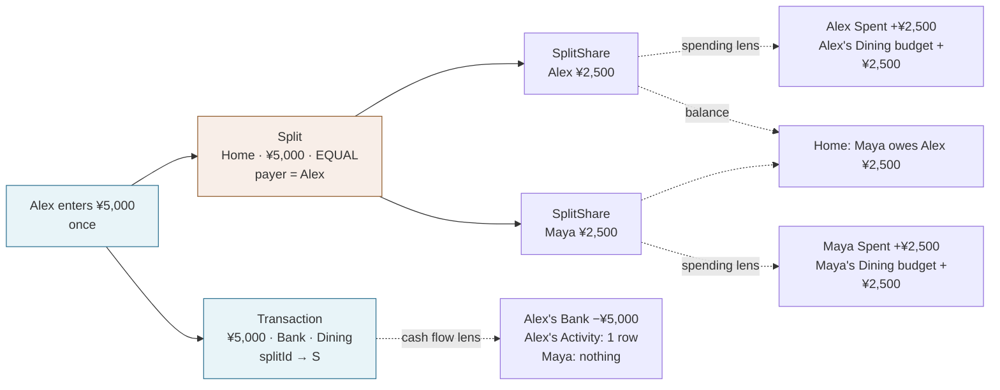
```mermaid
flowchart LR
    E["Alex enters ¥5,000<br/>once"] --> T["Transaction<br/>¥5,000 · Bank · Dining<br/>splitId → S"]
    E --> S["Split<br/>Home · ¥5,000 · EQUAL<br/>payer = Alex"]
    S --> SA["SplitShare<br/>Alex ¥2,500"]
    S --> SB["SplitShare<br/>Maya ¥2,500"]
    T -.->|"cash flow lens"| CF["Alex's Bank −¥5,000<br/>Alex's Activity: 1 row<br/>Maya: nothing"]
    SA -.->|"spending lens"| SP1["Alex Spent +¥2,500<br/>Alex's Dining budget +¥2,500"]
    SB -.->|"spending lens"| SP2["Maya Spent +¥2,500<br/>Maya's Dining budget +¥2,500"]
    SA -.->|"balance"| BAL["Home: Maya owes Alex ¥2,500"]
    SB -.-> BAL
    style E fill:#e8f4f8,stroke:#2a6f8f
    style T fill:#e8f4f8,stroke:#2a6f8f
    style S fill:#f8eee8,stroke:#8f5a2a
```

## 23.4 How each figure is calculated

| Figure | Formula | Includes | Excludes |
|---|---|---|---|
| **Account balance** | `opening + Σ(inflows − outflows)` on posted transactions of that account | Full amounts of shared expenses **you paid** from that account; settlement transactions | Shares of expenses others paid; splits with no linked transaction |
| **Net worth** | `Σ` account balances, converted | — | Archived accounts |
| **Spent this month** (Home hero) | `Σ` personal expenses + `Σ` your SplitShares, in the month | Your share of every shared expense, whoever paid | The portion others owe you; **all settlements**; transfers; income |
| **Out** (ACC-002, TXN-001) | `Σ` outflows in scope | Full amounts; settlement outflows | Nothing |
| **Personal budget progress** | `Σ` personal expenses in that category + `Σ` your SplitShares in that category | Your share only | Others' shares; settlements |
| **Space budget progress** | `Σ` all SplitShares in that space and category | Every member's share | Personal expenses outside the space; settlements |
| **Space expense total** (SPACE-003 strip) | `Σ` Split totals in scope | Full amounts | Settlements |
| **Member balance** | `(Σ paid − Σ owed) − settlementNet`, restricted to the active cycle | Confirmed splits and confirmed settlements | Proposed settlements; voided splits |
| **Space balance scope** | Default **cycle** — everything after the last confirmed settlement, excluding that settlement itself | — | Earlier cycles |

## 23.5 The settlement crossover

> **Maya settles ¥2,500 with Alex, marking it "Paid from: Cash".**

### What is written

| Record | Contents |
|---|---|
| **Settlement** | Home · from Maya → to Alex · ¥2,500 · CONFIRMED · 15 Aug · becomes the **cycle boundary** |
| **Transaction** (Maya) | −¥2,500 · **type = SETTLEMENT** · Cash · **no category** · `settlementId` set |
| **Transaction** (Alex) | +¥2,500 · **type = SETTLEMENT** · *(only when Alex sets "Received into" in SETL-006)* · no category · `settlementId` set |

### What each screen shows afterwards

| Screen | Before | After |
|---|---|---|
| Maya's Cash balance | ¥40,000 | **¥37,500** |
| Maya's **Spent this month** | ¥2,500 | **¥2,500 — unchanged** |
| Maya's Activity | 1 row | **2 rows** — the new one reads `Settled with Alex · Home · −¥2,500` with a handshake glyph, in secondary colour |
| Maya's Dining budget | ¥2,500 | **¥2,500 — unchanged** |
| Alex's Bank (if received into) | ¥345,000 | **¥347,500** |
| Alex's **Spent this month** | ¥2,500 | **¥2,500 — unchanged** |
| SPACE-002 balance | `Maya owes you ¥2,500` | **`Everyone's settled`** |
| SPACE-003 expense row | no pill | **`Settled` pill** |
| SETL-004 | — | A new row, and a cycle divider beneath it |

**The invariant:** *"Spent this month" does not move when a settlement happens, for either party.* Maya's ¥2,500 share was counted as spending when the dinner was recorded. Counting it again at settlement is the classic double-count bug, and the `SETTLEMENT` transaction type is what structurally prevents it.

This is stated to the user at three points: in SETL-001's "Paid from" helper (*"It won't count as spending"*), in SETL-002's impact block, and in TXN-002's settlement footnote (*"Settlements move money between people. They don't count as spending."*).

## 23.6 The four crossover cases

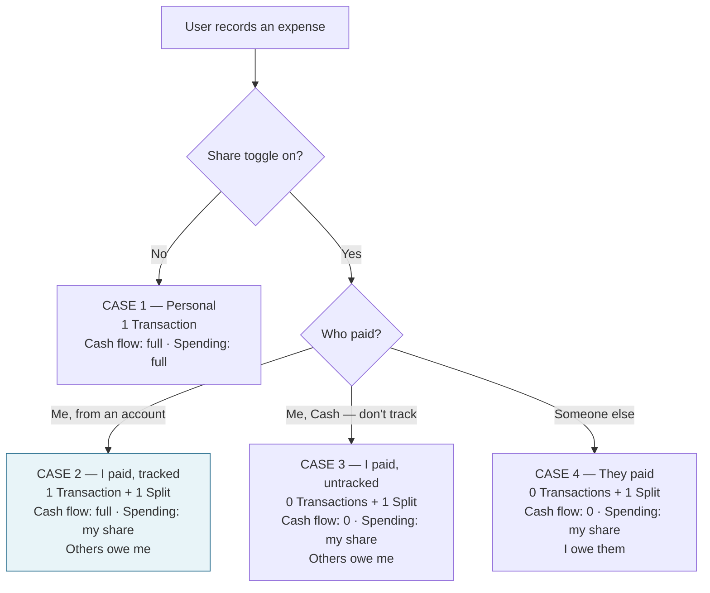
```mermaid
flowchart TD
    E["User records an expense"] --> Q1{"Share toggle on?"}
    Q1 -->|No| C1["CASE 1 — Personal<br/>1 Transaction<br/>Cash flow: full · Spending: full"]
    Q1 -->|Yes| Q2{"Who paid?"}
    Q2 -->|"Me, from an account"| C2["CASE 2 — I paid, tracked<br/>1 Transaction + 1 Split<br/>Cash flow: full · Spending: my share<br/>Others owe me"]
    Q2 -->|"Me, Cash — don't track"| C3["CASE 3 — I paid, untracked<br/>0 Transactions + 1 Split<br/>Cash flow: 0 · Spending: my share<br/>Others owe me"]
    Q2 -->|"Someone else"| C4["CASE 4 — They paid<br/>0 Transactions + 1 Split<br/>Cash flow: 0 · Spending: my share<br/>I owe them"]
    style C2 fill:#e8f4f8,stroke:#2a6f8f
```

**Case 3 matters and must not be dropped.** It lets a user split a cash expense without maintaining a cash account, and it is why PICK-001 carries the **Cash — don't track** option in shared context.

## 23.7 Editing and deleting across the boundary

| Action | UI treatment | Consequence |
|---|---|---|
| Edit the amount of a shared expense you paid | TXN-004, amount editable | Transaction and every SplitShare recompute; other members are notified; SPACE-004 records an edit event |
| Edit only the split | SPLIT-001 from SPACE-010 | Transaction is untouched; only shares and balances move |
| Turn **Share off** on an existing shared expense | TXN-004 toggle → DLG-003 | Split and all shares are deleted; the transaction remains as a personal expense; other members' balances change |
| Change the space of an existing shared expense | **Blocked** — the chip is disabled with a toast | Would silently rewrite two spaces' balances |
| Change the type of an existing transaction | **Blocked** — the segmented control is disabled | Would invalidate category, split and budget attribution |
| Delete a shared expense you paid | DLG-003 with quantified impact | Transaction and Split are soft-deleted; members notified; toast with **Undo** |
| Delete a shared expense **after** settlement | **Blocked** — DLG-016 | Offers **Add a correcting expense**, which opens TXN-003 pre-filled with the space and category |
| Delete a settlement | DLG-011 from SETL-005 | Settlement is cancelled; linked transactions reversed; balances restored; the cycle boundary is removed |
| Remove a member with a non-zero balance | DLG-009, which names the outstanding amount | Historical shares preserved; they cannot create new records; their rows render at 50% opacity thereafter |
| Archive an account with linked shared expenses | DLG-004 | Transactions and splits are untouched; the account simply stops appearing in pickers |

## 23.8 What the user never has to understand

The following exist in the model but are **never surfaced as concepts**:

- The word "split" as a database object — the user sees *"Share this expense"* and *"who owes whom"*
- The `SETTLEMENT` transaction type — it renders as *"Settled with Maya"* with a distinct glyph
- Cycle boundaries as records — they render as *"since you last settled"* and a divider in history
- The linked-transaction relationship — it renders as one row in Activity and one card on TXN-002
- Minor units, rounding remainders beyond the single `+¥1 rounding` disclosure
- Two-lens terminology — the user sees the words **Out**, **In**, **Spent** and **Your share**, never "cash flow" or "spending lens"

The model is capable underneath and plain on the surface. That is the product.

---

# 24. Complete Transition Matrix

**Type key:** `Push` = new screen in the current tab stack · `Pop` = return · `Replace` = the source leaves the stack · `Tab` = switch bottom-bar destination · `Sheet` = L1 bottom sheet · `Sub-sheet` = L2 · `Dialog` = L3 · `Inline` = state change, no navigation · `System` = OS surface

## 24.1 Authentication & onboarding

| From | Action | To | Type | Notes |
|---|---|---|---|---|
| AUTH-001 | Session valid + onboarded | HOME-001 | Replace | Stack cleared |
| AUTH-001 | Session valid + not onboarded | ONB-001 | Replace | — |
| AUTH-001 | No session | AUTH-002 | Replace | Pending deep link retained |
| AUTH-001 | Timeout / failure | AUTH-003 | Replace | — |
| AUTH-002 | Tap Continue | Keycloak | System | Platform auth session |
| AUTH-002 | Auth success (new) | ONB-001 | Replace | — |
| AUTH-002 | Auth success (returning) | HOME-001 | Replace | Or the pending deep link |
| AUTH-002 | Auth failure | AUTH-003 | Replace | — |
| AUTH-002 | Tap Terms / Privacy | Browser | System | In-app browser |
| AUTH-003 | Tap Try again | AUTH-001 | Replace | Re-resolves the session |
| AUTH-003 | Tap Get help | Browser | System | — |
| ONB-001 | Get started | ONB-002 | Push | — |
| ONB-002 | Tap Country | Country picker | Sub-sheet | Auto-sets currency |
| ONB-002 | Tap Currency | PICK-006 | Sub-sheet | — |
| ONB-002 | Continue | ONB-003 | Push | Profile persisted |
| ONB-002 | Back | ONB-001 | Pop | — |
| ONB-003 | Tap Currency | PICK-006 | Sub-sheet | — |
| ONB-003 | Continue | ONB-004 | Push | Account created + set default |
| ONB-003 | Back | ONB-002 | Pop | Values retained |
| ONB-004 | Create a space | *(inline form)* | Inline | Progressive reveal |
| ONB-004 | Tap Currency | PICK-006 | Sub-sheet | — |
| ONB-004 | Create space | ONB-005 | Push | Space created, user = Owner |
| ONB-004 | Not now | ONB-006 | Push | — |
| ONB-004 | Back | ONB-003 | Pop | — |
| ONB-005 | Share link | OS share sheet | System | Returns to ONB-005 |
| ONB-005 | Copy link | — | Inline | Toast |
| ONB-005 | Done | ONB-006 | Push | — |
| ONB-006 | Start using Pokito | HOME-001 | Replace | Entire stack replaced; coach mark fires |
| ONB-006 | Wait 4s | HOME-001 | Replace | — |

## 24.2 Home

| From | Action | To | Type | Notes |
|---|---|---|---|---|
| HOME-001 | Tap avatar | SET-001 | Push | — |
| HOME-001 | Tap bell | NOTIF-001 | Push | Badge clears |
| HOME-001 | Tap month chip | HOME-002 | Sheet | — |
| HOME-001 | Tap net worth | HOME-003 | Sheet | — |
| HOME-001 | Tap ⓘ on Spent | Popover | Inline | Dismiss on tap-away |
| HOME-001 | Tap an account card | ACC-002 | Push | Home stack |
| HOME-001 | Tap ＋ Add account | ACC-003 | Sheet | — |
| HOME-001 | Accounts See all | ACC-001 | Tab | Switches to the Accounts tab |
| HOME-001 | Tap a space row | SPACE-002 | Tab + Push | Switches to Spaces, then pushes |
| HOME-001 | Tap Settle up nudge | SETL-001 | Push | Home stack |
| HOME-001 | Shared See all | SPACE-001 | Tab | — |
| HOME-001 | Tap a budget row | BUD-002 | Push | — |
| HOME-001 | Budgets See all | BUD-001 | Push | — |
| HOME-001 | Tap a subscription row | SUB-002 | Push | — |
| HOME-001 | Tap Pay | SUB-005 | Sheet | Stays on Home |
| HOME-001 | Upcoming See all | SUB-001 | Push | — |
| HOME-001 | Tap a transaction row | TXN-002 | Push | Home stack |
| HOME-001 | Recent See all | TXN-001 | Tab | — |
| HOME-001 | Tap settlement banner Review | SETL-006 | Sheet | — |
| HOME-001 | Tap FAB | TXN-003 | Sheet | Personal defaults |
| HOME-001 | Pull to refresh | — | Inline | — |
| HOME-002 | Select a month | HOME-001 | Pop (sheet) | Data re-fetches |
| HOME-003 | Tap an account row | ACC-002 | Sheet dismiss + Push | Home stack |

## 24.3 Accounts

| From | Action | To | Type | Notes |
|---|---|---|---|---|
| ACC-001 | Tap ＋ | ACC-003 | Sheet | — |
| ACC-001 | Tap ⋮ → Reorder | ACC-005 | Inline | Mode change |
| ACC-001 | Tap an account row | ACC-002 | Push | — |
| ACC-001 | Long-press a row | ACC-005 | Inline | Row lifted |
| ACC-001 | Swipe → Edit | ACC-004 | Sheet | — |
| ACC-001 | Swipe → Archive | DLG-004 | Dialog | Then toast + Undo |
| ACC-001 | Tap Archived (N) | ACC-006 | Push | — |
| ACC-001 | Tap FAB | TXN-003 | Sheet | — |
| ACC-002 | Tap ⋮ → Edit | ACC-004 | Sheet | — |
| ACC-002 | Tap ⋮ → Archive | DLG-004 | Dialog | Confirm → Pop to ACC-001 |
| ACC-002 | Tap ⋮ → Delete | DLG-005 | Dialog | Confirm → Pop to ACC-001 |
| ACC-002 | Tap a transaction row | TXN-002 | Push | — |
| ACC-002 | Swipe → Edit | TXN-004 | Sheet | — |
| ACC-002 | Swipe → Delete | DLG-002 / DLG-003 | Dialog | — |
| ACC-002 | Tap filter | TXN-005 | Sheet | Account pre-scoped |
| ACC-002 | Tap View all transactions | TXN-001 | Tab | Account filter applied |
| ACC-002 | Tap FAB | TXN-003 | Sheet | This account preselected |
| ACC-003 | Tap Currency | PICK-006 | Sub-sheet | — |
| ACC-003 | Tap Appearance | PICK-007 | Sub-sheet | — |
| ACC-003 | Save | ACC-001 | Sheet dismiss | Toast |
| ACC-003 | Save (opened from PICK-001) | Parent form | Sheet dismiss ×2 | New account auto-selected |
| ACC-003 | Close (dirty) | DLG-001 | Dialog | — |
| ACC-004 | Save | ACC-002 | Sheet dismiss | Header re-renders |
| ACC-004 | Archive | DLG-004 | Dialog | Confirm → dismiss + Pop |
| ACC-004 | Delete | DLG-005 | Dialog | Confirm → dismiss + Pop |
| ACC-005 | Done / system back | ACC-001 | Inline | Order saved |
| ACC-006 | Tap a row | ACC-002 | Push | Archived variant |
| ACC-006 | Swipe → Restore | — | Inline | Toast; auto-pop when the list empties |

## 24.4 Activity & transactions

| From | Action | To | Type | Notes |
|---|---|---|---|---|
| TXN-001 | Tap search | TXN-006 | Inline | Header transforms |
| TXN-001 | Tap filter | TXN-005 | Sheet | — |
| TXN-001 | Tap a chip ✕ | — | Inline | Re-queries |
| TXN-001 | Tap Clear all | — | Inline | Re-queries |
| TXN-001 | Tap a transaction row | TXN-002 | Push | — |
| TXN-001 | Tap a settlement row | SETL-005 | Sheet | Not TXN-002 |
| TXN-001 | Swipe → Edit | TXN-004 | Sheet | — |
| TXN-001 | Swipe → Delete | DLG-002 / DLG-003 | Dialog | — |
| TXN-001 | Tap FAB | TXN-003 | Sheet | Space preselected when a space filter is active |
| TXN-006 | Tap a result | TXN-002 | Push | — |
| TXN-006 | Tap back | TXN-001 | Inline | Scroll position restored |
| TXN-002 | Tap Edit | TXN-004 | Sheet | DLG-016 when settled |
| TXN-002 | Tap ⋮ → Duplicate | TXN-003 | Sheet | Pre-filled, date = today |
| TXN-002 | Tap ⋮ → Delete | DLG-002 / DLG-003 | Dialog | Confirm → Pop |
| TXN-002 | Tap Account row | ACC-002 | Push | Current tab's stack |
| TXN-002 | Tap Category row | TXN-001 | Tab | Category filter applied |
| TXN-002 | Tap Subscription row | SUB-002 | Push | — |
| TXN-002 | Tap space name | SPACE-002 | Tab + Push | — |
| TXN-002 | Tap View in space | SPACE-010 | Push | — |
| TXN-003 | Tap Account | PICK-001 | Sub-sheet | — |
| TXN-003 | Tap Category / More chip | PICK-002 | Sub-sheet | — |
| TXN-003 | Tap Date | PICK-003 | Sub-sheet | — |
| TXN-003 | Tap More spaces | PICK-004 | Sub-sheet | Only when >4 spaces |
| TXN-003 | Tap Paid by | PICK-005 | Sub-sheet | — |
| TXN-003 | Tap split summary | SPLIT-001 | Sub-sheet | — |
| TXN-003 | Tap Create space link | SPACE-005 | Sheet | Replaces TXN-003 |
| TXN-003 | Save | Caller | Sheet dismiss | Toast; caller refreshes |
| TXN-003 | Close (dirty) | DLG-001 | Dialog | — |
| TXN-004 | Save | TXN-002 | Sheet dismiss | Detail re-renders |
| TXN-004 | Delete | DLG-002 / DLG-003 | Dialog | — |
| TXN-004 | Turn Share off | DLG-003 | Dialog | Split deleted on confirm |
| TXN-005 | Tap a date row | PICK-003 | Sub-sheet | Range mode |
| TXN-005 | Apply | TXN-001 | Sheet dismiss | Chips render |
| TXN-005 | Clear all | — | Inline | Sheet stays open |

## 24.5 Spaces

| From | Action | To | Type | Notes |
|---|---|---|---|---|
| SPACE-001 | Tap ＋ | SPACE-005 | Sheet | — |
| SPACE-001 | Tap a space card | SPACE-002 | Push | — |
| SPACE-001 | Tap an avatar stack | SPACE-007 | Push | — |
| SPACE-001 | Tap invite banner | SPACE-009 | Push | — |
| SPACE-001 | Tap Invite (solo card) | SPACE-008 | Sheet | — |
| SPACE-001 | Tap settlement strip | SETL-006 | Sheet | — |
| SPACE-001 | Tap Archived (N) | SPACE-013 | Push | — |
| SPACE-001 | Tap FAB | TXN-003 | Sheet | Share on, MRU space |
| SPACE-002 | Tap avatar stack | SPACE-007 | Push | — |
| SPACE-002 | ⋮ → Members | SPACE-007 | Push | — |
| SPACE-002 | ⋮ → Space settings | SPACE-006 | Push | — |
| SPACE-002 | ⋮ → Settlement history | SETL-004 | Push | — |
| SPACE-002 | ⋮ → Leave space | DLG-008 | Dialog | Confirm → Pop to SPACE-001 |
| SPACE-002 | Tap scope chip | — | Inline | Balance card re-queries |
| SPACE-002 | Tap balance amount | SPACE-012 | Sheet | Only when 3+ members |
| SPACE-002 | Tap Settle up | SETL-001 | Push | Bottom bar hidden |
| SPACE-002 | Tap budget card | BUD-002 | Push | — |
| SPACE-002 | Tap ＋ Add a budget | BUD-003 | Sheet | Space pre-scoped and locked |
| SPACE-002 | Tap Invite someone | SPACE-008 | Sheet | Solo variant |
| SPACE-002 | Tap settlement banner Review | SETL-006 | Sheet | — |
| SPACE-002 | Tap a tab | SPACE-003 / SPACE-004 | Inline | — |
| SPACE-002 | Tap FAB | TXN-003 | Sheet | Share on, this space |
| SPACE-003 | Tap a status chip | — | Inline | Re-queries |
| SPACE-003 | Tap filter | SPACE-014 | Sheet | — |
| SPACE-003 | Tap an expense row | SPACE-010 | Push | — |
| SPACE-003 | Swipe → Edit | TXN-004 / SPLIT-001 | Sheet / Sub-sheet | TXN-004 when a linked transaction exists |
| SPACE-003 | Swipe → Delete | DLG-003 | Dialog | — |
| SPACE-004 | Tap an expense event | SPACE-010 | Push | — |
| SPACE-004 | Tap a settlement event | SETL-005 | Sheet | — |
| SPACE-004 | Tap a member event | SPACE-007 | Push | — |
| SPACE-004 | Tap a budget event | BUD-002 | Push | — |
| SPACE-005 | Tap Currency | PICK-006 | Sub-sheet | — |
| SPACE-005 | Tap Appearance | PICK-007 | Sub-sheet | — |
| SPACE-005 | Create | *(step 2)* | Inline | Space created |
| SPACE-005 | Share link | OS share sheet | System | — |
| SPACE-005 | Done / Skip | SPACE-002 | Sheet dismiss + Push | SPACE-005 leaves the stack |
| SPACE-006 | Tap Default split | SPACE-011 | Sub-sheet | — |
| SPACE-006 | Tap Members | SPACE-007 | Push | — |
| SPACE-006 | Tap Appearance | PICK-007 | Sub-sheet | — |
| SPACE-006 | Tap Archive | DLG-006 | Dialog | Confirm → Pop to SPACE-001 |
| SPACE-006 | Tap Delete | DLG-007 | Dialog | Type-to-confirm when balances exist |
| SPACE-006 | Tap Leave | DLG-008 | Dialog | — |
| SPACE-006 | Tap the Settings link | SET-004 | Push | — |
| SPACE-007 | Tap ＋ / Invite | SPACE-008 | Sheet | — |
| SPACE-007 | Tap a member row | Member sheet | Sheet | — |
| SPACE-007 | Swipe → Remove | DLG-009 | Dialog | Owner only |
| SPACE-007 | Tap Revoke | DLG-010 | Dialog | — |
| SPACE-007 | Tap Leave space | DLG-008 | Dialog | — |
| SPACE-008 | Share link | OS share sheet | System | — |
| SPACE-008 | Copy link | — | Inline | Toast |
| SPACE-008 | Done | Caller | Sheet dismiss | — |
| SPACE-009 | Join space | SPACE-002 | Replace | SPACE-009 leaves the stack |
| SPACE-009 | Decline | SPACE-001 | Pop | Toast |
| SPACE-009 | Close | SPACE-001 / HOME-001 | Pop | Invite stays pending |
| SPACE-010 | Tap Edit | TXN-004 / SPLIT-001 | Sheet / Sub-sheet | DLG-016 when settled |
| SPACE-010 | Tap Edit split | SPLIT-001 | Sub-sheet | — |
| SPACE-010 | ⋮ → Delete | DLG-003 | Dialog | Confirm → Pop |
| SPACE-010 | Tap View my transaction | TXN-002 | Push | — |
| SPACE-010 | Tap the space row | SPACE-002 | Pop | Pops to it |
| SPACE-010 | Tap a participant row | Member sheet | Sheet | — |
| SPACE-011 | Save | SPACE-006 | Sub-sheet dismiss | Row updates |
| SPACE-012 | Tap Settle up | SETL-001 | Sheet dismiss + Push | — |
| SPACE-012 | Tap a member row | Member sheet | Sheet | — |
| SPACE-013 | Tap a card | SPACE-002 | Push | Archived variant |
| SPACE-013 | ⋮ → Restore | — | Inline | Toast; auto-pop when empty |
| SPACE-014 | Apply | SPACE-003 | Sheet dismiss | Chips render |

## 24.6 Split & settlement

| From | Action | To | Type | Notes |
|---|---|---|---|---|
| SPLIT-001 | Tap a method segment | — | Inline | Recomputes |
| SPLIT-001 | Toggle a member | — | Inline | Redistributes |
| SPLIT-001 | Split the rest / Reset | — | Inline | — |
| SPLIT-001 | Reset to space default | — | Inline | Method switches to match |
| SPLIT-001 | Just mine | — | Inline | Method → Exact |
| SPLIT-001 | Done | Caller | Sub-sheet dismiss | Summary row updates |
| SPLIT-001 | Cancel | Caller | Sub-sheet dismiss | No change |
| SETL-001 | Tap a recommendation | — | Inline | Form re-fills |
| SETL-001 | Tap From / To | PICK-005 | Sub-sheet | — |
| SETL-001 | Tap ⇅ swap | — | Inline | — |
| SETL-001 | Tap Paid from | PICK-001 | Sub-sheet | Space currency only |
| SETL-001 | I paid this / They paid me | SETL-002 | Sheet | Confirm mode |
| SETL-001 | Ask them to confirm | SETL-002 | Sheet | Request mode |
| SETL-001 | Mark everything settled | DLG-017 | Dialog | — |
| SETL-001 | ⋮ → Settlement history | SETL-004 | Push | — |
| SETL-002 | Confirm payment / Send request | SETL-003 | Replace | SETL-001/002 leave the stack |
| SETL-002 | Back | SETL-001 | Sheet dismiss | No write |
| SETL-003 | Done / system back / 6s | SPACE-002 | Replace | Balances refreshed |
| SETL-003 | View history | SETL-004 | Push | — |
| SETL-004 | Tap a row | SETL-005 | Sheet | — |
| SETL-004 | Tap New settlement | SETL-001 | Push | — |
| SETL-005 | Tap the account row | ACC-002 | Sheet dismiss + Push | — |
| SETL-005 | Cancel settlement | DLG-011 | Dialog | Balances revert |
| SETL-005 | Tap a member row | Member sheet | Sheet | — |
| SETL-006 | Tap Received into | PICK-001 | Sub-sheet | Space currency only |
| SETL-006 | Yes, I got it | SETL-003 | Replace | Confirmed variant |
| SETL-006 | I didn't receive this | Caller | Sheet dismiss | Settlement cancelled; toast |
| SETL-006 | Close | Caller | Sheet dismiss | Left pending |

## 24.7 Budgets, subscriptions, categories

| From | Action | To | Type | Notes |
|---|---|---|---|---|
| BUD-001 | Tap ＋ | BUD-003 | Sheet | — |
| BUD-001 | Tap a scope chip | — | Inline | Re-filters |
| BUD-001 | Tap a card | BUD-002 | Push | — |
| BUD-001 | Swipe → Edit | BUD-004 | Sheet | — |
| BUD-001 | Swipe → Delete | DLG-012 | Dialog | — |
| BUD-002 | Tap Edit | BUD-004 | Sheet | — |
| BUD-002 | ⋮ → Delete | DLG-012 | Dialog | Confirm → Pop |
| BUD-002 | Tap the period chip | Period sheet | Sheet | Month list |
| BUD-002 | Tap the scope pill | SPACE-002 | Tab + Push | Space budgets only |
| BUD-002 | Tap a transaction row | TXN-002 | Push | — |
| BUD-002 | Tap View all | TXN-001 | Tab | Category + period filters |
| BUD-003 | Tap a Scope chip | — | Inline | Currency updates |
| BUD-003 | Tap Category | PICK-002 | Sub-sheet | Expense only |
| BUD-003 | Tap Starts | PICK-003 | Sub-sheet | Month mode |
| BUD-003 | Save | BUD-001 / SPACE-002 | Sheet dismiss | Depends on the entry point |
| BUD-004 | Save | BUD-002 | Sheet dismiss | — |
| BUD-004 | Delete | DLG-012 | Dialog | Confirm → dismiss + Pop |
| SUB-001 | Tap ＋ | SUB-003 | Sheet | — |
| SUB-001 | Tap a row | SUB-002 | Push | — |
| SUB-001 | Tap Pay | SUB-005 | Sheet | Stays on SUB-001 |
| SUB-001 | Tap Skip | DLG-018 | Dialog | Toast + Undo |
| SUB-001 | Swipe → Edit | SUB-004 | Sheet | — |
| SUB-001 | Swipe → Pause / Resume | — | Inline | Toast |
| SUB-001 | Tap sort | Sort menu | Inline | Session-persisted |
| SUB-002 | Tap Edit | SUB-004 | Sheet | — |
| SUB-002 | Tap Pay now | SUB-005 | Sheet | — |
| SUB-002 | Tap Skip this one | DLG-018 | Dialog | — |
| SUB-002 | ⋮ → Pause / Resume | — | Inline | Toast |
| SUB-002 | ⋮ → Delete | DLG-013 | Dialog | Confirm → Pop |
| SUB-002 | Tap a payment row | TXN-002 | Push | — |
| SUB-002 | Tap the account row | ACC-002 | Push | — |
| SUB-002 | Tap the category row | TXN-001 | Tab | Filtered |
| SUB-002 | Tap View all | TXN-001 | Tab | Subscription filter |
| SUB-003 | Tap Repeats | SUB-006 | Sub-sheet | — |
| SUB-003 | Tap Starts / Ends | PICK-003 | Sub-sheet | — |
| SUB-003 | Tap Pay from | PICK-001 | Sub-sheet | Sets Currency |
| SUB-003 | Tap Category | PICK-002 | Sub-sheet | Expense only |
| SUB-003 | Tap the icon swatch | PICK-007 | Sub-sheet | — |
| SUB-003 | Save | SUB-001 | Sheet dismiss | Toast |
| SUB-004 | Save | SUB-002 | Sheet dismiss | — |
| SUB-004 | Delete | DLG-013 | Dialog | — |
| SUB-005 | Tap Pay from | PICK-001 | Sub-sheet | — |
| SUB-005 | Tap Date | PICK-003 | Sub-sheet | — |
| SUB-005 | Confirm payment | Caller | Sheet dismiss | Toast with **View** → TXN-002 |
| SUB-006 | Done | Caller | Sub-sheet dismiss | Preview updates |
| CAT-001 | Tap ＋ | CAT-002 | Sheet | Type from the active tab |
| CAT-001 | Tap a row | CAT-002 | Sheet | Edit mode |
| CAT-001 | Tap a tab | — | Inline | — |
| CAT-001 | Swipe → Delete (unused) | — | Inline | Toast + Undo |
| CAT-001 | Swipe → Delete (used) | DLG-014 | Dialog | → CAT-003 |
| CAT-001 | Swipe → Hide / Show | — | Inline | System categories |
| CAT-002 | Tap the swatch | PICK-007 | Sub-sheet | — |
| CAT-002 | Save | CAT-001 / parent form | Sheet dismiss | Auto-selected when opened from PICK-002 |
| CAT-002 | Delete | DLG-014 or direct | Dialog / Inline | — |
| CAT-003 | Move and delete | CAT-001 | Sheet dismiss | Toast; no Undo |

## 24.8 Settings & notifications

| From | Action | To | Type | Notes |
|---|---|---|---|---|
| SET-001 | Tap the profile row | SET-002 | Sheet | — |
| SET-001 | Tap Default currency | SET-003 | Sub-sheet | — |
| SET-001 | Tap Categories | CAT-001 | Push | — |
| SET-001 | Tap Budgets | BUD-001 | Push | — |
| SET-001 | Tap Subscriptions | SUB-001 | Push | — |
| SET-001 | Tap Notifications | SET-004 | Push | — |
| SET-001 | Tap Appearance | SET-005 | Sheet | — |
| SET-001 | Tap Language | SET-006 | Sheet | — |
| SET-001 | Tap About | SET-007 | Push | — |
| SET-001 | Tap Help & support | Browser | System | — |
| SET-001 | Tap Sign out | DLG-015 | Dialog | Confirm → AUTH-002, stacks cleared |
| SET-002 | Tap the avatar badge | OS action sheet | System | Photo permission |
| SET-002 | Save | SET-001 | Sheet dismiss | Avatars refresh app-wide |
| SET-003 | Select a currency | SET-001 | Sub-sheet dismiss | Aggregates re-render |
| SET-004 | Toggle any switch | — | Inline | Saves immediately |
| SET-004 | Tap a space row | SPACE-006 | Push | Anchored to Notifications |
| SET-004 | Tap Open settings | OS settings | System | — |
| SET-005 / SET-006 | Select an option | — | Inline | Applies immediately |
| SET-007 | Tap any legal row | Browser | System | — |
| NOTIF-001 | Tap an expense row | SPACE-010 | Push | Marks read |
| NOTIF-001 | Tap a settlement request | SETL-006 | Sheet | — |
| NOTIF-001 | Tap a settlement confirmation | SETL-005 | Sheet | — |
| NOTIF-001 | Tap an invite | SPACE-009 | Push | — |
| NOTIF-001 | Tap a budget alert | BUD-002 | Push | — |
| NOTIF-001 | Tap Mark all read | — | Inline | Home badge clears |
| NOTIF-001 | Swipe a row | — | Inline | Toast + Undo |
| NOTIF-002 | Turn on notifications | OS permission dialog | System | Dismisses either way |
| NOTIF-002 | Not now | Caller | Sheet dismiss | No OS prompt |

## 24.8a AI & Integrations

| From | Action | To | Type | Notes |
|---|---|---|---|---|
| SET-001 | Tap AI & Integrations | AI-001 | Push | — |
| HOME-001 | Tap approval banner Review | AI-007 | Push | Takes precedence over the settlement banner |
| AI-001 | Tap a connection row | AI-004 | Push | — |
| AI-001 | Swipe → Disconnect | DLG-019 | Dialog | Row animates out + toast |
| AI-001 | Tap Connect an app | AI-002 | Push | — |
| AI-001 | Tap AI activity | AI-006 | Push | — |
| AI-001 | Tap approvals banner Review | AI-007 | Push | — |
| AI-001 | ⋮ → Disconnect all apps | DLG-020 | Dialog | List empties |
| AI-001 | Tap Learn more | Browser | System | — |
| AI-002 | Tap Copy address | — | Inline | Toast |
| AI-002 | Tap a known-app row | External app / store / docs | System | — |
| AI-003 | Toggle a permission group | — | Inline | May reveal limits or auto-enable a dependency |
| AI-003 | Tap a limit field | Keypad / multi-select sheet | Inline / Sub-sheet | — |
| AI-003 | Tap **Connect** | AI-001 | Replace | Connection created; redirect to the client; new row highlighted |
| AI-003 | Tap **Don't connect** | Auth session closes | System | Redirect with `access_denied` |
| AI-003 | Dismiss mid-review | DLG-021 | Dialog | — |
| AI-004 | Tap Change | AI-005 | Push | — |
| AI-004 | Tap an activity row | TXN-002 / SPACE-010 / SETL-005 | Push | — |
| AI-004 | Tap See all | AI-006 | Push | Filtered to this client |
| AI-004 | Tap Resume | — | Inline | Suspended connections only; toast |
| AI-004 | Tap Disconnect | DLG-019 | Dialog | Confirm → Pop to AI-001 |
| AI-005 | Toggle a group / edit a limit | — | Inline | Save enables |
| AI-005 | Tap a space/account row | Multi-select sheet | Sub-sheet | — |
| AI-005 | Tap Save | AI-004 | Pop | Applies immediately; toast |
| AI-005 | Back with edits | DLG-001 | Dialog | — |
| AI-006 | Tap a client chip | — | Inline | Re-queries |
| AI-006 | Tap a row | TXN-002 / SPACE-010 / SETL-005 / BUD-002 | Push | — |
| AI-006 | Tap a client logo or name | AI-004 | Push | — |
| AI-007 | Tap Approve | — | Inline | Executes via the same domain path as the equivalent app screen; card resolves; screen pops when empty |
| AI-007 | Tap Reject | DLG-022 | Dialog | Card resolves; client informed on its next call |
| AI-007 | Tap a record link | TXN-002 / SPACE-010 | Push | Inspect before deciding |
| NOTIF-001 | Tap an AI approval notification | AI-007 | Push | Inline Review / Reject also available |
| NOTIF-001 | Tap an AI change notification | TXN-002 / SPACE-010 | Push | — |
| SET-004 | Tap Manage connected apps | AI-001 | Push | — |
| TXN-002 / SPACE-010 / SETL-005 | Tap the source client name | AI-004 | Push | Source attribution line |

## 24.9 Deep links

| From | Action | To | Type | Notes |
|---|---|---|---|---|
| External | `pokito://invite/{token}` | SPACE-009 | Push | Synthetic stack: SPACE-001 → SPACE-009 |
| External | `pokito://space/{id}` | SPACE-002 | Push | SPACE-001 → SPACE-002 |
| External | `pokito://space/{id}/expense/{id}` | SPACE-010 | Push | SPACE-001 → SPACE-002 → SPACE-010 |
| External | `pokito://space/{id}/settle` | SETL-001 | Push | SPACE-001 → SPACE-002 → SETL-001 |
| External | `pokito://settlement/{id}/confirm` | SETL-006 | Sheet | Over SPACE-002 |
| External | `pokito://transaction/{id}` | TXN-002 | Push | TXN-001 → TXN-002 |
| External | `pokito://budget/{id}` | BUD-002 | Push | HOME-001 → BUD-001 → BUD-002 |
| External | `pokito://add` | TXN-003 | Sheet | Over HOME-001 |
| External | `pokito://authorize?request_id=…` | AI-003 | Replace | Full screen, no back; sign-in first if needed |
| External | `pokito://approvals` | AI-007 | Push | HOME-001 → AI-007 |
| External | `pokito://ai` | AI-001 | Push | HOME-001 → SET-001 → AI-001 |
| Any deep link | Target missing / no permission | Nearest valid parent | Push | Toast naming the reason |
| Any deep link | Not signed in | AUTH-002 | Replace | Target retained and applied after sign-in |

---

# 25. Flow Diagrams

Every diagram below matches the screen specifications and the transition matrix.

## 25.1 App navigation


```mermaid
flowchart TD
    subgraph BAR["Bottom bar"]
        H["HOME-001<br/>Home"]
        A["ACC-001<br/>Accounts"]
        F(("TXN-003<br/>Add"))
        S["SPACE-001<br/>Spaces"]
        T["TXN-001<br/>Activity"]
    end

    H --> H2["HOME-002 Month"]
    H --> H3["HOME-003 Net worth"]
    H --> SET1["SET-001 Settings"]
    H --> N1["NOTIF-001"]
    H --> B1["BUD-001 Budgets"]
    H --> SU1["SUB-001 Subscriptions"]

    A --> A2["ACC-002 Account"]
    A --> A3["ACC-003 Add account"]
    A --> A6["ACC-006 Archived"]
    A2 --> A4["ACC-004 Edit"]

    S --> S2["SPACE-002 Space"]
    S --> S5["SPACE-005 Create"]
    S --> S9["SPACE-009 Invite review"]
    S2 --> S6["SPACE-006 Settings"]
    S2 --> S7["SPACE-007 Members"]
    S2 --> S10["SPACE-010 Shared expense"]
    S2 --> SE1["SETL-001 Settle up"]
    SE1 --> SE4["SETL-004 History"]

    T --> T2["TXN-002 Transaction"]
    T --> T5["TXN-005 Filters"]
    T2 --> T4["TXN-004 Edit"]

    B1 --> B2["BUD-002 Budget"]
    SU1 --> SU2["SUB-002 Subscription"]
    SET1 --> C1["CAT-001 Categories"]
    SET1 --> SET4["SET-004 Notifications"]

    F -.-> SP["SPLIT-001 Split editor"]
    F -.-> PK["PICK-001…007"]

    style F fill:#2a6f8f,color:#fff
    style BAR fill:#eef4f7,stroke:#2a6f8f
```

## 25.2 Onboarding

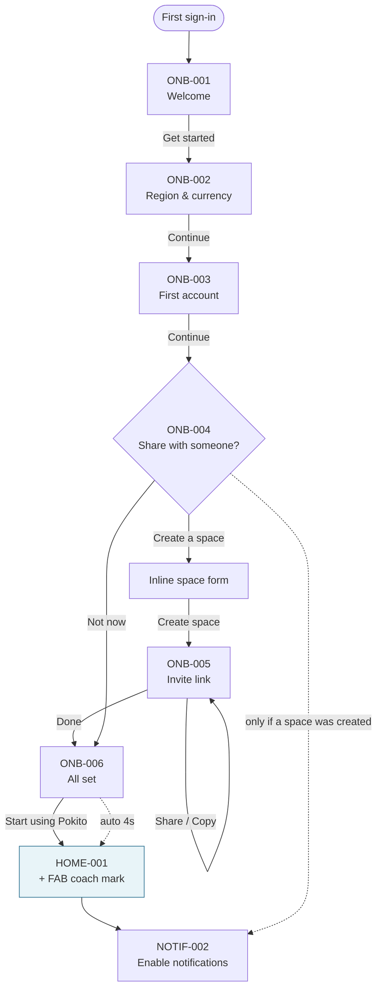
```mermaid
flowchart TD
    START(["First sign-in"]) --> O1["ONB-001<br/>Welcome"]
    O1 -->|Get started| O2["ONB-002<br/>Region & currency"]
    O2 -->|Continue| O3["ONB-003<br/>First account"]
    O3 -->|Continue| O4{"ONB-004<br/>Share with someone?"}
    O4 -->|Create a space| O4F["Inline space form"]
    O4F -->|Create space| O5["ONB-005<br/>Invite link"]
    O5 -->|Share / Copy| O5
    O5 -->|Done| O6["ONB-006<br/>All set"]
    O4 -->|Not now| O6
    O6 -->|Start using Pokito| HOME["HOME-001<br/>+ FAB coach mark"]
    O6 -.->|"auto 4s"| HOME
    HOME --> NP["NOTIF-002<br/>Enable notifications"]
    O4 -.->|"only if a space was created"| NP

    style HOME fill:#e8f4f8,stroke:#2a6f8f
```

## 25.3 Add a personal transaction

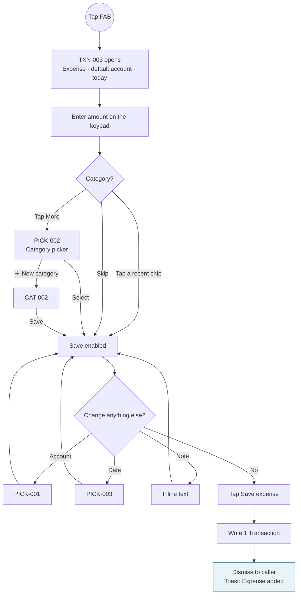
```mermaid
flowchart TD
    FAB(("Tap FAB")) --> S["TXN-003 opens<br/>Expense · default account · today"]
    S --> AMT["Enter amount on the keypad"]
    AMT --> CAT{"Category?"}
    CAT -->|"Tap a recent chip"| READY
    CAT -->|"Tap More"| P2["PICK-002<br/>Category picker"]
    CAT -->|Skip| READY
    P2 -->|Select| READY["Save enabled"]
    P2 -->|"＋ New category"| C2["CAT-002"] -->|Save| READY
    READY --> OPT{"Change anything else?"}
    OPT -->|Account| P1["PICK-001"] --> READY
    OPT -->|Date| P3["PICK-003"] --> READY
    OPT -->|Note| NOTE["Inline text"] --> READY
    OPT -->|No| SAVE["Tap Save expense"]
    SAVE --> W["Write 1 Transaction"]
    W --> DONE["Dismiss to caller<br/>Toast: Expense added"]

    style DONE fill:#e8f4f8,stroke:#2a6f8f
```

## 25.4 Transfer money between accounts

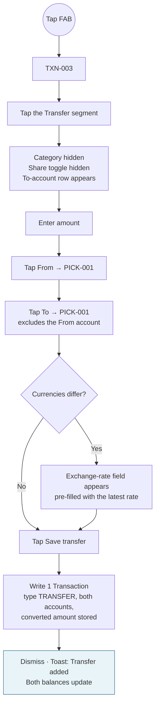
```mermaid
flowchart TD
    FAB(("Tap FAB")) --> S["TXN-003"]
    S --> TT["Tap the Transfer segment"]
    TT --> RESET["Category hidden<br/>Share toggle hidden<br/>To-account row appears"]
    RESET --> AMT["Enter amount"]
    AMT --> FROM["Tap From → PICK-001"]
    FROM --> TO["Tap To → PICK-001<br/>excludes the From account"]
    TO --> FX{"Currencies differ?"}
    FX -->|Yes| RATE["Exchange-rate field appears<br/>pre-filled with the latest rate"]
    FX -->|No| SAVE
    RATE --> SAVE["Tap Save transfer"]
    SAVE --> W["Write 1 Transaction<br/>type TRANSFER, both accounts,<br/>converted amount stored"]
    W --> DONE["Dismiss · Toast: Transfer added<br/>Both balances update"]

    style DONE fill:#e8f4f8,stroke:#2a6f8f
```

## 25.5 Subscription management

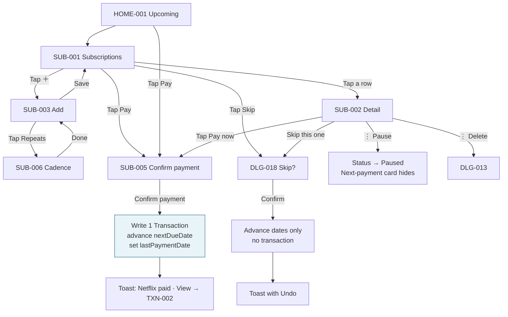
```mermaid
flowchart TD
    H["HOME-001 Upcoming"] --> S1["SUB-001 Subscriptions"]
    S1 -->|"Tap ＋"| S3["SUB-003 Add"]
    S3 -->|"Tap Repeats"| S6["SUB-006 Cadence"]
    S6 -->|Done| S3
    S3 -->|Save| S1

    S1 -->|"Tap a row"| S2["SUB-002 Detail"]
    S1 -->|"Tap Pay"| S5["SUB-005 Confirm payment"]
    H -->|"Tap Pay"| S5
    S2 -->|"Tap Pay now"| S5
    S5 -->|"Confirm payment"| WR["Write 1 Transaction<br/>advance nextDueDate<br/>set lastPaymentDate"]
    WR --> TOAST["Toast: Netflix paid · View → TXN-002"]

    S1 -->|"Tap Skip"| D18["DLG-018 Skip?"]
    S2 -->|"Skip this one"| D18
    D18 -->|Confirm| SKIP["Advance dates only<br/>no transaction"]
    SKIP --> TOAST2["Toast with Undo"]

    S2 -->|"⋮ Pause"| PAUSE["Status → Paused<br/>Next-payment card hides"]
    S2 -->|"⋮ Delete"| D13["DLG-013"]

    style WR fill:#e8f4f8,stroke:#2a6f8f
```

## 25.6 Create a space and invite a member

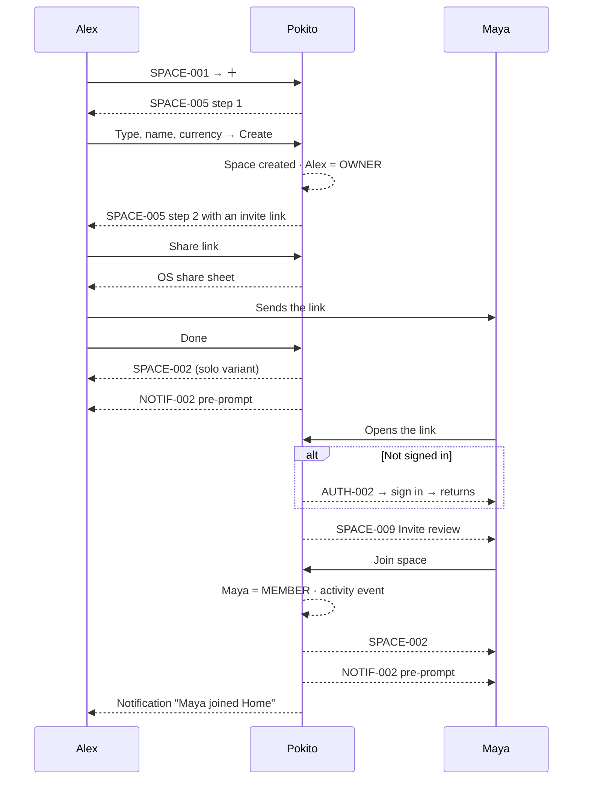
```mermaid
sequenceDiagram
    participant A as Alex
    participant P as Pokito
    participant M as Maya
    A->>P: SPACE-001 → ＋
    P-->>A: SPACE-005 step 1
    A->>P: Type, name, currency → Create
    P-->>P: Space created · Alex = OWNER
    P-->>A: SPACE-005 step 2 with an invite link
    A->>P: Share link
    P-->>A: OS share sheet
    A->>M: Sends the link
    A->>P: Done
    P-->>A: SPACE-002 (solo variant)
    P-->>A: NOTIF-002 pre-prompt
    M->>P: Opens the link
    alt Not signed in
        P-->>M: AUTH-002 → sign in → returns
    end
    P-->>M: SPACE-009 Invite review
    M->>P: Join space
    P-->>P: Maya = MEMBER · activity event
    P-->>M: SPACE-002
    P-->>M: NOTIF-002 pre-prompt
    P-->>A: Notification "Maya joined Home"
```

## 25.7 Add a shared expense — the core flow

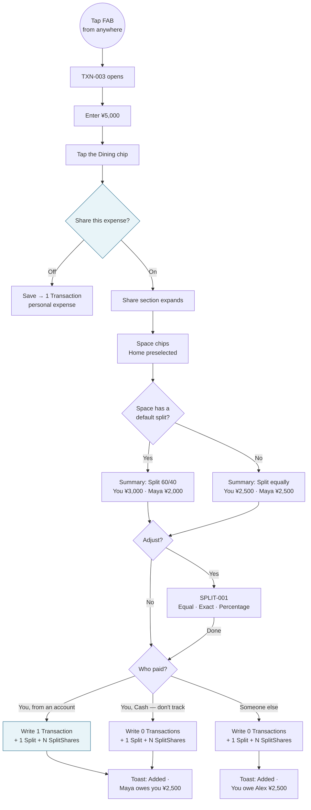
```mermaid
flowchart TD
    FAB(("Tap FAB<br/>from anywhere")) --> S["TXN-003 opens"]
    S --> AMT["Enter ¥5,000"]
    AMT --> CAT["Tap the Dining chip"]
    CAT --> TOG{"Share this expense?"}
    TOG -->|Off| PERS["Save → 1 Transaction<br/>personal expense"]
    TOG -->|On| REVEAL["Share section expands"]
    REVEAL --> SPC["Space chips<br/>Home preselected"]
    SPC --> DEF{"Space has a<br/>default split?"}
    DEF -->|Yes| SUM1["Summary: Split 60/40<br/>You ¥3,000 · Maya ¥2,000"]
    DEF -->|No| SUM2["Summary: Split equally<br/>You ¥2,500 · Maya ¥2,500"]
    SUM1 --> ADJ
    SUM2 --> ADJ{"Adjust?"}
    ADJ -->|No| PAY
    ADJ -->|Yes| SP["SPLIT-001<br/>Equal · Exact · Percentage"]
    SP -->|Done| PAY{"Who paid?"}
    PAY -->|"You, from an account"| W2["Write 1 Transaction<br/>+ 1 Split + N SplitShares"]
    PAY -->|"You, Cash — don't track"| W3["Write 0 Transactions<br/>+ 1 Split + N SplitShares"]
    PAY -->|"Someone else"| W4["Write 0 Transactions<br/>+ 1 Split + N SplitShares"]
    W2 --> T["Toast: Added ·<br/>Maya owes you ¥2,500"]
    W3 --> T
    W4 --> T2["Toast: Added ·<br/>You owe Alex ¥2,500"]

    style TOG fill:#e8f4f8,stroke:#2a6f8f
    style W2 fill:#e8f4f8,stroke:#2a6f8f
```

## 25.8 Configure an expense split

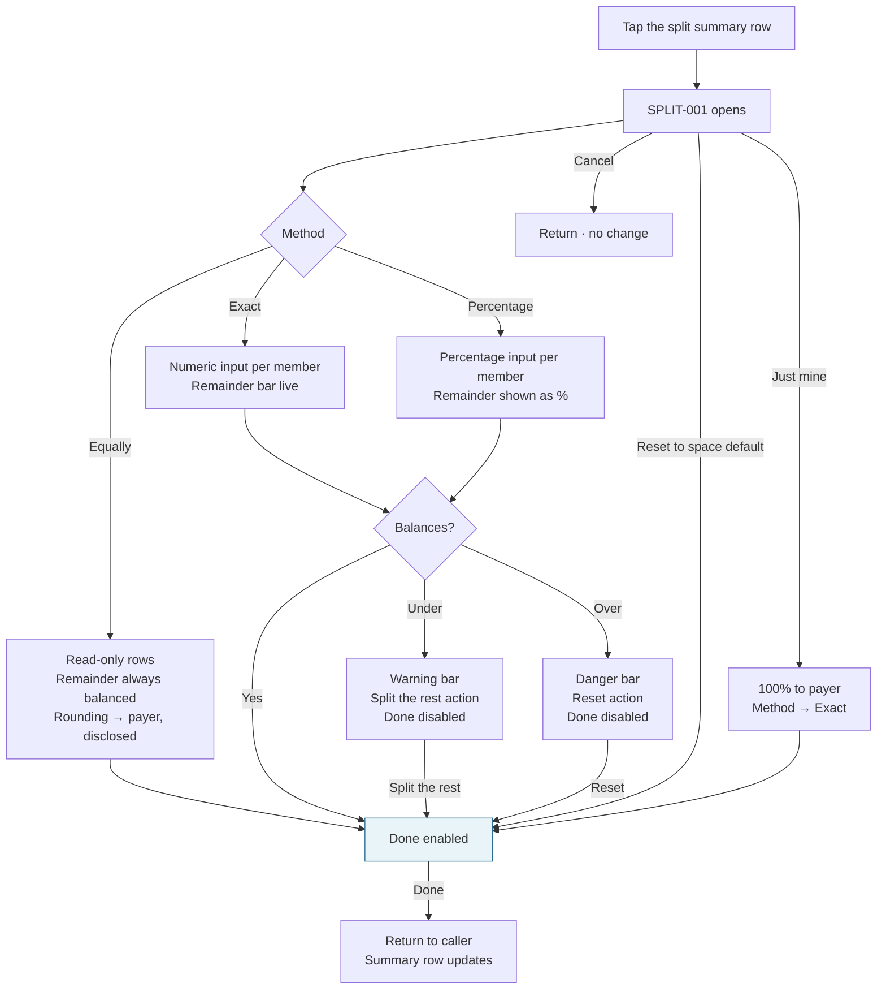
```mermaid
flowchart TD
    ENTRY["Tap the split summary row"] --> SP["SPLIT-001 opens"]
    SP --> M{"Method"}
    M -->|Equally| EQ["Read-only rows<br/>Remainder always balanced<br/>Rounding → payer, disclosed"]
    M -->|Exact| EX["Numeric input per member<br/>Remainder bar live"]
    M -->|Percentage| PC["Percentage input per member<br/>Remainder shown as %"]
    EX --> BAL{"Balances?"}
    PC --> BAL
    EQ --> OK["Done enabled"]
    BAL -->|Yes| OK
    BAL -->|"Under"| UNDER["Warning bar<br/>Split the rest action<br/>Done disabled"]
    BAL -->|"Over"| OVER["Danger bar<br/>Reset action<br/>Done disabled"]
    UNDER -->|"Split the rest"| OK
    OVER -->|Reset| OK
    OK -->|Done| RET["Return to caller<br/>Summary row updates"]
    SP -->|"Reset to space default"| OK
    SP -->|"Just mine"| JM["100% to payer<br/>Method → Exact"] --> OK
    SP -->|Cancel| NOCH["Return · no change"]

    style OK fill:#e8f4f8,stroke:#2a6f8f
```

## 25.9 Budget management

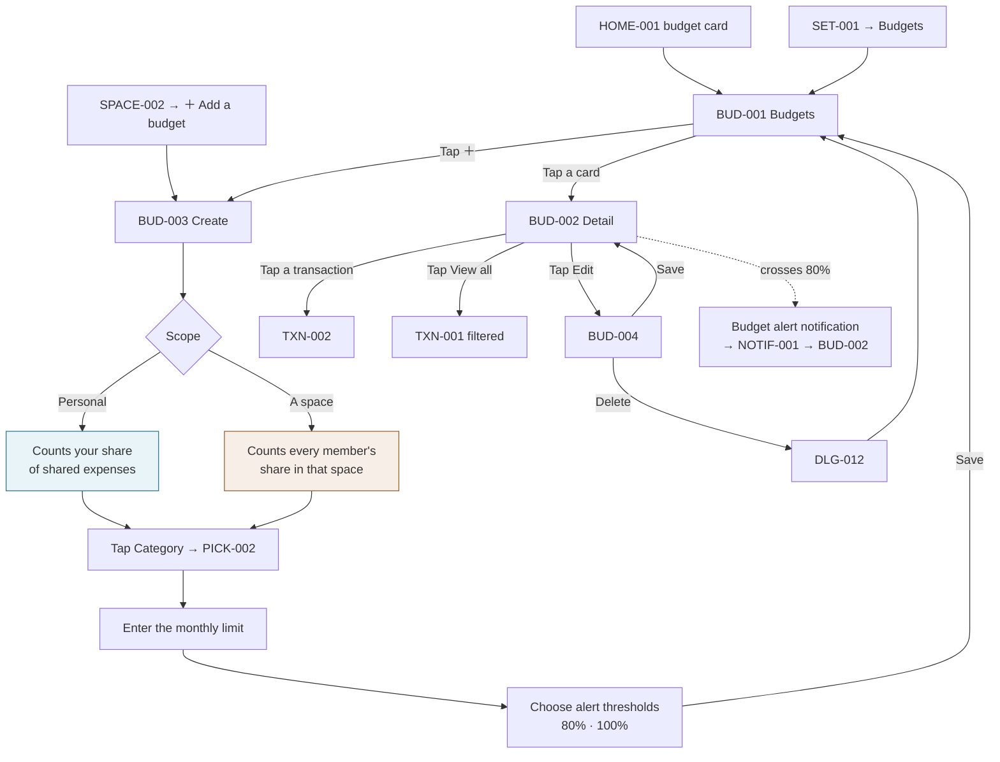
```mermaid
flowchart TD
    H["HOME-001 budget card"] --> B1["BUD-001 Budgets"]
    SET["SET-001 → Budgets"] --> B1
    SP2["SPACE-002 → ＋ Add a budget"] --> B3
    B1 -->|"Tap ＋"| B3["BUD-003 Create"]
    B3 --> SC{"Scope"}
    SC -->|Personal| PC["Counts your share<br/>of shared expenses"]
    SC -->|"A space"| SPC["Counts every member's<br/>share in that space"]
    PC --> CAT["Tap Category → PICK-002"]
    SPC --> CAT
    CAT --> AMT["Enter the monthly limit"]
    AMT --> AL["Choose alert thresholds<br/>80% · 100%"]
    AL -->|Save| B1
    B1 -->|"Tap a card"| B2["BUD-002 Detail"]
    B2 -->|"Tap a transaction"| T2["TXN-002"]
    B2 -->|"Tap View all"| T1["TXN-001 filtered"]
    B2 -->|"Tap Edit"| B4["BUD-004"] -->|Save| B2
    B4 -->|Delete| D12["DLG-012"] --> B1
    B2 -.->|"crosses 80%"| N["Budget alert notification<br/>→ NOTIF-001 → BUD-002"]

    style PC fill:#e8f4f8,stroke:#2a6f8f
    style SPC fill:#f8eee8,stroke:#8f5a2a
```

## 25.10 Settlement

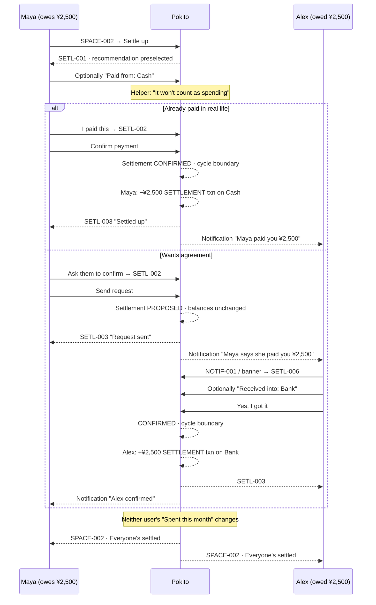
```mermaid
sequenceDiagram
    participant M as Maya (owes ¥2,500)
    participant P as Pokito
    participant A as Alex (owed ¥2,500)
    M->>P: SPACE-002 → Settle up
    P-->>M: SETL-001 · recommendation preselected
    M->>P: Optionally "Paid from: Cash"
    Note over P: Helper: "It won't count as spending"
    alt Already paid in real life
        M->>P: I paid this → SETL-002
        M->>P: Confirm payment
        P-->>P: Settlement CONFIRMED · cycle boundary
        P-->>P: Maya: −¥2,500 SETTLEMENT txn on Cash
        P-->>M: SETL-003 "Settled up"
        P-->>A: Notification "Maya paid you ¥2,500"
    else Wants agreement
        M->>P: Ask them to confirm → SETL-002
        M->>P: Send request
        P-->>P: Settlement PROPOSED · balances unchanged
        P-->>M: SETL-003 "Request sent"
        P-->>A: Notification "Maya says she paid you ¥2,500"
        A->>P: NOTIF-001 / banner → SETL-006
        A->>P: Optionally "Received into: Bank"
        A->>P: Yes, I got it
        P-->>P: CONFIRMED · cycle boundary
        P-->>P: Alex: +¥2,500 SETTLEMENT txn on Bank
        P-->>A: SETL-003
        P-->>M: Notification "Alex confirmed"
    end
    Note over P: Neither user's "Spent this month" changes
    P-->>M: SPACE-002 · Everyone's settled
    P-->>A: SPACE-002 · Everyone's settled
```

## 25.11 Account management

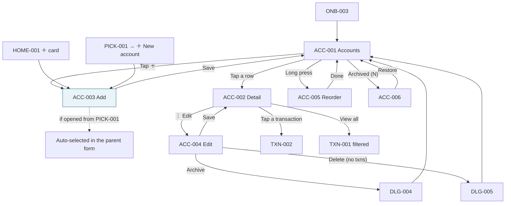
```mermaid
flowchart TD
    A1["ACC-001 Accounts"] -->|"Tap ＋"| A3["ACC-003 Add"]
    ONB["ONB-003"] --> A1
    H["HOME-001 ＋ card"] --> A3
    P1["PICK-001 → ＋ New account"] --> A3
    A3 -->|Save| A1
    A3 -.->|"if opened from PICK-001"| AUTO["Auto-selected in the parent form"]
    A1 -->|"Tap a row"| A2["ACC-002 Detail"]
    A1 -->|"Long press"| A5["ACC-005 Reorder"] -->|Done| A1
    A2 -->|"⋮ Edit"| A4["ACC-004 Edit"] -->|Save| A2
    A4 -->|Archive| D4["DLG-004"] --> A1
    A4 -->|"Delete (no txns)"| D5["DLG-005"] --> A1
    A1 -->|"Archived (N)"| A6["ACC-006"]
    A6 -->|Restore| A1
    A2 -->|"Tap a transaction"| T2["TXN-002"]
    A2 -->|"View all"| T1["TXN-001 filtered"]

    style A3 fill:#e8f4f8,stroke:#2a6f8f
```

## 25.12 Personal ↔ shared expense lifecycle

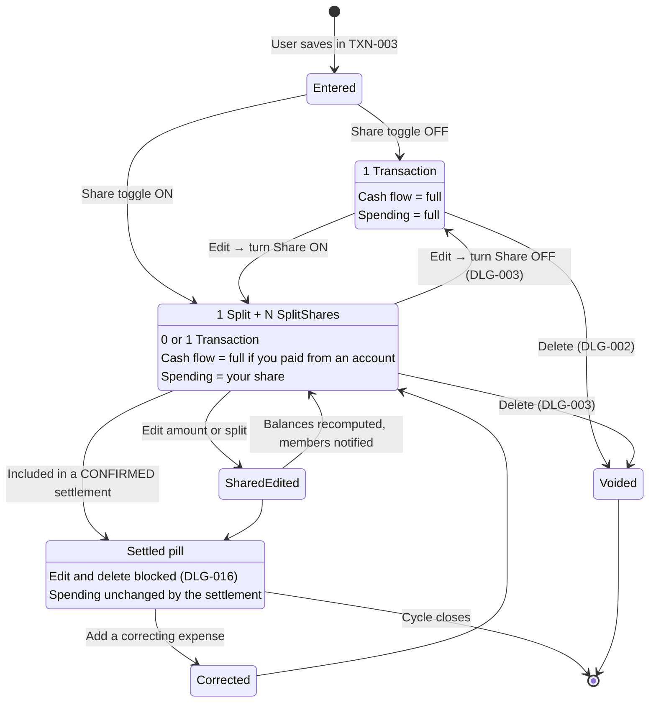
```mermaid
stateDiagram-v2
    [*] --> Entered: User saves in TXN-003
    Entered --> Personal: Share toggle OFF
    Entered --> Shared: Share toggle ON

    Personal: 1 Transaction
    Personal: Cash flow = full
    Personal: Spending = full

    Shared: 1 Split + N SplitShares
    Shared: 0 or 1 Transaction
    Shared: Cash flow = full if you paid from an account
    Shared: Spending = your share

    Personal --> Shared: Edit → turn Share ON
    Shared --> Personal: Edit → turn Share OFF (DLG-003)

    Shared --> SharedEdited: Edit amount or split
    SharedEdited --> Shared: Balances recomputed, members notified

    Shared --> Settled: Included in a CONFIRMED settlement
    SharedEdited --> Settled

    Settled: Settled pill
    Settled: Edit and delete blocked (DLG-016)
    Settled: Spending unchanged by the settlement

    Settled --> Corrected: Add a correcting expense
    Corrected --> Shared

    Personal --> Voided: Delete (DLG-002)
    Shared --> Voided: Delete (DLG-003)
    Settled --> [*]: Cycle closes
    Voided --> [*]
```

## 25.12a Connecting an AI application

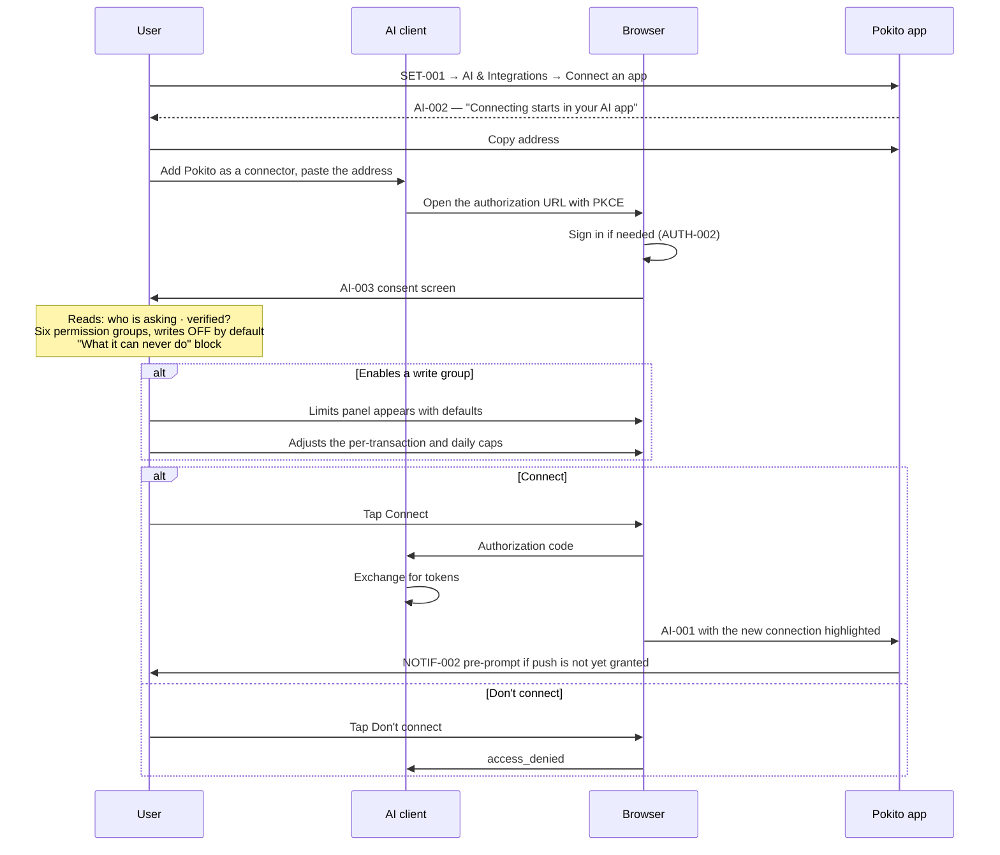
```mermaid
sequenceDiagram
    participant U as User
    participant C as AI client
    participant B as Browser
    participant P as Pokito app
    U->>P: SET-001 → AI & Integrations → Connect an app
    P-->>U: AI-002 — "Connecting starts in your AI app"
    U->>P: Copy address
    U->>C: Add Pokito as a connector, paste the address
    C->>B: Open the authorization URL with PKCE
    B->>B: Sign in if needed (AUTH-002)
    B->>U: AI-003 consent screen
    Note over U: Reads: who is asking · verified?<br/>Six permission groups, writes OFF by default<br/>"What it can never do" block
    alt Enables a write group
        U->>B: Limits panel appears with defaults
        U->>B: Adjusts the per-transaction and daily caps
    end
    alt Connect
        U->>B: Tap Connect
        B->>C: Authorization code
        C->>C: Exchange for tokens
        B->>P: AI-001 with the new connection highlighted
        P->>U: NOTIF-002 pre-prompt if push is not yet granted
    else Don't connect
        U->>B: Tap Don't connect
        B->>C: access_denied
    end
```

## 25.12b Approving an AI action

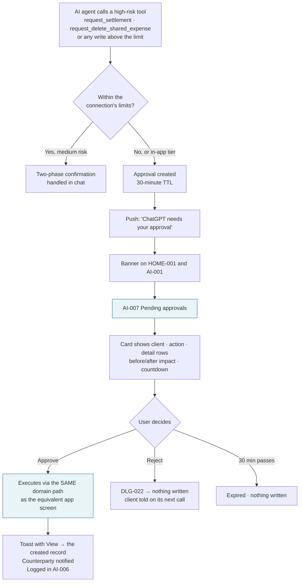
```mermaid
flowchart TD
    AGENT["AI agent calls a high-risk tool<br/>request_settlement · request_delete_shared_expense<br/>or any write above the limit"] --> CHK{"Within the<br/>connection's limits?"}
    CHK -->|"Yes, medium risk"| TWO["Two-phase confirmation<br/>handled in chat"]
    CHK -->|"No, or in-app tier"| APR["Approval created<br/>30-minute TTL"]
    APR --> PUSH["Push: 'ChatGPT needs your approval'"]
    PUSH --> BAN["Banner on HOME-001 and AI-001"]
    BAN --> A7["AI-007 Pending approvals"]
    A7 --> DET["Card shows client · action · detail rows<br/>before/after impact · countdown"]
    DET --> D{"User decides"}
    D -->|Approve| EXEC["Executes via the SAME domain path<br/>as the equivalent app screen"]
    D -->|Reject| DLG["DLG-022 → nothing written<br/>client told on its next call"]
    D -->|"30 min passes"| EXP["Expired · nothing written"]
    EXEC --> DONE["Toast with View → the created record<br/>Counterparty notified<br/>Logged in AI-006"]

    style A7 fill:#e8f4f8,stroke:#2a6f8f
    style EXEC fill:#e8f4f8,stroke:#2a6f8f
```

## 25.12c One capability, two interfaces

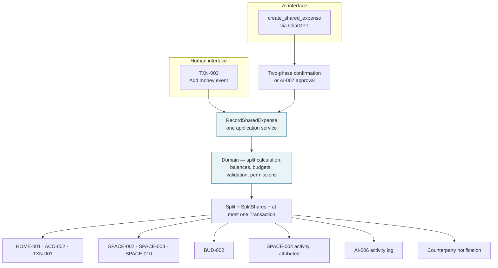
```mermaid
flowchart TD
    subgraph HUMAN["Human interface"]
        T3["TXN-003<br/>Add money event"]
    end
    subgraph AIF["AI interface"]
        MCP["create_shared_expense<br/>via ChatGPT"]
    end
    T3 --> UC["RecordSharedExpense<br/>one application service"]
    MCP --> CONF["Two-phase confirmation<br/>or AI-007 approval"] --> UC
    UC --> DOM["Domain — split calculation,<br/>balances, budgets, validation, permissions"]
    DOM --> W["Split + SplitShares + at most one Transaction"]
    W --> S1["HOME-001 · ACC-002 · TXN-001"]
    W --> S2["SPACE-002 · SPACE-003 · SPACE-010"]
    W --> S3["BUD-002"]
    W --> S4["SPACE-004 activity, attributed"]
    W --> S5["AI-006 activity log"]
    W --> S6["Counterparty notification"]

    style UC fill:#e8f4f8,stroke:#2a6f8f
    style DOM fill:#e8f4f8,stroke:#2a6f8f
```

## 25.12d Multi-currency: three roles, one event

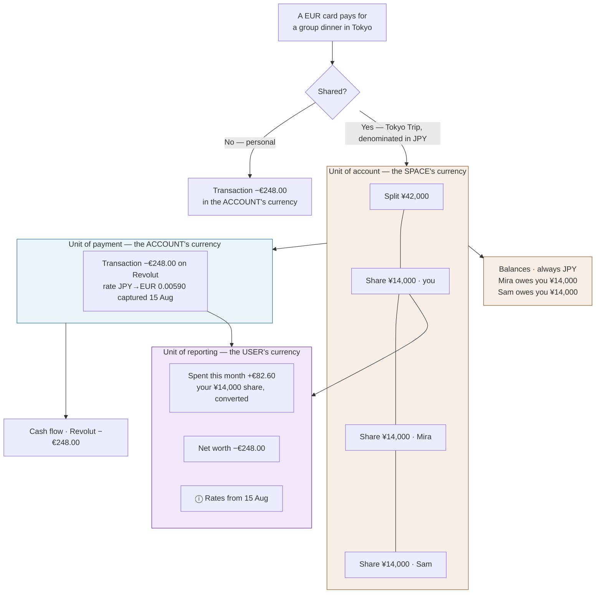
```mermaid
flowchart TD
    E["A EUR card pays for<br/>a group dinner in Tokyo"] --> Q{"Shared?"}
    Q -->|"No — personal"| P["Transaction −€248.00<br/>in the ACCOUNT's currency"]
    Q -->|"Yes — Tokyo Trip, denominated in JPY"| SPLIT

    subgraph SPLIT["Unit of account — the SPACE's currency"]
        S1["Split ¥42,000"]
        S2["Share ¥14,000 · you"]
        S3["Share ¥14,000 · Mira"]
        S4["Share ¥14,000 · Sam"]
        S1 --- S2 --- S3 --- S4
    end

    SPLIT --> PAY
    subgraph PAY["Unit of payment — the ACCOUNT's currency"]
        T["Transaction −€248.00 on Revolut<br/>rate JPY→EUR 0.00590 captured 15 Aug"]
    end

    SPLIT --> BAL["Balances · always JPY<br/>Mira owes you ¥14,000<br/>Sam owes you ¥14,000"]
    PAY --> CF["Cash flow · Revolut −€248.00"]

    S2 --> REP
    T --> REP
    subgraph REP["Unit of reporting — the USER's currency"]
        R1["Spent this month +€82.60<br/>your ¥14,000 share, converted"]
        R2["Net worth −€248.00"]
        R3["ⓘ Rates from 15 Aug"]
    end

    style SPLIT fill:#f8eee8,stroke:#8f5a2a
    style PAY fill:#e8f4f8,stroke:#2a6f8f
    style REP fill:#f0e8f8,stroke:#6a2a8f
    style BAL fill:#f8eee8,stroke:#8f5a2a
```

**Read it as:** the debt lives in one currency and never moves. The payment lives in another and never moves. Reporting converts both, at read time, and says so.

## 25.13 Two-lens data flow

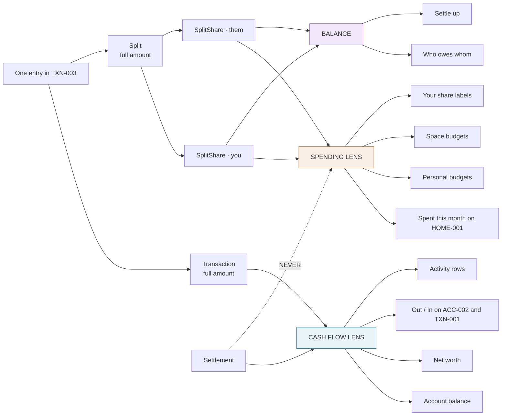
```mermaid
flowchart LR
    ENTRY["One entry in TXN-003"] --> TXN["Transaction<br/>full amount"]
    ENTRY --> SPL["Split<br/>full amount"]
    SPL --> SH1["SplitShare · you"]
    SPL --> SH2["SplitShare · them"]

    TXN --> CF["CASH FLOW LENS"]
    CF --> B1["Account balance"]
    CF --> B2["Net worth"]
    CF --> B3["Out / In on ACC-002 and TXN-001"]
    CF --> B4["Activity rows"]

    SH1 --> SPD["SPENDING LENS"]
    SH2 --> SPD
    SPD --> C1["Spent this month on HOME-001"]
    SPD --> C2["Personal budgets"]
    SPD --> C3["Space budgets"]
    SPD --> C4["Your share labels"]

    SH1 --> BAL["BALANCE"]
    SH2 --> BAL
    BAL --> D1["Who owes whom"]
    BAL --> D2["Settle up"]

    SET["Settlement"] --> CF
    SET -.->|"NEVER"| SPD

    style CF fill:#e8f4f8,stroke:#2a6f8f
    style SPD fill:#f8eee8,stroke:#8f5a2a
    style BAL fill:#f0e8f8,stroke:#6a2a8f
```

---

# 26. Designer Handoff Notes

## 26.1 What this document decides, and what it leaves to design

| Decided here — do not re-open | Left to design |
|---|---|
| Which screens exist and what each contains | Visual style, colour palette, typography scale |
| Information hierarchy within every screen | Spacing rhythm beyond the values given |
| Every navigation transition and its type | Illustration style and iconography set |
| Every field, its type, default and validation | Micro-interaction detail and easing curves |
| Every state and what it shows | Skeleton shimmer treatment |
| Every action and its result | Empty-state illustration content |
| Copy for titles, empty states, errors and dialogs | Copy tone refinement (keep the meaning) |
| The two-lens labelling system | Component visual design |
| Which figures are cash flow vs. spending | Chart and progress-ring rendering |

**Copy is specified, not suggested.** The exact strings for empty states, error messages, dialogs and helper text encode product decisions — particularly everything explaining the two-lens model. Rewrite them for tone, never for meaning.

## 26.2 Build order for design

Design in this order. Each stage validates the one before it.

| Stage | Screens | Why this order |
|---|---|---|
| **1** | TXN-003 + SPLIT-001 + PICK-001/002/003 | The highest-frequency surface and the whole product thesis. If the Share toggle → split summary → editor progression is not fast and legible, nothing else matters. **Prototype and time this before drawing anything else.** |
| **2** | HOME-001 + HOME-003 | Two lenses made legible at a glance. Validates the labelling system that every other screen depends on |
| **3** | SPACE-002 + SPACE-003 + SPACE-010 | The shared hub, with the balance card as the anchor |
| **4** | TXN-001 + TXN-002 + ACC-001 + ACC-002 | The ledger surfaces; largely conventional once the labelling is settled |
| **5** | SETL-001 → SETL-006 | The settlement loop, including the crossover copy |
| **6** | ONB-001 → ONB-006 + SPACE-005 + SPACE-009 | First-run, once the destination screens are known |
| **7** | BUD-*, SUB-*, CAT-*, SET-*, NOTIF-* | Supporting surfaces |
| **8** | **AI-003, AI-007**, then AI-001/002/004/005/006 | AI-003 is security-critical and AI-007 is the gate an attacker cannot reach — design both with the same care as TXN-003. The rest are conventional settings screens |
| **9** | All DLG-*, all remaining PICK-*, every state variant | Systematic completion pass |

## 26.3 The five screens that carry the product

If time is short, these five must be excellent and the rest can be conventional:

1. **TXN-003** — the Share toggle is the product thesis made physical
2. **HOME-001** — the hero's *Spent* vs. *In* pairing, and the ⓘ popover that explains the model
3. **SPACE-002** — the balance card
4. **TXN-002** — the shared section and its explanatory footnote, where the two worlds are reconciled for the user
5. **SPLIT-001** — the fixed remainder bar

## 26.4 Design system inventory

Components to build, with the specifications that define them:

| Component | Spec | Variants |
|---|---|---|
| Header | §5.1 | H1 tab, H2 detail, H2 large-title, H3 sheet |
| Card | §5.2 | standard, hero, compact |
| List row | §5.3 | 56pt single-line, 64pt two-line, 72pt three-element, 80pt with actions |
| Amount text | §5.4 | signed, unsigned, positive, negative, over-budget, tabular |
| Status pill | §5.9 | 10 defined statuses |
| Progress bar | §5.10 | on-track, warning, over with overflow segment |
| Progress ring | BUD-002 | same three states |
| Avatar | §5.7 | 24 / 32 / 48 / 56 / 64pt, stack, dimmed |
| Category icon | §5.8 | 40pt circle, chip, selected chip |
| Filter chip | §5.14 | selectable, removable with ✕, count-badged |
| Segmented control | TXN-003, SPLIT-001 | 2 and 3 segments, disabled |
| Empty state | §5.15 | illustration variant, icon variant, inline variant |
| Skeleton | §5.16 | card, row, hero, ring |
| Error | §5.17 | E1 full, E2 inline card, E3 toast, E4 form banner |
| Button | §5.20 | primary, secondary, tertiary, destructive, icon, compact |
| Toast | §5.12 | plain, with action |
| Dialog | §5.21 | standard, destructive, type-to-confirm |
| Bottom sheet | §4.4 | form, picker, filter, info, review |
| Numeric keypad | TXN-003 | with and without a decimal key |
| Bottom bar + FAB | §4.1, §21 | — |
| Offline banner | §5.22 | — |
| Remainder bar | SPLIT-001 | balanced, under, over |

## 26.5 Content the designer needs from product

| Asset | Used by | Notes |
|---|---|---|
| Icon set (~80 glyphs) | Categories, accounts, spaces, subscriptions, events | PICK-007 groups them as Money / Food / Transport / Home / Leisure / People / Other |
| 12-colour palette for user-assigned colours | Accounts, categories, spaces | Must meet 3:1 contrast against both theme backgrounds as icon tints |
| 8 empty-state illustrations | ACC-001, TXN-001, SPACE-001, SETL-004, BUD-001, SUB-001, NOTIF-001, ONB-001 | Line style |
| Success animation | SETL-003, ONB-006 | 600ms check draw-in |
| Brand-icon matching set | SUB-003 auto-icon | Optional; falls back to a generic repeat glyph |
| Space accent presets | SPACE-005 | 5 defaults, one per space type |

## 26.6 Non-negotiable rules

These encode correctness, not taste. Changing them changes the product's behaviour.

1. **Never label a share-based figure and a cash-based figure with the same word.** *Spent* is always the share; *Out* is always the cash.
2. **Settlements never appear in any spending figure.** Not in Home's Spent, not in budgets, not in category breakdowns.
3. **A missing exchange rate replaces the combined total with per-currency subtotals and a stated reason.** Never an approximation, never a blank.
4. **The split remainder bar is fixed, never scrollable.**
5. **High-severity destructive dialogs quantify the impact and name the affected people.**
6. **The FAB is present and unchanging on all four tabs, and never hides on scroll.**
7. **Every empty state has exactly one CTA that leads somewhere useful.**
8. **A disabled submit button, when tapped, scrolls to and focuses the first blocking field.**
9. **One primary button per screen or sheet.**
10. **Colour is never the only signal** — see §5.24.
11. **AI-003 never renders client-supplied text as page chrome.** Client name, logo and URI live inside a bounded card, always beside a Verified/Unverified badge, clamped to 40 characters. Pokito's own header sits above it. See §19.3 of the MCP spec.
12. **Write permission groups on AI-003 default to off.** A user who taps straight through grants a read-only connection.
13. **The "What it can never do" block on AI-003 is always visible and never collapsible.** It is what makes granting write access a reasonable decision rather than an act of faith.
14. **AI-007 is the only place high-risk AI actions are approved.** No equivalent affordance exists in chat, by design — it is a gate an injected prompt cannot reach.
15. **The "AI approval needed" notification cannot be switched off.** Approvals expire in 30 minutes; a silent one is a broken feature.

## 26.7 Prototype checklist

The interactive prototype should cover, at minimum:

- [ ] FAB → TXN-003 → amount → category chip → Save (the three-interaction path, timed)
- [ ] FAB → TXN-003 → Share toggle on → split summary → SPLIT-001 → Exact mode with the remainder bar → Done → Save
- [ ] HOME-001 with the ⓘ popover on **Spent**
- [ ] SPACE-002 balance card → scope toggle → SETL-001 → SETL-002 → SETL-003
- [ ] SETL-006 confirm flow entered from a notification
- [ ] ONB-001 → ONB-006 including the space branch
- [ ] SPACE-009 as a cold first screen for an invited user
- [ ] TXN-002 for a shared expense, including the footnote
- [ ] At least one E2 per-card error on HOME-001
- [ ] DLG-003 with quantified impact
- [ ] Offline: GLB-004 + a disabled Save on TXN-003

---

# 27. Remaining Product Decisions

Six open items. Each has a recommendation; none blocks starting design.

---

### `PD-1` — Should income be shareable?

**What is unknown:** V1 restricts sharing to expenses. Shared income (a joint gift, a shared refund, a split rebate) has no defined semantics.

**Options**
- **A.** Expenses only *(specified)*
- **B.** Allow shared income, splitting it as a credit that reduces what participants owe
- **C.** Allow shared income but treat it as a negative shared expense

**Recommendation: A.** Shared income is uncommon and its semantics are genuinely ambiguous — does receiving a shared ¥10,000 gift mean each member is credited ¥5,000 against their debts, or that the recipient owes ¥5,000? Both readings are defensible, which is exactly why it does not belong in V1. The Share toggle is not rendered at all in Income mode, so there is no dead affordance. A shared refund can be handled in V1 as a correcting expense.

**Impact if changed:** TXN-003 gains the Share toggle in Income mode; SPLIT-001 needs a credit variant; balance calculation changes sign handling.

---

### `PD-2` — Can any member invite, or only the Owner?

**What is unknown:** SPACE-007 currently hides the invite action from non-owners.

**Options**
- **A.** Owner only *(specified)*
- **B.** Any member may invite
- **C.** Owner-configurable per space, defaulting to Owner-only

**Recommendation: A for V1, C for V1.x.** A Member inviting someone means that person immediately sees the space's entire financial history including other people's balances. For a couple space this is harmless; for a six-person flatshare it is a real privacy event. Owner-only is the safe default, and the cost is one message ("ask Alex to invite them"). C is the right long-term answer but adds a settings row and a permission check for a V1 audience that is mostly two people.

**Impact if changed:** SPACE-007's ＋ becomes unconditional; SPACE-006 gains a toggle under a new "Permissions" group.

---

### `PD-3` — Should accounts have a manual "adjust balance" action?

**What is unknown:** ACC-004 makes the balance read-only, deriving it purely from transactions. Real users' balances drift from reality (a forgotten cash purchase, a bank fee).

**Options**
- **A.** Read-only balance; corrections require adding an income or expense *(specified)*
- **B.** An "Adjust balance" action that writes a hidden reconciling transaction
- **C.** An editable balance field that silently rewrites the opening balance

**Recommendation: A for V1, B for V1.x.** Option C is disqualified — it makes history untrue. B is the correct long-term answer (LifeOS has an `ADJUSTMENT` transaction type for exactly this), but it needs its own category treatment, its own row rendering in Activity, and a decision about whether adjustments count as spending. That is real design work for a problem that only appears after a few weeks of use. A ships honestly, with a helper explaining the path.

**Impact if changed:** ACC-004's balance row becomes an action → an adjust sheet; a fourth transaction type is added to TXN-001's rendering and to §5.4; adjustments must be excluded from spending, like settlements.

---

### `PD-4` — Should future-dated transactions be allowed?

**What is unknown:** PICK-003 disables future dates for TXN-003.

**Options**
- **A.** Block future dates *(specified)*
- **B.** Allow them, and exclude them from balances until their date arrives
- **C.** Allow them and include them immediately

**Recommendation: A.** C is wrong — it makes the account balance not match the bank. B is defensible and is what "scheduled transactions" would look like, but it introduces a second transaction status the user must reason about (*"why isn't this in my balance?"*) for a need that **subscriptions already serve**. Someone who wants to record next month's rent should create a subscription, which is exactly what that feature is for.

**Impact if changed:** PICK-003 stops disabling future days; a `Scheduled` pill and status are added; balance calculation gains a date filter; TXN-001 needs an "Upcoming" section.

---

### `PD-5` — Should over-payment be allowed when settling?

**What is unknown:** SETL-001 caps the settlement amount at the outstanding balance.

**Options**
- **A.** Block over-payment *(specified)*
- **B.** Allow it; the balance flips direction
- **C.** Allow it, and offer to record the excess as a shared expense

**Recommendation: A for V1.** Over-payment is real — someone rounds ¥2,480 up to ¥2,500, or pays two months of a recurring split at once. But B produces a screen that says *"Alex owes you ¥20"* immediately after a settlement, which reads as a bug to most people unless it is carefully explained. The blocking message names the exact permitted amount, so the user is never stuck. Revisit with real usage data — if users routinely hit the cap, B with good explanatory copy is the answer.

**Impact if changed:** SETL-001's validation relaxes; SETL-002's impact block must show the flipped direction explicitly; SETL-003's copy needs a "now owed to you" variant.

---

### `PD-6` — Are quiet hours in V1?

**What is unknown:** SET-004 specifies a quiet-hours group.

**Options**
- **A.** Ship quiet hours in V1 *(specified)*
- **B.** Defer to V1.x; rely on OS-level notification scheduling
- **C.** No quiet hours at all

**Recommendation: B.** Both iOS and Android provide system-level scheduled summaries and focus modes that already solve this. Building server-side delivery scheduling for five notification types is meaningful backend work with a platform-provided alternative. If deferred, remove Group 3 from SET-004 entirely rather than showing it disabled.

**Impact if changed:** SET-004 loses Group 3; no other screen is affected.

---

## Explicitly closed — do not reopen

These were considered and decided; they are recorded so they are not relitigated during design.

| Question | Decision | Where |
|---|---|---|
| FAB opens a menu or the add sheet? | The add sheet, directly | §21.1 |
| Separate merchant and note fields? | One field; the first line is the merchant | TXN-003 |
| Is category required on a transaction? | **No** — optional, with a save-time helper | TXN-003 |
| Is category required on a subscription? | **Yes** | SUB-003 |
| Do budgets count the share or the total? | Personal → your share; space → all members' shares | BUD-002 |
| Does "your share" appear on ACC-002 rows? | **No** — that screen is the cash-flow lens | TXN-001 |
| Filters apply live or on Apply? | **On Apply** | §5.14 |
| Are transaction amounts coloured red? | **No** — colour is reserved for judgement values | §5.4 |
| Can a settled expense be edited? | **No** — DLG-016 offers a correcting expense | SPACE-010 |
| Can an expense move between spaces? | **No** | TXN-004 |
| Can a transaction change type after creation? | **No** | TXN-004 |
| Multiple payers on one expense? | **No** in V1 — single payer | TXN-003 |
| Shares/weights split method? | **No** — Percentage covers the intent | SPLIT-001 |
| Space-scoped categories? | **No** — one catalog per user | CAT-001 |
| Offline writes? | **No** — reads only | §5.22 |
| Tags? | **Not in V1** | — |

---

# 28. Completeness Pass

The verification required before handoff, performed against this document.

## 28.1 Every MVP feature has screens

| MVP feature (from the product analysis) | Screens | ✔ |
|---|---|---|
| Keycloak auth | AUTH-001, AUTH-002, AUTH-003 | ✔ |
| Onboarding | ONB-001 … ONB-006 | ✔ |
| Accounts: create, edit, archive, reorder, default | ACC-001 … ACC-006, PICK-001 | ✔ |
| Derived balances | ACC-001, ACC-002, HOME-001, HOME-003 | ✔ |
| Transactions: expense, income, transfer | TXN-001 … TXN-006 | ✔ |
| Categories: system + custom CRUD | CAT-001, CAT-002, CAT-003, PICK-002 | ✔ |
| Subscriptions: schedule, pay, skip, pause | SUB-001 … SUB-006 | ✔ |
| Subscription monthly total per currency | SUB-001 total card | ✔ |
| Budgets: category, monthly, personal or space, alerts | BUD-001 … BUD-004 | ✔ |
| Home overview with both lenses | HOME-001, HOME-002, HOME-003 | ✔ |
| Activity: search + filter | TXN-001, TXN-005, TXN-006 | ✔ |
| Spaces: create, edit, archive, 5 types | SPACE-001, SPACE-005, SPACE-006, SPACE-013 | ✔ |
| Members: 2 roles, last-owner protection | SPACE-007, DLG-008, DLG-009 | ✔ |
| Invites: link with expiry, review, accept | SPACE-008, SPACE-009, ONB-005 | ✔ |
| Shared expenses: single payer, 3 split methods | TXN-003, SPLIT-001, SPACE-010 | ✔ |
| Space default split | SPACE-011 | ✔ |
| **Automatic linked transaction** | TXN-003 save behaviour, §23 | ✔ |
| Balances: member net, who-owes-whom, cycle/lifetime | SPACE-002, SPACE-012 | ✔ |
| Settlements: recommend, record, request, confirm, cancel | SETL-001 … SETL-007, DLG-011 | ✔ |
| Settlement → optional account transaction | SETL-001 "Paid from", SETL-006 "Received into" | ✔ |
| Settlement history | SETL-004, SETL-005 | ✔ |
| Shared budgets | BUD-003 scope, SPACE-002 budget card | ✔ |
| Space activity feed | SPACE-004 | ✔ |
| 5 notification types + per-space prefs | NOTIF-001, NOTIF-002, SET-004, SPACE-006 | ✔ |
| Empty / loading / error states everywhere | §22.1, per-screen State blocks | ✔ |
| i18n | SET-006 | ✔ |
| Light and dark themes | SET-005 | ✔ |
| Offline read cache | §5.22, §22.1 | ✔ |
| **AI connection management** | AI-001, AI-002, AI-004 | ✔ |
| **AI authorization & consent** | AI-003, DLG-021 | ✔ |
| **AI permission & limit tuning** | AI-005 | ✔ |
| **AI activity audit** | AI-006, source lines on TXN-002 / SPACE-010 / SETL-005 / SPACE-004, TXN-005 filter | ✔ |
| **AI approval gate** | AI-007, DLG-022, HOME-001 banner, SET-004 non-optional notification | ✔ |
| **AI revocation** | DLG-019, DLG-020, AI-001 swipe, AI-004 danger zone | ✔ |

## 28.2 Every interactive element has a defined result

Verified by construction: every screen specification contains an **Actions** table in the form *Action → Result → Destination/Response*, and every row of §24 names both a destination and a transition type. Spot-checks on the highest-risk surfaces:

| Surface | Interactive elements | All defined |
|---|---|---|
| HOME-001 | 20 | ✔ (Actions table) |
| TXN-003 | 17 | ✔ |
| SPACE-002 | 14 | ✔ |
| SPLIT-001 | 10 | ✔ |
| SETL-001 | 10 | ✔ |
| ACC-002 | 9 | ✔ |

## 28.3 Every destination has a specification

Cross-checked: every screen ID appearing in the **To** column of §24 appears as a specified unit in §6–§20. There are **no forward references to unspecified screens**.

One deliberate exception, specified inline rather than as a numbered unit:
- **Member sheet** (opened from SPACE-007, SPACE-010, SPACE-012, SETL-005) — fully specified within SPACE-007
- **Period sheet** (BUD-002) — specified as "a compact month list as in HOME-002"
- **Country picker** (ONB-002) — specified inline as a searchable country list
- **Sort menu** (SUB-001) — specified inline

## 28.4 Create / edit / delete / cancel / error / empty coverage

| Object | Create | Edit | Delete | Cancel | Error | Empty |
|---|---|---|---|---|---|---|
| Account | ACC-003 | ACC-004 | DLG-004 archive / DLG-005 delete | DLG-001 | E4 | ACC-001 |
| Transaction | TXN-003 | TXN-004 | DLG-002 | DLG-001 | E4 | TXN-001, ACC-002 |
| Shared expense | TXN-003 (share on) | TXN-004 / SPLIT-001 | DLG-003, blocked by DLG-016 | DLG-001 | E4 | SPACE-003 |
| Space | SPACE-005 | SPACE-006 | DLG-006 archive / DLG-007 delete | DLG-001 | E4 | SPACE-001 |
| Member | SPACE-008 invite | *(role change is V1.x)* | DLG-009 remove / DLG-008 leave | — | E1 | SPACE-007 solo |
| Invite | SPACE-008 | — | DLG-010 revoke | — | Retry in-sheet | SPACE-007 |
| Settlement | SETL-001 → SETL-002 | *(immutable)* | DLG-011 cancel | Back from SETL-002 | E4 | SETL-004 |
| Budget | BUD-003 | BUD-004 | DLG-012 | DLG-001 | E4 | BUD-001 |
| Subscription | SUB-003 | SUB-004 | DLG-013 | DLG-001 | E4 | SUB-001 |
| Category | CAT-002 | CAT-002 | DLG-014 → CAT-003 | DLG-001 | E4 | Never empty (seeded) |
| Split | TXN-003 | SPLIT-001 | Via the expense | Cancel in SPLIT-001 | Inline remainder | Solo variant |

## 28.5 Personal ↔ shared consistency

| Assertion | Verified against |
|---|---|
| One entry writes at most one Transaction | TXN-003 save-behaviour table; §23.1; §25.7 |
| Maya has no transaction when Alex pays | §23.2 Maya's-screens table |
| "Spent" is always the share; "Out" is always the cash | §5.4; HOME-001 hero; ACC-002 month card; TXN-001 summary |
| Shared rows show "your share" on TXN-001 but not ACC-002 | TXN-001 note; ACC-002 component table |
| Personal budgets count shares; space budgets count all shares | BUD-002 footnote; §23.4 |
| Settlements never count as spending | §5.4 settlement row; SETL-001 helper; SETL-002 impact; TXN-002 settlement footnote; §23.5 invariant; §25.13 |
| Case 3 (cash, untracked) is reachable | PICK-001 "Cash — don't track"; §23.6 |
| Settled expenses cannot be edited or deleted | SPACE-010 states; TXN-002 states; DLG-016 |
| Removed members' history is preserved | SPACE-007 states; SPLIT-001 member-row table; DLG-009 copy |
| Balance defaults to cycle scope | SPACE-002 scope toggle; SETL-004 cycle dividers |

## 28.6 Diagrams match the written specification

| Diagram | Verified against |
|---|---|
| §2.1 app structure | §3 inventory, §4 navigation |
| §25.1 navigation | §24.2–§24.8 |
| §25.2 onboarding | §7, §24.1 |
| §25.3 add transaction | TXN-003 fields and save behaviour |
| §25.4 transfer | TXN-003 mode table |
| §25.5 subscriptions | SUB-001, SUB-005, DLG-018 |
| §25.6 create space + invite | SPACE-005, SPACE-008, SPACE-009, NOTIF-002 |
| §25.7 shared expense | TXN-003 share section + save-behaviour table |
| §25.8 split config | SPLIT-001 method behaviours |
| §25.9 budgets | BUD-001 … BUD-004, §23.4 |
| §25.10 settlement | SETL-001 … SETL-006, §23.5 |
| §25.11 accounts | ACC-001 … ACC-006 |
| §25.12 lifecycle | §23.7 edit/delete table |
| §25.12a connect an AI app | §20A AI-002, AI-003; MCP spec §4.3 |
| §25.12b approve an AI action | §20A AI-007, DLG-022; MCP spec §13.4 |
| §25.12c one capability, two interfaces | §20A; MCP spec §2.1, §17 |
| §25.13 two-lens flow | §5.4, §23.4 |

## 28.7 No orphans, no dead ends

**Orphan check** — every specified screen has at least one entry point:

| Potential orphan | Entry point |
|---|---|
| ACC-006 | ACC-001 `Archived (N)` row — hidden at zero, so never a dead link |
| SPACE-013 | SPACE-001 `Archived (N)` row — same |
| CAT-003 | DLG-014 only — correct, it exists solely to service a blocked delete |
| SETL-006 | Notification, HOME-001 banner, SPACE-001 strip, SPACE-002 banner, NOTIF-001 inline |
| SETL-007 (DLG-017) | SETL-001, only when ≥2 balances exist |
| NOTIF-002 | Post-first-space only; never shown when permission is already granted |
| PICK-004 | TXN-003 **More** chip, only when >4 spaces exist |
| SPACE-012 | SPACE-002 balance card, only when ≥3 members |
| HOME-003 | HOME-001 net-worth tap |
| SUB-006 | SUB-003 / SUB-004 Repeats row |
| AI-002 | AI-001 "Connect an app" and its empty-state CTA |
| AI-003 | OAuth redirect from an AI client only — never reachable from inside the app, by design |
| AI-005 | AI-004 "Change" |
| AI-006 | AI-001 "AI activity", AI-004 "See all", AI-change notifications |
| AI-007 | Push, HOME-001 banner, AI-001 banner, NOTIF-001 — all conditional on a pending approval existing |

**Dead-end check** — every terminal state has a forward path:

| Terminal state | Exit |
|---|---|
| SETL-003 | **Done** / auto-advance to SPACE-002; SETL-001/002/003 removed from the stack |
| ONB-006 | **Start using Pokito** / auto-advance to HOME-001; stack replaced |
| SPACE-009 expired or revoked | **Close** → SPACE-001 |
| ACC-006 emptied by restoring the last item | Auto-pop to ACC-001 |
| SPACE-013 emptied | Auto-pop to SPACE-001 |
| Every empty state | Exactly one CTA leading somewhere useful |
| Every E1 error | **Try again**, or **Go back** when retry cannot help |
| Every dialog | Cancel, and a confirm that navigates |
| Invalid deep link | Nearest valid parent + an explanatory toast |
| Disabled submit | Tapping scrolls to and focuses the blocking field |
| ONB-005 link generation failure | **Done** remains enabled |
| SPACE-008 link failure | **Retry** + Close |
| AI-003 expired request | Screen replaced with an explanation + **Close**; the user restarts from the AI client |
| AI-007 last card resolved | Screen pops automatically to the caller |
| AI-007 approval failed on state change | Card becomes warning-tinted with the reason + **Dismiss** |
| AI-002 | Has no "Connect" button by design — the flow starts in the AI client, and the screen says so rather than offering a dead affordance |

**Loop check** — no navigation cycle can trap the user:

- Creation flows are removed from the back stack on success (§4.7), so back from SPACE-002 after creating a space reaches SPACE-001, never SPACE-005.
- SETL-003 replaces its predecessors, so a completed settlement cannot be re-entered by pressing back.
- SPACE-010 → **View my transaction** → TXN-002 → **View in space** would loop, so **TXN-002's "View in space" pops to SPACE-010 when it is already on the stack** rather than pushing a duplicate.
- ACC-002 → transaction → TXN-002 → account row: same rule — pops when already on the stack.
- Cross-tab transitions (`Tab + Push`) reset the destination tab's stack to root before pushing, so repeated cross-tab jumps cannot accumulate depth.

## 28.8 Could a designer build Pokito from this document?

| Requirement | Status |
|---|---|
| Every screen is enumerated with a stable ID | ✔ 107 units, §3 |
| Every screen's layout is specified top-to-bottom with concrete content | ✔ §6–§20 |
| Every component's behaviour is defined, including swipe, long-press and no-data | ✔ per-screen component tables + §5 |
| Every action has a result and a destination | ✔ per-screen Actions tables + §24 |
| Every form field has type, label, default, validation and error copy | ✔ per-form field tables |
| Every state — empty, loading, error, partial, offline, contextual — is defined | ✔ per-screen States blocks + §22 |
| Every sheet, modal and dialog is specified as carefully as a screen | ✔ §19, §20 |
| Copy is provided, not left to invention | ✔ throughout; §20 gives verbatim dialog copy |
| Navigation, back behaviour and state preservation are unambiguous | ✔ §4 |
| Cross-screen consistency patterns are defined once | ✔ §5 |
| The personal ↔ shared model is fully worked through | ✔ §23 |
| Open questions are minimised and have recommendations | ✔ §27 — 6 items, all with recommendations, none blocking |

| AI integration is treated as product experience, not backend | ✔ §20A — 7 screens, 4 dialogs, changes to 6 existing screens, 3 diagrams, transition-matrix and state-catalogue entries |

## 28.9 AI integration consistency

| Assertion | Verified against |
|---|---|
| Every MCP write appears in the mobile UI with attribution | §20A "Changes to existing screens" — TXN-002, SPACE-010, SETL-005, SPACE-004, TXN-005 |
| Every high-risk AI action has an in-app gate | AI-007; MCP spec §13.4 |
| The approval gate executes the same domain path as the equivalent screen | AI-007 Notes; MCP spec §13.4, §17.3 |
| A user can see everything an AI changed | AI-006; MCP spec §16.4 |
| A user can revoke access immediately | DLG-019, DLG-020; MCP spec §4.5 |
| Consent is explicit, scoped and write-off-by-default | AI-003; MCP spec §5.3 |
| Client-supplied text cannot spoof Pokito chrome | AI-003 layout; non-negotiable rule 11; MCP spec §19.3 |
| AI capability is absent from onboarding | §20A ONB note |
| The V1 notification set grew from 5 to 7, and both additions are specified | §20A SET-004 and NOTIF-001 changes |

**Conclusion:** a designer can proceed to wireframes without product input. The six mobile PD items (§27) and the four MCP PD items (`pokito-mcp-spec.md` §20.4) are answerable in parallel, and none blocks stages 1–5 of the build order in §26.2.


